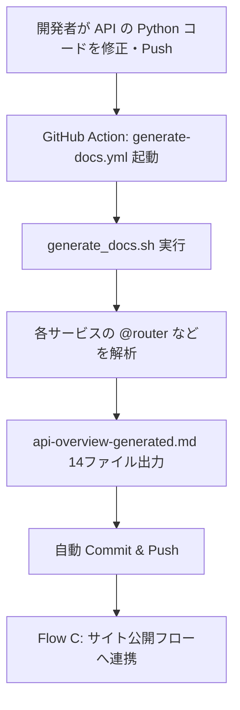
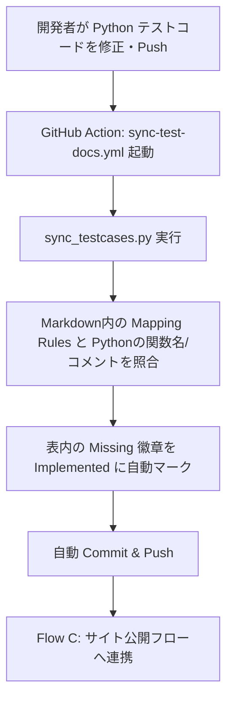

# ドキュメント管理 — Jekyll + GitHub Pages

本プロジェクトの公式ドキュメント（当サイト）は、**「Jekyll による静的サイト自動構築」** と **「Docs-as-Code（文書即コード）による自動同期」** という2つの強力な自動化基盤によって運用されています。

このページでは、サイトの基本構成と、開発チームが日常的に活用する「自動化フロー」の仕組み、および新たなプロジェクトへの設定移植手順を解説します。

---

## 🏗️ サイトの基本構成

| 項目 | 設定・利用技術 | 説明 |
|------|-------------|------|
| **ビルダー** | [Jekyll](https://jekyllrb.com/) | Markdown ファイル群を高速に HTML サイトへ変換する静的サイトジェネレーター |
| **ホスティング** | [GitHub Pages](https://pages.github.com/) | サーバー構築不要で GitHub リポジトリから直接 Web サイトを公開 |
| **テーマ** | `just-the-docs` | 検索機能つき・多階層サイドバー付きのモダンなドキュメントUI（ダークモード対応） |
| **多言語対応** | Collections 活用 | `docs/ja/` (日本語) と `docs/en/` (英語) の言語切り替え構造を実装 |

---

## ⚡ 2つのコア自動化機能（Docs-as-Code）

本サイトは手動でのドキュメント保守作業を極限まで減らすため、以下の **2大自動化システム** を組み込んでいます。

### 柱1：API 仕様書の自動生成 (FastAPI → Markdown)
開発者が `services/` 配下の **Python (FastAPI) コード**や Pydantic モデルを変更して Push すると、スクリプトがコードをスキャンし、各サービスの API エンドポイントやデータモデルの Markdown ドキュメントを全自動で生成します。

### 柱2：テスト仕様書の自動同期 (Test Code → Markdown)
開発者が `tests/` 配下に **Python テストコード**を作成して Push すると、スクリプトがプロフェッショナルテストケース設計書（Markdown）の「Mapping Rules」列を読み取り、実際のコード内に該当する関数名や主要コメントが存在するかをスキャンして検証し、ステータスを自動で `![Implemented]`（緑の徽章）に更新します。

---

## 🔄 詳細な実装フローと仕組み

これら2つの自動化は、いずれも `main` ブランチへの **Push** をトリガーとして、GitHub Actions が背後で全てのスクリプト実行・Commit・デプロイを代行します。

### Flow A : API ドキュメントの自動生成フロー

* **設定ファイル**: `.github/workflows/generate-docs.yml`
* **実行スクリプト**: `scripts/generate_docs.sh`



### Flow B : テスト仕様書の自動同期フロー

* **設定ファイル**: `.github/workflows/sync-test-docs.yml`
* **実行スクリプト**: `scripts/sync_testcases.py`



### Flow C : サイトビルド＆公開フロー

* **設定ファイル**: `.github/workflows/jekyll-gh-pages.yml`

```text
Flow A / Flow B によるドキュメントの自動更新
⬇
GitHub Action `jekyll-gh-pages.yml` 起動
⬇
Ruby / Jekyll 環境セットアップ ＆ `bundle exec jekyll build`
⬇
生成された HTML の Artifacts を GitHub Pages 環境へデプロイ
⬇
🌐 https://<org>.github.io/<repo>/ で公開完了（数分で反映）
```

---

## ⚠️ 【重要】テストコード実装時の必須ルール（Flow B 関連）

テストドキュメントの自動同期（Flow B）を正常に稼働させるため、テストを作成・修正する際は、**必ず関数の名称、または関数内の主要なコメントが、Markdown 仕様書の `Mapping Rules` 列に定義された文字列と完全に一致（または部分一致）する**ように実装してください。

### 例：Cart サービスの `CT-U-001` の場合
仕様書（Markdown）の Matching Rules が `test_cart_operations` または `*(# Check if the terminal is opened [异常系])*` と定義されている場合、実際のテストコードは以下のように同名の関数にするか、同じコメントを含める必要があります：

```python
def test_cart_operations():
    """ カート操作の異常系テスト """
    # Check if the terminal is opened [异常系]
    assert True
```

* **一致する場合**：スクリプト実行時、Markdown 表内のステータスが自動で `![Missing]` から `![Implemented]`（緑アイコン）に更新されます。
* **一致しない場合**：スクリプトは実装を検出できず、仕様書上は `![Missing]`（赤アイコン：未実装によるカバレッジのギャップ）として残ります。

---

## ✅ プロフェッショナルテストケースドキュメント一覧

当基盤では、以下の7つのコアマイクロサービスに対して、「単体 (Unit)」「結合 (Integration)」「シナリオ (Scenario)」の3階層からなるプロフェッショナルな設計書が用意されています：
- [Account サービス テストケース](ja/testing/testcases-account.html)
- [Cart サービス テストケース](ja/testing/testcases-cart.html)
- [Journal サービス テストケース](ja/testing/testcases-journal.html)
- [Master Data サービス テストケース](ja/testing/testcases-master-data.html)
- [Report サービス テストケース](ja/testing/testcases-report.html)
- [Stock サービス テストケース](ja/testing/testcases-stock.html)
- [Terminal サービス テストケース](ja/testing/testcases-terminal.html)

---

## 📦 新規プロジェクトへの全サイト基盤（Docs + Automation）の移植手順

この Jekyll ドキュメントサイト、API自動生成、およびテスト仕様書自動更新の強力な基盤を別プロジェクト全体に適用するには、以下の 5 ステップを実行します。

| 移植レイヤー | 対象ファイル/ディレクトリ | 説明 |
| :--- | :--- | :--- |
| **1. Jekyll 基盤** | `docs/` (コンテンツ除く), `Gemfile`, `_config.yml` | サイトのデザイン、検索機能、多言語構造を移植します。 |
| **2. 自動化スクリプト** | `scripts/generate_docs.sh`, `scripts/sync_testcases.py` | API 抽出エンジンとテスト ID 解析エンジンを移植します。 |
| **3. CI/CD (GitHub)** | `.github/workflows/` 配下の全 `.yml` | 自動デプロイ、自動生成、自動同期のワークフローを移植します。 |
| **4. テンプレート** | `docs/ja/index.md`, `testcases-*.md` 等 | プロジェクト構成合わせたナビゲーションとテスト表の雛形を移植します。 |
| **5. 基本設定** | `_config.yml` | 移植先プロジェクトの `baseurl` やリポジトリ名を設定に合わせて微調整します。 |

### 移行後の運用イメージ
1. **通常ドキュメント**: `docs/` 配下にマークダウンを追加するだけで、1分後にサイトに反映されます。
2. **API 仕様**: ソースコードに新しいエンドポイントを書く（`@router.xxx`）だけで、仕様書が自動生成されます。
3. **テスト進捗**: テストコードに `@TestCaseID: xxx` を書き込むだけで、仕様書の表が「✅ 実装済」に自動更新されます。


---

## � 初回セットアップ・手動デプロイ手順

サイトの初回立ち上げ時のみ、以下の GitHub リポジトリ設定が必要です。

1. `git push origin main` で全てのリポジトリ内容を Push
2. GitHub Web 画面の **Settings** → **Pages** → **Source** を「**GitHub Actions**」に変更
3. **Settings** → **Actions** → Workflow permissions を「**Read and write**」に設定（これにより Actions ボットが自動 Commit できるようになります）

以降、すべてのサイト更新は自動化されます。
