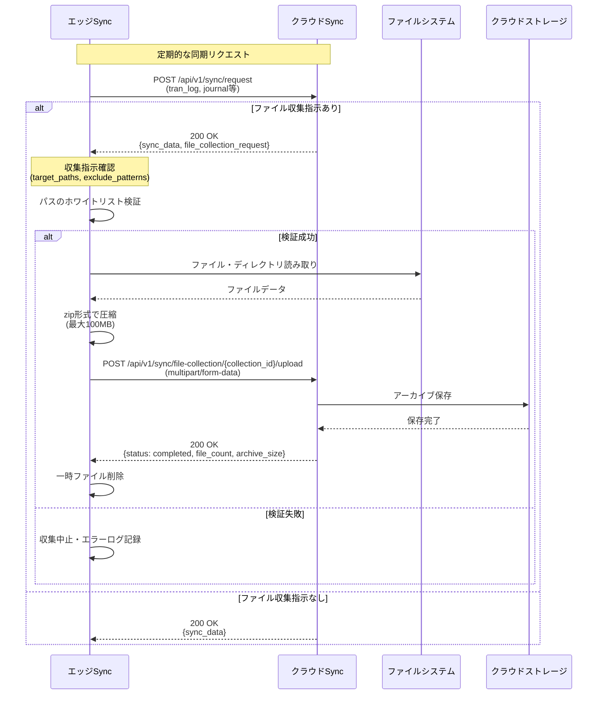
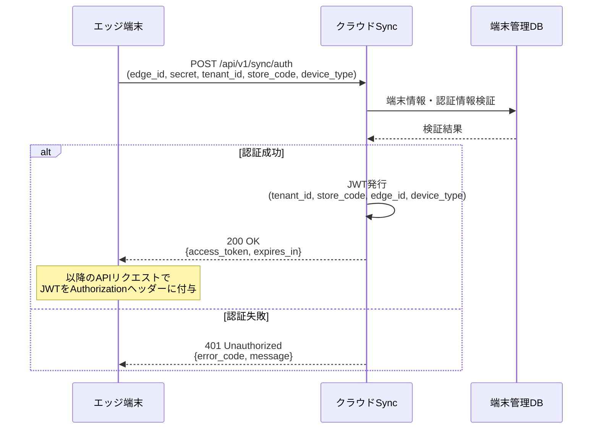
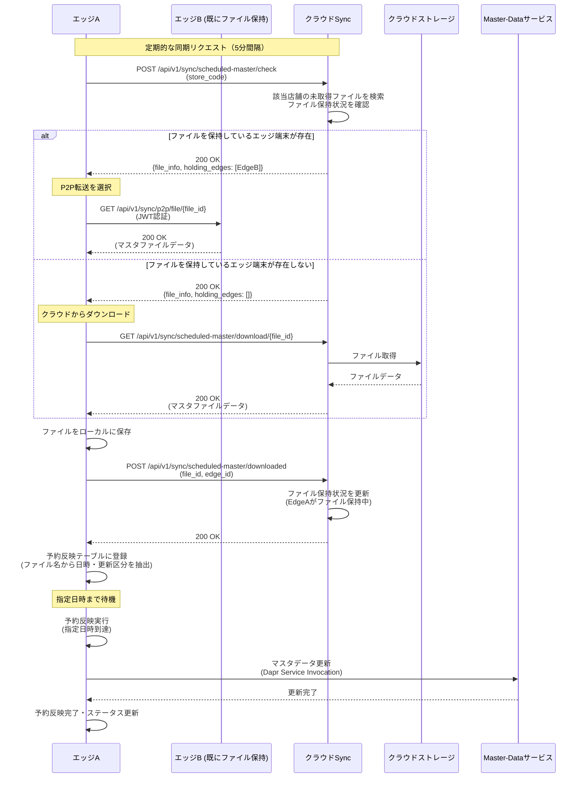

# Sync Service データ同期 機能要件書

## 1. 概要

### 1.1 目的
クラウド環境とエッジ環境（店舗）間でデータの同期を行うサービスを開発し、オフライン耐性を持つPOSシステムを実現する。

### 1.2 背景
- 店舗のPOSシステムは、ネットワーク障害時でも業務を継続できる必要がある
- クラウドで一元管理されるマスターデータを各店舗に配信する必要がある
- 店舗で発生したトランザクションデータをクラウドに集約して分析する必要がある
- トラブルシューティングやコンプライアンス対応のため、エッジ環境のファイルをクラウドで収集する必要がある

### 1.3 スコープ
本サービスは以下のデータの同期を対象とする：
- **マスターデータ**: 商品、価格、決済方法、税制、スタッフ情報など（クラウド→エッジ）
- **ターミナルデータ**: テナント情報、店舗情報、端末情報、端末ステータス（双方向同期）
- **トランザクションデータ**: 取引ログ（売上・返品・取消を含む）、開設精算、入出金（エッジ→クラウド）
- **ジャーナルデータ**: 電子ジャーナル（エッジ→クラウド）
- **ファイル収集**: エッジ環境の任意ファイル・ディレクトリの圧縮収集（アプリケーションログを含む）（エッジ→クラウド）

## 2. 機能要件

### 2.1 サービス構成

#### 2.1.1 新規機能の追加

Sync Service内に以下の機能を実装します：

##### データ同期管理機能

**機能概要:**
クラウド環境とエッジ環境（店舗）間でデータの双方向同期を実現する中核機能。

**主要機能:**
- **マスターデータ同期**: 商品、価格、決済方法、税制、スタッフ情報などのクラウド→エッジ同期
- **トランザクションデータ同期**: 取引ログ、開設精算、入出金などのエッジ→クラウド同期
- **ターミナルデータ同期**: 店舗情報、端末情報、端末状態の双方向同期
- **ジャーナルデータ同期**: 電子ジャーナルのエッジ→クラウド同期
- **ファイル収集**: エッジ環境の任意ファイル・ディレクトリの圧縮収集（アプリログ含む）

**エンドポイント:**
- POST /api/v1/sync/auth - エッジ端末認証・トークン発行
- POST /api/v1/sync/request - 同期リクエスト（エッジ側からの定期ポーリング）
- POST /api/v1/sync/execute - 手動同期実行
- GET /api/v1/sync/history - 同期履歴取得
- POST /api/v1/sync/file-collection/{collection_id}/upload - ファイルアーカイブ送信
- GET /api/v1/sync/file-collection/{collection_id} - ファイル収集状況確認
- GET /api/v1/sync/file-collection/{collection_id}/download - ファイルアーカイブダウンロード

##### マスターデータ予約反映機能

**機能概要:**
マスタデータ管理サーバから店舗単位で配信されるマスタファイルを事前受信し、ファイル名に含まれる反映日時に自動更新を実行する機能。

**主要機能:**
- **ファイル配信管理**: 店舗固有マスタと全店共通マスタの配信管理
- **予約スケジューリング**: ファイル名から反映日時を抽出し、指定日時に自動実行
- **P2Pファイル共有**: 同一店舗内のエッジ端末間でマスタファイルを共有し、クラウド負荷を軽減
- **ファイル保持状況管理**: クラウド側で全エッジ端末のファイル保持状況を一元管理
- **更新区分対応**: 全件更新（A）と差分更新（M）をサポート

**エンドポイント:**
- POST /api/v1/sync/scheduled-master/check - 未取得ファイル確認・保持状況取得
- GET /api/v1/sync/scheduled-master/download/{file_id} - マスタファイルダウンロード（クラウドから）
- GET /api/v1/sync/p2p/file/{file_id} - マスタファイルダウンロード（エッジ端末間P2P）
- POST /api/v1/sync/scheduled-master/downloaded - ダウンロード完了通知・保持状況更新

##### マスターデータ整合性チェック機能

**機能概要:**
マスターデータ同期における整合性を保証するため、段階的なチェックメカニズムを実装。

**主要機能:**
- **チェックサム検証**: SHA-256によるデータ受信完全性の検証
- **レコード件数検証**: DB投入/更新の完全性確認
- **バージョン検証**: 更新漏れの検出と補完同期の自動実行
- **補完同期管理**: 欠落バージョンの自動補完（最大20バージョン/回）
- **自動リトライ**: 検証失敗時の指数バックオフリトライ（最大3回）

**エンドポイント:**
- POST /api/v1/sync/backfill - 欠落バージョンの補完同期

**設計上の重要性:**
- データ受信整合性、データ永続化整合性、更新完全性の3つの観点から検証
- マスター種別単位のチェックで効率性を重視（個別レコード単位のチェックは実施しない）
- 欠落バージョン数が50件を超える場合は一括同期への切り替えを推奨

#### 2.1.2 サービス配置
```
クラウド環境:
  - sync (Cloud Mode)
  - account, terminal, master-data, cart, report, journal, stock

エッジ環境:
  - sync (Edge Mode)
  - account, terminal, master-data, cart, report, journal, stock
```

### 2.2 データ別同期仕様

#### 2.2.1 データ種別同期仕様一覧

| データ種別 | 同期方向 | 差分同期 | 一括同期 | ポーリング間隔 | 備考 |
|------------|----------|----------|----------|----------------|------|
| master_data | クラウド→エッジ | ✓ | ✓ | 30秒-1分 | 初期セットアップ時は一括同期 |
| terminal | 双方向 | ✓ | × | 30秒-1分 | 店舗情報、端末情報、端末状態 |
| tran_log | エッジ→クラウド | ✓ | × | 30秒-1分 | 取引データ（売上・返品・取消） |
| open_close_log | エッジ→クラウド | ✓ | × | 30秒-1分 | 開設精算データ |
| cash_in_out_log | エッジ→クラウド | ✓ | × | 30秒-1分 | 入出金データ |
| journal | エッジ→クラウド | ✓ | × | 30秒-1分 | 電子ジャーナル |
| file_collection | エッジ→クラウド | × | ✓ | オンデマンド | 任意ファイル・ディレクトリの収集（アプリログ含む） |

**注記:**
- ✓: サポート、×: 非サポート
- ポーリング間隔は環境変数`SYNC_POLL_INTERVAL`で調整可能

#### 2.2.2 マスターデータ（クラウド → エッジ）

**対象データ:**

master-dataサービスで管理されているマスターデータを同期対象とする。

- カテゴリーマスター（category_master）
- 商品共通マスター（item_common_master）
- 店舗別商品マスター（item_store_master）
- 決済方法マスター（payment_master）
- スタッフマスター（staff_master）
- 税制マスター（tax_master）
- 設定マスター（settings_master）

※今後マスターデータが追加された場合には、それも対象とする

#### 2.2.3 マスターデータ整合性チェック

**基本方針:**

マスターデータ同期における整合性チェックは、以下の3つの観点から最低限必要な検証のみを実施します：

- **データ受信整合性**: 送信されたデータが正しく受信できているか
- **データ永続化整合性**: 受信したデータが正しくデータベースに反映されているか
- **更新完全性**: 差分同期において更新漏れがないか

**チェック粒度:**
- マスター種別単位（商品マスター、価格マスター、決済方法マスター等）
- 個別レコード単位のチェックは実施せず、効率性を重視

**一括同期の整合性チェック:**

1. **マスター種別ごとのチェックサム検証**
   - **目的**: 送信データの完全性確認
   - **実施タイミング**: データ受信完了後、DB投入前
   - **検証内容**:
     - クラウド側で送信前に計算したマスター種別全体のチェックサム値
     - エッジ側で受信後に計算したマスター種別全体のチェックサム値
     - 両者の一致確認により、通信途中でのデータ破損・欠損を検出
   - **チェックサム算出方法**:
     - マスター種別内の全レコードを統合してSHA-256ハッシュ値を計算
     - レコード順序の影響を排除するため、主キー昇順でソート後に算出
     - 環境依存フィールド（created_at等）は除外して算出
   - **不一致時の対応**:
     - 同期処理を中断し、データを破棄
     - 自動リトライ（最大3回）
     - リトライ失敗時はエラーログ出力とアラート通知

2. **マスター種別ごとのレコード件数検証**
   - **目的**: データベース投入の完全性確認
   - **実施タイミング**: DB投入完了後
   - **検証内容**:
     - 送信予定レコード件数（クラウド側で事前計算）
     - 実際にDBに投入されたレコード件数（エッジ側で実測）
     - 両者の完全一致確認により、DB投入処理の成功を保証
   - **件数取得方法**:
     - 送信件数：クラウド側でマスター種別の全レコードをカウント
     - 投入件数：エッジ側でDB投入後にマスター種別テーブルをカウント
     - 投入範囲はedge_idでフィルタして正確な件数を取得
   - **不一致時の対応**:
     - DB投入処理をロールバック
     - 自動リトライ（最大3回）
     - リトライ失敗時は手動調査が必要なエラーとして扱う

**差分同期の整合性チェック:**

1. **マスター種別ごとのチェックサム検証**
   - **目的**: 差分データの受信完全性確認
   - **実施タイミング**: 差分データ受信完了後、DB更新前
   - **検証内容**:
     - クラウド側で送信前に計算した差分レコード群のチェックサム値
     - エッジ側で受信後に計算した差分レコード群のチェックサム値
     - 差分データセット単位での完全性を保証
   - **差分チェックサム算出方法**:
     - 同期対象期間（last_sync_timestamp以降）の変更レコードのみを対象
     - レコードのupdated_at昇順、主キー昇順でソート後にチェックサム算出
     - 新規追加、更新、削除の各操作を区別して算出
   - **不一致時の対応**:
     - 差分同期を中断し、受信データを破棄
     - 自動リトライ（最大3回）
     - リトライ失敗時は一括同期への切り替えを検討

2. **マスター種別ごとのレコード件数検証**
   - **目的**: 差分データのDB反映完全性確認
   - **実施タイミング**: DB更新処理完了後
   - **検証内容**:
     - 送信された差分レコード件数（追加・更新・削除の合計）
     - 実際にDBで更新されたレコード件数（INSERT、UPDATE、DELETEの実行件数合計）
     - 処理タイプ別の件数内訳も確認（追加○件、更新○件、削除○件）
   - **件数検証方法**:
     - 送信件数：クラウド側で差分抽出時にカウント
     - 処理件数：エッジ側でDB操作の実行結果から取得
     - 処理タイプ別（INSERT/UPDATE/DELETE）の詳細件数も照合
   - **不一致時の対応**:
     - DB更新処理をロールバック
     - 同期ステータスを"failed"に更新
     - 自動リトライ（最大3回）、失敗時は手動調査

3. **マスター種別ごとのレコードバージョン検証**
   - **目的**: 更新漏れの検出
   - **実施タイミング**: 差分同期完了後の定期チェック（5分間隔）
   - **検証内容**:
     - クラウド側マスター種別の最新バージョン番号
     - エッジ側マスター種別の最新バージョン番号
     - バージョン番号の連続性確認（欠番検出）
   - **バージョン管理方式**:
     - 各マスター種別にて単調増加するバージョン番号を付与
     - 差分同期時は対象バージョン範囲（from_version ～ to_version）を明示
     - エッジ側で受信後、バージョンの連続性と最終到達バージョンを検証
   - **検証ロジック**:
     ```
     期待バージョン範囲: [last_synced_version + 1, latest_cloud_version]
     実際のエッジバージョン: edge_latest_version

     チェック条件:
     1. edge_latest_version == latest_cloud_version (最新状態の一致)
     2. バージョン番号に欠番がないこと（連続性確認）
     ```
   - **バージョン不整合時の対応**:
     - 最新バージョン差異時：差分同期で最新データを取得（正常処理）
     - 欠落バージョン検出時：該当バージョンの補完同期を即座に実行
     - 欠落バージョン数が50件超過時：一括同期への切り替えを推奨（アラート通知後、手動実行等）

**チェック実行タイミング:**

一括同期時のチェック順序:
```
1. 一括データ受信
2. チェックサム検証 → NG時は中断・リトライ
3. DB投入処理（shadow table方式による切替）
4. レコード件数検証 → NG時はロールバック・リトライ
5. 同期完了
```

差分同期時のチェック順序:
```
1. 差分データ受信
2. チェックサム検証 → NG時は中断・リトライ
3. DB更新処理（INSERT/UPDATE/DELETE）
4. レコード件数検証 → NG時はロールバック・リトライ
5. 同期完了
6. [5分後] バージョン検証 → NG時は補完同期実行
```

**欠落バージョン管理と補完同期:**

1. **欠落バージョン管理方式**
   - 管理データ構造:
     ```json
     {
       "data_type": "master_data_products",
       "edge_id": "EDGE001",
       "latest_synced_version": 1250,
       "missing_versions": [47, 156, 342, 891, 1023, 1124],
       "last_updated": "2024-01-15T10:30:00Z"
     }
     ```
   - 管理項目:
     - `latest_synced_version`: エッジ側で取得済みの最新バージョン番号
     - `missing_versions`: 欠落している全バージョン番号のリスト
     - 欠落バージョン数の上限：50件（超過時は一括同期へ切り替え）

2. **補完同期メカニズム**
   - 実行フロー:
     1. バージョン検証で欠落を検出
     2. `missing_versions`から補完対象を特定（最大20件/回）
     3. クラウドに個別バージョン取得リクエスト送信
     4. 取得データをエッジDBに投入
     5. 成功したバージョンを`missing_versions`から削除
   - 補完同期API:
     ```
     POST /api/v1/sync/backfill
     {
       "edge_id": "EDGE001",
       "data_type": "master_data_products",
       "missing_versions": [47, 156, 342]
     }
     ```
   - 補完同期の特徴:
     - 通常の差分同期と並行実行可能
     - `last_sync_timestamp`は更新しない（現在の同期状態を維持）
     - 処理件数制限：20バージョン/回（システム負荷考慮）
     - 失敗時のリトライ：最大3回（指数バックオフ）
   - エラー時の対応:
     - ネットワークエラー：自動リトライ
     - 連続失敗時：一括同期への切り替えを推奨

**同期方法:**
- **初期同期**: 一括同期（スナップショット方式）
- **定期同期**: 差分同期（30-60秒間隔）
- **手動同期**: 管理画面から任意のタイミングで実行可能
- **予約反映**: ファイル名に指定された日時での自動反映

**一括同期タイミング:**
- システム初期セットアップ時
- 日次バッチ（営業時間外）
- マスターデータ大幅変更時（手動実行）

**差分同期タイミング:**
- 30秒-1分間隔の定期ポーリング（エッジ側からクラウドへ問い合わせ）

**予約反映の更新タイミング:**
- **S（Scheduled）**: 指定日時反映
  - ファイル名に指定された日時に反映実行
  - 過去日時の場合は即時実行
  - 未来日時の場合は指定日時まで待機後に実行

**予約反映の更新区分:**
- **A（All）**: 全件更新（既存データを全て置き換え）
- **M（Modified）**: 差分更新（変更分のみ適用）

#### 2.2.4 ターミナルデータ（双方向）

**クラウド → エッジ:**
- 店舗情報（store）
- 端末情報（terminal）
- terminalサービスが管理するマスタ情報

**エッジ → クラウド:**
- 端末ステータス（terminal_status）
- 店舗状態変更通知

**同期方法:**
- **差分同期**: 30秒-1分間隔の定期同期
- 双方向での変更検知と反映

**同期タイミング:**
- 定期的なポーリング（30秒～1分間隔）

#### 2.2.5 トランザクションデータ（エッジ → クラウド）

**対象データ:**
- 取引ログ（tran_log） ※売上・返品・取消取引を含む
- 開設精算（open_close_log）
- 入出金（cash_in_out_log）

**同期方法:**
- **差分同期**: 非同期での定期同期（30秒～1分間隔）
- **復旧時同期**: ネットワーク復旧時に未送信分を一括送信

**同期タイミング:**
- 定期的なポーリング（30秒～1分間隔）
- ネットワーク障害時はローカルキューに保存
- ネットワーク復旧時に未送信分を自動送信

#### 2.2.6 ジャーナルデータ（エッジ → クラウド）

**対象データ:**
- 電子ジャーナル（electronic_journal）

**同期方法:**
- **差分同期**: 非同期での定期同期（30秒～1分間隔）
- **復旧時同期**: ネットワーク復旧時に未送信分を送信

**同期タイミング:**
- 定期的なポーリング（30秒～1分間隔）
- ネットワーク障害時はローカルキューに保存
- ネットワーク復旧時に未送信分を自動送信

#### 2.2.7 ファイル収集（エッジ → クラウド）

**対象データ:**
- エッジ環境の任意のファイル・ディレクトリ
- アプリケーションログ（log_application、log_request、その他ログ）
- 設定ファイル、データベースファイル、システムファイル等

**同期方法:**
- **同期レスポンス連動**: エッジ側の定期同期リクエストのレスポンスに収集指示が含まれる場合に実行
- **圧縮アーカイブ**: 収集対象をzip形式で圧縮してクラウドに送信

**収集フロー:**
1. エッジ側が定期的な同期リクエスト（tran_log, journal等）をクラウド側に送信
2. クラウド側が同期レスポンスを返却
   - 通常の同期データ + 収集指示（オプション）
   - 収集指示内容：対象パス、アーカイブファイル名、除外パターン
3. エッジ側がレスポンスに収集指示が含まれている場合、収集処理を開始
   - 指定パスのホワイトリスト検証
4. エッジ側が指定パスを圧縮アーカイブ作成
   - zip形式での圧縮
   - 最大アーカイブサイズ制限（100MB、設定可能）
   - 一時ディレクトリでの作業
5. エッジ側がファイル収集専用APIでクラウド側にアーカイブを送信
   - チャンク分割対応（大容量ファイル用）
   - 送信完了後、一時ファイルを削除
6. クラウド側がアーカイブを受信・保存し、収集完了をレスポンスで通知
   - 成功時：ステータス"completed"を返却
   - 失敗時：エラー詳細を返却



**セキュリティ制限:**
- 収集可能パスの事前許可制（ホワイトリスト、環境変数で設定）
- 最大ファイルサイズ・アーカイブサイズ制限

**同期タイミング:**
- 定期同期リクエストのレスポンスに収集指示が含まれている場合のみ実行
- クラウド側で収集が必要と判断された際に指示
- 緊急時やトラブルシューティング時の手動指示

### 2.3 同期状態管理

**管理主体**: クラウド側syncサービスが全エッジインスタンスの同期状態を一元管理

**管理対象データ種別:**

【マスターデータ（クラウド → エッジ）】
- `master_data`: マスターデータ（商品、価格、決済方法、税制、スタッフ等）

【ターミナルデータ（双方向）】
- `terminal`: 端末情報（店舗情報、端末情報、端末状態）

【トランザクションデータ（エッジ → クラウド）】
- `tran_log`: 取引ログ（売上、返品、取消）
- `open_close_log`: 開設精算ログ
- `cash_in_out_log`: 入出金ログ

【ジャーナルデータ（エッジ → クラウド）】
- `journal`: 電子ジャーナル

【ファイル収集（エッジ → クラウド）】
- `file_collection`: 任意ファイル・ディレクトリの圧縮収集（アプリログ、システムログ、設定ファイル等）

#### 2.3.1 同期ステータス

クラウド側syncサービスが、各エッジインスタンス・データ種別ごとに以下を管理：
- `edge_id`: エッジインスタンス識別子（テナント内で一意）
- `data_type`: データ種別（tran_log, open_close_log, master_data等）
- `last_sync_timestamp`: 最終同期時刻
- `sync_type`: 同期タイプ（differential/bulk）
- `status`: 同期状態（idle/syncing/completed/failed）
- `retry_count`: リトライ回数
- `error_message`: エラーメッセージ

#### 2.3.2 同期履歴

クラウド側syncサービスが同期実行履歴を記録：
- エッジID
- データ種別
- 同期タイプ（differential/bulk）
- 同期方向（cloud-to-edge/edge-to-cloud）
- 同期開始・終了時刻
- 同期データ件数・サイズ
- 成功/失敗状態
- エラー詳細
- リトライ回数
- 処理時間（ミリ秒）

### 2.4 競合解決

#### 2.4.1 競合検出

- 同一レコードへの同時更新を検出
- タイムスタンプ（updated_at）による変更追跡

#### 2.4.2 解決戦略

**Last Write Wins (後勝ち):**
- 唯一の解決方法としてシンプルに実装
- 最新タイムスタンプ（updated_at）のデータを採用
- 適用対象：全データ種別
- 競合発生時はログに記録（監査用）

※将来的に必要に応じて他の解決戦略を検討

### 2.5 エラーハンドリング

#### 2.5.1 リトライ機構

- 指数バックオフによるリトライ
- 最大リトライ回数: 5回（設定可能）
- リトライ間隔: 1秒 → 2秒 → 4秒 → 8秒 → 16秒

#### 2.5.2 サーキットブレーカー

- 連続失敗しきい値: 3回
- 回路開放時間: 60秒
- 半開状態での段階的復旧

#### 2.5.3 フォールバック

- ネットワーク障害時はローカルキューに保存
- キュー容量超過時は古いログから削除
- 重要データは必ず永続化

## 3. 非機能要件

### 3.1 パフォーマンス目標

- **同期遅延**: 5分以内（目標）
- **スループット**:
  - 全件更新時: 1000件/秒以上（目標）
  - 差分更新時: 100件/秒以上（目標）
- **データ圧縮率**: 50%以上（目標、gzip使用）
- **並行処理**: 最大1,000エッジの同時同期対応（目標）

### 3.2 可用性目標

- **稼働率**: 99.9%以上（目標）
- **自動復旧**: ネットワーク復旧後30秒以内に同期再開（目標）
- **データ保証**: At-least-once delivery

### 3.3 セキュリティ要件

#### 3.3.1 通信セキュリティ
- **通信暗号化**: TLS 1.2以上による暗号化
- **データ暗号化**: 機密データは暗号化して保存

#### 3.3.2 エッジ端末認証

**エッジ端末の定義:**
- 1店舗に複数台のエッジ端末が存在する構成をサポート
- レジ自身がエッジ機能を内蔵するケース
- 専用エッジサーバーを設置するケース
- **edge_id命名規則**: `edge-<tenant_id>-<store_code>-<連番>`
  - 例: `edge-A1234-tokyo-001` (Edge端末), `edge-A1234-tokyo-002` (POS端末)
  - 一意性: グローバルに一意（tenant_id、store_code、連番の組み合わせ）
  - デバイス種別: `device_type`フィールドで判別（edge/pos）

**認証フロー:**
1. エッジ端末が`edge_id`と`secret`を使用して認証リクエスト送信
2. クラウド側syncサービスが認証し、JWTトークンを発行
3. JWTトークンに`tenant_id`、`store_code`、`edge_id`、`device_type`を含める
4. 以降のAPIアクセスはJWTトークンをAuthorizationヘッダーに付与



**JWT構成:**
```json
{
  "tenant_id": "A1234",
  "store_code": "tokyo",
  "edge_id": "edge-A1234-tokyo-001",
  "device_type": "pos",     // pos/edge等
  "exp": 1234567890,        // 有効期限
  "iat": 1234567800         // 発行時刻
}
```

**エッジ端末管理:**
- 各テナントのDB（`sync_{tenant_id}`）にエッジ端末情報を管理
- edge_idはグローバルに一意（tenant_id、store_code、連番の組み合わせ）
- テナント間の完全な分離を実現

### 3.4 運用要件

- **監視**: メトリクス、ログ、ヘルスチェック
- **アラート**: 同期遅延、エラー率上昇時に通知
- **バックアップ**: 同期状態の定期バックアップ

## 4. インターフェース仕様

### 4.1 エッジ端末認証API

**目的**: エッジ端末がクラウドsyncサービスに対して認証を行い、JWTトークンを取得する。

**エンドポイント**: POST /api/v1/sync/auth

**リクエストヘッダー**:
- Content-Type: application/json

**リクエストパラメータ**:
- tenant_id: テナントID
- store_code: 店舗コード
- edge_id: エッジ端末ID（`edge-<tenant_id>-<store_code>-<連番>`形式、グローバルに一意）
- device_type: デバイスタイプ（pos/edge等）
- secret: 認証用シークレット

**成功レスポンス（200 OK）**:
- success: true
- data:
  - access_token: JWTアクセストークン
  - token_type: トークンタイプ（bearer）
  - expires_in: 有効期限（秒）

**エラーレスポンス（401 Unauthorized）**:
- success: false
- error:
  - code: エラーコード（例: AUTH_002）
  - message: エラーメッセージ

### 4.2 同期API

#### 4.2.1 同期状態確認（エッジ側からの定期リクエスト）

**目的**: エッジ端末が定期的にクラウドに同期リクエストを送信し、同期データおよびファイル収集指示を取得する。

**エンドポイント**: POST /api/v1/sync/request

**リクエストヘッダー**:
- Authorization: Bearer <JWT_TOKEN>
- Content-Type: application/json

**リクエストパラメータ**:
- edge_id: エッジ端末ID
- data_type: データ種別（tran_log/master_data等）
- last_sync_timestamp: 最終同期タイムスタンプ（ISO 8601形式）
- sync_type: 同期タイプ（differential/bulk）

**成功レスポンス（200 OK）**:
- success: true
- data:
  - sync_data:
    - records: 同期データレコード配列
    - next_sync_timestamp: 次回同期タイムスタンプ
  - file_collection_request（オプション）:
    - collection_id: 収集ID
    - collection_name: 収集名
    - target_paths: 収集対象パス配列
    - exclude_patterns: 除外パターン配列
    - max_archive_size_mb: 最大アーカイブサイズ（MB）

#### 4.2.2 手動同期実行

**目的**: 管理者が任意のタイミングで同期を手動実行する。

**エンドポイント**: POST /api/v1/sync/execute

**リクエストヘッダー**:
- Authorization: Bearer <JWT_TOKEN>
- Content-Type: application/json

**リクエストパラメータ**:
- data_type: データ種別（master_data等）
- sync_type: 同期タイプ（bulk/differential）
- data_filter: データフィルター条件（オプション）

**成功レスポンス（202 Accepted）**:
- success: true
- data:
  - sync_id: 同期ID
  - status: ステータス（queued等）
  - message: メッセージ

#### 4.2.3 同期履歴取得

**目的**: 指定期間の同期履歴を取得する。

**エンドポイント**: GET /api/v1/sync/history

**リクエストヘッダー**:
- Authorization: Bearer <JWT_TOKEN>

**クエリパラメータ**:
- from: 開始日時（YYYY-MM-DD形式）
- to: 終了日時（YYYY-MM-DD形式）

**成功レスポンス（200 OK）**:
- success: true
- data:
  - histories: 同期履歴配列
    - sync_id: 同期ID
    - edge_id: エッジ端末ID
    - data_type: データ種別
    - sync_type: 同期タイプ
    - sync_direction: 同期方向（edge-to-cloud/cloud-to-edge）
    - start_time: 開始時刻
    - end_time: 終了時刻
    - record_count: レコード件数
    - data_size_bytes: データサイズ（バイト）
    - status: ステータス（success/failed等）
  - total: 総件数

### 4.3 ファイル収集API

#### 4.3.1 ファイル送信（エッジからクラウドへ）

**目的**: エッジ端末が収集したファイルアーカイブをクラウドへ送信する。

**エンドポイント**: POST /api/v1/sync/file-collection/{collection_id}/upload

**リクエストヘッダー**:
- Authorization: Bearer <JWT_TOKEN>
- Content-Type: multipart/form-data

**リクエストボディ**:
- archive: 圧縮アーカイブファイル（multipart/form-data形式）
  - ファイル名例: error_logs_20250115.zip
  - Content-Type: application/zip

**成功レスポンス（200 OK）**:
- success: true
- data:
  - collection_id: 収集ID
  - file_count: ファイル件数
  - archive_size_bytes: アーカイブサイズ（バイト）
  - status: ステータス（completed等）
  - message: メッセージ

#### 4.3.2 ファイル収集履歴確認

**目的**: 指定した収集IDの収集状況と履歴を確認する。

**エンドポイント**: GET /api/v1/sync/file-collection/{collection_id}

**リクエストヘッダー**:
- Authorization: Bearer <JWT_TOKEN>

**パスパラメータ**:
- collection_id: 収集ID

**成功レスポンス（200 OK）**:
- success: true
- data:
  - collection_id: 収集ID
  - edge_id: エッジ端末ID
  - collection_name: 収集名
  - status: ステータス（completed/failed等）
  - file_count: ファイル件数
  - archive_size_bytes: アーカイブサイズ（バイト）
  - download_url: ダウンロードURL
  - start_time: 開始時刻
  - end_time: 終了時刻

#### 4.3.3 ファイルダウンロード

**目的**: 収集されたファイルアーカイブをダウンロードする。

**エンドポイント**: GET /api/v1/sync/file-collection/{collection_id}/download

**リクエストヘッダー**:
- Authorization: Bearer <JWT_TOKEN>

**パスパラメータ**:
- collection_id: 収集ID

**成功レスポンス（200 OK）**:
- レスポンスヘッダー:
  - Content-Type: application/zip
  - Content-Disposition: attachment; filename="収集名.zip"
  - Content-Length: ファイルサイズ（バイト）
- レスポンスボディ: 圧縮アーカイブデータ（バイナリ）

## 5. マスターデータ予約反映機能

### 5.1 概要

マスタデータ管理サーバ（Mサーバ）から店舗単位で配信されるマスタファイルを事前受信し、ファイル名に含まれる反映日時に自動更新を実行する機能。全店共通マスタ（店舗ID=COMMON）は全店舗に配信される。

### 5.2 ファイル命名規則

```
[マスタ反映日時]_[更新タイミング]_[反映優先順位]_[ファイルID]_[マスタ作成日時]_[更新区分]_S[店舗ID].json

店舗固有マスタ例：202501011200_S_01_ITEM01_20250115123456_A_S001.json
全店共通マスタ例：202501011200_S_01_CATEG1_20250115123456_A_SCOMMON.json
```

### 5.3 店舗ID定義

- **001-999**: 店舗固有マスタ（該当店舗のみに配信）
- **COMMON**: 全店共通マスタ（全店舗に配信）

### 5.4 反映タイミング

**更新タイミング区分:**
- **S（Scheduled）**: 指定日時反映
  - ファイル名に指定された日時に反映実行
  - 過去日時の場合は即時実行
  - 未来日時の場合は指定日時まで待機後に実行

**更新区分:**
- **A（All）**: 全件更新（既存データを全て置き換え）
- **M（Modified）**: 差分更新（変更分のみ適用）

### 5.5 同期フロー

1. エッジ側が定期的に同期リクエスト送信（5分間隔）
2. クラウド側が該当店舗の未取得ファイル情報を返却
   - ファイル情報（ファイル名、サイズ、ハッシュ等）
   - 既にファイルを保持している同一店舗内のエッジ端末情報（存在する場合）
3. エッジ側がファイルダウンロードを開始
   - クラウドからの情報に基づいて取得元を判断
   - ファイルを保持しているエッジ端末が存在する場合、そのエッジ端末から直接取得（P2P転送）
   - 保持しているエッジ端末がない場合、クラウドからダウンロード
4. エッジ側がダウンロードしたファイルをローカルに保存
5. エッジ側がダウンロード完了をクラウドに通知（ファイル保持状況の更新）
6. エッジ側が予約反映テーブルに登録
7. 指定日時に自動反映を実行



**エッジ端末間ファイル共有:**
- クラウドが同一店舗内の全エッジ端末のファイル保持状況を一元管理
- 同一店舗内のエッジ端末間でファイルを共有することで、クラウドへの通信負荷を軽減
- 最初にダウンロードしたエッジ端末がファイルサーバーの役割を果たす
- ファイル取得元の優先順位: 店舗内エッジ端末 > クラウド
- セキュリティ: 店舗内エッジ端末間の通信も認証・暗号化を実施

### 5.6 マスターデータ同期との統合

**実行前提条件:**
- 予約反映実行前にCloud-Edge同期状態を確認
- 同期状態に問題がある場合は先に同期を完了
- 予約反映実行後に整合性を検証
- 不整合検出時は自動復旧を実行

**実行フロー:**
1. 予約反映対象の検出（1分間隔）
2. 同期状態チェック
3. 必要に応じてCloud-Edge同期実行
4. 予約反映実行
5. 整合性チェック実行
6. 必要に応じて緊急復旧処理

## 6. データベース構成

### 6.1 テナント別データベース

- sync サービスも他のサービスと同様に、テナント毎に独立したデータベースを使用
- データベース名: `sync_{tenant_id}` (例: sync_A1234)
- 各テナントの同期状態、履歴、リクエストは完全に分離して管理
