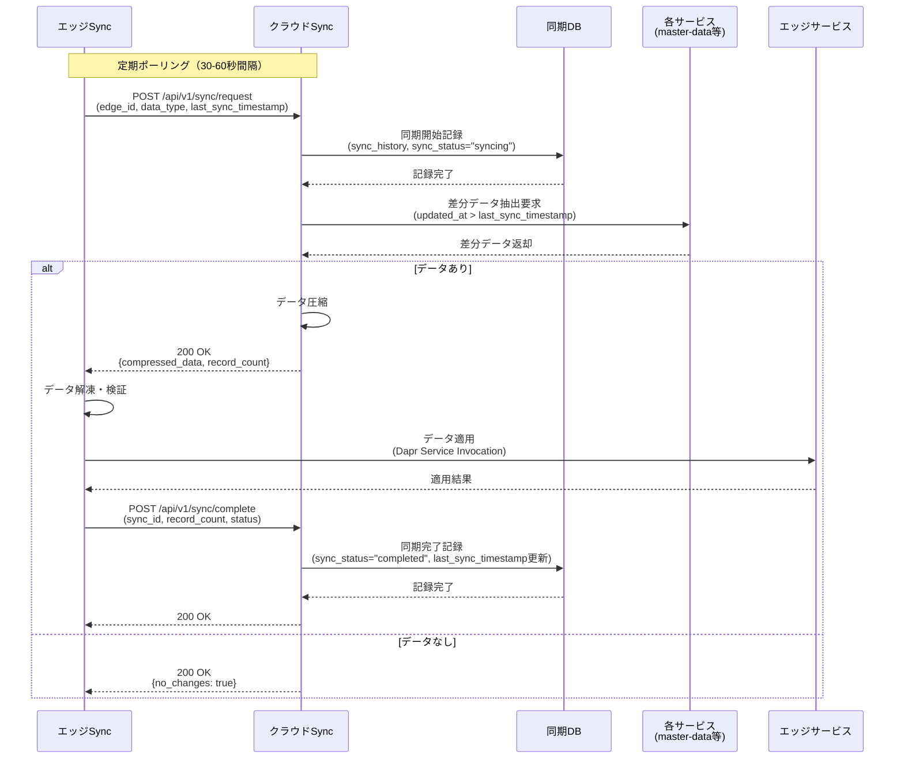
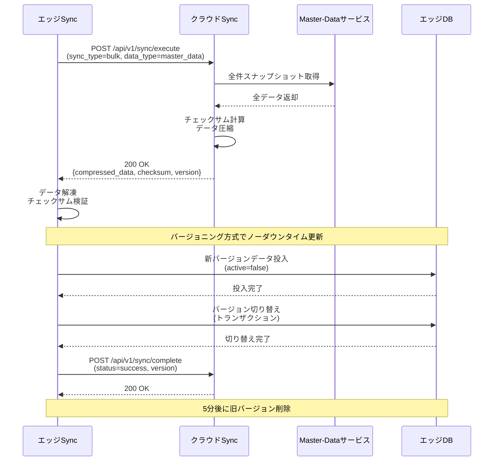
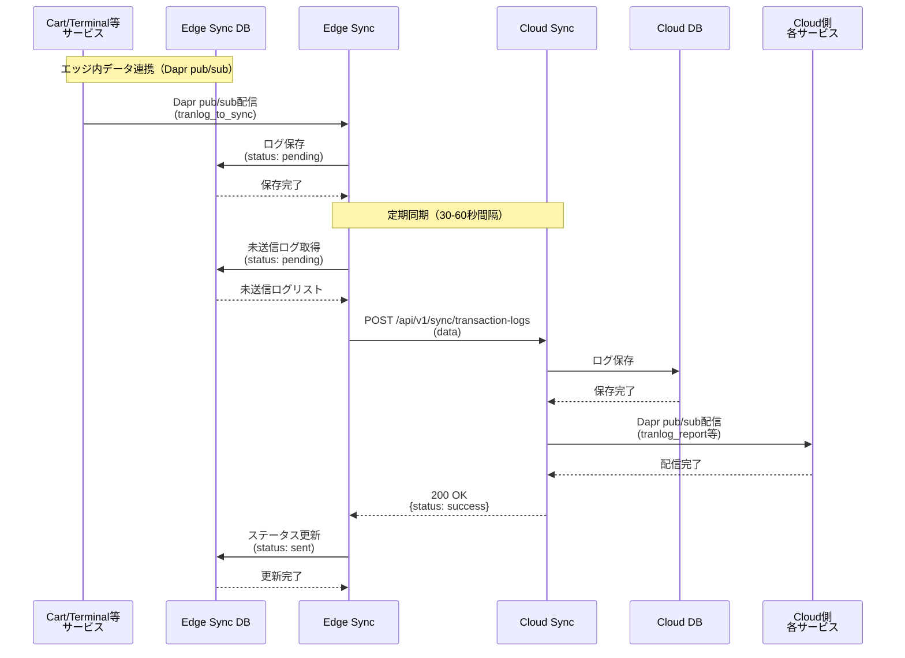
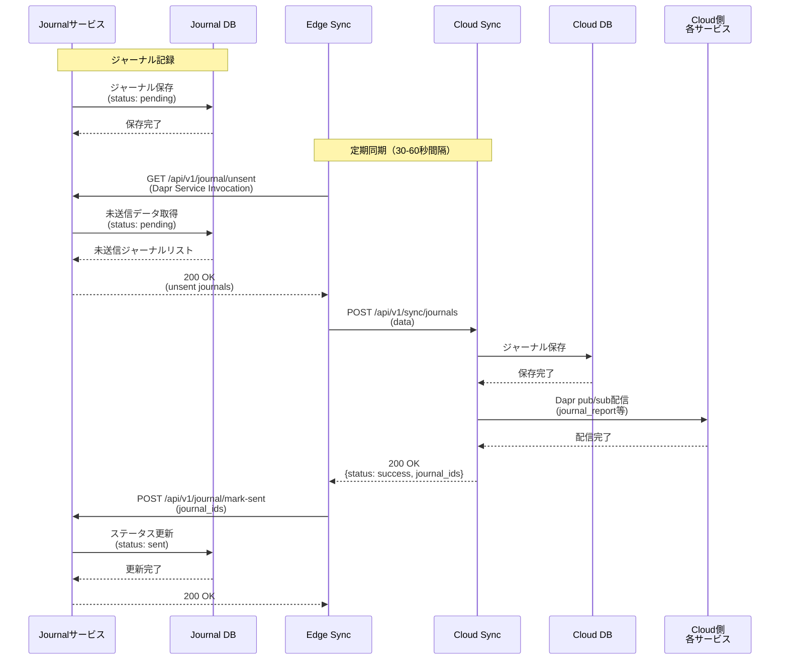
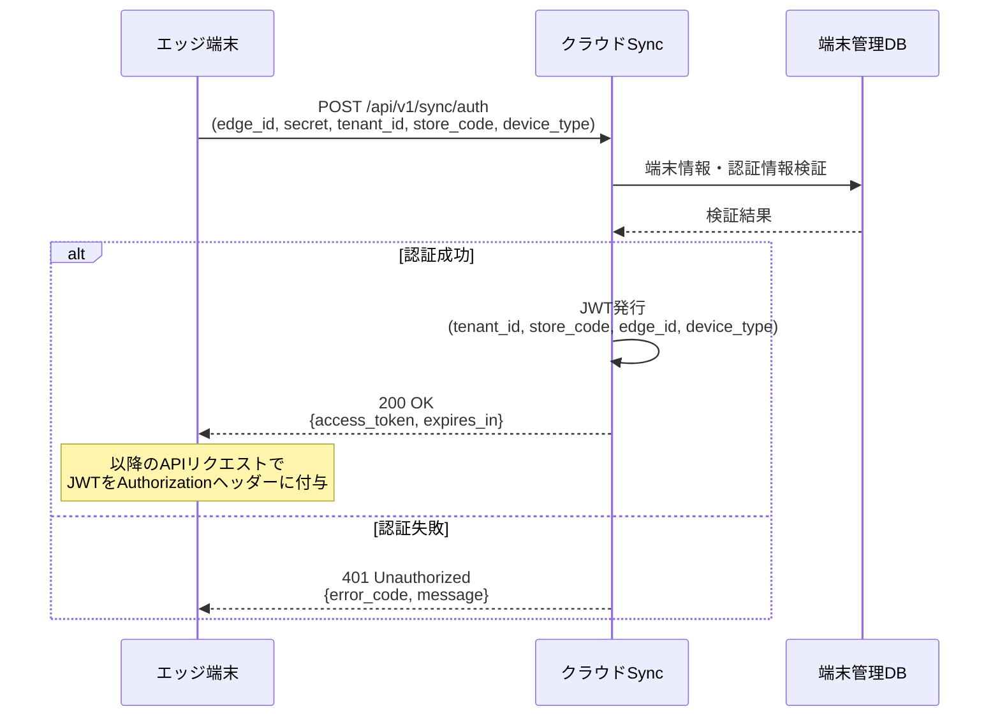
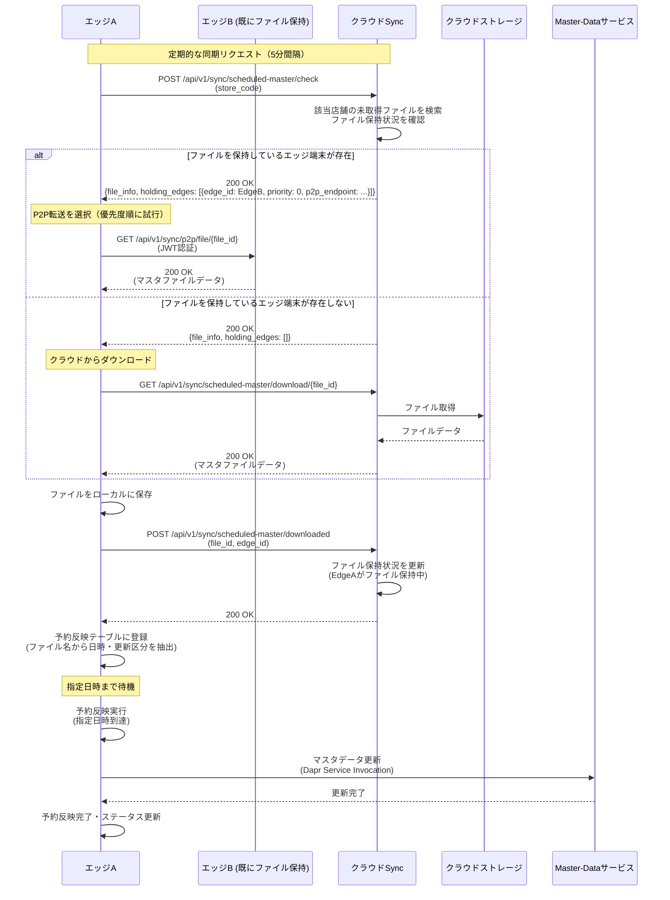
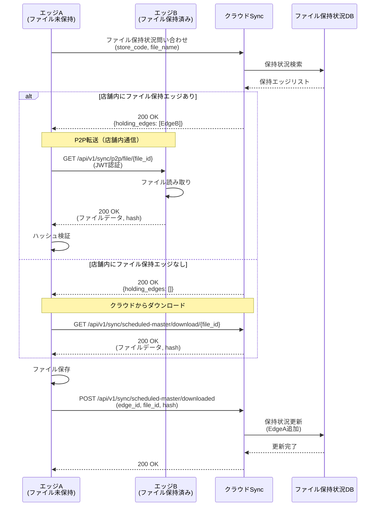
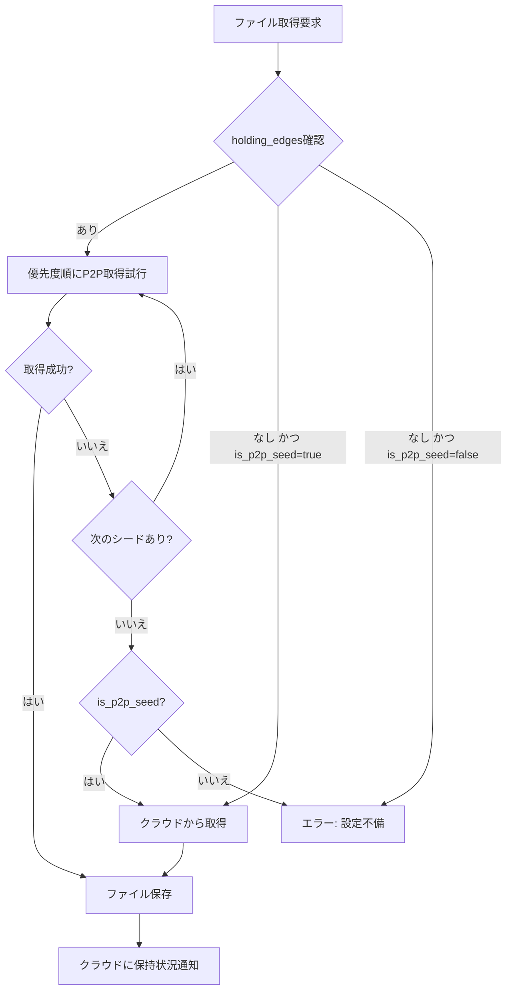
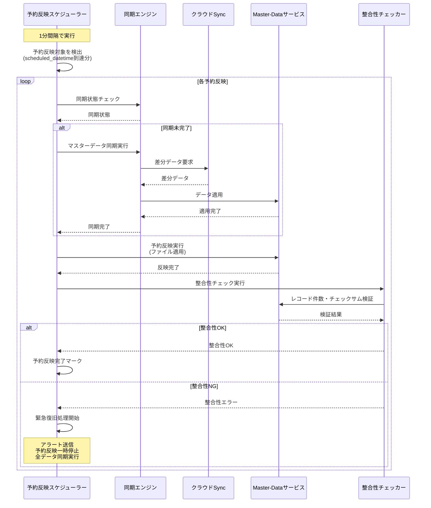

# Sync Service データ同期 詳細設計書

## 1. データ同期フロー概要と比較

### 1.1 データタイプ別同期方式一覧

本Sync Serviceは、データの特性に応じて6つの異なる同期方式を実装しています。

| データタイプ | 同期方向 | 同期方式 | データ収集方法 | ステータス管理場所 | 同期頻度 |
|------------|---------|---------|--------------|------------------|---------|
| **マスターデータ** | Cloud → Edge | プル型（差分/一括） | Cloud Syncが各サービスから取得 | Cloud Sync DB | 30-60秒間隔 |
| **ターミナルマスタ** | Cloud → Edge | プル型（マスタ同期の一部） | マスタ同期に含めてCloud Syncが取得 | Cloud Sync DB | 30-60秒間隔 |
| **ターミナル状態** | Edge → Cloud | プッシュ型（ステータス管理） | Dapr pub/sub | **Edge Sync DB** | 30-60秒間隔 |
| **トランザクションログ** | Edge → Cloud | プッシュ型（ステータス管理） | Dapr pub/sub | **Edge Sync DB** | 30-60秒間隔 |
| **ジャーナルデータ** | Edge → Cloud | プル型（ステータス管理） | Dapr Service Invocation | **Journal Service DB** | 30-60秒間隔 |
| **ファイル収集** | Edge → Cloud | オンデマンド | 同期レスポンスによる指示 | File Collection DB | 応答トリガー |

### 1.2 同期方式の詳細比較

#### 1.2.1 マスターデータ同期（Cloud → Edge）

**特徴:**
- クラウド側がマスターデータソース
- エッジ側からのポーリングによる差分取得
- 一括同期時はバージョニング方式でノーダウンタイム更新

**データフロー:**
```
Edge Sync (定期ポーリング)
  ↓ POST /api/v1/sync/request
Cloud Sync (差分データ抽出)
  ↓ 各サービス(master-data等)にデータ取得要求
  ↓ データ圧縮・送信
Edge Sync (受信・検証)
  ↓ Dapr Service Invocation
Master-Dataサービス (データ適用)
```

**整合性チェック:**
- チェックサム検証（マスター種別単位）
- レコード件数検証
- バージョン検証（差分同期時）

**特記事項:**
- 24時間営業店舗対応（バージョニング方式）
- チェックサム不一致時は自動リトライ（最大3回）
- 大量データ時はストリーミング方式を併用可能

#### 1.2.2 ターミナルデータ同期

ターミナルデータは2つの異なるタイプに分離され、それぞれ異なる同期方式を使用します。

##### 1.2.2.1 ターミナルマスタデータ（Cloud → Edge）

**対象データ:**
- テナント情報（tenant）
- 店舗情報（store）
- 端末情報（terminal）
- Terminalサービスが管理するマスタ情報

**特徴:**
- マスターデータ同期（1.2.1節）の一部として実施
- Cloud Syncがマスタデータと同様の方式でTerminalサービスから取得
- Edge Syncが受信したデータをTerminal ServiceのAPIに反映

**データフロー:**
```
Edge Sync (定期ポーリング)
  ↓ POST /api/v1/sync/request (sync_types: ["terminal_master"])
Cloud Sync (差分データ抽出)
  ↓ Terminal Serviceにデータ取得要求
  ↓ データ圧縮・送信
Edge Sync (受信・検証)
  ↓ Dapr Service Invocation
Terminal Service (データ適用)
  ↓ POST /api/v1/terminal/sync/master
  ↓ Terminal DBに反映
```

**API反映方式:**
- Edge Sync → Terminal Service: Dapr Service Invocation
- エンドポイント例: `POST /api/v1/terminal/sync/master`
- リクエストボディ: `{ "terminals": [...], "stores": [...], "tenant": {...} }`

**特記事項:**
- マスターデータ同期と同じチェックサム検証を実施
- バージョン管理により差分同期に対応

##### 1.2.2.2 ターミナル状態データ（Edge → Cloud）

**対象データ:**
- 端末ステータス（terminal_status）
- 端末状態変更通知

**特徴:**
- トランザクションログ送信（1.2.3節）と同様のプッシュ型
- Terminal ServiceからEdge SyncへDapr pub/subで通知
- Edge Sync DBでステータス管理（`pending` → `sent`）

**データフロー:**
```
Terminal Service (状態変更発生)
  ↓ Dapr pub/sub (terminal_status_to_sync)
Edge Sync (サブスクライブ)
  ↓ Edge Sync DBに保存 (status: pending)
  ↓ 定期送信処理（30-60秒間隔）
  ↓ status=pending のデータを取得
  ↓ POST /api/v1/sync/terminal-status
Cloud Sync (受信・保存)
  ↓ Cloud DBに保存
  ↓ レスポンス返却
Edge Sync (ステータス更新)
  ↓ status: sent に更新
```

**ステータス管理:**
- `pending`: 未送信（Edge Sync DBで管理）
- `sent`: 送信完了
- 送信失敗時は`pending`のまま維持し、次回自動リトライ

**特記事項:**
- At-least-once delivery保証
- ネットワーク断時はローカルDBでキューイング
- クラウド側での他サービスへの配信は不要（Terminal状態の通知のみ）

#### 1.2.3 トランザクションログ送信（Edge → Cloud）

**特徴:**
- エッジ内サービスからDapr pub/subでログ収集
- Edge Sync DBでステータス管理（`pending` → `sent`）
- At-least-once delivery保証

**データフロー:**
```
Cart/Terminal等サービス (トランザクション発生)
  ↓ Dapr pub/sub (tranlog_to_sync等)
Edge Sync (サブスクライブ)
  ↓ Edge Sync DBに保存 (status: pending)
  ↓ 定期送信処理（30-60秒間隔）
  ↓ status=pending のログを取得
  ↓ POST /api/v1/sync/transaction-logs
Cloud Sync (受信・配信)
  ↓ Cloud DBに保存
  ↓ Dapr pub/sub (tranlog_report等)
  ↓ レスポンス返却
Edge Sync (ステータス更新)
  ↓ status: sent に更新
```

**ステータス管理:**
- `pending`: 未送信（Edge Sync DBで管理）
- `sent`: 送信完了
- 送信失敗時は`pending`のまま維持し、次回自動リトライ

**特記事項:**
- 同期リクエストによる差分確認が不要（ステータスベース）
- クラウド側で他サービスへpub/sub配信を実施
- ネットワーク断時はローカルDBでキューイング

#### 1.2.4 ジャーナルデータ送信（Edge → Cloud）

**特徴:**
- Edge SyncがJournalサービスからプル型で取得
- Journal Service DBでステータス管理（`pending` → `sent`）
- Dapr Service Invocation経由のAPI通信

**データフロー:**
```
Journalサービス (ジャーナル記録)
  ↓ Journal DBに保存 (status: pending)
Edge Sync (定期取得処理、30-60秒間隔)
  ↓ GET /api/v1/journal/unsent (Dapr Service Invocation)
Journalサービス
  ↓ status=pending のジャーナルを返却
Edge Sync
  ↓ POST /api/v1/sync/journals
Cloud Sync (受信・配信)
  ↓ Cloud DBに保存
  ↓ Dapr pub/sub配信（journal_report等）
  ↓ レスポンス返却（journal_ids）
Edge Sync
  ↓ POST /api/v1/journal/mark-sent (journal_ids)
Journalサービス
  ↓ status: sent に更新
```

**ステータス管理:**
- `pending`: 未送信（Journal Service DBで管理）
- `sent`: 送信完了
- 送信失敗時は`pending`のまま維持し、次回自動リトライ

**Journalサービス側API:**
- `GET /api/v1/journal/unsent`: 未送信ジャーナル取得
- `POST /api/v1/journal/mark-sent`: 送信完了マーク

**特記事項:**
- トランザクションログとは異なり、pub/subではなくサービス間API呼び出し
- Journal側でステータス管理することでJournalサービスの独立性を保つ
- At-least-once delivery保証

#### 1.2.5 ファイル収集（Edge → Cloud）

**特徴:**
- クラウド側からの指示により実行
- 定期同期レスポンスに収集指示を含める
- セキュリティ重視（ホワイトリスト検証）

**データフロー:**
```
Edge Sync (定期ポーリング)
  ↓ POST /api/v1/sync/request
Cloud Sync (同期レスポンス)
  ↓ file_collection_request を含めて返却
Edge Sync (収集指示受信)
  ↓ ファイル収集処理開始
  ↓ ホワイトリスト検証
  ↓ zip圧縮
  ↓ POST /api/v1/sync/file-collection/{collection_id}/upload
Cloud Sync (アーカイブ受信・保存)
  ↓ 保存完了通知
```

**セキュリティ検証:**
- ホワイトリスト検証（環境変数で設定）
- 最大アーカイブサイズ制限（デフォルト100MB）
- パストラバーサル攻撃対策

**特記事項:**
- オンデマンド実行（定期実行ではない）
- クラウドからのプッシュ指示ではなく、ポーリングレスポンスに埋め込み
- 収集完了まで待機せず、バックグラウンド実行可能

### 1.3 同期方式選択基準

各データタイプの同期方式は、以下の基準に基づいて選択されています：

#### 1.3.1 データ特性による比較

| 基準 | マスターデータ | ターミナルマスタ | ターミナル状態 | トランザクションログ | ジャーナルデータ | ファイル収集 |
|------|--------------|----------------|--------------|-------------------|----------------|------------|
| **データ発生頻度** | 低 | 低 | 低 | 高 | 高 | 極低 |
| **データ量** | 大 | 小 | 小 | 中 | 大 | 大 |
| **リアルタイム性要求** | 低 | 低 | 低 | 中 | 中 | 低 |
| **データ整合性要求** | 高 | 高 | 中 | 高 | 高 | 中 |
| **同期方向** | Cloud → Edge | Cloud → Edge | Edge → Cloud | Edge → Cloud | Edge → Cloud | Edge → Cloud |
| **配信先サービス** | Edge複数サービス | Edge Terminal | Cloud DB | Cloud複数サービス | Cloud複数サービス | Cloud特定サービス |

#### 1.3.2 実装方式による比較

| 観点 | マスターデータ | ターミナルマスタ | ターミナル状態 | トランザクションログ | ジャーナルデータ | ファイル収集 |
|------|--------------|----------------|--------------|-------------------|----------------|------------|
| **データ収集方法** | クラウド側が各サービスから取得 | クラウド側がTerminalサービスから取得 | **Dapr pub/sub** | **Dapr pub/sub** | **Dapr Service Invocation** | 同期レスポンス指示 |
| **ステータス管理場所** | Cloud Sync DB | Cloud Sync DB | **Edge Sync DB** | **Edge Sync DB** | **Journal Service DB** | File Collection DB |
| **送信トリガー** | エッジからのポーリング | エッジからのポーリング | **イベント駆動（pub/sub）** | **イベント駆動（pub/sub）** | **定期プル（API呼び出し）** | クラウド指示 |
| **整合性チェック** | チェックサム・件数・バージョン | チェックサム・バージョン | At-least-once | At-least-once | At-least-once | サイズ制限 |
| **配信メカニズム** | プル型（差分/一括） | プル型（マスタ同期の一部） | プッシュ型 | プッシュ型 | プル型 | オンデマンド |
| **API反映方式** | Dapr Service Invocation | Dapr Service Invocation | - | - | - | - |

#### 1.3.3 選択理由

1. **マスターデータ**: クラウドがマスターソースのため、クラウド → エッジの一方向同期。大量データ対応のため一括同期とバージョニング方式を採用。整合性チェック機構（チェックサム・件数・バージョン検証）を実装。

2. **ターミナルマスタデータ**: クラウドのTerminalサービスがマスターソース。マスターデータ同期の一部として実施することで、実装を統一化。受信したデータはEdge SyncからTerminal ServiceのAPIに反映（Dapr Service Invocation）。

3. **ターミナル状態データ**: エッジ側での端末状態変更をクラウドに通知する必要があるため、Edge → Cloudの一方向同期。トランザクションログと同様に**Dapr pub/subによる非同期収集**を採用。**Edge Sync DBでステータス管理**（`pending` → `sent`）。

4. **トランザクションログ**: 高頻度発生データのため、**Dapr pub/subによる非同期収集**を採用。**Edge Sync DBでステータス管理**（`pending` → `sent`）し、バッチ送信で効率化。イベント駆動型でリアルタイム性を向上。

5. **ジャーナルデータ**: Journalサービスの独立性を保つため、**プル型でデータ取得**（Dapr Service Invocation）。**Journal Service DBでステータス管理**（`pending` → `sent`）することで、Journalサービス側で送信制御が可能。トランザクションログとは異なり、pub/subではなくサービス間API呼び出しを採用。

6. **ファイル収集**: 低頻度オンデマンド処理のため、同期レスポンスに指示を埋め込む方式を採用。セキュリティリスクを考慮してホワイトリスト検証を実施。

## 2. 同期メカニズム詳細

### 2.1 差分同期メカニズム

**基本フロー:**
1. エッジ側syncが定期的（30-60秒間隔）にクラウド側syncに同期リクエストを送信
   - リクエストに含まれる情報：edge_id、data_type、last_sync_timestamp
2. クラウド側syncが同期開始を記録
   - sync_historyに開始時刻、ステータス"syncing"を記録
   - sync_statusを"syncing"に更新
3. クラウド側syncが最終同期時刻以降の変更データを抽出
   - 各データ種別の更新日時（updated_at）を基準に差分を特定
4. 差分データをエッジ側syncに送信
   - データがない場合は"no_changes"レスポンス
   - データがある場合は圧縮して一括送信
5. エッジ側syncが受信データを各サービスに配信
   - 成功/失敗をトラッキング
6. エッジ側syncが同期結果をクラウド側に通知
   - 処理件数、成功/失敗状態を含む
7. クラウド側syncが同期終了を記録
   - sync_historyに終了時刻、処理結果を記録
   - sync_statusを"completed"または"failed"に更新
   - last_sync_timestampを更新



**実装詳細:**
- ポーリング間隔: 環境変数`SYNC_POLL_INTERVAL`で設定（デフォルト: 30-60秒）
- タイムスタンプベースの変更追跡
  - 全データに`created_at`、`updated_at`フィールドが必須
  - `updated_at > last_sync_timestamp`のレコードを差分として抽出
- 各データ種別ごとに独立した同期状態管理
- リトライ機構（指数バックオフ）
- トランザクション管理
  - 同期処理をトランザクションとして管理
  - 部分的な失敗時はロールバック可能

### 2.2 一括同期メカニズム

#### 2.2.1 スナップショット方式（マスターデータ用）

**実行フロー:**
1. エッジ側syncがフル同期リクエストを送信
2. クラウド側syncが対象データの全件スナップショットを作成
3. データを圧縮して転送
4. エッジ側syncが既存データを削除後、新データを投入
5. 同期完了を通知



**24時間営業店舗対応（ノーダウンタイム更新）:**
- バージョニング方式による段階的切り替え
- 具体的な実装方式：
  - Blue-Green Deployment方式（2つのDBを切り替え）
  - Shadow Table方式（一時テーブルへの投入後、名前変更）
  - Versioning方式（バージョン管理による段階的切り替え）
  - トランザクション内での高速置換

#### 2.2.2 ストリーミング方式（大量データ用）

**実行フロー:**
1. エッジ側syncがストリーム同期をリクエスト
2. クラウド側syncがデータストリームを開始
3. チャンク単位でデータを順次転送
4. エッジ側syncが受信したチャンクを順次処理
5. 全チャンク処理完了後、同期完了を通知

### 2.3 トランザクションログ送信メカニズム（エッジ → クラウド）

**基本フロー:**



**詳細フロー:**

1. **エッジ内データ収集（Dapr pub/sub）**
   - cart、terminal等のサービスがトランザクション発生時にDapr pub/subでEdge Syncに配信
   - トピック例: `tranlog_to_sync`, `cashlog_to_sync`, `opencloselog_to_sync`
   - Edge SyncがサブスクライブしてDBに保存（`status: pending`）

2. **定期送信処理（30-60秒間隔）**
   - Edge Syncが`status=pending`のログをDBから取得
   - タイムスタンプベースでバッチ送信
   - クラウド側APIにPOSTリクエスト送信

3. **クラウド側処理**
   - Cloud SyncがログをCloud側DBに保存
   - 他サービスへDapr pub/sub配信（`tranlog_report`, `cashlog_report`等）
   - エッジへレスポンス返却

4. **エッジ側ステータス更新**
   - 成功レスポンス受信後、`status: sent`に更新
   - 失敗時は`status: pending`のまま維持し、次回リトライ

**実装詳細:**
- 送信単位: タイムスタンプベースのバッチ送信
- ステータス管理: `pending` → `sent`
- リトライ: 失敗時は次回ポーリングで自動リトライ
- At-least-once delivery保証

### 2.4 ジャーナルデータ送信メカニズム（エッジ → クラウド）

**基本フロー:**



**詳細フロー:**

1. **ジャーナル記録（Journalサービス内）**
   - Journalサービスがジャーナルを記録
   - Journal DBに保存（`status: pending`）

2. **定期的な未送信データ取得（30-60秒間隔）**
   - Edge SyncがJournalサービスに未送信データ取得リクエスト（Dapr Service Invocation）
   - エンドポイント: `GET /api/v1/journal/unsent`
   - Journalサービスが`status=pending`のジャーナルデータを返却

3. **クラウドへ送信**
   - Edge Syncが取得したジャーナルデータをクラウド側Sync APIにPOSTリクエストで送信
   - タイムスタンプベースでバッチ送信（At-least-once delivery保証）

4. **クラウド側処理**
   - Cloud SyncがジャーナルデータをCloud側DBに保存
   - 必要に応じて他サービスへDapr pub/sub配信
   - 処理成功したジャーナルIDリストをレスポンスで返却

5. **送信完了通知**
   - Edge SyncがJournalサービスに送信完了を通知（Dapr Service Invocation）
   - エンドポイント: `POST /api/v1/journal/mark-sent`
   - パラメータ: 送信成功したジャーナルIDリスト
   - Journalサービスが該当データのステータスを`sent`に更新
   - 失敗時は`status=pending`のまま維持し、次回ポーリング時に自動リトライ

**実装詳細:**
- 送信単位: タイムスタンプベースのバッチ送信
- ステータス管理: `pending` → `sent`（Journalサービス側で管理）
- リトライ: 失敗時は次回ポーリングで自動リトライ
- At-least-once delivery保証
- Journalサービス側API:
  - `GET /api/v1/journal/unsent`: 未送信ジャーナル取得
  - `POST /api/v1/journal/mark-sent`: 送信完了マーク

### 2.5 ファイル収集メカニズム

**実行フロー:**
1. エッジ側の定期同期リクエスト送信
2. クラウド側が同期レスポンスに収集指示を含めて返却（オプション）
3. エッジ側が収集指示を受信した場合、ファイル収集処理を開始
4. 指定されたパス（ファイル/ディレクトリ）をzip形式で圧縮
5. 圧縮ファイルをクラウドの専用APIに送信
6. クラウド側でアーカイブを受信・保存し、収集完了をレスポンスで通知

**セキュリティ検証:**
- ホワイトリスト検証（許可されたパスのみ収集可能、環境変数で設定）
- 最大アーカイブサイズ制限（デフォルト100MB）

**zip圧縮実装:**
- ZIP_DEFLATED方式で圧縮
- ファイルサイズ超過時は警告を記録
- 一時ディレクトリでの作業後、送信完了で削除

### 2.6 エッジ端末認証メカニズム

**認証フロー:**



**認証処理詳細:**

1. **認証リクエスト受信**
   - エッジ端末が認証情報を送信（edge_id, secret, tenant_id, store_code, device_type）
   - リクエストボディの検証

2. **端末情報検証**
   - テナントDBから端末情報を取得
   - edge_idの存在確認
   - secretのハッシュ値照合
   - 端末の有効状態確認

3. **JWT発行**
   - JWTペイロード構成:
     ```json
     {
       "tenant_id": "A1234",
       "store_code": "tokyo",
       "edge_id": "edge-A1234-tokyo-001",
       "device_type": "pos",
       "exp": 1234567890,
       "iat": 1234567800
     }
     ```
   - HS256アルゴリズムで署名
   - 有効期限: 24時間（環境変数で設定可能）

4. **レスポンス返却**
   - 成功時: access_token, token_type, expires_inを返却
   - 失敗時: エラーコードとメッセージを返却

**セキュリティ実装:**
- Secretはbcryptでハッシュ化してDB保存
- JWT署名鍵は環境変数で管理
- トークンリフレッシュ機能（有効期限の50%経過時）
- 不正なトークンは即座に拒否

### 2.7 マスターデータ予約反映メカニズム

**予約反映フロー:**



**ファイル命名規則解析:**
```
[マスタ反映日時]_[更新タイミング]_[反映優先順位]_[ファイルID]_[マスタ作成日時]_[更新区分]_S[店舗ID].json

例: 202501011200_S_01_ITEM01_20250115123456_A_S001.json
```

**解析ロジック:**
1. ファイル名を"_"で分割
2. 各フィールドを抽出:
   - マスタ反映日時: YYYYMMDDHHmm形式
   - 更新タイミング: S（Scheduled）
   - 反映優先順位: 01-99
   - ファイルID: 任意の識別子
   - マスタ作成日時: YYYYMMDDHHmmss形式
   - 更新区分: A（All）/M（Modified）
   - 店舗ID: S001-S999 または SCOMMON

**P2Pファイル共有実装:**
- クラウドが同一店舗内の全エッジ端末のファイル保持状況を管理
- ファイル保持テーブル: `file_holding_status`
  ```python
  {
    "file_id": "ITEM01_20250115123456",
    "store_code": "001",
    "holding_edges": ["edge-A1234-001-001", "edge-A1234-001-002"],
    "total_edges": 3,
    "updated_at": "2025-01-15T12:34:56Z"
  }
  ```
- エッジ端末間通信もJWT認証を実施
- ファイル転送はHTTPS通信で暗号化

**予約反映実行タイミング:**
- 1分間隔で予約反映テーブルをスキャン
- 反映日時到達判定:
  - 過去日時: 即時実行
  - 現在日時: 即時実行
  - 未来日時: 指定日時まで待機
- 優先順位順に実行（01が最優先）

**更新区分別処理:**
- **A（All）**: 全件更新
  - 既存データを全削除
  - 新データを一括投入
  - Shadow Table方式でノーダウンタイム更新
- **M（Modified）**: 差分更新
  - ファイル内のレコードをINSERT/UPDATE/DELETE
  - トランザクション内で実行

## 3. データモデル設計

### 3.1 同期ステータス（sync_status）

```python
class SyncStatusDocument(BaseDocumentModel):
    """同期状態管理ドキュメント"""

    # 識別情報
    edge_id: str = Field(description="エッジ端末ID")
    data_type: str = Field(description="データ種別")

    # 同期状態
    last_sync_timestamp: datetime = Field(description="最終同期時刻")
    sync_type: str = Field(default="differential", description="同期タイプ")
    status: str = Field(default="idle", description="状態")

    # エラー情報
    retry_count: int = Field(default=0, description="リトライ回数")
    error_message: Optional[str] = Field(None, description="エラーメッセージ")

    # 統計情報
    last_record_count: Optional[int] = Field(None, description="最終同期レコード数")
    last_data_size_bytes: Optional[int] = Field(None, description="最終同期データサイズ")
    total_synced_records: int = Field(default=0, description="累計同期レコード数")
```

### 3.2 同期リクエスト（sync_request）

```python
class SyncRequestDocument(BaseDocumentModel):
    """同期リクエストドキュメント"""

    edge_id: str
    data_type: str
    sync_type: str
    last_timestamp: datetime
    data_filter: Dict[str, Any] = Field(default={})
    created_at: datetime = Field(default_factory=datetime.utcnow)
```

### 3.3 エッジ端末管理（edge_devices）

```python
class EdgeDeviceDocument(BaseDocumentModel):
    """エッジ端末管理ドキュメント

    1店舗に複数台のエッジ端末が存在する構成をサポート。
    - レジ自身がエッジ機能を内蔵するケース
    - 専用エッジサーバーを設置するケース
    edge_id命名規則: edge-<tenant_id>-<store_code>-<連番>
    例: edge-A1234-tokyo-001 (Edge端末), edge-A1234-tokyo-002 (POS端末)
    一意性: グローバルに一意（tenant_id、store_code、連番の組み合わせ）
    """

    # 識別情報
    edge_id: str = Field(description="エッジ端末ID（edge-<tenant_id>-<store_code>-<連番>形式、グローバルに一意）")
    tenant_id: str = Field(description="テナントID")
    store_code: str = Field(description="店舗コード")
    device_type: str = Field(description="デバイスタイプ（pos/edge等）")

    # 認証情報
    secret_hash: str = Field(description="パスワードのbcryptハッシュ")

    # ステータス情報
    status: str = Field(default="active", description="端末状態")
    description: Optional[str] = Field(None, description="端末の説明")

    # 時刻情報
    last_authenticated: Optional[datetime] = Field(None)
    last_sync: Optional[datetime] = Field(None)
    registered_at: datetime = Field(default_factory=datetime.utcnow)
```

### 3.4 同期履歴（sync_history）

```python
class SyncHistoryDocument(BaseDocumentModel):
    """同期履歴ドキュメント"""

    # 識別情報
    sync_id: str = Field(description="同期処理ID")
    edge_id: str
    data_type: str

    # 同期情報
    sync_type: str = Field(description="differential|bulk")
    sync_direction: str = Field(description="cloud-to-edge|edge-to-cloud")

    # タイミング情報
    start_time: datetime
    end_time: Optional[datetime] = None
    processing_time_ms: Optional[int] = None

    # 統計情報
    record_count: int = Field(default=0)
    data_size_bytes: int = Field(default=0)

    # 結果情報
    status: str = Field(description="success|partial|failed")
    error_details: Optional[str] = None
    retry_count: int = Field(default=0)

    # データ範囲（差分同期用）
    from_timestamp: Optional[datetime] = None
    to_timestamp: Optional[datetime] = None
```

### 3.5 ファイル収集リクエスト（file_collection_request）

```python
class FileCollectionRequestDocument(BaseDocumentModel):
    """ファイル収集リクエストドキュメント"""

    collection_id: str
    edge_id: str
    collection_name: str
    target_paths: List[str]
    exclude_patterns: List[str] = Field(default=[])
    max_archive_size_mb: int = Field(default=100)

    status: str = Field(default="queued")
    requested_by: str

    start_time: Optional[datetime] = None
    end_time: Optional[datetime] = None
    error_details: Optional[Dict[str, Any]] = None
```

### 3.6 ファイル収集履歴（file_collection_history）

```python
class FileCollectionHistoryDocument(BaseDocumentModel):
    """ファイル収集履歴ドキュメント"""

    collection_id: str
    edge_id: str
    collection_name: str
    target_paths: List[str]
    exclude_patterns: List[str] = Field(default=[])

    start_time: datetime
    end_time: datetime
    processing_time_ms: int

    status: str = Field(description="completed|failed")
    file_count: int
    archive_size_bytes: int
    archive_path: str

    error_details: Optional[Dict[str, Any]] = None
    requested_by: str
```

### 3.7 予約反映管理（scheduled_master_updates）

```python
class ScheduledMasterUpdateDocument(BaseDocumentModel):
    """予約反映管理ドキュメント"""

    tenant_id: str
    store_id: str
    file_name: str

    # ファイル名から解析される項目
    scheduled_datetime: datetime
    update_timing: str  # S (Scheduled)
    priority: int
    file_id: str
    created_datetime: datetime
    update_type: str  # A/M

    # システム管理項目
    status: str  # pending/processing/completed/failed/cancelled
    file_path: str
    file_hash: str
    received_at: datetime
    processed_at: Optional[datetime] = None
    error_message: Optional[str] = None
    retry_count: int = Field(default=0)

    # 配信対象
    is_common_master: bool
    target_store_id: Optional[str] = None
```

## 4. 実装設計

### 4.1 ディレクトリ構成

```
services/sync/
├── app/
│   ├── main.py
│   ├── api/
│   │   └── v1/
│   │       ├── auth.py
│   │       ├── sync.py
│   │       ├── file_collection.py
│   │       ├── status.py
│   │       ├── schemas.py
│   │       └── schemas_transformer.py
│   ├── config/
│   │   ├── settings.py
│   │   ├── settings_database.py
│   │   └── settings_sync.py
│   ├── database/
│   │   └── database_setup.py
│   ├── dependencies/
│   │   ├── get_sync_service.py
│   │   └── auth.py
│   ├── exceptions/
│   │   ├── sync_error_codes.py
│   │   └── sync_exceptions.py
│   ├── models/
│   │   ├── documents/
│   │   │   ├── sync_status_document.py
│   │   │   ├── sync_history_document.py
│   │   │   ├── sync_request_document.py
│   │   │   ├── edge_device_document.py
│   │   │   ├── sync_queue_document.py
│   │   │   ├── file_collection_request_document.py
│   │   │   ├── file_collection_history_document.py
│   │   │   ├── file_holding_status_document.py
│   │   │   ├── scheduled_master_update_document.py
│   │   │   └── file_collection_instruction_document.py
│   │   └── repositories/
│   │       ├── sync_status_repository.py
│   │       ├── sync_history_repository.py
│   │       ├── edge_device_repository.py
│   │       ├── sync_queue_repository.py
│   │       ├── file_holding_status_repository.py
│   │       └── file_collection_repository.py
│   ├── services/
│   │   ├── auth_service.py
│   │   ├── sync_service.py
│   │   ├── sync_orchestrator.py
│   │   ├── cloud_sync_engine.py
│   │   ├── edge_sync_engine.py
│   │   ├── file_collection_engine.py
│   │   ├── file_collection_service.py
│   │   ├── data_collector.py
│   │   ├── data_applier.py
│   │   ├── data_services/
│   │   │   ├── master_data_service.py
│   │   │   ├── transaction_service.py
│   │   │   └── journal_service.py
│   │   └── strategies/
│   │       ├── differential_sync.py
│   │       └── bulk_sync.py
│   └── utils/
│       ├── compression.py
│       ├── file_compression.py
│       ├── encryption.py
│       ├── retry_handler.py
│       └── queue_manager.py
├── tests/
├── logging.conf
├── Pipfile
├── Dockerfile
└── run.py
```

**構成の変更点:**
- `core/`ディレクトリを削除し、その内容を`services/`に統合（既存サービスパターンに準拠）
- `utils/dapr_client_helper.py`を削除（kugel_commonライブラリから使用）
- `config/settings_sync.py`を追加（サービス固有設定用）
- `file_holding_status_document.py`と`scheduled_master_update_document.py`を追加（P2P共有と予約反映用）

### 4.2 エッジ側同期エンジン実装

```python
from kugel_common.utils.dapr_client_helper import get_dapr_client


class EdgeSyncEngine:
    """エッジ側同期エンジン"""

    def __init__(self, config, http_client, queue_manager, file_collection_engine):
        self.config = config
        self.http_client = http_client
        self.queue_manager = queue_manager
        self.file_collection_engine = file_collection_engine
        self.sync_interval = config.SYNC_POLL_INTERVAL

    async def pull_and_apply_master_data(self) -> Dict[str, Any]:
        """クラウドからマスターデータを取得して適用"""

        # Step 1: クラウドAPIから圧縮データ取得
        response_data = await self._pull_from_cloud()

        # Step 2: 解凍と検証
        master_data = await self._decompress_and_validate(
            response_data.get("sync_data")
        )

        # Step 3: Master-Dataサービスへ直接転送
        sync_result = await self._transfer_to_master_data(master_data)

        # Step 4: ファイル収集処理（指示がある場合）
        if "file_collection_request" in response_data:
            collection_result = await self._handle_file_collection(
                response_data["file_collection_request"]
            )
            sync_result["file_collection"] = collection_result

        return sync_result

    async def _transfer_to_master_data(self, master_data: Dict[str, Any]) -> Dict:
        """Master-Dataサービスへ直接転送"""
        request_data = {
            "sync_id": master_data.get("sync_id"),
            "sync_type": master_data.get("sync_type", "differential"),
            "version": master_data.get("version", 1),
            "records": master_data["records"],
            "timestamp": master_data.get("timestamp")
        }

        # Dapr Service Invocation（ローカル通信）
        async with get_dapr_client() as client:
            response = await client.invoke_method(
                app_id="master-data",
                method_name="sync/apply",
                data=json.dumps(request_data),
                http_verb="POST"
            )

            if response.status_code == 200:
                return response.json()
            else:
                raise Exception(f"Master-Data service returned {response.status_code}")
```

### 4.3 ファイル収集エンジン実装

```python
class FileCollectionEngine:
    """ファイル収集専用エンジン"""

    def __init__(self, config, http_client):
        self.config = config
        self.http_client = http_client
        self.allowed_paths = config.FILE_COLLECTION_ALLOWED_PATHS.split(',')
        self.forbidden_paths = ["/etc", "/root", "/sys", "/proc", "/dev"]

    async def process_collection_request(self, request: Dict[str, Any]) -> Dict[str, Any]:
        """ファイル収集リクエストの処理"""
        collection_id = request["collection_id"]
        target_paths = request["target_paths"]
        exclude_patterns = request.get("exclude_patterns", [])
        max_size_mb = request.get("max_archive_size_mb", 100)

        # Step 1: パス検証
        validated_paths = await self._validate_paths(target_paths)

        # Step 2: ファイル収集
        collected_files = await self._collect_files(validated_paths, exclude_patterns)

        # Step 3: zip圧縮
        archive_path = await self._create_zip_archive(
            collected_files, collection_id, max_size_mb
        )

        # Step 4: クラウドにアップロード
        upload_result = await self._upload_archive(collection_id, archive_path)

        # Step 5: 一時ファイル削除
        os.unlink(archive_path)

        return {
            "collection_id": collection_id,
            "status": "completed",
            "file_count": len(collected_files),
            "archive_size_bytes": upload_result["size"]
        }

    async def _validate_paths(self, target_paths: List[str]) -> List[str]:
        """収集対象パスのセキュリティ検証"""
        validated_paths = []

        for path in target_paths:
            # パストラバーサル攻撃対策
            normalized_path = os.path.normpath(path)
            if ".." in normalized_path:
                raise ValueError(f"Invalid path detected: {path}")

            # 禁止パスチェック
            is_forbidden = any(
                normalized_path.startswith(forbidden)
                for forbidden in self.forbidden_paths
            )
            if is_forbidden:
                raise ValueError(f"Forbidden path: {path}")

            # ホワイトリストチェック
            is_allowed = any(
                normalized_path.startswith(allowed.strip())
                for allowed in self.allowed_paths
            )
            if not is_allowed:
                raise ValueError(f"Path not in allowed list: {path}")

            # 存在チェック
            if os.path.exists(normalized_path):
                validated_paths.append(normalized_path)

        return validated_paths

    async def _create_zip_archive(
        self,
        files: List[str],
        collection_id: str,
        max_size_mb: int
    ) -> str:
        """ファイルをzip形式で圧縮"""
        with tempfile.NamedTemporaryFile(
            suffix=f"_{collection_id}.zip",
            delete=False
        ) as temp_file:
            archive_path = temp_file.name

        total_size = 0
        max_size_bytes = max_size_mb * 1024 * 1024

        with zipfile.ZipFile(archive_path, 'w', zipfile.ZIP_DEFLATED) as zipf:
            for file_path in files:
                try:
                    file_size = os.path.getsize(file_path)

                    if total_size + file_size > max_size_bytes:
                        logger.warning(f"Archive size limit reached: {max_size_mb}MB")
                        break

                    arcname = os.path.relpath(file_path, '/')
                    zipf.write(file_path, arcname)
                    total_size += file_size

                except (OSError, PermissionError) as e:
                    logger.warning(f"Cannot read file {file_path}: {e}")

        return archive_path
```

### 4.4 クラウド側同期エンジン実装

```python
class CloudSyncEngine:
    """クラウド側同期エンジン"""

    def __init__(self, db, dapr_client, config, file_collection_service):
        self.db = db
        self.dapr_client = dapr_client
        self.config = config
        self.file_collection_service = file_collection_service

    async def process_pull_request(
        self,
        edge_id: str,
        data_type: str,
        last_sync_timestamp: datetime,
        sync_type: str = "differential"
    ) -> Dict[str, Any]:
        """Pull リクエスト処理（ファイル収集指示を含む）"""

        # 同期開始を記録
        sync_id = await self._start_sync_session(
            edge_id, data_type, sync_type, "cloud-to-edge"
        )

        try:
            response_data = {}

            # 通常の同期データ取得
            if sync_type == "differential":
                sync_data = await self._get_differential_data(
                    data_type, last_sync_timestamp
                )
            else:
                sync_data = await self._get_bulk_data(data_type)

            if sync_data:
                compressed_data = self._compress_data(sync_data)
                response_data["sync_data"] = {
                    "records": sync_data,
                    "compressed_data": compressed_data,
                    "record_count": len(sync_data)
                }

            # ファイル収集指示があるかチェック
            collection_request = await self.file_collection_service.get_pending_collection(edge_id)
            if collection_request:
                response_data["file_collection_request"] = {
                    "collection_id": collection_request.collection_id,
                    "collection_name": collection_request.collection_name,
                    "target_paths": collection_request.target_paths,
                    "exclude_patterns": collection_request.exclude_patterns,
                    "max_archive_size_mb": collection_request.max_archive_size_mb
                }

                # 指示を送信済みにマーク
                await self.file_collection_service.mark_as_sent(
                    collection_request.collection_id
                )

            # 同期成功を記録
            await self._complete_sync_session(
                sync_id,
                len(sync_data) if sync_data else 0,
                len(compressed_data) if sync_data else 0,
                "success"
            )

            return response_data

        except Exception as e:
            await self._complete_sync_session(
                sync_id, 0, 0, "failed", str(e)
            )
            raise
```

### 4.5 マスターデータ同期サービス実装

```python
class MasterDataSyncService:
    """マスターデータ同期サービス"""

    async def apply_sync_data(
        self,
        sync_id: str,
        sync_type: str,
        version: int,
        records: Dict[str, List[Dict]]
    ) -> Dict[str, Any]:
        """マスターデータをDBに適用"""

        if sync_type == "bulk":
            return await self._apply_bulk_sync(records, version)
        else:
            return await self._apply_differential_sync(records)

    async def _apply_bulk_sync(self, records: Dict, version: int) -> Dict:
        """24時間営業対応のバージョニング適用"""
        results = {}

        for data_type, items in records.items():
            collection_name = self.collection_map.get(data_type)
            if not collection_name:
                continue

            try:
                # Phase 1: 新バージョンのデータを挿入（非アクティブ）
                await self._insert_versioned_data(
                    collection_name, items, version, active=False
                )

                # Phase 2: バージョン切り替え（トランザクション）
                await self._switch_version(collection_name, version)

                # Phase 3: 遅延削除をスケジュール
                asyncio.create_task(
                    self._delayed_cleanup(collection_name, version - 1, delay=300)
                )

                results[data_type] = {
                    "status": "success",
                    "count": len(items)
                }

            except Exception as e:
                logger.error(f"Failed to sync {data_type}: {e}")
                results[data_type] = {
                    "status": "failed",
                    "error": str(e)
                }

        return results

    async def _switch_version(self, collection_name: str, new_version: int):
        """バージョン切り替え（アトミック操作）"""
        collection = self.db[collection_name]
        old_version = new_version - 1

        # MongoDBトランザクションを使用
        async with await self.db.client.start_session() as session:
            async with session.start_transaction():
                # 新バージョンをアクティブ化
                await collection.update_many(
                    {"_sync_version": new_version},
                    {"$set": {"_sync_active": True}},
                    session=session
                )

                # 旧バージョンを非アクティブ化
                await collection.update_many(
                    {"_sync_version": old_version},
                    {"$set": {"_sync_active": False}},
                    session=session
                )
```

## 5. エラーハンドリングと信頼性

### 5.1 エラーコード定義

**exceptions/sync_error_codes.py:**

```python
from kugel_common.exceptions.error_codes import ErrorMessage as CommonErrorMessage


class SyncErrorCode:
    """
    Sync Service固有のエラーコード定義

    コード体系: XXYYZZ
    XX: サービス識別子 (70: sync service)
    YY: 機能/モジュール識別子
    ZZ: 詳細エラー番号

    Syncサービス用エラーコード範囲: 70xxxx
    """

    # 認証関連エラー (7001xx)
    AUTH_INVALID_EDGE_ID = "700101"        # 無効なエッジ端末ID
    AUTH_INVALID_SECRET = "700102"         # 無効なシークレット
    AUTH_TOKEN_EXPIRED = "700103"          # トークン有効期限切れ
    AUTH_TOKEN_INVALID = "700104"          # 無効なトークン
    AUTH_EDGE_DEVICE_NOT_FOUND = "700105"  # エッジ端末が見つからない

    # 同期処理関連エラー (7002xx)
    SYNC_REQUEST_FAILED = "700201"         # 同期リクエスト失敗
    SYNC_DATA_COLLECTION_FAILED = "700202" # データ収集失敗
    SYNC_DATA_APPLY_FAILED = "700203"      # データ適用失敗
    SYNC_STATUS_UPDATE_FAILED = "700204"   # 同期ステータス更新失敗
    SYNC_HISTORY_SAVE_FAILED = "700205"    # 同期履歴保存失敗
    SYNC_QUEUE_FULL = "700206"             # 同期キューが満杯
    SYNC_DATA_TYPE_INVALID = "700207"      # 無効なデータ種別

    # ファイル収集関連エラー (7003xx)
    FILE_COLLECTION_PATH_NOT_ALLOWED = "700301"  # 許可されていないパス
    FILE_COLLECTION_PATH_NOT_FOUND = "700302"    # パスが見つからない
    FILE_COLLECTION_ARCHIVE_TOO_LARGE = "700303" # アーカイブサイズ超過
    FILE_COLLECTION_COMPRESSION_FAILED = "700304" # 圧縮失敗
    FILE_COLLECTION_UPLOAD_FAILED = "700305"     # アップロード失敗
    FILE_COLLECTION_NOT_FOUND = "700306"         # 収集が見つからない

    # P2Pファイル共有関連エラー (7004xx)
    P2P_FILE_NOT_FOUND = "700401"          # ファイルが見つからない
    P2P_SOURCE_EDGE_UNAVAILABLE = "700402" # 送信元エッジが利用不可
    P2P_TRANSFER_FAILED = "700403"         # P2P転送失敗
    P2P_HASH_MISMATCH = "700404"           # ファイルハッシュ不一致

    # 予約反映関連エラー (7005xx)
    SCHEDULED_UPDATE_NOT_FOUND = "700501"        # 予約反映が見つからない
    SCHEDULED_UPDATE_PARSE_FAILED = "700502"     # ファイル名解析失敗
    SCHEDULED_UPDATE_EXECUTION_FAILED = "700503" # 反映実行失敗
    SCHEDULED_UPDATE_CONSISTENCY_ERROR = "700504" # 整合性エラー

    # 外部サービス連携エラー (7006xx)
    EXTERNAL_SERVICE_UNAVAILABLE = "700601"  # 外部サービス利用不可
    EXTERNAL_SERVICE_TIMEOUT = "700602"      # 外部サービスタイムアウト
    EXTERNAL_SERVICE_INVALID_RESPONSE = "700603" # 無効なレスポンス

    # 内部エラー (7099xx)
    INTERNAL_ERROR = "709901"              # 内部処理エラー
    UNEXPECTED_ERROR = "709999"            # 想定外のエラー


class SyncErrorMessage:
    """Syncサービスのエラーメッセージ定義"""

    # 日本語メッセージ
    ERROR_MESSAGES_JA = {
        # 認証関連
        SyncErrorCode.AUTH_INVALID_EDGE_ID: "無効なエッジ端末IDです",
        SyncErrorCode.AUTH_INVALID_SECRET: "認証情報が正しくありません",
        SyncErrorCode.AUTH_TOKEN_EXPIRED: "トークンの有効期限が切れています",
        SyncErrorCode.AUTH_TOKEN_INVALID: "無効なトークンです",
        SyncErrorCode.AUTH_EDGE_DEVICE_NOT_FOUND: "エッジ端末が見つかりません",

        # 同期処理関連
        SyncErrorCode.SYNC_REQUEST_FAILED: "同期リクエストに失敗しました",
        SyncErrorCode.SYNC_DATA_COLLECTION_FAILED: "データ収集に失敗しました",
        SyncErrorCode.SYNC_DATA_APPLY_FAILED: "データ適用に失敗しました",
        SyncErrorCode.SYNC_STATUS_UPDATE_FAILED: "同期ステータスの更新に失敗しました",
        SyncErrorCode.SYNC_HISTORY_SAVE_FAILED: "同期履歴の保存に失敗しました",
        SyncErrorCode.SYNC_QUEUE_FULL: "同期キューが満杯です",
        SyncErrorCode.SYNC_DATA_TYPE_INVALID: "無効なデータ種別です",

        # ファイル収集関連
        SyncErrorCode.FILE_COLLECTION_PATH_NOT_ALLOWED: "指定されたパスは許可されていません",
        SyncErrorCode.FILE_COLLECTION_PATH_NOT_FOUND: "指定されたパスが見つかりません",
        SyncErrorCode.FILE_COLLECTION_ARCHIVE_TOO_LARGE: "アーカイブサイズが制限を超えています",
        SyncErrorCode.FILE_COLLECTION_COMPRESSION_FAILED: "ファイルの圧縮に失敗しました",
        SyncErrorCode.FILE_COLLECTION_UPLOAD_FAILED: "ファイルのアップロードに失敗しました",
        SyncErrorCode.FILE_COLLECTION_NOT_FOUND: "ファイル収集が見つかりません",

        # P2Pファイル共有関連
        SyncErrorCode.P2P_FILE_NOT_FOUND: "ファイルが見つかりません",
        SyncErrorCode.P2P_SOURCE_EDGE_UNAVAILABLE: "送信元エッジ端末が利用できません",
        SyncErrorCode.P2P_TRANSFER_FAILED: "P2P転送に失敗しました",
        SyncErrorCode.P2P_HASH_MISMATCH: "ファイルの整合性チェックに失敗しました",

        # 予約反映関連
        SyncErrorCode.SCHEDULED_UPDATE_NOT_FOUND: "予約反映が見つかりません",
        SyncErrorCode.SCHEDULED_UPDATE_PARSE_FAILED: "ファイル名の解析に失敗しました",
        SyncErrorCode.SCHEDULED_UPDATE_EXECUTION_FAILED: "予約反映の実行に失敗しました",
        SyncErrorCode.SCHEDULED_UPDATE_CONSISTENCY_ERROR: "データの整合性エラーが発生しました",

        # 外部サービス連携
        SyncErrorCode.EXTERNAL_SERVICE_UNAVAILABLE: "外部サービスが利用できません",
        SyncErrorCode.EXTERNAL_SERVICE_TIMEOUT: "外部サービスへの接続がタイムアウトしました",
        SyncErrorCode.EXTERNAL_SERVICE_INVALID_RESPONSE: "外部サービスから無効なレスポンスを受信しました",

        # 内部エラー
        SyncErrorCode.INTERNAL_ERROR: "内部処理エラーが発生しました",
        SyncErrorCode.UNEXPECTED_ERROR: "想定外のエラーが発生しました",
    }

    # 英語メッセージ
    ERROR_MESSAGES_EN = {
        # Authentication
        SyncErrorCode.AUTH_INVALID_EDGE_ID: "Invalid edge device ID",
        SyncErrorCode.AUTH_INVALID_SECRET: "Invalid credentials",
        SyncErrorCode.AUTH_TOKEN_EXPIRED: "Token has expired",
        SyncErrorCode.AUTH_TOKEN_INVALID: "Invalid token",
        SyncErrorCode.AUTH_EDGE_DEVICE_NOT_FOUND: "Edge device not found",

        # Synchronization
        SyncErrorCode.SYNC_REQUEST_FAILED: "Sync request failed",
        SyncErrorCode.SYNC_DATA_COLLECTION_FAILED: "Data collection failed",
        SyncErrorCode.SYNC_DATA_APPLY_FAILED: "Data application failed",
        SyncErrorCode.SYNC_STATUS_UPDATE_FAILED: "Sync status update failed",
        SyncErrorCode.SYNC_HISTORY_SAVE_FAILED: "Sync history save failed",
        SyncErrorCode.SYNC_QUEUE_FULL: "Sync queue is full",
        SyncErrorCode.SYNC_DATA_TYPE_INVALID: "Invalid data type",

        # File Collection
        SyncErrorCode.FILE_COLLECTION_PATH_NOT_ALLOWED: "Path is not allowed",
        SyncErrorCode.FILE_COLLECTION_PATH_NOT_FOUND: "Path not found",
        SyncErrorCode.FILE_COLLECTION_ARCHIVE_TOO_LARGE: "Archive size exceeds limit",
        SyncErrorCode.FILE_COLLECTION_COMPRESSION_FAILED: "File compression failed",
        SyncErrorCode.FILE_COLLECTION_UPLOAD_FAILED: "File upload failed",
        SyncErrorCode.FILE_COLLECTION_NOT_FOUND: "File collection not found",

        # P2P File Sharing
        SyncErrorCode.P2P_FILE_NOT_FOUND: "File not found",
        SyncErrorCode.P2P_SOURCE_EDGE_UNAVAILABLE: "Source edge device unavailable",
        SyncErrorCode.P2P_TRANSFER_FAILED: "P2P transfer failed",
        SyncErrorCode.P2P_HASH_MISMATCH: "File hash mismatch",

        # Scheduled Updates
        SyncErrorCode.SCHEDULED_UPDATE_NOT_FOUND: "Scheduled update not found",
        SyncErrorCode.SCHEDULED_UPDATE_PARSE_FAILED: "Filename parse failed",
        SyncErrorCode.SCHEDULED_UPDATE_EXECUTION_FAILED: "Scheduled update execution failed",
        SyncErrorCode.SCHEDULED_UPDATE_CONSISTENCY_ERROR: "Data consistency error",

        # External Services
        SyncErrorCode.EXTERNAL_SERVICE_UNAVAILABLE: "External service unavailable",
        SyncErrorCode.EXTERNAL_SERVICE_TIMEOUT: "External service timeout",
        SyncErrorCode.EXTERNAL_SERVICE_INVALID_RESPONSE: "Invalid response from external service",

        # Internal
        SyncErrorCode.INTERNAL_ERROR: "Internal processing error",
        SyncErrorCode.UNEXPECTED_ERROR: "Unexpected error occurred",
    }
```

### 5.2 サーキットブレーカー実装

```python
class CircuitBreaker:
    """サーキットブレーカーパターン実装"""

    def __init__(self, failure_threshold=3, timeout_seconds=60):
        self.failure_threshold = failure_threshold
        self.timeout = timedelta(seconds=timeout_seconds)
        self.failure_count = 0
        self.last_failure_time = None
        self.state = CircuitState.CLOSED

    async def call(self, func, *args, **kwargs):
        """関数呼び出しをラップ"""

        # 状態確認
        if self.state == CircuitState.OPEN:
            if datetime.utcnow() - self.last_failure_time > self.timeout:
                self.state = CircuitState.HALF_OPEN
            else:
                raise Exception("Circuit breaker is open")

        try:
            result = await func(*args, **kwargs)

            # 成功時の処理
            if self.state == CircuitState.HALF_OPEN:
                self.state = CircuitState.CLOSED
                self.failure_count = 0

            return result

        except Exception as e:
            # 失敗時の処理
            self.failure_count += 1
            self.last_failure_time = datetime.utcnow()

            if self.failure_count >= self.failure_threshold:
                self.state = CircuitState.OPEN

            raise e
```

### 5.3 リトライ機構

```python
class RetryHandler:
    """指数バックオフによるリトライ"""

    def __init__(self, max_retries=5, base_delay=1):
        self.max_retries = max_retries
        self.base_delay = base_delay

    async def execute_with_retry(self, func: Callable, *args, **kwargs) -> Any:
        """リトライ付き実行"""

        for attempt in range(self.max_retries):
            try:
                return await func(*args, **kwargs)
            except Exception as e:
                if attempt == self.max_retries - 1:
                    raise e

                # 指数バックオフ
                delay = self.base_delay * (2 ** attempt)
                await asyncio.sleep(delay)
```

### 5.4 オフライン対応

```python
class QueueManager:
    """オフライン時のキュー管理"""

    def __init__(self, db, max_queue_size=10000):
        self.db = db
        self.max_queue_size = max_queue_size

    async def add_to_queue(
        self,
        data_type: str,
        data: Dict[str, Any],
        operation: str = "create"
    ):
        """キューにデータを追加"""

        # キューサイズチェック
        queue_size = await self.db.sync_queue.count_documents(
            {"status": "pending"}
        )

        if queue_size >= self.max_queue_size:
            await self._cleanup_old_entries()

        # キューに追加
        queue_doc = {
            "queue_id": self._generate_queue_id(),
            "data_type": data_type,
            "operation": operation,
            "data": data,
            "status": "pending",
            "queued_at": datetime.utcnow(),
            "retry_count": 0
        }

        await self.db.sync_queue.insert_one(queue_doc)
```

## 6. パフォーマンス最適化

### 6.1 データ圧縮

```python
class DataCompressor:
    """データ圧縮ユーティリティ"""

    @staticmethod
    def compress(data: Any) -> bytes:
        """データをgzip圧縮"""
        json_str = json.dumps(data, ensure_ascii=False)
        return gzip.compress(json_str.encode('utf-8'))

    @staticmethod
    def decompress(compressed_data: bytes) -> Any:
        """gzip圧縮データを展開"""
        json_str = gzip.decompress(compressed_data).decode('utf-8')
        return json.loads(json_str)
```

### 6.2 バッチ処理最適化

```python
class BatchProcessor:
    """バッチ処理最適化"""

    def __init__(self, batch_size=1000, max_concurrent=10):
        self.batch_size = batch_size
        self.max_concurrent = max_concurrent
        self.semaphore = asyncio.Semaphore(max_concurrent)

    async def process_in_batches(
        self,
        data: List[Dict[str, Any]],
        processor_func
    ):
        """データをバッチ処理"""

        # バッチに分割
        batches = [
            data[i:i + self.batch_size]
            for i in range(0, len(data), self.batch_size)
        ]

        # 並行処理
        tasks = []
        for batch in batches:
            task = self._process_batch_with_limit(batch, processor_func)
            tasks.append(task)

        results = await asyncio.gather(*tasks)
        return results
```

## 7. マスターデータ整合性チェック

### 7.1 基本方針

マスターデータ同期における整合性チェックは、以下の3つの観点から最低限必要な検証のみを実施します：

- **データ受信整合性**: 送信されたデータが正しく受信できているか
- **データ永続化整合性**: 受信したデータが正しくデータベースに反映されているか
- **更新完全性**: 差分同期において更新漏れがないか

**チェック粒度:**
- マスター種別単位（商品マスター、価格マスター、決済方法マスター等）
- 個別レコード単位のチェックは実施せず、効率性を重視

### 7.2 一括同期の整合性チェック

#### 7.2.1 マスター種別ごとのチェックサム検証

**目的**: 送信データの完全性確認

**実施タイミング**: データ受信完了後、DB投入前

**検証内容:**
- クラウド側で送信前に計算したマスター種別全体のチェックサム値
- エッジ側で受信後に計算したマスター種別全体のチェックサム値
- 両者の一致確認により、通信途中でのデータ破損・欠損を検出

**チェックサム算出方法:**
- マスター種別内の全レコードを統合してSHA-256ハッシュ値を計算
- レコード順序の影響を排除するため、主キー昇順でソート後に算出
- 環境依存フィールド（created_at等）は除外して算出

**実装例:**

```python
import hashlib
import json
from typing import List, Dict

class ChecksumCalculator:
    """チェックサム計算ユーティリティ"""

    @staticmethod
    def calculate_master_checksum(
        records: List[Dict],
        exclude_fields: List[str] = ["created_at", "updated_at"]
    ) -> str:
        """マスター種別全体のチェックサムを計算"""

        # 主キーでソート（順序を統一）
        sorted_records = sorted(records, key=lambda x: x.get("_id", ""))

        # 除外フィールドを削除
        normalized_records = []
        for record in sorted_records:
            normalized = {
                k: v for k, v in record.items()
                if k not in exclude_fields
            }
            normalized_records.append(normalized)

        # JSON文字列化してSHA-256ハッシュ計算
        json_str = json.dumps(normalized_records, sort_keys=True, ensure_ascii=False)
        return hashlib.sha256(json_str.encode('utf-8')).hexdigest()
```

**不一致時の対応:**
- 同期処理を中断し、データを破棄
- 自動リトライ（最大3回）
- リトライ失敗時はエラーログ出力とアラート通知

**エラーハンドリング実装:**

```python
async def verify_bulk_checksum(
    self,
    received_data: Dict[str, Any],
    cloud_checksum: str
) -> bool:
    """一括同期チェックサム検証"""

    # エッジ側でチェックサム再計算
    edge_checksum = ChecksumCalculator.calculate_master_checksum(
        received_data["records"]
    )

    if edge_checksum != cloud_checksum:
        logger.error(
            f"Checksum mismatch detected! "
            f"Cloud: {cloud_checksum}, Edge: {edge_checksum}"
        )

        # リトライカウント確認
        if self.retry_count < 3:
            self.retry_count += 1
            logger.info(f"Retrying bulk sync (attempt {self.retry_count})")
            await asyncio.sleep(2 ** self.retry_count)  # 指数バックオフ
            return False
        else:
            # リトライ上限到達
            await self.send_alert("CHECKSUM_VERIFICATION_FAILED", {
                "data_type": received_data["data_type"],
                "cloud_checksum": cloud_checksum,
                "edge_checksum": edge_checksum
            })
            raise ChecksumVerificationError("Checksum verification failed after retries")

    return True
```

#### 7.2.2 マスター種別ごとのレコード件数検証

**目的**: データベース投入の完全性確認

**実施タイミング**: DB投入完了後

**検証内容:**
- 送信予定レコード件数（クラウド側で事前計算）
- 実際にDBに投入されたレコード件数（エッジ側で実測）
- 両者の完全一致確認により、DB投入処理の成功を保証

**件数取得方法:**
- 送信件数：クラウド側でマスター種別の全レコードをカウント
- 投入件数：エッジ側でDB投入後にマスター種別テーブルをカウント
- 投入範囲はedge_idでフィルタして正確な件数を取得

**実装例:**

```python
async def verify_bulk_record_count(
    self,
    data_type: str,
    expected_count: int
) -> bool:
    """一括同期レコード件数検証"""

    # DB投入後の実測件数を取得
    collection_name = self.collection_map[data_type]
    actual_count = await self.db[collection_name].count_documents({
        "edge_id": self.edge_id,
        "_sync_active": True
    })

    if actual_count != expected_count:
        logger.error(
            f"Record count mismatch! "
            f"Expected: {expected_count}, Actual: {actual_count}"
        )

        # ロールバック処理
        await self.rollback_bulk_sync(data_type)

        # リトライ処理
        if self.retry_count < 3:
            self.retry_count += 1
            logger.info(f"Retrying bulk sync (attempt {self.retry_count})")
            await asyncio.sleep(2 ** self.retry_count)
            return False
        else:
            raise RecordCountMismatchError(
                f"Record count verification failed: "
                f"expected {expected_count}, got {actual_count}"
            )

    return True
```

**不一致時の対応:**
- DB投入処理をロールバック
- 自動リトライ（最大3回）
- リトライ失敗時は手動調査が必要なエラーとして扱う

### 7.3 差分同期の整合性チェック

#### 7.3.1 マスター種別ごとのチェックサム検証

**目的**: 差分データの受信完全性確認

**実施タイミング**: 差分データ受信完了後、DB更新前

**検証内容:**
- クラウド側で送信前に計算した差分レコード群のチェックサム値
- エッジ側で受信後に計算した差分レコード群のチェックサム値
- 差分データセット単位での完全性を保証

**差分チェックサム算出方法:**
- 同期対象期間（last_sync_timestamp以降）の変更レコードのみを対象
- レコードのupdated_at昇順、主キー昇順でソート後にチェックサム算出
- 新規追加、更新、削除の各操作を区別して算出

**実装例:**

```python
class DifferentialChecksumCalculator:
    """差分同期用チェックサム計算"""

    @staticmethod
    def calculate_differential_checksum(
        records: List[Dict],
        operation_type: str  # "insert", "update", "delete"
    ) -> str:
        """差分レコード群のチェックサム計算"""

        # updated_at昇順、主キー昇順でソート
        sorted_records = sorted(
            records,
            key=lambda x: (x.get("updated_at", ""), x.get("_id", ""))
        )

        # 操作タイプを含めてハッシュ計算
        data_with_operation = {
            "operation": operation_type,
            "records": sorted_records
        }

        json_str = json.dumps(data_with_operation, sort_keys=True, ensure_ascii=False)
        return hashlib.sha256(json_str.encode('utf-8')).hexdigest()
```

**不一致時の対応:**
- 差分同期を中断し、受信データを破棄
- 自動リトライ（最大3回）
- リトライ失敗時は一括同期への切り替えを検討

#### 7.3.2 マスター種別ごとのレコード件数検証

**目的**: 差分データのDB反映完全性確認

**実施タイミング**: DB更新処理完了後

**検証内容:**
- 送信された差分レコード件数（追加・更新・削除の合計）
- 実際にDBで更新されたレコード件数（INSERT、UPDATE、DELETEの実行件数合計）
- 処理タイプ別の件数内訳も確認（追加○件、更新○件、削除○件）

**件数検証方法:**
- 送信件数：クラウド側で差分抽出時にカウント
- 処理件数：エッジ側でDB操作の実行結果から取得
- 処理タイプ別（INSERT/UPDATE/DELETE）の詳細件数も照合

**実装例:**

```python
async def verify_differential_record_count(
    self,
    expected_counts: Dict[str, int]  # {"insert": 10, "update": 5, "delete": 2}
) -> bool:
    """差分同期レコード件数検証"""

    actual_counts = {
        "insert": self.insert_count,
        "update": self.update_count,
        "delete": self.delete_count
    }

    # 処理タイプ別の件数照合
    for operation, expected_count in expected_counts.items():
        actual_count = actual_counts.get(operation, 0)

        if actual_count != expected_count:
            logger.error(
                f"{operation} count mismatch! "
                f"Expected: {expected_count}, Actual: {actual_count}"
            )

            # ロールバック
            await self.rollback_differential_sync()

            # リトライ
            if self.retry_count < 3:
                self.retry_count += 1
                await asyncio.sleep(2 ** self.retry_count)
                return False
            else:
                raise RecordCountMismatchError(
                    f"Differential sync count verification failed for {operation}"
                )

    return True
```

**不一致時の対応:**
- DB更新処理をロールバック
- 同期ステータスを"failed"に更新
- 自動リトライ（最大3回）、失敗時は手動調査

#### 7.3.3 マスター種別ごとのレコードバージョン検証

**目的**: 更新漏れの検出

**実施タイミング**: 差分同期完了後の定期チェック（5分間隔）

**検証内容:**
- クラウド側マスター種別の最新バージョン番号
- エッジ側マスター種別の最新バージョン番号
- バージョン番号の連続性確認（欠番検出）

**バージョン管理方式:**
- 各マスター種別にて単調増加するバージョン番号を付与
- 差分同期時は対象バージョン範囲（from_version ～ to_version）を明示
- エッジ側で受信後、バージョンの連続性と最終到達バージョンを検証

**検証ロジック:**
```python
async def verify_version_consistency(
    self,
    data_type: str,
    latest_cloud_version: int
) -> Dict[str, Any]:
    """バージョン整合性検証"""

    # エッジ側の最新バージョン取得
    edge_latest_version = await self.get_latest_version(data_type)
    last_synced_version = await self.get_last_synced_version(data_type)

    # バージョン範囲検証
    expected_range = range(last_synced_version + 1, latest_cloud_version + 1)

    # 欠番検出
    missing_versions = await self.detect_missing_versions(
        data_type,
        expected_range
    )

    result = {
        "edge_latest_version": edge_latest_version,
        "cloud_latest_version": latest_cloud_version,
        "is_consistent": edge_latest_version == latest_cloud_version,
        "missing_versions": missing_versions,
        "missing_count": len(missing_versions)
    }

    # 不整合時の対応判断
    if result["missing_count"] > 0:
        if result["missing_count"] <= 50:
            # 補完同期実行
            await self.execute_backfill_sync(data_type, missing_versions[:20])
        else:
            # 一括同期推奨
            await self.send_alert("VERSION_GAP_EXCEEDED", {
                "data_type": data_type,
                "missing_count": result["missing_count"]
            })
            result["action"] = "bulk_sync_recommended"

    return result
```

**バージョン不整合時の対応:**
- 最新バージョン差異時：差分同期で最新データを取得（正常処理）
- 欠落バージョン検出時：該当バージョンの補完同期を即座に実行
- 欠落バージョン数が50件超過時：一括同期への切り替えを推奨（アラート通知後、手動実行等）

### 7.4 欠落バージョン管理と補完同期

#### 7.4.1 欠落バージョン管理方式

**管理データ構造:**
```python
class MissingVersionDocument(BaseDocumentModel):
    """欠落バージョン管理ドキュメント"""

    data_type: str = Field(description="マスター種別")
    edge_id: str = Field(description="エッジ端末ID（edge-<tenant_id>-<store_code>-<連番>形式）")
    latest_synced_version: int = Field(description="取得済み最新バージョン")
    missing_versions: List[int] = Field(
        default=[],
        description="欠落バージョン番号リスト"
    )
    last_updated: datetime = Field(default_factory=datetime.utcnow)
```

**管理項目:**
- `latest_synced_version`: エッジ側で取得済みの最新バージョン番号
- `missing_versions`: 欠落している全バージョン番号のリスト
- 欠落バージョン数の上限：50件（超過時は一括同期へ切り替え）

#### 7.4.2 補完同期メカニズム

**実行フロー:**
1. バージョン検証で欠落を検出
2. `missing_versions`から補完対象を特定（最大20件/回）
3. クラウドに個別バージョン取得リクエスト送信
4. 取得データをエッジDBに投入
5. 成功したバージョンを`missing_versions`から削除

**補完同期API:**
```python
async def execute_backfill_sync(
    self,
    data_type: str,
    missing_versions: List[int]
) -> Dict[str, Any]:
    """補完同期実行"""

    # 最大20バージョン/回の制限
    versions_to_backfill = missing_versions[:20]

    # クラウドAPIにリクエスト
    response = await self.cloud_client.post(
        "/api/v1/sync/backfill",
        json={
            "edge_id": self.edge_id,  # 例: edge-A1234-tokyo-001
            "data_type": data_type,
            "missing_versions": versions_to_backfill
        }
    )

    backfill_data = response.json()

    # データをDBに投入
    success_versions = []
    for version_data in backfill_data["records"]:
        try:
            await self.apply_version_data(data_type, version_data)
            success_versions.append(version_data["version"])
        except Exception as e:
            logger.error(f"Failed to apply version {version_data['version']}: {e}")

    # 成功したバージョンをmissing_versionsから削除
    await self.remove_missing_versions(data_type, success_versions)

    return {
        "requested_versions": versions_to_backfill,
        "success_versions": success_versions,
        "failed_count": len(versions_to_backfill) - len(success_versions)
    }
```

**補完同期の特徴:**
- 通常の差分同期と並行実行可能
- `last_sync_timestamp`は更新しない（現在の同期状態を維持）
- 処理件数制限：20バージョン/回（システム負荷考慮）
- 失敗時のリトライ：最大3回（指数バックオフ）

**エラー時の対応:**
- ネットワークエラー：自動リトライ
- 連続失敗時：一括同期への切り替えを推奨

### 7.5 チェック実行タイミング

#### 7.5.1 一括同期時のチェック順序

```python
async def execute_bulk_sync_with_verification(
    self,
    data_type: str,
    data: Dict[str, Any]
) -> Dict[str, Any]:
    """検証付き一括同期実行"""

    try:
        # 1. 一括データ受信（既に完了）

        # 2. チェックサム検証
        checksum_ok = await self.verify_bulk_checksum(
            data,
            data["checksum"]
        )
        if not checksum_ok:
            raise ChecksumVerificationError("Bulk sync checksum verification failed")

        # 3. DB投入処理（shadow table方式による切替）
        await self.apply_bulk_data_with_versioning(data_type, data["records"])

        # 4. レコード件数検証
        count_ok = await self.verify_bulk_record_count(
            data_type,
            data["record_count"]
        )
        if not count_ok:
            raise RecordCountMismatchError("Bulk sync count verification failed")

        # 5. 同期完了
        await self.update_sync_status(data_type, "completed")

        return {"status": "success", "data_type": data_type}

    except Exception as e:
        logger.error(f"Bulk sync failed: {e}")
        await self.update_sync_status(data_type, "failed", str(e))
        raise
```

#### 7.5.2 差分同期時のチェック順序

```python
async def execute_differential_sync_with_verification(
    self,
    data_type: str,
    data: Dict[str, Any]
) -> Dict[str, Any]:
    """検証付き差分同期実行"""

    try:
        # 1. 差分データ受信（既に完了）

        # 2. チェックサム検証
        checksum_ok = await self.verify_differential_checksum(data)
        if not checksum_ok:
            raise ChecksumVerificationError("Differential sync checksum failed")

        # 3. DB更新処理（INSERT/UPDATE/DELETE）
        await self.apply_differential_data(data_type, data["records"])

        # 4. レコード件数検証
        count_ok = await self.verify_differential_record_count(
            data["expected_counts"]
        )
        if not count_ok:
            raise RecordCountMismatchError("Differential sync count failed")

        # 5. 同期完了
        await self.update_sync_status(data_type, "completed")

        # 6. [5分後] バージョン検証（非同期タスクとしてスケジュール）
        asyncio.create_task(
            self.schedule_version_verification(data_type, delay=300)
        )

        return {"status": "success", "data_type": data_type}

    except Exception as e:
        logger.error(f"Differential sync failed: {e}")
        await self.update_sync_status(data_type, "failed", str(e))
        raise
```

### 7.6 P2Pファイル共有（マスターデータ予約ファイル）

**概要:**
同一店舗内のエッジ端末間でマスターデータ予約ファイルを共有することで、クラウドへの通信負荷を軽減する。



**実装フロー:**

```python
async def download_scheduled_master_file(self, file_info: dict):
    """予約マスターファイルのダウンロード（P2P対応）"""

    # 1. クラウドにファイル保持状況を問い合わせ
    holding_info = await self.cloud_client.get_file_holding_status(
        tenant_id=self.tenant_id,
        store_code=self.store_code,
        file_name=file_info["file_name"]
    )

    # 2. 取得元を判断
    if holding_info.get("holding_edges"):
        # 同一店舗内の他エッジ端末が保持している場合
        source_edge = holding_info["holding_edges"][0]  # 最初のエッジから取得
        file_data = await self.p2p_client.download_from_edge(
            edge_id=source_edge["edge_id"],
            file_name=file_info["file_name"]
        )
    else:
        # 保持しているエッジがない場合、クラウドから取得
        file_data = await self.cloud_client.download_file(
            file_name=file_info["file_name"]
        )

    # 3. ローカルに保存
    await self.save_file_locally(file_info["file_name"], file_data)

    # 4. クラウドにダウンロード完了を通知（ファイル保持状況の更新）
    await self.cloud_client.notify_file_downloaded(
        edge_id=self.edge_id,
        file_name=file_info["file_name"],
        file_hash=calculate_hash(file_data)
    )
```

**ファイル保持状況管理:**

```python
class FileHoldingStatusDocument(BaseDocumentModel):
    """ファイル保持状況ドキュメント（クラウド側で管理）"""

    tenant_id: str
    store_code: str
    file_name: str
    file_hash: str

    # 保持しているエッジ端末リスト
    holding_edges: list[dict] = []  # [{edge_id, downloaded_at}, ...]

    created_at: datetime
    updated_at: datetime
```

**セキュリティ:**
- 店舗内エッジ端末間の通信も認証・暗号化を実施
- ファイルハッシュによる整合性検証
- 取得元の優先順位: 店舗内エッジ端末 > クラウド

## 2.8 エッジデバイス管理とP2P優先度制御

### 2.8.1 概要

店舗内の複数エッジデバイス間でマスターデータ予約ファイルを効率的に配信するため、P2Pシード端末と優先度を管理する。

### 2.8.2 エッジデバイス情報

**EdgeDeviceDocument:**

```python
from enum import Enum
from typing import Optional
from pydantic import Field
from datetime import datetime

class DeviceType(str, Enum):
    """ハードウェアデバイス種別"""
    EDGE = "edge"  # 専用エッジサーバー
    POS = "pos"    # POS端末

class EdgeDeviceDocument(BaseDocumentModel):
    """エッジデバイス登録・管理"""

    # 基本情報
    edge_id: str = Field(
        description="エッジデバイスID (edge-<tenant_id>-<store_code>-<連番>形式)"
    )
    tenant_id: str = Field(description="テナントID")
    store_code: str = Field(description="店舗コード")
    device_type: DeviceType = Field(description="ハードウェアデバイス種別")

    # P2Pファイル共有設定
    is_p2p_seed: bool = Field(
        default=False,
        description="P2Pファイル共有のシード（クラウドから最初にダウンロードする端末）"
    )
    p2p_priority: int = Field(
        default=99,
        description="P2P取得時の優先度（0=最優先、数値が小さいほど優先）"
    )

    # 将来の拡張用
    metadata: Optional[dict] = Field(
        default=None,
        description="追加情報（将来のアプリケーション更新機能等で使用）"
    )

    # 認証
    secret_hash: str = Field(description="認証用のハッシュ化されたシークレット")

    # ステータス
    status: str = Field(default="active")  # active/inactive/maintenance
    last_seen: datetime = Field(default_factory=datetime.utcnow)

    class Settings:
        name = "edge_devices"
        indexes = [
            {"keys": [("edge_id", 1)], "unique": True},
            {"keys": [("tenant_id", 1), ("store_code", 1)]},
            {"keys": [("tenant_id", 1), ("store_code", 1), ("is_p2p_seed", 1)]},
            {"keys": [("tenant_id", 1), ("store_code", 1), ("p2p_priority", 1)]},
        ]
```

### 2.8.3 P2P優先度制御

**優先度の決定方針:**

1. **専用エッジサーバーがある場合:**
   - エッジサーバー: `is_p2p_seed=True`, `p2p_priority=0`
   - POS端末: `is_p2p_seed=False`, `p2p_priority=99`

2. **POS端末のみの場合:**
   - 代表POS（1台目）: `is_p2p_seed=True`, `p2p_priority=0`
   - セカンダリPOS（2台目）: `is_p2p_seed=True`, `p2p_priority=1`
   - その他POS: `is_p2p_seed=False`, `p2p_priority=99`

**フォールバック動作:**



### 2.8.4 ファイル保持状況の拡張

**FileHoldingStatusDocument:**

```python
class FileHoldingStatusDocument(BaseDocumentModel):
    """ファイル保持状況ドキュメント"""

    tenant_id: str
    store_code: str
    file_id: str
    file_name: str
    file_hash: str

    # 保持しているエッジ端末リスト（優先度情報付き）
    holding_edges: list[dict] = []
    # 形式: [
    #   {
    #     "edge_id": "edge-A1234-tokyo-001",
    #     "priority": 0,
    #     "device_type": "pos",
    #     "downloaded_at": "2025-01-15T12:34:56Z"
    #   },
    #   ...
    # ]

    created_at: datetime
    updated_at: datetime

    class Settings:
        name = "file_holding_status"
        indexes = [
            {
                "keys": [("tenant_id", 1), ("store_code", 1), ("file_id", 1)],
                "unique": True
            },
        ]
```

### 2.8.5 レスポンスフォーマットの拡張

**POST /api/v1/sync/scheduled-master/check のレスポンス:**

```json
{
  "files": [
    {
      "file_info": {
        "file_id": "MASTER_20250115_001",
        "file_name": "202501011200_S_01_ITEM01_20250115123456_A_S001.json",
        "file_size": 1048576,
        "checksum": "sha256:abc123..."
      },
      "holding_edges": [
        {
          "edge_id": "edge-A1234-tokyo-001",
          "priority": 0,
          "device_type": "pos",
          "p2p_endpoint": "http://edge-A1234-tokyo-001:8007"
        },
        {
          "edge_id": "edge-A1234-tokyo-002",
          "priority": 1,
          "device_type": "pos",
          "p2p_endpoint": "http://edge-A1234-tokyo-002:8007"
        }
      ]
    }
  ]
}
```

**変更点:**
- `holding_edges`が文字列配列から詳細情報を持つオブジェクト配列に拡張
- `priority`, `device_type`, `p2p_endpoint`を追加

### 2.8.6 エッジ側ダウンロード処理

```python
async def download_scheduled_master_file(self, file_info: dict):
    """予約マスターファイルのダウンロード（P2P優先度対応）"""

    # 1. ファイル保持状況を問い合わせ
    response = await self.cloud_client.check_scheduled_master(
        store_code=self.store_code
    )

    holding_edges = response.get("holding_edges", [])

    # 2. 取得元を判断
    if holding_edges:
        # 優先度順にソート済みのためそのまま試行
        for seed in holding_edges:
            try:
                logger.info(
                    f"Downloading from P2P seed: {seed['edge_id']} "
                    f"(priority={seed['priority']})"
                )
                file_data = await self.p2p_client.download_file(
                    endpoint=seed["p2p_endpoint"],
                    file_id=file_info["file_id"]
                )
                logger.info(f"Successfully downloaded from {seed['edge_id']}")
                break
            except Exception as e:
                logger.warning(
                    f"Failed to download from {seed['edge_id']}: {e}, "
                    f"trying next seed..."
                )
                continue
        else:
            # すべてのシードで失敗
            if self.is_p2p_seed:
                logger.warning("All P2P seeds failed, falling back to cloud")
                file_data = await self.cloud_client.download_file(
                    file_id=file_info["file_id"]
                )
            else:
                raise SyncError("All P2P seeds unavailable and not a seed device")
    else:
        # シードがいない = 最初のダウンロード
        if self.is_p2p_seed:
            logger.info("No seeds available, downloading from cloud as initial seed")
            file_data = await self.cloud_client.download_file(
                file_id=file_info["file_id"]
            )
        else:
            raise ConfigurationError(
                "No P2P seeds configured and this device is not a seed"
            )

    # 3. ファイル保存
    await self.save_file_locally(file_info["file_name"], file_data)

    # 4. 保持状況通知
    await self.cloud_client.notify_file_downloaded(
        edge_id=self.edge_id,
        file_id=file_info["file_id"],
        file_hash=calculate_hash(file_data)
    )
```

### 2.8.7 クラウド側レスポンス生成

```python
class CloudSyncService:
    async def check_scheduled_master(
        self,
        tenant_id: str,
        store_code: str,
        edge_id: str
    ) -> dict:
        """予約マスターファイルのチェック（優先度対応）"""

        # 未取得ファイルを検索
        pending_files = await self.scheduled_master_service.get_pending_files(
            tenant_id, store_code, edge_id
        )

        if not pending_files:
            return {"files": []}

        result_files = []
        for file_info in pending_files:
            # ファイル保持状況を取得
            holding_status = await self.file_holding_service.get_holding_edges(
                tenant_id=tenant_id,
                store_code=store_code,
                file_id=file_info.file_id
            )

            # EdgeDeviceDocumentから詳細情報を取得して結合
            holding_edges_detail = []
            for holding in holding_status.holding_edges:
                edge_device = await self.edge_device_repo.find_one({
                    "edge_id": holding["edge_id"]
                })
                if edge_device and edge_device.status == "active":
                    holding_edges_detail.append({
                        "edge_id": edge_device.edge_id,
                        "priority": edge_device.p2p_priority,
                        "device_type": edge_device.device_type,
                        "p2p_endpoint": f"http://{edge_device.edge_id}:8007"
                    })

            # 優先度順にソート
            holding_edges_detail.sort(key=lambda x: x["priority"])

            result_files.append({
                "file_info": {
                    "file_id": file_info.file_id,
                    "file_name": file_info.file_name,
                    "file_size": file_info.file_size,
                    "checksum": file_info.checksum
                },
                "holding_edges": holding_edges_detail
            })

        return {"files": result_files}
```

## 8. 予約反映システム統合実装

### 8.1 統合実行フロー



**メインスケジューラー実装:**

```python
class IntegratedMasterDataScheduler:
    """統合マスターデータスケジューラー"""

    async def run_main_loop(self):
        """メインループ（1分間隔実行）"""
        while True:
            try:
                # 1. 予約反映対象の検出と実行
                await self.process_scheduled_updates()

                # 2. 5分経過時: マスターデータ同期状態チェック
                if self.should_check_sync_status():
                    await self.check_master_data_sync_status()

                # 3. 30分経過時: 定期整合性チェック
                if self.should_run_consistency_check():
                    await self.run_periodic_consistency_check()

                await asyncio.sleep(60)

            except Exception as e:
                logger.error(f"Scheduler error: {e}")
                await asyncio.sleep(60)

    async def execute_integrated_flow(self, scheduled_update):
        """統合実行フロー"""

        # Step 2: 同期状態チェック
        sync_status = await self.check_sync_status(scheduled_update)

        # Step 3: 必要に応じて同期実行
        if sync_status.sync_status != "synced":
            sync_success = await self.execute_sync_if_needed(
                scheduled_update, sync_status
            )
            if not sync_success:
                return  # 同期失敗時は予約反映をスキップ

        # Step 4: 予約反映実行
        reflection_success = await self.execute_scheduled_reflection(scheduled_update)
        if not reflection_success:
            return

        # Step 5: 整合性チェック
        consistency_ok = await self.verify_consistency(scheduled_update)

        # Step 6: 必要に応じて緊急復旧
        if not consistency_ok:
            await self.execute_emergency_recovery(scheduled_update)
```

### 8.2 緊急復旧処理

```python
async def execute_emergency_recovery(self, scheduled_update):
    """緊急復旧処理（整合性チェック失敗時）"""

    # 1. 緊急アラート送信
    await send_critical_alert({
        "type": "data_inconsistency",
        "tenant_id": scheduled_update.tenant_id,
        "store_id": scheduled_update.target_store_id,
        "data_type": scheduled_update.file_id
    })

    # 2. 該当マスター種別の予約反映を一時停止
    await suspend_scheduled_updates(
        tenant_id=scheduled_update.tenant_id,
        store_id=scheduled_update.target_store_id,
        data_type=scheduled_update.file_id
    )

    # 3. 全データ同期を強制実行
    await execute_full_master_data_sync(
        tenant_id=scheduled_update.tenant_id,
        store_id=scheduled_update.target_store_id,
        data_type=scheduled_update.file_id
    )

    # 4. 整合性確認後に予約反映を再開
    consistency_ok = await verify_master_data_consistency(
        tenant_id=scheduled_update.tenant_id,
        store_id=scheduled_update.target_store_id,
        data_type=scheduled_update.file_id
    )

    if consistency_ok:
        await resume_scheduled_updates(
            tenant_id=scheduled_update.tenant_id,
            store_id=scheduled_update.target_store_id,
            data_type=scheduled_update.file_id
        )
```

## 9. 環境設定

### 9.1 設定ファイル

**config/settings_sync.py:**

```python
from pydantic import Field
from pydantic_settings import BaseSettings


class SyncSettings(BaseSettings):
    """Sync Service固有設定"""

    # 動作モード
    SYNC_MODE: str = Field(default="cloud", description="cloud|edge")

    # エッジ設定（エッジモード時）
    EDGE_ID: str | None = Field(default=None, description="エッジ端末ID（edge-<tenant_id>-<store_code>-<連番>形式）")
    DEVICE_TYPE: str | None = Field(default=None, description="デバイスタイプ（pos/edge等）")
    EDGE_SECRET: str | None = Field(default=None, description="エッジ認証シークレット")
    CLOUD_SYNC_URL: str | None = Field(default=None, description="クラウド同期URL")

    # 同期設定
    SYNC_POLL_INTERVAL: int = Field(default=60, description="同期ポーリング間隔（秒）")
    SYNC_DATA_TYPES: list[str] = Field(
        default=[
            "master_data", "terminal", "tran_log",
            "open_close_log", "cash_in_out_log", "journal",
            "file_collection"
        ],
        description="同期対象データ種別"
    )

    # ファイル収集設定
    FILE_COLLECTION_MAX_ARCHIVE_SIZE_MB: int = Field(default=100)
    FILE_COLLECTION_ALLOWED_PATHS: str = Field(
        default="/var/log/kugelpos,/opt/kugelpos/data"
    )
    FILE_COLLECTION_STORAGE_PATH: str = Field(default="/storage/collections")
    FILE_COLLECTION_RETENTION_DAYS: int = Field(default=30)

    # バッチ処理設定
    BATCH_SIZE: int = Field(default=1000)
    MAX_CONCURRENT_BATCHES: int = Field(default=10)

    # リトライ設定
    MAX_RETRY_COUNT: int = Field(default=5)
    RETRY_BACKOFF_BASE: int = Field(default=2)

    # サーキットブレーカー設定
    CIRCUIT_BREAKER_THRESHOLD: int = Field(default=3)
    CIRCUIT_BREAKER_TIMEOUT: int = Field(default=60)

    # キュー設定
    MAX_QUEUE_SIZE: int = Field(default=10000)
    QUEUE_CLEANUP_DAYS: int = Field(default=7)
```

**config/settings.py (メイン設定クラス):**

```python
from pydantic import Field
from pydantic_settings import SettingsConfigDict

from kugel_common.config.settings_web import WebServiceSettings
from kugel_common.config.settings_database import DBSettings, DBCollectionCommonSettings
from kugel_common.config.settings_datetime import DatetimeSettings
from kugel_common.config.settings_auth import AuthSettings
from app.config.settings_database import DBCollectionSettings
from app.config.settings_sync import SyncSettings


class Settings(
    WebServiceSettings,
    DBSettings,
    DBCollectionSettings,
    DBCollectionCommonSettings,
    DatetimeSettings,
    AuthSettings,
    SyncSettings,
):
    """
    Sync Service Settings

    複数の設定クラスを継承して統合設定を提供：
    - WebServiceSettings: Webサーバー設定
    - DBSettings: データベース接続設定
    - DBCollectionSettings: sync固有コレクション名
    - DBCollectionCommonSettings: 共通コレクション名
    - DatetimeSettings: 日時フォーマット設定
    - AuthSettings: 認証・セキュリティ設定
    - SyncSettings: sync固有設定
    """

    # デフォルト値をオーバーライド
    MONGODB_URI: str = Field(default="mongodb://localhost:27017/?replicaSet=rs0")
    DB_NAME_PREFIX: str = Field(default="sync")

    model_config = SettingsConfigDict(
        env_file=".env",
        env_ignore_empty=True,
        extra="allow",
    )


# シングルトンインスタンス
settings = Settings()
```

### 9.2 環境変数

```env
# データベース接続
MONGODB_URI=mongodb://localhost:27017/?replicaSet=rs0

# 動作モード
SYNC_MODE=cloud|edge

# エッジID（エッジモード時のみ、edge-<tenant_id>-<store_code>-<連番>形式）
EDGE_ID=edge-A1234-tokyo-001

# エッジデバイスタイプ（エッジモード時のみ）
DEVICE_TYPE=pos

# エッジ認証情報（エッジモード時のみ）
EDGE_SECRET=secure_password_123

# クラウドエンドポイント（エッジモード時のみ）
CLOUD_SYNC_URL=https://cloud.example.com/api/v1/sync

# ポーリング間隔（秒）
SYNC_POLL_INTERVAL=60

# リトライ設定
MAX_RETRY_COUNT=5
RETRY_BACKOFF_BASE=2

# サーキットブレーカー
CIRCUIT_BREAKER_THRESHOLD=3
CIRCUIT_BREAKER_TIMEOUT=60

# ファイル収集設定
FILE_COLLECTION_MAX_ARCHIVE_SIZE_MB=100
FILE_COLLECTION_ALLOWED_PATHS=/var/log/kugelpos,/opt/kugelpos/data,/tmp/kugelpos
FILE_COLLECTION_STORAGE_PATH=/storage/collections
FILE_COLLECTION_RETENTION_DAYS=30
```
