# Sync Service データ同期 アーキテクチャー解説書

## 1. システム全体構成

### 1.1 システム概要

Kugelpos POSシステムにおけるSync Serviceは、クラウド環境とエッジ環境（店舗）間でデータの双方向同期を実現する中核的なサービスです。システムは大きく2つの環境に分かれており、それぞれが独立したサービス群を持ちながら、Sync Serviceを通じて双方向のデータ同期を行います。

### 1.2 全体アーキテクチャ図

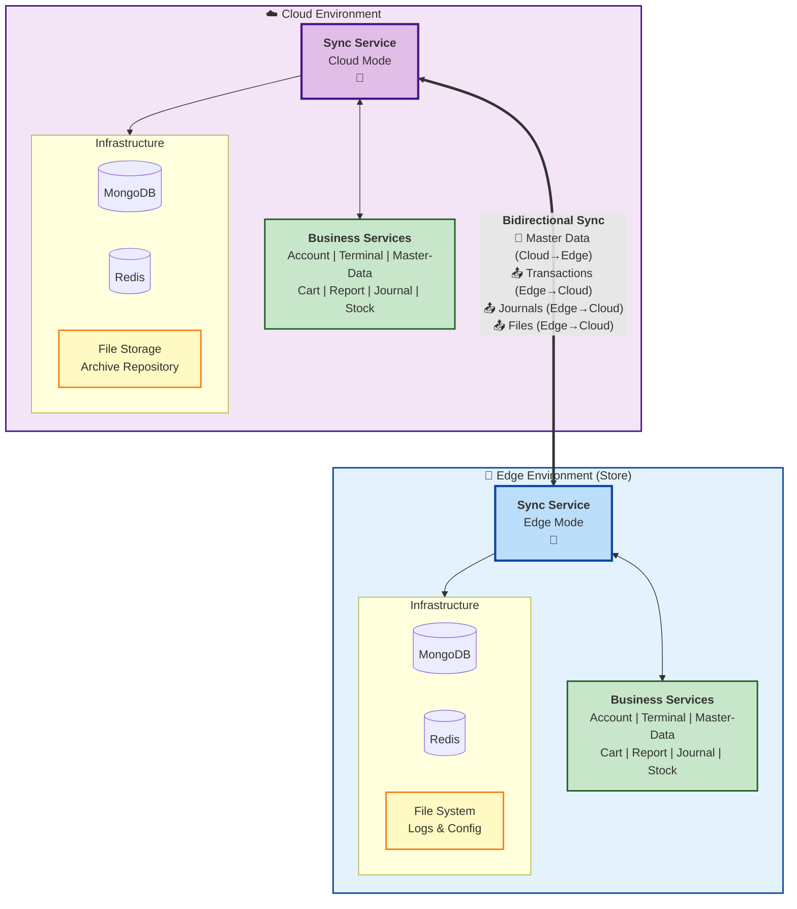
```mermaid
graph TB
    subgraph Cloud["☁️ Cloud Environment"]
        direction TB
        CloudSync[<b>Sync Service</b><br/>Cloud Mode<br/>📡]

        subgraph CloudInfra["Infrastructure"]
            direction LR
            CloudDB[(MongoDB)]
            CloudRedis[(Redis)]
            CloudStorage[File Storage<br/>Archive Repository]
        end

        CloudServices["<b>Business Services</b><br/>Account | Terminal | Master-Data<br/>Cart | Report | Journal | Stock"]

        CloudSync --> CloudInfra
        CloudSync <--> CloudServices
    end

    subgraph Edge["🏪 Edge Environment (Store)"]
        direction TB
        EdgeSync[<b>Sync Service</b><br/>Edge Mode<br/>📱]

        subgraph EdgeInfra["Infrastructure"]
            direction LR
            EdgeDB[(MongoDB)]
            EdgeRedis[(Redis)]
            EdgeFS[File System<br/>Logs & Config]
        end

        EdgeServices["<b>Business Services</b><br/>Account | Terminal | Master-Data<br/>Cart | Report | Journal | Stock"]

        EdgeSync --> EdgeInfra
        EdgeSync <--> EdgeServices
    end

    CloudSync <===>|"<b>Bidirectional Sync</b><br/>🔄 Master Data (Cloud→Edge)<br/>📤 Transactions (Edge→Cloud)<br/>📤 Journals (Edge→Cloud)<br/>📤 Files (Edge→Cloud)"| EdgeSync

    style CloudSync fill:#e1bee7,stroke:#4a148c,stroke-width:3px
    style EdgeSync fill:#bbdefb,stroke:#0d47a1,stroke-width:3px
    style CloudServices fill:#c8e6c9,stroke:#1b5e20,stroke-width:2px
    style EdgeServices fill:#c8e6c9,stroke:#1b5e20,stroke-width:2px
    style Cloud fill:#f3e5f5,stroke:#4a148c,stroke-width:2px
    style Edge fill:#e3f2fd,stroke:#0d47a1,stroke-width:2px
    style CloudStorage fill:#fff9c4,stroke:#f57f17,stroke-width:2px
    style EdgeFS fill:#fff9c4,stroke:#f57f17,stroke-width:2px
```

### 1.3 同期の特徴

- **双方向同期**: クラウドとエッジ間で双方向のデータ同期を実現
- **マルチデバイス対応**: 1店舗に複数台のエッジ端末（POS内蔵型、専用エッジサーバー）が存在する構成をサポート
- **自動フェイルオーバー**: ネットワーク障害時もエッジ環境で業務継続可能
- **差分同期**: 効率的な差分データの同期により、ネットワーク帯域を最適化
- **P2Pファイル共有**: 同一店舗内のエッジ端末間でマスターデータ予約ファイルを共有し、クラウド負荷を軽減
- **ファイル収集**: エッジ環境のアプリケーションログやシステムファイルをzip形式で圧縮収集
- **データアクセス制限**: Syncサービスは自身のデータベースのみ直接アクセス可能、他サービスのデータはAPIを通じてアクセス
- **テナント分離**: エッジ端末情報を含む全データをテナント別DBで管理し、完全な分離を実現

## 2. データフローパターン

### 2.1 クラウド → エッジ（マスターデータ）

マスターデータは通常クラウドで管理され、エッジ環境に配信されます。

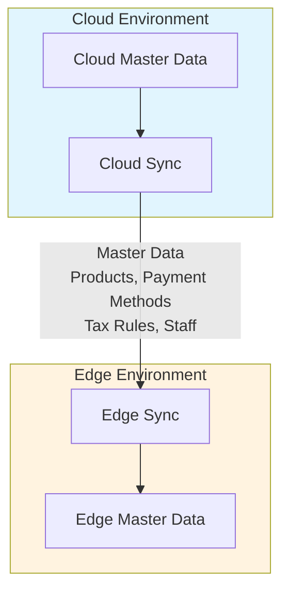
```mermaid
flowchart TB
    subgraph Cloud["Cloud Environment"]
        direction LR
        CMD2[Cloud Master Data] --> CS2[Cloud Sync]
    end

    subgraph Edge["Edge Environment"]
        direction LR
        ES2[Edge Sync] --> EMD2[Edge Master Data]
    end

    CS2 -->|Master Data<br/>Products, Payment Methods<br/>Tax Rules, Staff| ES2

    style Cloud fill:#e1f5fe
    style Edge fill:#fff3e0
```

**対象データ:**
- **Products（商品情報）**: 商品マスター、価格、在庫情報
- **Payment Methods（決済方法）**: 利用可能な決済手段の設定
- **Tax Rules（税制ルール）**: 税率、税計算ロジック
- **Staff（スタッフ情報）**: 従業員マスター、権限設定

**同期フロー:**

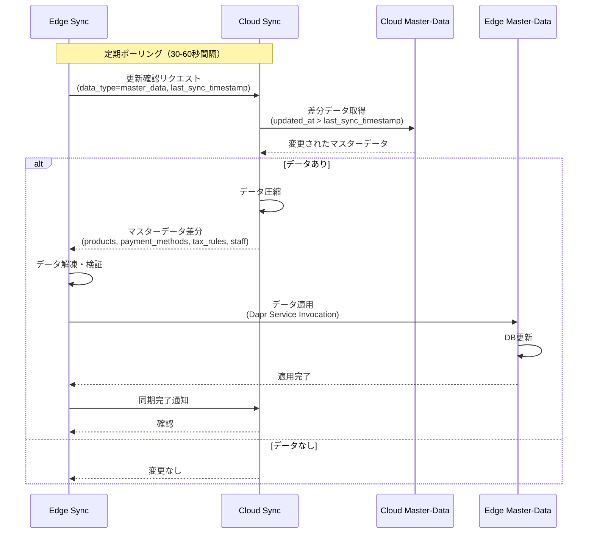
```mermaid
sequenceDiagram
    participant EdgeSync as Edge Sync
    participant CloudSync as Cloud Sync
    participant CloudMasterData as Cloud Master-Data
    participant EdgeMasterData as Edge Master-Data

    Note over EdgeSync,CloudSync: 定期ポーリング（30-60秒間隔）

    EdgeSync->>CloudSync: 更新確認リクエスト<br/>(data_type=master_data, last_sync_timestamp)

    CloudSync->>CloudMasterData: 差分データ取得<br/>(updated_at > last_sync_timestamp)
    CloudMasterData-->>CloudSync: 変更されたマスターデータ

    alt データあり
        CloudSync->>CloudSync: データ圧縮
        CloudSync-->>EdgeSync: マスターデータ差分<br/>(products, payment_methods, tax_rules, staff)

        EdgeSync->>EdgeSync: データ解凍・検証

        EdgeSync->>EdgeMasterData: データ適用<br/>(Dapr Service Invocation)
        EdgeMasterData->>EdgeMasterData: DB更新
        EdgeMasterData-->>EdgeSync: 適用完了

        EdgeSync->>CloudSync: 同期完了通知
        CloudSync-->>EdgeSync: 確認
    else データなし
        CloudSync-->>EdgeSync: 変更なし
    end
```

### 2.2 エッジ → クラウド（トランザクションデータ）

店舗で発生したトランザクションデータはエッジからクラウドへ送信されます。

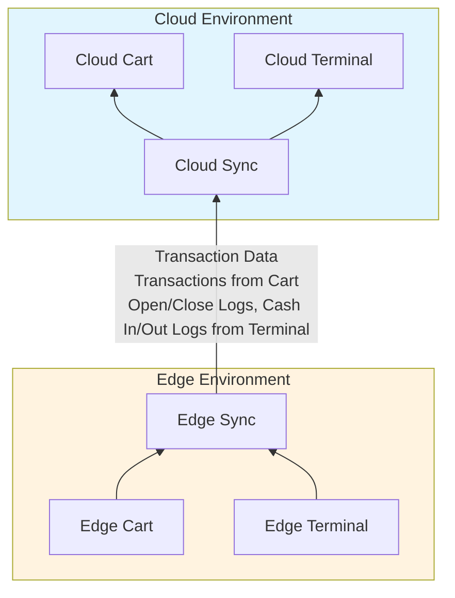
```mermaid
flowchart BT
    subgraph Edge["Edge Environment"]
        direction LR
        ECA2[Edge Cart] --> ES3[Edge Sync]
        ET3[Edge Terminal] --> ES3
    end

    subgraph Cloud["Cloud Environment"]
        direction LR
        CS3[Cloud Sync] --> CCA2[Cloud Cart]
        CS3 --> CT3[Cloud Terminal]
    end

    ES3 -->|Transaction Data<br/>Transactions from Cart<br/>Open/Close Logs, Cash In/Out Logs from Terminal| CS3

    style Cloud fill:#e1f5fe
    style Edge fill:#fff3e0
```

**対象データ:**
- **Transactions（取引データ）**: 売上、返品、取消などの取引情報
- **Open/Close Logs（開設精算ログ）**: 開店・閉店処理、精算情報
- **Cash In/Out Logs（入出金ログ）**: 現金の入出金記録

**同期フロー:**

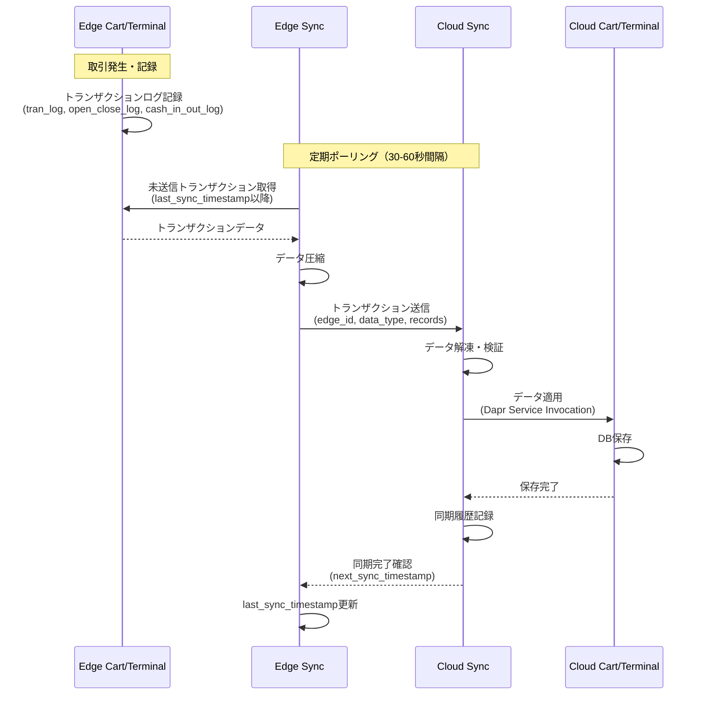
```mermaid
sequenceDiagram
    participant EdgeCart as Edge Cart/Terminal
    participant EdgeSync as Edge Sync
    participant CloudSync as Cloud Sync
    participant CloudCart as Cloud Cart/Terminal

    Note over EdgeCart: 取引発生・記録

    EdgeCart->>EdgeCart: トランザクションログ記録<br/>(tran_log, open_close_log, cash_in_out_log)

    Note over EdgeSync,CloudSync: 定期ポーリング（30-60秒間隔）

    EdgeSync->>EdgeCart: 未送信トランザクション取得<br/>(last_sync_timestamp以降)
    EdgeCart-->>EdgeSync: トランザクションデータ

    EdgeSync->>EdgeSync: データ圧縮

    EdgeSync->>CloudSync: トランザクション送信<br/>(edge_id, data_type, records)

    CloudSync->>CloudSync: データ解凍・検証

    CloudSync->>CloudCart: データ適用<br/>(Dapr Service Invocation)
    CloudCart->>CloudCart: DB保存
    CloudCart-->>CloudSync: 保存完了

    CloudSync->>CloudSync: 同期履歴記録

    CloudSync-->>EdgeSync: 同期完了確認<br/>(next_sync_timestamp)

    EdgeSync->>EdgeSync: last_sync_timestamp更新
```

### 2.3 エッジ → クラウド（ジャーナルデータ）

店舗で記録されたジャーナルデータはエッジからクラウドへ送信されます。

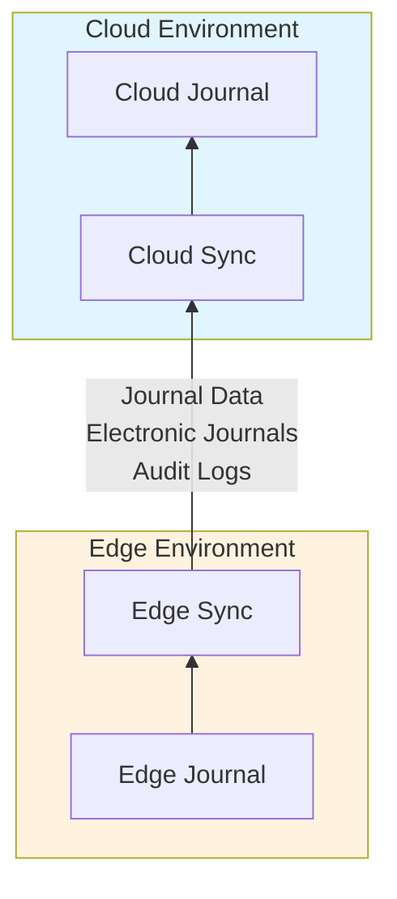
```mermaid
flowchart BT
    subgraph Edge["Edge Environment"]
        direction LR
        EJ2[Edge Journal] --> ES5[Edge Sync]
    end

    subgraph Cloud["Cloud Environment"]
        direction LR
        CS5[Cloud Sync] --> CJ2[Cloud Journal]
    end

    ES5 -->|Journal Data<br/>Electronic Journals<br/>Audit Logs| CS5

    style Cloud fill:#e1f5fe
    style Edge fill:#fff3e0
```

**対象データ:**
- **Electronic Journals（電子ジャーナル）**: 取引の詳細な記録
- **Audit Logs（監査ログ）**: 監査用の操作履歴

### 2.4 エッジ → クラウド（ファイル収集）

エッジ環境のファイルは、クラウドからの指示に基づいてzip形式で圧縮収集されます。

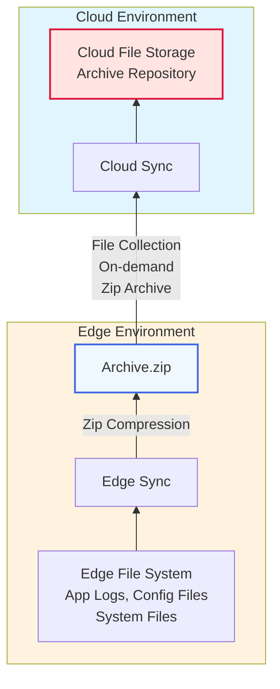
```mermaid
flowchart BT
    subgraph Edge["Edge Environment"]
        direction TB
        EFS[Edge File System<br/>App Logs, Config Files<br/>System Files] --> ES6[Edge Sync]
        ES6 -->|Zip Compression| EZip[Archive.zip]
    end

    subgraph Cloud["Cloud Environment"]
        direction TB
        CS6[Cloud Sync] --> CFS[Cloud File Storage<br/>Archive Repository]
    end

    EZip -->|File Collection<br/>On-demand<br/>Zip Archive| CS6

    style Cloud fill:#e1f5fe
    style Edge fill:#fff3e0
    style EZip fill:#f0f8ff,stroke:#4169e1,stroke-width:2px
    style CFS fill:#ffe4e1,stroke:#dc143c,stroke-width:2px
```

**対象ファイル:**
- **Application Logs（アプリケーションログ）**: 各サービスのアプリケーションログ、APIリクエストログ
- **System Files（システムファイル）**: 設定ファイル、データベースファイル
- **Configuration Files（設定ファイル）**: アプリケーション設定、環境設定

**収集フロー:**
1. 定期同期レスポンスに収集指示が含まれる場合に実行
2. エッジ側でファイルをzip形式で圧縮
3. 圧縮ファイルをクラウドに送信
4. クラウドでアーカイブを保存・管理

**詳細シーケンス:**

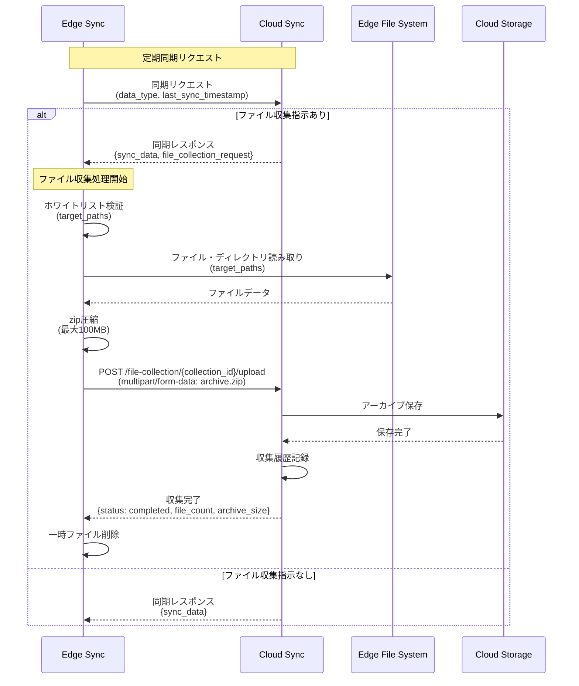
```mermaid
sequenceDiagram
    participant EdgeSync as Edge Sync
    participant CloudSync as Cloud Sync
    participant EdgeFS as Edge File System
    participant CloudStorage as Cloud Storage

    Note over EdgeSync,CloudSync: 定期同期リクエスト

    EdgeSync->>CloudSync: 同期リクエスト<br/>(data_type, last_sync_timestamp)

    alt ファイル収集指示あり
        CloudSync-->>EdgeSync: 同期レスポンス<br/>{sync_data, file_collection_request}

        Note over EdgeSync: ファイル収集処理開始

        EdgeSync->>EdgeSync: ホワイトリスト検証<br/>(target_paths)

        EdgeSync->>EdgeFS: ファイル・ディレクトリ読み取り<br/>(target_paths)
        EdgeFS-->>EdgeSync: ファイルデータ

        EdgeSync->>EdgeSync: zip圧縮<br/>(最大100MB)

        EdgeSync->>CloudSync: POST /file-collection/{collection_id}/upload<br/>(multipart/form-data: archive.zip)

        CloudSync->>CloudStorage: アーカイブ保存
        CloudStorage-->>CloudSync: 保存完了

        CloudSync->>CloudSync: 収集履歴記録

        CloudSync-->>EdgeSync: 収集完了<br/>{status: completed, file_count, archive_size}

        EdgeSync->>EdgeSync: 一時ファイル削除
    else ファイル収集指示なし
        CloudSync-->>EdgeSync: 同期レスポンス<br/>{sync_data}
    end
```

### 2.5 双方向同期（ターミナルデータ）

ターミナル関連のデータは双方向で同期されます。

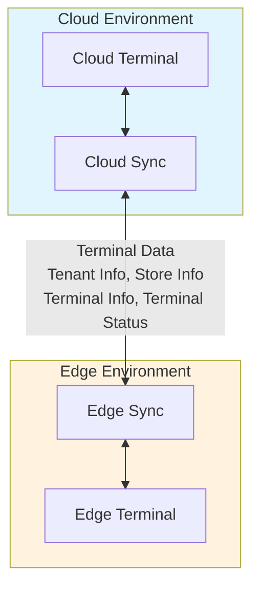
```mermaid
flowchart TB
    subgraph Cloud["Cloud Environment"]
        direction LR
        CT2[Cloud Terminal] <--> CS4[Cloud Sync]
    end

    subgraph Edge["Edge Environment"]
        direction LR
        ES4[Edge Sync] <--> ET2[Edge Terminal]
    end

    CS4 <-->|Terminal Data<br/>Tenant Info, Store Info<br/>Terminal Info, Terminal Status| ES4

    style Cloud fill:#e1f5fe
    style Edge fill:#fff3e0
```

**対象データ:**
- **Tenant Info（テナント情報）**: 企業・組織の設定情報
- **Store Info（店舗情報）**: 店舗設定、営業時間
- **Terminal Info（端末情報）**: POS端末の設定、状態
- **Terminal Status（端末ステータス）**: オンライン/オフライン状態、稼働状況

### 2.6 エッジ端末間P2Pファイル共有（マスターデータ予約ファイル）

同一店舗内の複数エッジ端末間でマスターデータ予約ファイルを共有し、クラウドへの通信負荷を軽減します。

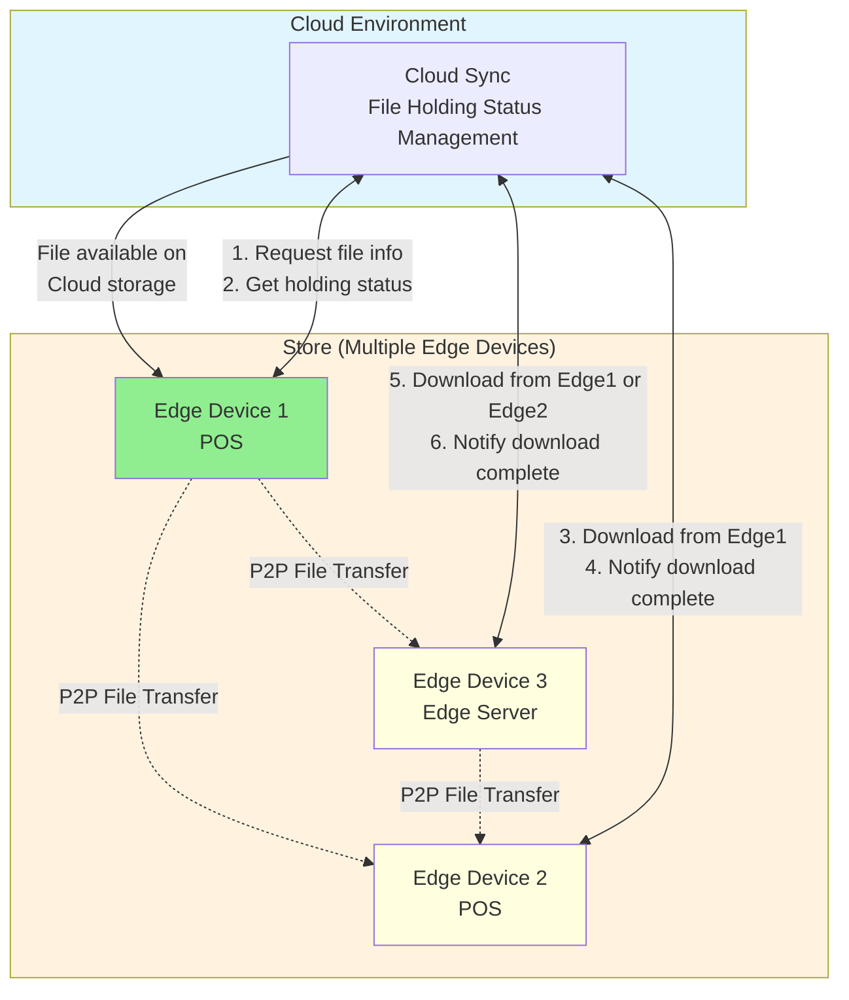
```mermaid
flowchart TB
    subgraph Cloud["Cloud Environment"]
        CS_P2P[Cloud Sync<br/>File Holding Status Management]
    end

    subgraph Store["Store (Multiple Edge Devices)"]
        direction LR
        Edge1[Edge Device 1<br/>POS]
        Edge2[Edge Device 2<br/>POS]
        Edge3[Edge Device 3<br/>Edge Server]

        Edge1 -.->|P2P File Transfer| Edge2
        Edge1 -.->|P2P File Transfer| Edge3
        Edge3 -.->|P2P File Transfer| Edge2
    end

    Edge1 <-->|1. Request file info<br/>2. Get holding status| CS_P2P
    Edge2 <-->|3. Download from Edge1<br/>4. Notify download complete| CS_P2P
    Edge3 <-->|5. Download from Edge1 or Edge2<br/>6. Notify download complete| CS_P2P

    CS_P2P -->|File available on<br/>Cloud storage| Edge1

    style Cloud fill:#e1f5fe
    style Store fill:#fff3e0
    style Edge1 fill:#90ee90
    style Edge2 fill:#ffffe0
    style Edge3 fill:#ffffe0
```

**フロー:**
1. Edge Device 1がクラウドに予約ファイル情報を問い合わせ
2. クラウドが「他のエッジ端末が保持していない」ことを通知
3. Edge Device 1がクラウドからファイルをダウンロード
4. Edge Device 1がダウンロード完了をクラウドに通知
5. Edge Device 2が同じファイルを問い合わせ
6. クラウドが「Edge Device 1が保持している」ことを通知
7. Edge Device 2がEdge Device 1からP2P転送でファイル取得
8. Edge Device 2がダウンロード完了をクラウドに通知

**詳細シーケンス:**

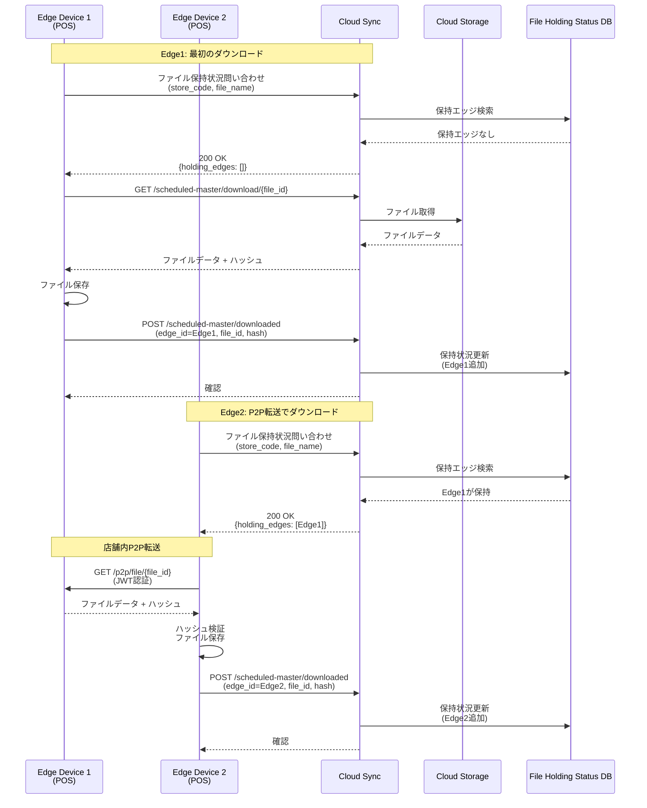
```mermaid
sequenceDiagram
    participant Edge1 as Edge Device 1<br/>(POS)
    participant Edge2 as Edge Device 2<br/>(POS)
    participant CloudSync as Cloud Sync
    participant CloudStorage as Cloud Storage
    participant FileHoldingDB as File Holding Status DB

    Note over Edge1,CloudSync: Edge1: 最初のダウンロード

    Edge1->>CloudSync: ファイル保持状況問い合わせ<br/>(store_code, file_name)
    CloudSync->>FileHoldingDB: 保持エッジ検索
    FileHoldingDB-->>CloudSync: 保持エッジなし

    CloudSync-->>Edge1: 200 OK<br/>{holding_edges: []}

    Edge1->>CloudSync: GET /scheduled-master/download/{file_id}
    CloudSync->>CloudStorage: ファイル取得
    CloudStorage-->>CloudSync: ファイルデータ
    CloudSync-->>Edge1: ファイルデータ + ハッシュ

    Edge1->>Edge1: ファイル保存

    Edge1->>CloudSync: POST /scheduled-master/downloaded<br/>(edge_id=Edge1, file_id, hash)
    CloudSync->>FileHoldingDB: 保持状況更新<br/>(Edge1追加)
    CloudSync-->>Edge1: 確認

    Note over Edge2,CloudSync: Edge2: P2P転送でダウンロード

    Edge2->>CloudSync: ファイル保持状況問い合わせ<br/>(store_code, file_name)
    CloudSync->>FileHoldingDB: 保持エッジ検索
    FileHoldingDB-->>CloudSync: Edge1が保持

    CloudSync-->>Edge2: 200 OK<br/>{holding_edges: [Edge1]}

    Note over Edge2,Edge1: 店舗内P2P転送

    Edge2->>Edge1: GET /p2p/file/{file_id}<br/>(JWT認証)
    Edge1-->>Edge2: ファイルデータ + ハッシュ

    Edge2->>Edge2: ハッシュ検証<br/>ファイル保存

    Edge2->>CloudSync: POST /scheduled-master/downloaded<br/>(edge_id=Edge2, file_id, hash)
    CloudSync->>FileHoldingDB: 保持状況更新<br/>(Edge2追加)
    CloudSync-->>Edge2: 確認
```

**メリット:**
- クラウド→エッジ間の帯域使用量削減
- ダウンロード速度の向上（店舗内ネットワークの利用）
- クラウドサーバーの負荷軽減

## 3. 同期メカニズム

### 3.1 差分同期メカニズム（Differential Sync）

最も一般的な同期方式で、変更があったデータのみを転送します。

**動作フロー:**
1. エッジ側のSync Serviceが30秒〜1分ごとにクラウドに更新確認を送信（ポーリング）
2. クラウド側が各サービスのAPIを通じて最後の同期タイムスタンプ以降の変更データを取得
3. 変更があったレコードのみを抽出（デルタデータ）
4. エッジ側が各サービスのAPIを通じてデルタデータを適用
5. 同期完了をクラウドに通知

**利点:**
- ネットワーク帯域の効率的な利用
- 高頻度での同期が可能
- リアルタイムに近い更新を実現

### 3.2 バルク同期メカニズム - スナップショット

マスターデータの完全同期が必要な場合に使用されます。

**動作フロー:**
1. エッジからフル同期リクエストを送信
2. クラウドが各サービスのAPIを通じて全レコードを取得
3. データを圧縮してスナップショットを作成
4. エッジ側が各サービスのAPIを通じて既存データを完全に置き換え
5. バルク同期完了を通知

**使用シーン:**
- 初期セットアップ時
- データ不整合の修復時
- 定期的なマスターデータのリフレッシュ

### 3.3 バルク同期メカニズム - ストリーム

大量のログやジャーナルデータの転送に使用されます。

**動作フロー:**
1. エッジからストリーム同期をリクエスト
2. クラウドがデータストリームを開始
3. データをチャンク単位で順次転送
4. エッジ側で受信したチャンクを順次追加
5. 全チャンク受信後、ストリーム完了を通知

**特徴:**
- メモリ効率的な大量データ転送
- 途中からの再開が可能
- ログやジャーナルなどの追記型データに最適

### 3.4 ファイル収集メカニズム

エッジ環境のファイル（アプリケーションログ含む）をzip形式で圧縮収集します。

**動作フロー:**
1. エッジ側の定期同期リクエストを送信
2. クラウド側が同期レスポンスに収集指示を含めて返却（オプション）
3. エッジ側が収集指示を受信した場合、ファイル収集処理を開始
4. 指定されたパス（ファイル/ディレクトリ）をzip形式で圧縮
5. 圧縮ファイルをクラウドの専用APIに送信
6. クラウド側でアーカイブを受信・保存し、収集完了をレスポンスで通知

### 3.5 同期メカニズム シーケンス図

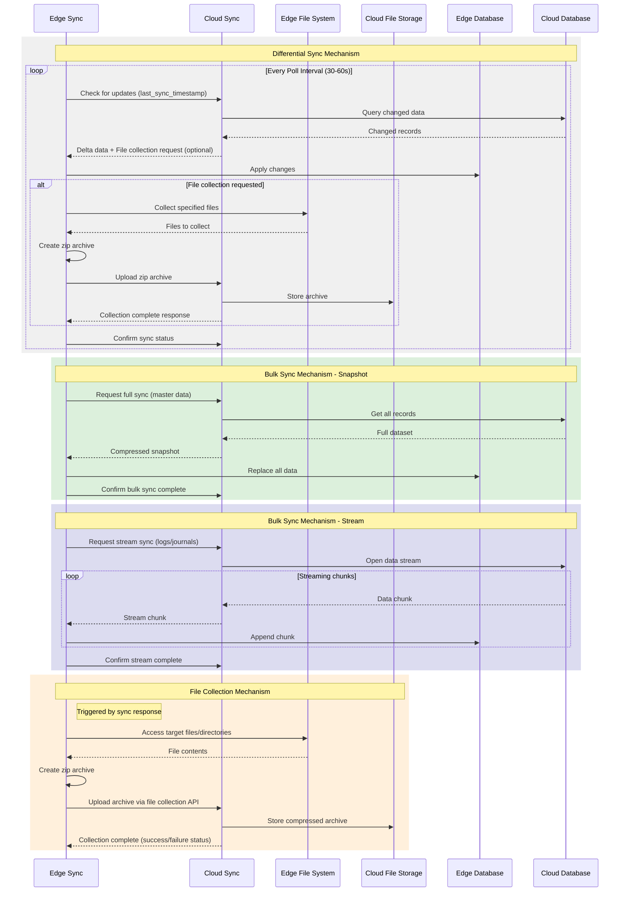
```mermaid
sequenceDiagram
    participant ES as Edge Sync
    participant CS as Cloud Sync
    participant EFS as Edge File System
    participant CFS as Cloud File Storage
    participant ED as Edge Database
    participant CD as Cloud Database

    rect rgb(240, 240, 240)
        Note over ES,CD: Differential Sync Mechanism
        loop Every Poll Interval (30-60s)
            ES->>CS: Check for updates (last_sync_timestamp)
            CS->>CD: Query changed data
            CD-->>CS: Changed records
            CS-->>ES: Delta data + File collection request (optional)
            ES->>ED: Apply changes

            alt File collection requested
                ES->>EFS: Collect specified files
                EFS-->>ES: Files to collect
                ES->>ES: Create zip archive
                ES->>CS: Upload zip archive
                CS->>CFS: Store archive
                CS-->>ES: Collection complete response
            end

            ES->>CS: Confirm sync status
        end
    end

    rect rgb(220, 240, 220)
        Note over ES,CD: Bulk Sync Mechanism - Snapshot
        ES->>CS: Request full sync (master data)
        CS->>CD: Get all records
        CD-->>CS: Full dataset
        CS-->>ES: Compressed snapshot
        ES->>ED: Replace all data
        ES->>CS: Confirm bulk sync complete
    end

    rect rgb(220, 220, 240)
        Note over ES,CD: Bulk Sync Mechanism - Stream
        ES->>CS: Request stream sync (logs/journals)
        CS->>CD: Open data stream
        loop Streaming chunks
            CD-->>CS: Data chunk
            CS-->>ES: Stream chunk
            ES->>ED: Append chunk
        end
        ES->>CS: Confirm stream complete
    end

    rect rgb(255, 240, 220)
        Note over ES,CFS: File Collection Mechanism
        Note right of ES: Triggered by sync response
        ES->>EFS: Access target files/directories
        EFS-->>ES: File contents
        ES->>ES: Create zip archive
        ES->>CS: Upload archive via file collection API
        CS->>CFS: Store compressed archive
        CS-->>ES: Collection complete (success/failure status)
    end
```

## 4. コンポーネントアーキテクチャ

### 4.1 クラス図

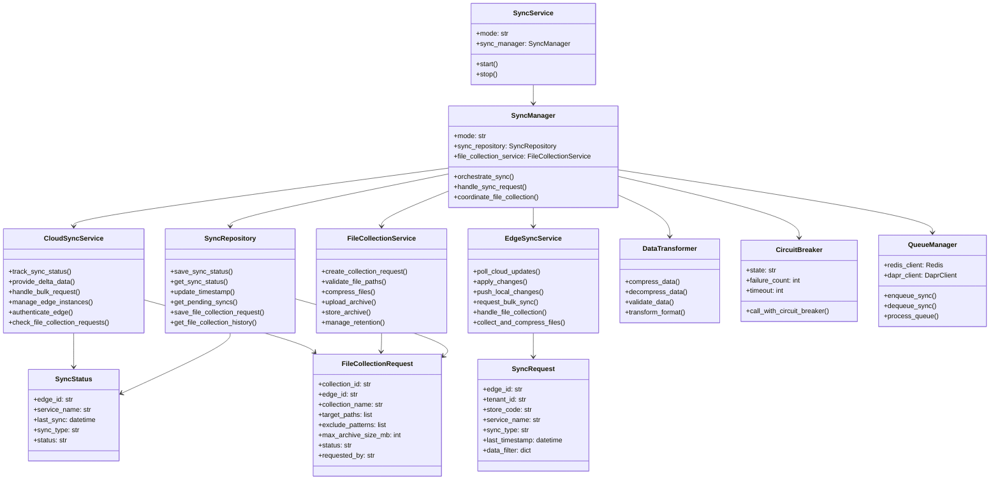
```mermaid
classDiagram
    class SyncService {
        +mode: str
        +sync_manager: SyncManager
        +start()
        +stop()
    }

    class SyncManager {
        +mode: str
        +sync_repository: SyncRepository
        +file_collection_service: FileCollectionService
        +orchestrate_sync()
        +handle_sync_request()
        +coordinate_file_collection()
    }

    class CloudSyncService {
        +track_sync_status()
        +provide_delta_data()
        +handle_bulk_request()
        +manage_edge_instances()
        +authenticate_edge()
        +check_file_collection_requests()
    }

    class EdgeSyncService {
        +poll_cloud_updates()
        +apply_changes()
        +push_local_changes()
        +request_bulk_sync()
        +handle_file_collection()
        +collect_and_compress_files()
    }

    class FileCollectionService {
        +create_collection_request()
        +validate_file_paths()
        +compress_files()
        +upload_archive()
        +store_archive()
        +manage_retention()
    }

    class SyncRepository {
        +save_sync_status()
        +get_sync_status()
        +update_timestamp()
        +get_pending_syncs()
        +save_file_collection_request()
        +get_file_collection_history()
    }

    class SyncStatus {
        +edge_id: str
        +service_name: str
        +last_sync: datetime
        +sync_type: str
        +status: str
    }

    class SyncRequest {
        +edge_id: str
        +tenant_id: str
        +store_code: str
        +service_name: str
        +sync_type: str
        +last_timestamp: datetime
        +data_filter: dict
    }

    class FileCollectionRequest {
        +collection_id: str
        +edge_id: str
        +collection_name: str
        +target_paths: list
        +exclude_patterns: list
        +max_archive_size_mb: int
        +status: str
        +requested_by: str
    }

    class DataTransformer {
        +compress_data()
        +decompress_data()
        +validate_data()
        +transform_format()
    }

    class CircuitBreaker {
        +state: str
        +failure_count: int
        +timeout: int
        +call_with_circuit_breaker()
    }

    class QueueManager {
        +redis_client: Redis
        +dapr_client: DaprClient
        +enqueue_sync()
        +dequeue_sync()
        +process_queue()
    }

    SyncService --> SyncManager
    SyncManager --> CloudSyncService
    SyncManager --> EdgeSyncService
    SyncManager --> FileCollectionService
    SyncManager --> SyncRepository
    CloudSyncService --> SyncStatus
    CloudSyncService --> FileCollectionRequest
    EdgeSyncService --> SyncRequest
    FileCollectionService --> FileCollectionRequest
    SyncManager --> DataTransformer
    SyncManager --> CircuitBreaker
    SyncManager --> QueueManager

    SyncRepository --> SyncStatus
    SyncRepository --> FileCollectionRequest
```

### 4.2 主要コンポーネント

#### SyncService
- システムのエントリーポイント
- モード（Cloud/Edge）に応じた動作切り替え
- サービスのライフサイクル管理（start/stop）

#### SyncManager
- 同期処理の中央制御
- 各種サービスとリポジトリの協調
- 同期リクエストのオーケストレーション

#### CloudSyncService
クラウド側の同期処理を担当：
- **track_sync_status()**: エッジインスタンスの同期状態を追跡
- **provide_delta_data()**: 他サービスのAPIから取得した差分データの提供
- **handle_bulk_request()**: バルク同期リクエストの処理（APIを通じてデータ取得）
- **manage_edge_instances()**: テナント別DBでエッジインスタンスを管理
- **authenticate_edge()**: テナントID検証とJWT認証によるエッジデバイスの認証
- **check_file_collection_requests()**: ファイル収集リクエストの確認

#### EdgeSyncService
エッジ側の同期処理を担当：
- **poll_cloud_updates()**: クラウドからの更新をポーリング
- **apply_changes()**: 受信した変更を各サービスのAPIを通じて適用
- **push_local_changes()**: 各サービスのAPIから取得したローカル変更をクラウドへプッシュ
- **request_bulk_sync()**: バルク同期のリクエスト
- **handle_file_collection()**: ファイル収集指示の処理
- **collect_and_compress_files()**: 指定ファイルのzip圧縮とアップロード

#### FileCollectionService
ファイル収集専用の処理を担当：
- **create_collection_request()**: 収集リクエストの作成（クラウド側）
- **validate_file_paths()**: 収集対象パスのセキュリティ検証
- **compress_files()**: 指定ファイル・ディレクトリのzip圧縮
- **upload_archive()**: 圧縮ファイルのアップロード
- **store_archive()**: アーカイブファイルの保存（クラウド側）
- **manage_retention()**: アーカイブファイルの保持期間管理

## 5. Sync Service 内部アーキテクチャ

### 5.1 レイヤー構成図

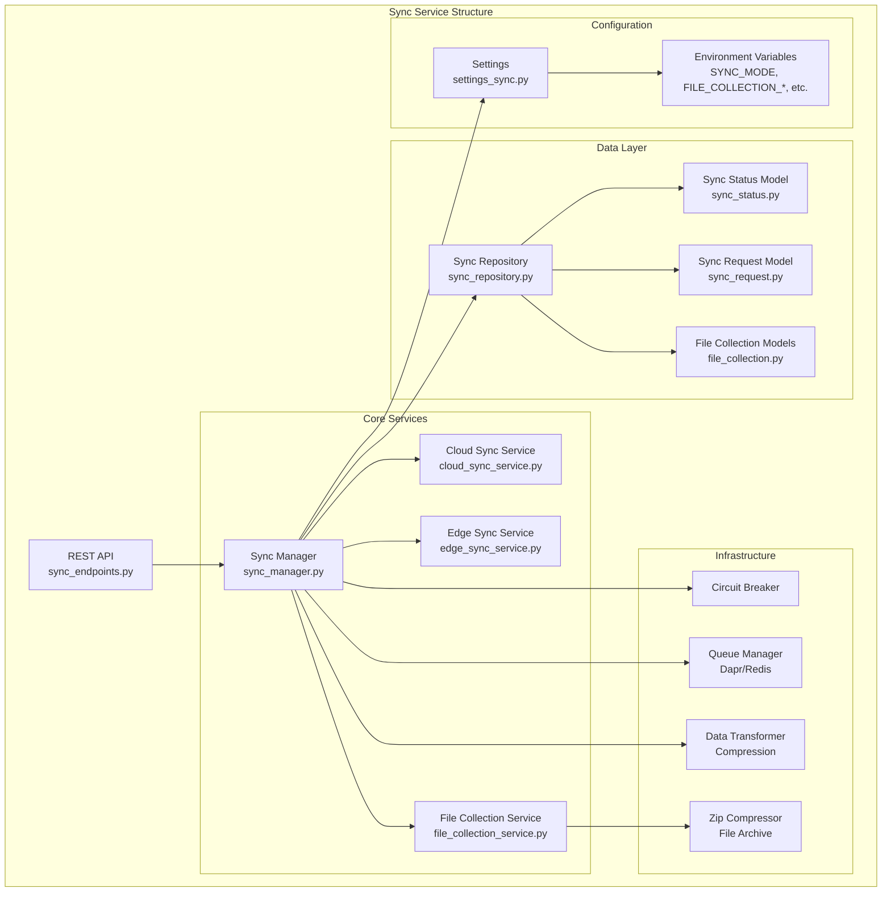
```mermaid
graph TB
    subgraph "Sync Service Structure"
        API[REST API<br/>sync_endpoints.py]

        subgraph "Core Services"
            SM[Sync Manager<br/>sync_manager.py]
            CSS[Cloud Sync Service<br/>cloud_sync_service.py]
            ESS[Edge Sync Service<br/>edge_sync_service.py]
            FCS[File Collection Service<br/>file_collection_service.py]
        end

        subgraph "Data Layer"
            SR[Sync Repository<br/>sync_repository.py]
            SS[Sync Status Model<br/>sync_status.py]
            SReq[Sync Request Model<br/>sync_request.py]
            FCM[File Collection Models<br/>file_collection.py]
        end

        subgraph "Infrastructure"
            CB[Circuit Breaker]
            QM[Queue Manager<br/>Dapr/Redis]
            DT[Data Transformer<br/>Compression]
            ZC[Zip Compressor<br/>File Archive]
        end

        subgraph "Configuration"
            SC[Settings<br/>settings_sync.py]
            ENV[Environment Variables<br/>SYNC_MODE, FILE_COLLECTION_*, etc.]
        end

        API --> SM
        SM --> CSS
        SM --> ESS
        SM --> FCS
        SM --> SR
        SR --> SS
        SR --> SReq
        SR --> FCM
        SM --> CB
        SM --> QM
        SM --> DT
        FCS --> ZC
        SC --> ENV
        SM --> SC
    end
```

### 5.2 レイヤーの責務

#### API層
**REST API (sync_endpoints.py)**
- 外部からのHTTPリクエストを受け付けるエンドポイント
- 同期状態の照会、手動同期のトリガー
- ヘルスチェックやメトリクスの提供

#### コアサービス層
**Sync Manager (sync_manager.py)**
- 全体の同期処理を統括
- Cloud/Edgeモードの切り替え
- 各種サービスの協調制御

**Cloud Sync Service (cloud_sync_service.py)**
- クラウド側の同期ロジック実装
- エッジインスタンスからのリクエスト処理
- データの配信と収集

**Edge Sync Service (edge_sync_service.py)**
- エッジ側の同期ロジック実装
- クラウドへの接続とポーリング
- ローカルデータの同期管理
- ファイル収集指示の処理と実行

**File Collection Service (file_collection_service.py)**
- ファイル収集専用の処理ロジック
- パスの検証とセキュリティチェック
- zip圧縮とアーカイブ管理
- アプリケーションログの収集統合

#### データ層
**Sync Repository (sync_repository.py)**
- テナント別Syncデータベースへの同期状態の保存
- 同期履歴とエッジ端末情報の管理
- ファイル収集リクエストと履歴の管理
- データアクセスの抽象化
- 他サービスのデータベースへは直接アクセス不可（APIを通じてのみアクセス）

#### インフラストラクチャ層
**Circuit Breaker**
- 連続した失敗時の自動遮断
- システム保護と段階的復旧

**Queue Manager (Dapr/Redis)**
- 非同期タスクの管理
- メッセージの順序保証
- リトライ機構

**Data Transformer (Compression)**
- データの圧縮・解凍
- 転送効率の最適化
- データ形式の変換

**Zip Compressor (File Archive)**
- ファイルのzip圧縮とアーカイブ管理

## 6. ステートマシン

### 6.1 同期処理ステートマシン

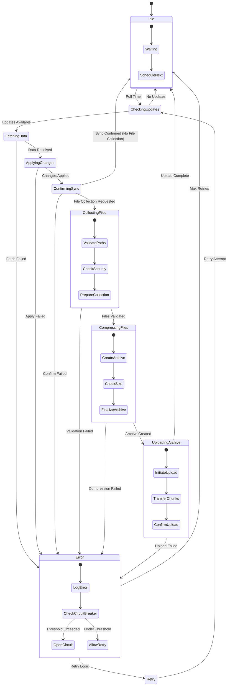
```mermaid
stateDiagram-v2
    [*] --> Idle

    Idle --> CheckingUpdates: Poll Timer
    CheckingUpdates --> FetchingData: Updates Available
    CheckingUpdates --> Idle: No Updates

    FetchingData --> ApplyingChanges: Data Received
    FetchingData --> Error: Fetch Failed

    ApplyingChanges --> ConfirmingSync: Changes Applied
    ApplyingChanges --> Error: Apply Failed

    ConfirmingSync --> CollectingFiles: File Collection Requested
    ConfirmingSync --> Idle: Sync Confirmed (No File Collection)
    ConfirmingSync --> Error: Confirm Failed

    CollectingFiles --> CompressingFiles: Files Validated
    CollectingFiles --> Error: Validation Failed

    CompressingFiles --> UploadingArchive: Archive Created
    CompressingFiles --> Error: Compression Failed

    UploadingArchive --> Idle: Upload Complete
    UploadingArchive --> Error: Upload Failed

    Error --> Retry: Retry Logic
    Error --> Idle: Max Retries
    Retry --> CheckingUpdates: Retry Attempt

    state Idle {
        [*] --> Waiting
        Waiting --> ScheduleNext
    }

    state Error {
        [*] --> LogError
        LogError --> CheckCircuitBreaker
        CheckCircuitBreaker --> OpenCircuit: Threshold Exceeded
        CheckCircuitBreaker --> AllowRetry: Under Threshold
    }

    state CollectingFiles {
        [*] --> ValidatePaths
        ValidatePaths --> CheckSecurity
        CheckSecurity --> PrepareCollection
    }

    state CompressingFiles {
        [*] --> CreateArchive
        CreateArchive --> CheckSize
        CheckSize --> FinalizeArchive
    }

    state UploadingArchive {
        [*] --> InitiateUpload
        InitiateUpload --> TransferChunks
        TransferChunks --> ConfirmUpload
    }
```

### 6.2 主要な状態

#### Idle（待機状態）
- 同期処理の開始を待つ基本状態
- 次の同期タイミングをスケジューリング
- リソースを最小限に保ちながら待機

#### CheckingUpdates（更新確認中）
- クラウドに対して更新の有無を確認
- 最後の同期タイムスタンプを基準に照会
- 更新がある場合はFetchingDataへ、なければIdleへ戻る

#### FetchingData（データ取得中）
- クラウドから実際のデータを取得
- ネットワーク帯域を考慮した効率的な転送
- 取得成功でApplyingChangesへ、失敗でErrorへ

#### ApplyingChanges（変更適用中）
- 取得したデータをローカルデータベースに適用
- トランザクション処理による一貫性の保証
- 適用成功でConfirmingSyncへ、失敗でErrorへ

#### ConfirmingSync（同期確認中）
- クラウドに同期完了を通知
- 同期ステータスを更新
- ファイル収集指示がある場合はCollectingFilesへ
- 確認完了でIdleへ戻り、失敗でErrorへ

#### CollectingFiles（ファイル収集中）
- ファイル収集指示を処理
- 指定されたパス（ファイル/ディレクトリ）を検証
- セキュリティチェック（ホワイトリスト確認）
- 収集準備完了でCompressingFilesへ、失敗でErrorへ

#### CompressingFiles（ファイル圧縮中）
- 収集対象ファイルをzip形式で圧縮
- 最大アーカイブサイズ制限の確認
- 圧縮完了でUploadingArchiveへ、失敗でErrorへ

#### UploadingArchive（アーカイブアップロード中）
- 圧縮ファイルをクラウドにアップロード
- チャンク分割による大容量ファイル対応
- アップロード完了でIdleへ、失敗でErrorへ

### 6.3 状態遷移シーケンス（通常フロー + ファイル収集）

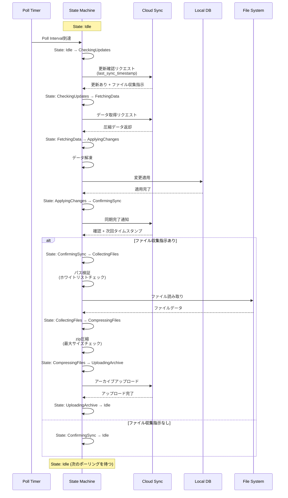
```mermaid
sequenceDiagram
    participant Timer as Poll Timer
    participant SM as State Machine
    participant CloudSync as Cloud Sync
    participant LocalDB as Local DB
    participant FileSystem as File System

    Note over SM: State: Idle

    Timer->>SM: Poll Interval到達
    SM->>SM: State: Idle → CheckingUpdates

    SM->>CloudSync: 更新確認リクエスト<br/>(last_sync_timestamp)
    CloudSync-->>SM: 更新あり + ファイル収集指示

    SM->>SM: State: CheckingUpdates → FetchingData

    SM->>CloudSync: データ取得リクエスト
    CloudSync-->>SM: 圧縮データ返却

    SM->>SM: State: FetchingData → ApplyingChanges

    SM->>SM: データ解凍
    SM->>LocalDB: 変更適用
    LocalDB-->>SM: 適用完了

    SM->>SM: State: ApplyingChanges → ConfirmingSync

    SM->>CloudSync: 同期完了通知
    CloudSync-->>SM: 確認 + 次回タイムスタンプ

    alt ファイル収集指示あり
        SM->>SM: State: ConfirmingSync → CollectingFiles

        SM->>SM: パス検証<br/>(ホワイトリストチェック)
        SM->>FileSystem: ファイル読み取り
        FileSystem-->>SM: ファイルデータ

        SM->>SM: State: CollectingFiles → CompressingFiles

        SM->>SM: zip圧縮<br/>(最大サイズチェック)

        SM->>SM: State: CompressingFiles → UploadingArchive

        SM->>CloudSync: アーカイブアップロード
        CloudSync-->>SM: アップロード完了

        SM->>SM: State: UploadingArchive → Idle
    else ファイル収集指示なし
        SM->>SM: State: ConfirmingSync → Idle
    end

    Note over SM: State: Idle (次のポーリングを待つ)
```

## 7. サービス間通信

### 7.1 通信方式の選択基準

| データ種別 | 通信方式 | 理由 |
|------------|----------|------|
| マスターデータ取得 | REST API (Pull) | 大量データの一括取得に適している |
| トランザクションログ | Pub/Sub (Subscribe) | 既存のpub/subトピックを活用 |
| ジャーナル | Pub/Sub (Subscribe) | 既存のフローに影響を与えない |
| ファイル収集 | HTTP Upload (Push) | zip圧縮ファイルのバイナリ転送に適している |
| 同期結果通知 | Pub/Sub (Publish) | 非同期での状態更新通知 |

### 7.2 Dapr Integration

#### 7.2.1 Pub/Sub設定

```yaml
# dapr/components/pubsub-sync.yaml
apiVersion: dapr.io/v1alpha1
kind: Component
metadata:
  name: sync-pubsub
spec:
  type: pubsub.redis
  version: v1
  metadata:
  - name: redisHost
    value: redis:6379
  - name: redisPassword
    value: ""
  - name: consumerID
    value: "sync-service"
```

#### 7.2.2 トピック定義

```python
class SyncTopics:
    """同期関連のPub/Subトピック"""

    # マスターデータ更新通知
    MASTER_DATA_UPDATED = "sync.master_data.updated"

    # トランザクション受信通知
    TRANSACTION_RECEIVED = "sync.transaction.received"

    # 同期完了通知
    SYNC_COMPLETED = "sync.completed"

    # 同期エラー通知
    SYNC_ERROR = "sync.error"

    # ファイル収集完了通知
    FILE_COLLECTION_COMPLETED = "sync.file_collection.completed"

    # ファイル収集エラー通知
    FILE_COLLECTION_ERROR = "sync.file_collection.error"
```

### 7.3 データ収集・配信インターフェース

#### 7.3.1 データ収集

```python
from kugel_common.utils.dapr_client_helper import get_dapr_client


class DataCollector:
    """各サービスからデータを収集"""

    async def collect_master_data(self, last_sync: datetime) -> List[Dict]:
        """Master Dataサービスから差分データ収集"""
        async with get_dapr_client() as client:
            response = await client.invoke_method(
                app_id="master-data",
                method_name="api/v1/sync/changes",
                data=json.dumps({
                    "from_timestamp": last_sync.isoformat(),
                    "data_types": ["products", "prices", "tax_rules"]
                }),
                http_verb="POST"
            )
            return response.json()

    async def collect_transaction_logs(self, last_sync: datetime) -> List[Dict]:
        """Cartサービスからトランザクションログ収集"""
        async with get_dapr_client() as client:
            response = await client.invoke_method(
                app_id="cart",
                method_name="api/v1/sync/transactions",
                data=json.dumps({
                    "from_timestamp": last_sync.isoformat()
                }),
                http_verb="POST"
            )
            return response.json()
```

#### 7.3.2 データ配信

```python
from kugel_common.utils.dapr_client_helper import get_dapr_client


class DataApplier:
    """各サービスへデータを配信"""

    async def apply_to_service(
        self,
        service_name: str,
        data_type: str,
        data: List[Dict]
    ):
        """指定サービスにデータを適用"""

        endpoint_map = {
            "master-data": "/api/v1/sync/apply",
            "cart": "/api/v1/sync/transactions",
            "journal": "/api/v1/sync/journals",
            "terminal": "/api/v1/sync/terminals"
        }

        endpoint = endpoint_map.get(service_name)
        if not endpoint:
            raise ValueError(f"Unknown service: {service_name}")

        async with get_dapr_client() as client:
            response = await client.invoke_method(
                app_id=service_name,
                method_name=endpoint,
                data=json.dumps({
                    "data_type": data_type,
                    "records": data
                }),
                http_verb="POST"
            )

        if response.status_code != 200:
            raise Exception(f"Failed to apply data to {service_name}")
```

## 8. エッジ内データフロー

### 8.1 同一マシン内通信の特性

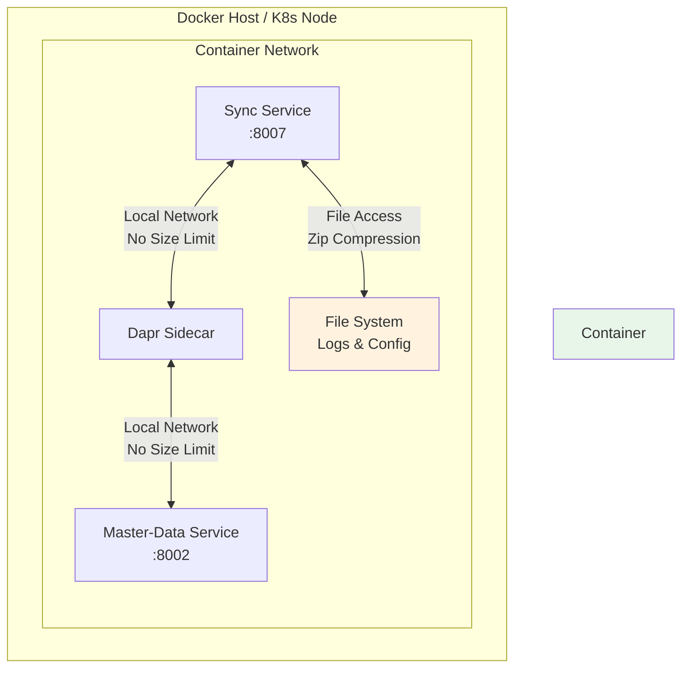
```mermaid
flowchart TB
    subgraph Docker Host / K8s Node
        subgraph Container Network
            Sync[Sync Service<br/>:8007]
            MD[Master-Data Service<br/>:8002]
            FS[File System<br/>Logs & Config]
            Dapr[Dapr Sidecar]
        end
    end

    Sync <-->|Local Network<br/>No Size Limit| Dapr
    Dapr <-->|Local Network<br/>No Size Limit| MD
    Sync <-->|File Access<br/>Zip Compression| FS

    style Container fill:#e8f5e9
    style FS fill:#fff3e0
```

**ポイント:**
- 同一ホスト内のコンテナ間通信
- ネットワーク帯域の制約なし
- Pub/SubのRedis制限も関係なし（Service Invocation使用）
- メモリ制限のみ考慮すれば良い
- ファイルシステムへの直接アクセス（ボリュームマウント）

### 8.2 簡潔なデータフロー

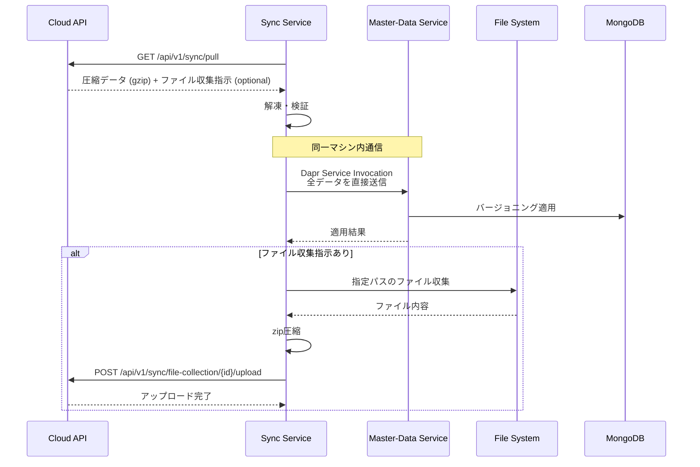
```mermaid
sequenceDiagram
    participant Cloud as Cloud API
    participant Sync as Sync Service
    participant MD as Master-Data Service
    participant FS as File System
    participant DB as MongoDB

    Sync->>Cloud: GET /api/v1/sync/pull
    Cloud-->>Sync: 圧縮データ (gzip) + ファイル収集指示 (optional)
    Sync->>Sync: 解凍・検証

    Note over Sync,MD: 同一マシン内通信
    Sync->>MD: Dapr Service Invocation<br/>全データを直接送信
    MD->>DB: バージョニング適用
    MD-->>Sync: 適用結果

    alt ファイル収集指示あり
        Sync->>FS: 指定パスのファイル収集
        FS-->>Sync: ファイル内容
        Sync->>Sync: zip圧縮
        Sync->>Cloud: POST /api/v1/sync/file-collection/{id}/upload
        Cloud-->>Sync: アップロード完了
    end
```

## 9. 優先度制御と競合解決

### 9.1 同期優先度（現在の実装）

**処理方式:**
- すべてのデータ種別はFIFO（先入先出）方式で処理
- 同期間隔: 30秒〜1分（差分同期データタイプで統一）
- ファイル収集: オンデマンド（同期レスポンス連動）
- 特別な優先度制御なし（将来実装予定）

### 9.2 ファイル収集の優先度

**処理タイミング:**
- 定期同期レスポンスに収集指示が含まれる場合に実行
- 差分同期処理の後に実行
- エラー発生時はクラウドに状態通知

**優先度の特徴:**
- **オンデマンド実行**: 定期ポーリングは行わない
- **非阻害処理**: 通常の同期を妨げない設計
- **独立したエラー処理**: ファイル収集の失敗は通常同期に影響しない

### 9.3 競合解決戦略

#### Last Write Wins (LWW) - 現在の実装

**タイムスタンプベースの解決:**
- 最も新しいタイムスタンプのデータを採用
- シンプルで高速な解決方法
- すべての同期データタイプに適用
- ファイル収集は競合の概念なし（アーカイブファイルとして保存）

**実装詳細:**
- 各レコードに`updated_at`タイムスタンプを付与
- 同期時にタイムスタンプを比較
- 新しいデータで上書き

### 9.4 優先度キュー図（現在と将来）

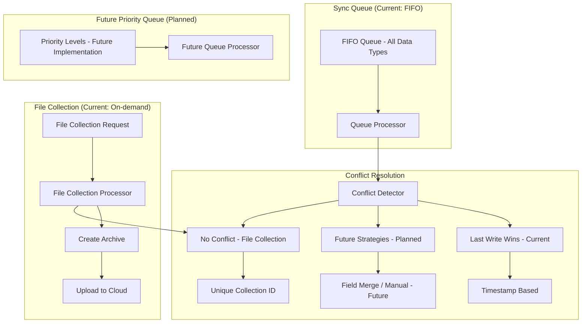
```mermaid
flowchart TD
    subgraph "Sync Queue (Current: FIFO)"
        FIFO[FIFO Queue - All Data Types]
        FIFO --> QP[Queue Processor]
    end

    subgraph "File Collection (Current: On-demand)"
        FC[File Collection Request]
        FC --> FCP[File Collection Processor]
        FCP --> Archive[Create Archive]
        Archive --> Upload[Upload to Cloud]
    end

    subgraph "Future Priority Queue (Planned)"
        P1[Priority Levels - Future Implementation]
        P1 --> FQP[Future Queue Processor]
    end

    subgraph "Conflict Resolution"
        CR[Conflict Detector]
        CR --> LWW[Last Write Wins - Current]
        CR --> Future[Future Strategies - Planned]
        CR --> NoConflict[No Conflict - File Collection]

        LWW --> R1[Timestamp Based]
        Future --> R2[Field Merge / Manual - Future]
        NoConflict --> R3[Unique Collection ID]
    end

    QP --> CR
    FCP --> NoConflict
```

## 10. デプロイメント構成

### 10.1 Docker Compose設定

```yaml
services:
  sync:
    build: ./sync
    container_name: sync
    ports:
      - "8007:8007"
      - "5687:5678"  # デバッグポート
    environment:
      - MONGODB_URI=mongodb://mongodb:27017/?replicaSet=rs0
      - REDIS_HOST=redis
      - REDIS_PORT=6379
      - SYNC_MODE=${SYNC_MODE:-cloud}
      - EDGE_ID=${EDGE_ID:-}
      - EDGE_SECRET=${EDGE_SECRET:-}
      - CLOUD_SYNC_URL=${CLOUD_SYNC_URL:-}
      - FILE_COLLECTION_ALLOWED_PATHS=/var/log/kugelpos,/opt/kugelpos/data
      - FILE_COLLECTION_STORAGE_PATH=/storage/collections
      - LOG_LEVEL=INFO
    depends_on:
      - mongodb
      - redis
    networks:
      - kugelpos-network
    volumes:
      - /var/log/kugelpos:/var/log/kugelpos:ro
      - /opt/kugelpos/data:/opt/kugelpos/data:ro
      - ./storage/collections:/storage/collections
```

### 10.2 サービスポート

- **Sync Service**: 8007
- **Account**: 8000
- **Terminal**: 8001
- **Master-Data**: 8002
- **Cart**: 8003
- **Report**: 8004
- **Journal**: 8005
- **Stock**: 8006
