# Sync Service Architecture

## 1. System Overview

この図は、Kugelpos POSシステムにおけるSync Serviceの全体的なアーキテクチャを示しています。システムは大きく2つの環境に分かれており、クラウド環境とエッジ環境がそれぞれ独立したサービス群を持ちながら、Sync Serviceを通じて双方向のデータ同期を実現しています。

### クラウド環境
クラウド環境では、Sync Service（Cloud Mode）が中心となり、以下のコンポーネントと連携します：

- **MongoDB Cloud**: クラウド環境のマスターデータベース
- **Redis Cloud**: キャッシュとメッセージング用
- **各種サービス**: Account、Terminal、Master Data、Cart、Report、Journal、Stockサービス
- **File Storage**: 収集されたファイルアーカイブの保存領域

### エッジ環境
エッジ環境（店舗側）では、Sync Service（Edge Mode）が以下と連携します：

- **MongoDB Edge**: ローカルデータベース（オフライン動作対応）
- **Redis Edge**: ローカルキャッシュとメッセージング
- **各種サービス**: クラウドと同様の7つのサービスがローカルで動作
- **File System**: アプリケーションログやシステムファイルの収集対象

### 同期の特徴
- **双方向同期**: クラウドとエッジ間で双方向のデータ同期を実現
- **自動フェイルオーバー**: ネットワーク障害時もエッジ環境で業務継続可能
- **差分同期**: 効率的な差分データの同期により、ネットワーク帯域を最適化
- **ファイル収集**: エッジ環境のアプリケーションログやシステムファイルをzip形式で圧縮収集
- **データアクセス制限**: Syncサービスは自身のデータベースのみ直接アクセス可能、他サービスのデータはAPIを通じてアクセス
- **テナント分離**: エッジ端末情報を含む全データをテナント別DBで管理し、完全な分離を実現

### 同期対象データ
1. **マスターデータ**: 商品、価格、決済方法、税制、スタッフ情報など（クラウド→エッジ）
2. **ターミナルデータ**: テナント情報、店舗情報、端末情報、端末ステータス（双方向同期）
3. **トランザクションデータ**: 取引ログ、開設精算、入出金（エッジ→クラウド）
4. **ジャーナルデータ**: 電子ジャーナル（エッジ→クラウド）
5. **ファイル収集**: アプリケーションログ、設定ファイル、システムファイル等（エッジ→クラウド、zip圧縮）

```mermaid
graph TB
    subgraph "Cloud Environment"
        CS[Sync Service<br>Cloud Mode]
        CM[MongoDB<br>Cloud]
        CR[Redis<br>Cloud]
        CFS[File Storage<br>Archive Repository]
        
        subgraph "Cloud Services"
            CA[Account Service]
            CT[Terminal Service]
            CMD[Master Data Service]
            CCA[Cart Service]
            CRP[Report Service]
            CJ[Journal Service]
            CST[Stock Service]
        end
        
        CS --> CM
        CS --> CR
        CS --> CFS
        CS <--> CA
        CS <--> CT
        CS <--> CMD
        CS <--> CCA
        CS <--> CRP
        CS <--> CJ
        CS <--> CST
    end
    
    subgraph "Edge Environment"
        ES[Sync Service<br>Edge Mode]
        EM[MongoDB<br>Edge]
        ER[Redis<br>Edge]
        EFS[File System<br>Logs & Config]
        
        subgraph "Edge Services"
            EA[Account Service]
            ET[Terminal Service]
            EMD[Master Data Service]
            ECA[Cart Service]
            ERP[Report Service]
            EJ[Journal Service]
            EST[Stock Service]
        end
        
        ES --> EM
        ES --> ER
        ES --> EFS
        ES <--> EA
        ES <--> ET
        ES <--> EMD
        ES <--> ECA
        ES <--> ERP
        ES <--> EJ
        ES <--> EST
    end
    
    CS <==> ES
    CFS -->|File Archive<br>zip| CS
    ES -->|File Collection<br>zip| CS
    
    style CS fill:#f9f,stroke:#333,stroke-width:4px
    style ES fill:#bbf,stroke:#333,stroke-width:4px
    style CFS fill:#ffe,stroke:#333,stroke-width:2px
    style EFS fill:#eff,stroke:#333,stroke-width:2px
```

