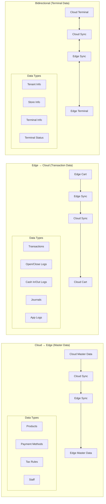

# Sync Service Architecture

## 2. Data Flow Patterns

このセクションでは、クラウドとエッジ環境間でのデータフローパターンを示しています。データの種類と特性に応じて、3つの異なる同期パターンを採用しています。

**重要**: Syncサービスは自身が管理するデータベースのみ直接アクセス可能です。他サービスが管理するデータについては、それぞれのサービスのAPIを通じてアクセスします。これにより、サービス間の責任境界を明確にし、データの整合性を保証します。

### クラウド → エッジ（マスターデータ）
マスターデータは通常クラウドで管理され、エッジ環境に配信されます：

- **Products（商品情報）**: 商品マスター、価格、在庫情報
- **Payment Methods（決済方法）**: 利用可能な決済手段の設定
- **Tax Rules（税制ルール）**: 税率、税計算ロジック
- **Staff（スタッフ情報）**: 従業員マスター、権限設定

これらのデータは定期的にクラウドからエッジに同期され、各店舗で最新の情報を保持します。

### エッジ → クラウド（トランザクションデータ）
店舗で発生したトランザクションデータはエッジからクラウドへ送信されます：

- **Transactions（取引データ）**: 売上、返品、取消などの取引情報
- **Open/Close Logs（開設精算ログ）**: 開店・閉店処理、精算情報
- **Cash In/Out Logs（入出金ログ）**: 現金の入出金記録
- **Journals（ジャーナル）**: 電子ジャーナル
- **App Logs（アプリケーションログ）**: システムログ、エラーログ、操作ログ、パフォーマンスログ

これらのデータは、リアルタイムまたはバッチで集約され、クラウドで分析・保管されます。

### 双方向同期（ターミナルデータ）
ターミナル関連のデータは双方向で同期される必要があります：

- **Tenant Info（テナント情報）**: 企業・組織の設定情報
- **Store Info（店舗情報）**: 店舗設定、営業時間
- **Terminal Info（端末情報）**: POS端末の設定、状態
- **Terminal Status（端末ステータス）**: オンライン/オフライン状態、稼働状況

これらのデータは、管理と運用の両面から双方向の同期が必要となります。

