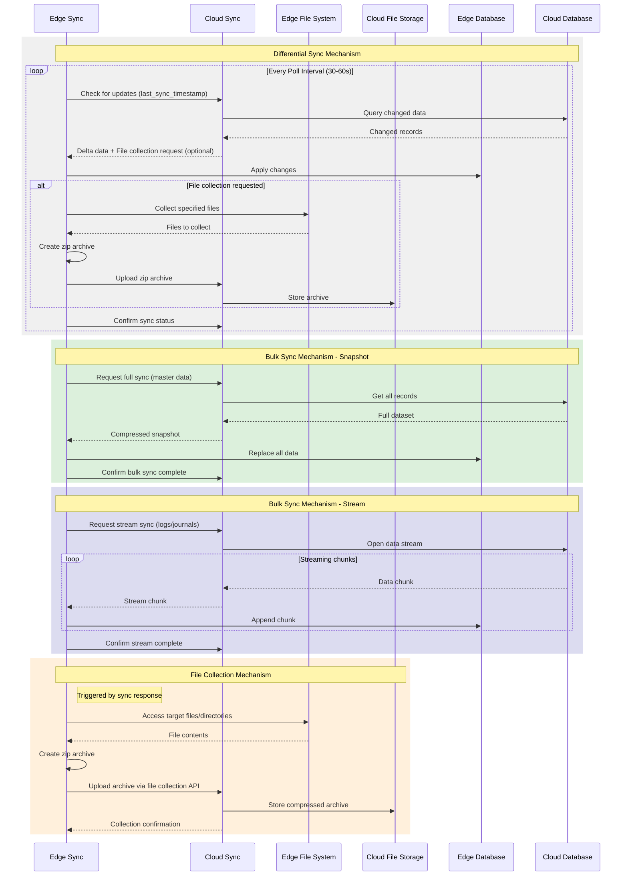

# Sync Service Architecture

## 3. Sync Mechanisms

このセクションでは、Sync Serviceが採用している4つの主要な同期メカニズムについて説明します。各メカニズムはデータの種類と要件に応じて使い分けられます。

### 差分同期メカニズム（Differential Sync）
最も一般的な同期方式で、変更があったデータのみを転送します：

**動作フロー：**
1. エッジ側のSync Serviceが30秒〜1分ごとにクラウドに更新確認を送信（ポーリング）
2. クラウド側が各サービスのAPIを通じて最後の同期タイムスタンプ以降の変更データを取得
3. 変更があったレコードのみを抽出（デルタデータ）
4. エッジ側が各サービスのAPIを通じてデルタデータを適用
5. 同期完了をクラウドに通知

**利点：**
- ネットワーク帯域の効率的な利用
- 高頻度での同期が可能
- リアルタイムに近い更新を実現

### バルク同期メカニズム - スナップショット
マスターデータの完全同期が必要な場合に使用されます：

**動作フロー：**
1. エッジからフル同期リクエストを送信
2. クラウドが各サービスのAPIを通じて全レコードを取得
3. データを圧縮してスナップショットを作成
4. エッジ側が各サービスのAPIを通じて既存データを完全に置き換え
5. バルク同期完了を通知

**使用シーン：**
- 初期セットアップ時
- データ不整合の修復時
- 定期的なマスターデータのリフレッシュ

### バルク同期メカニズム - ストリーム
大量のログやジャーナルデータの転送に使用されます：

**動作フロー：**
1. エッジからストリーム同期をリクエスト
2. クラウドがデータストリームを開始
3. データをチャンク単位で順次転送
4. エッジ側で受信したチャンクを順次追加
5. 全チャンク受信後、ストリーム完了を通知

**特徴：**
- メモリ効率的な大量データ転送
- 途中からの再開が可能
- ログやジャーナルなどの追記型データに最適

### ファイル収集メカニズム（File Collection）
エッジ環境のファイル（アプリケーションログ含む）をzip形式で圧縮収集します：

**動作フロー：**
1. エッジ側の定期同期リクエストを送信
2. クラウド側が同期レスポンスに収集指示を含めて返却（オプション）
3. エッジ側が収集指示を受信した場合、ファイル収集処理を開始
4. 指定されたパス（ファイル/ディレクトリ）をzip形式で圧縮
5. 圧縮ファイルをクラウドの専用APIに送信
6. クラウド側でアーカイブを受信・保存
7. 次回の同期時に収集完了を通知

**対象ファイル：**
- アプリケーションログ（各サービスのログファイル、APIリクエストログ）
- システム設定ファイル
- データベースファイル
- その他のシステムファイル

**セキュリティ制限：**
- 収集可能パスのホワイトリスト制御
- システムディレクトリの収集禁止
- 最大アーカイブサイズ制限

**使用シーン：**
- トラブルシューティング時のログ収集
- コンプライアンス監査対応
- システム診断・メンテナンス

