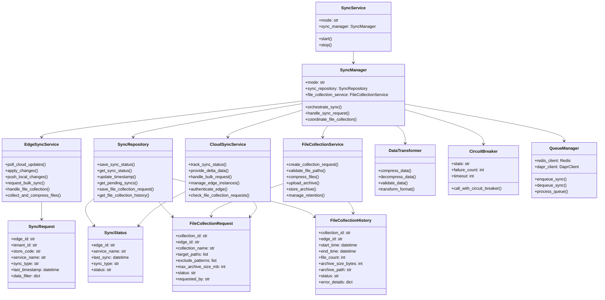

# Sync Service Architecture

## 4. Component Architecture

このクラス図は、Sync Serviceを構成する主要コンポーネントとその関係を示しています。各コンポーネントは明確な責務を持ち、疎結合な設計により柔軟性と拡張性を実現しています。

### 主要コンポーネント

#### SyncService
- システムのエントリーポイント
- モード（Cloud/Edge）に応じた動作切り替え
- サービスのライフサイクル管理（start/stop）

#### SyncManager
- 同期処理の中央制御
- 各種サービスとリポジトリの協調
- 同期リクエストのオーケストレーション

#### CloudSyncService
クラウド側の同期処理を担当：
- **track_sync_status()**: エッジインスタンスの同期状態を追跡
- **provide_delta_data()**: 他サービスのAPIから取得した差分データの提供
- **handle_bulk_request()**: バルク同期リクエストの処理（APIを通じてデータ取得）
- **manage_edge_instances()**: テナント別DBでエッジインスタンスを管理
- **authenticate_edge()**: テナントID検証とJWT認証によるエッジデバイスの認証
- **check_file_collection_requests()**: ファイル収集リクエストの確認

#### EdgeSyncService  
エッジ側の同期処理を担当：
- **poll_cloud_updates()**: クラウドからの更新をポーリング
- **apply_changes()**: 受信した変更を各サービスのAPIを通じて適用
- **push_local_changes()**: 各サービスのAPIから取得したローカル変更をクラウドへプッシュ
- **request_bulk_sync()**: バルク同期のリクエスト
- **handle_file_collection()**: ファイル収集指示の処理
- **collect_and_compress_files()**: 指定ファイルのzip圧縮とアップロード

#### FileCollectionService
ファイル収集専用の処理を担当：
- **create_collection_request()**: 収集リクエストの作成（クラウド側）
- **validate_file_paths()**: 収集対象パスのセキュリティ検証
- **compress_files()**: 指定ファイル・ディレクトリのzip圧縮
- **upload_archive()**: 圧縮ファイルのアップロード
- **store_archive()**: アーカイブファイルの保存（クラウド側）
- **manage_retention()**: アーカイブファイルの保持期間管理

### サポートコンポーネント

#### SyncRepository
- Sync専用データベースへの同期状態の永続化
- タイムスタンプの管理
- ペンディング同期の管理
- 他サービスのデータベースへは直接アクセス不可

#### DataTransformer
- データの圧縮/解凍
- データ形式の変換
- データ検証

#### CircuitBreaker
- 障害時の自動遮断
- 段階的な復旧制御
- システム保護機能

#### QueueManager
- 同期タスクのキューイング
- Redis/Daprを使用したメッセージング
- 非同期処理の管理

### データモデル

#### SyncStatus
同期状態を表現：
- edge_id: エッジインスタンスの識別子
- service_name: 対象サービス名
- last_sync: 最終同期時刻
- sync_type: 同期タイプ（differential/bulk）
- status: 現在の状態

#### SyncRequest
同期リクエストの構造：
- edge_id: リクエスト元のエッジID
- tenant_id: テナントID
- store_code: 店舗コード
- service_name: 対象サービス
- sync_type: リクエストする同期タイプ
- last_timestamp: 最後の同期タイムスタンプ
- data_filter: フィルタ条件

#### FileCollectionRequest
ファイル収集リクエストの構造：
- collection_id: 収集処理の一意識別子
- edge_id: 対象エッジインスタンス
- collection_name: 収集名（管理用）
- target_paths: 収集対象パス配列
- exclude_patterns: 除外パターン配列
- max_archive_size_mb: 最大アーカイブサイズ
- status: 処理状態
- requested_by: 要求者

#### FileCollectionHistory
ファイル収集履歴の構造：
- collection_id: 収集処理の一意識別子
- edge_id: 対象エッジインスタンス
- start_time: 収集開始時刻
- end_time: 収集終了時刻
- file_count: 収集ファイル数
- archive_size_bytes: アーカイブサイズ
- archive_path: 保存先パス
- status: 最終状態
- error_details: エラー詳細

