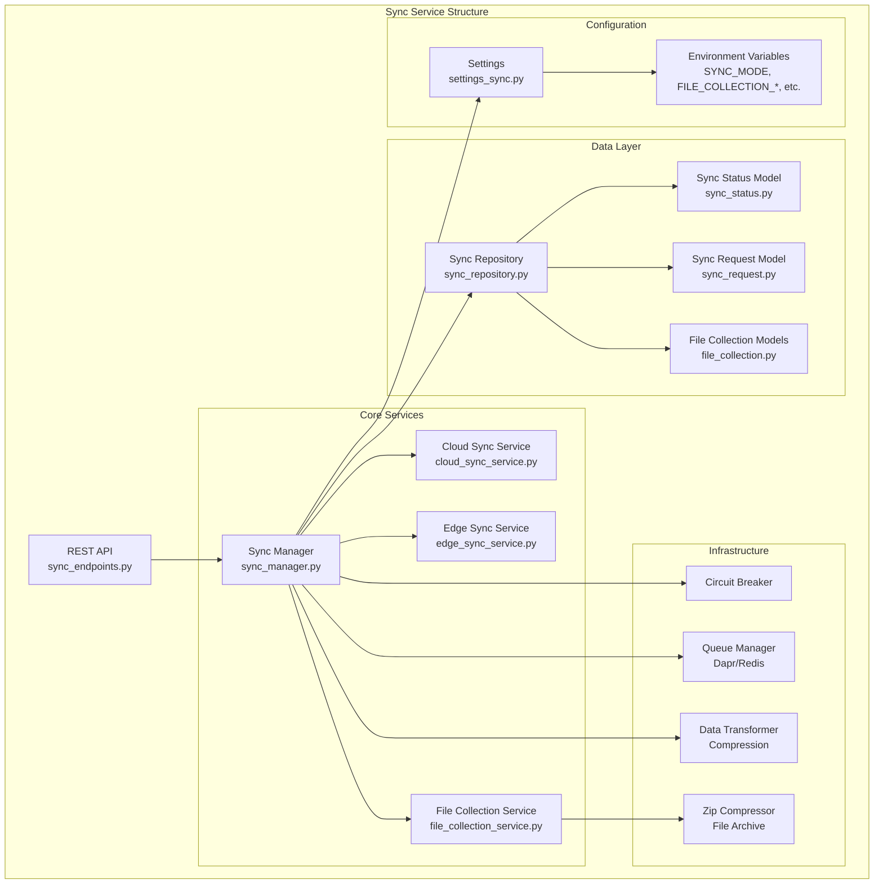

# Sync Service Architecture

## 5. Sync Service Internal Architecture

この図は、Sync Service内部の詳細なアーキテクチャと各コンポーネントの関係を示しています。サービスは4つの主要な層に分かれており、それぞれが特定の責務を担っています。

### API層
**REST API (sync_endpoints.py)**
- 外部からのHTTPリクエストを受け付けるエンドポイント
- 同期状態の照会、手動同期のトリガー
- ヘルスチェックやメトリクスの提供

### コアサービス層
この層はビジネスロジックの中核を担います：

**Sync Manager (sync_manager.py)**
- 全体の同期処理を統括
- Cloud/Edgeモードの切り替え
- 各種サービスの協調制御

**Cloud Sync Service (cloud_sync_service.py)**
- クラウド側の同期ロジック実装
- エッジインスタンスからのリクエスト処理
- データの配信と収集

**Edge Sync Service (edge_sync_service.py)**
- エッジ側の同期ロジック実装
- クラウドへの接続とポーリング
- ローカルデータの同期管理
- ファイル収集指示の処理と実行

**File Collection Service (file_collection_service.py)**
- ファイル収集専用の処理ロジック
- パスの検証とセキュリティチェック
- zip圧縮とアーカイブ管理
- アプリケーションログの収集統合

### データ層
永続化とデータモデルを管理：

**Sync Repository (sync_repository.py)**
- テナント別Syncデータベースへの同期状態の保存
- 同期履歴とエッジ端末情報の管理
- ファイル収集リクエストと履歴の管理
- データアクセスの抽象化
- 他サービスのデータベースへは直接アクセス不可（APIを通じてのみアクセス）

**Sync Status Model (sync_status.py)**
- 同期状態を表すドメインモデル
- バリデーションロジック

**Sync Request Model (sync_request.py)**
- 同期リクエストの構造定義
- リクエストパラメータの検証

**File Collection Models (file_collection.py)**
- FileCollectionRequest: 収集リクエストのモデル
- FileCollectionHistory: 収集履歴のモデル
- FileCollectionInstruction: 収集指示のモデル

### インフラストラクチャ層
システムの信頼性と効率性を支える：

**Circuit Breaker**
- 連続した失敗時の自動遮断
- システム保護と段階的復旧

**Queue Manager (Dapr/Redis)**
- 非同期タスクの管理
- メッセージの順序保証
- リトライ機構

**Data Transformer (Compression)**
- データの圧縮・解凍
- 転送効率の最適化
- データ形式の変換

**Zip Compressor (File Archive)**
- ファイルのzip圧縮とアーカイブ管理

### 設定層
システム設定と環境変数を管理：

**Settings (settings_sync.py)**
- 同期間隔、タイムアウト値
- エンドポイントURL
- 認証情報

**Environment Variables**
- SYNC_MODE: Cloud/Edgeモードの指定
- MONGODB_URI: データベース接続情報
- REDIS_URL: キャッシュ接続情報

この階層構造により、各層の責務が明確に分離され、保守性と拡張性の高いシステムを実現しています。

