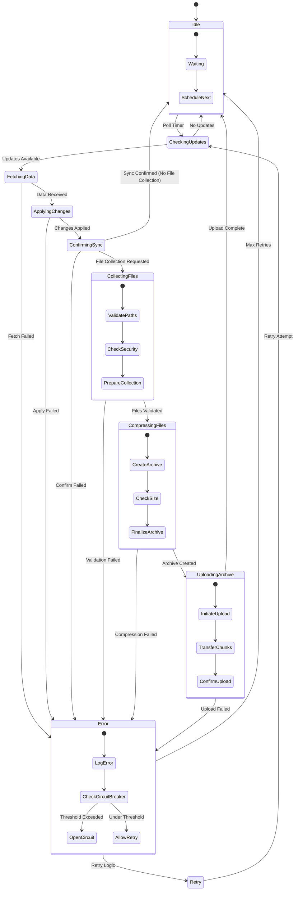

# Sync Service Architecture

## 6. Synchronization State Machine

このステートマシン図は、同期処理のライフサイクルと状態遷移を示しています。各状態は特定の処理段階を表し、エラー処理とリトライメカニズム、そしてファイル収集機能も含まれています。

### 主要な状態

#### Idle（待機状態）
- 同期処理の開始を待つ基本状態
- 次の同期タイミングをスケジューリング
- リソースを最小限に保ちながら待機

#### CheckingUpdates（更新確認中）
- クラウドに対して更新の有無を確認
- 最後の同期タイムスタンプを基準に照会
- 更新がある場合はFetchingDataへ、なければIdleへ戻る

#### FetchingData（データ取得中）
- クラウドから実際のデータを取得
- ネットワーク帯域を考慮した効率的な転送
- 取得成功でApplyingChangesへ、失敗でErrorへ

#### ApplyingChanges（変更適用中）
- 取得したデータをローカルデータベースに適用
- トランザクション処理による一貫性の保証
- 適用成功でConfirmingSyncへ、失敗でErrorへ

#### ConfirmingSync（同期確認中）
- クラウドに同期完了を通知
- 同期ステータスを更新
- ファイル収集指示がある場合はCollectingFilesへ
- 確認完了でIdleへ戻り、失敗でErrorへ

#### CollectingFiles（ファイル収集中）
- ファイル収集指示を処理
- 指定されたパス（ファイル/ディレクトリ）を検証
- セキュリティチェック（ホワイトリスト確認）
- 収集準備完了でCompressingFilesへ、失敗でErrorへ

#### CompressingFiles（ファイル圧縮中）
- 収集対象ファイルをzip形式で圧縮
- 最大アーカイブサイズ制限の確認
- 圧縮完了でUploadingArchiveへ、失敗でErrorへ

#### UploadingArchive（アーカイブアップロード中）
- 圧縮ファイルをクラウドにアップロード
- チャンク分割による大容量ファイル対応
- アップロード完了でIdleへ、失敗でErrorへ

### エラー処理

#### Error状態
エラー発生時の処理フロー：

1. **LogError**: エラーの詳細をログに記録
2. **CheckCircuitBreaker**: サーキットブレーカーの状態確認
3. **判定処理**:
   - しきい値超過 → OpenCircuit（回路開放）
   - しきい値未満 → AllowRetry（リトライ許可）

#### Retry（リトライ）
- 指数バックオフによる段階的なリトライ
- 最大リトライ回数の制限
- リトライ成功でCheckingUpdatesへ、失敗でIdleへ

### 状態の詳細

#### Idle状態の内部処理
- **Waiting**: アイドル状態で待機
- **ScheduleNext**: 次回同期のスケジューリング

#### Error状態の内部処理
- **LogError**: エラーログの記録
- **CheckCircuitBreaker**: 障害頻度の確認
- **OpenCircuit/AllowRetry**: 次のアクションの決定

### 特徴的な設計

1. **フェイルセーフ設計**: どの状態からもError状態への遷移が可能
2. **自動復旧**: エラー後は自動的にリトライまたはIdleへ復帰
3. **サーキットブレーカー**: 連続した失敗からシステムを保護
4. **非同期処理**: 各状態は非同期で実行され、システムの応答性を維持

このステートマシンにより、同期処理の信頼性と可用性を高め、ネットワーク障害やシステムエラーに対する耐性を実現しています。

