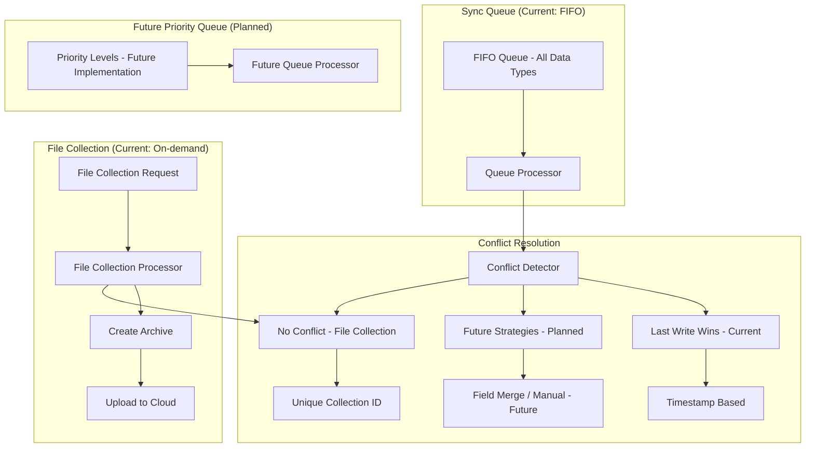

# Sync Service Architecture

## 7. Data Sync Priority and Conflict Resolution

このセクションでは、同期処理における優先度管理と競合解決のメカニズムを説明します。効率的なデータ同期を実現するため、データの重要度に応じた優先度付けと、競合発生時の解決戦略を実装しています。

### 同期優先度キュー（将来実装）

**注**: 優先度制御は将来の実装予定です。現在はFIFO（先入先出）方式で処理されます。

データの種類に応じた優先度管理の将来計画：

#### すべてのデータ（現在の実装）
- **処理方式**: FIFO（先入先出）
- **同期間隔**: 30秒〜1分（差分同期データタイプで統一）
- **ファイル収集**: オンデマンド（同期レスポンス連動）
- **特別な優先度なし**

### ファイル収集の優先度（現在の実装）

**処理タイミング:**
- 定期同期レスポンスに収集指示が含まれる場合に実行
- 差分同期処理の後に実行
- エラー発生時はクラウドに状態通知

**優先度の特徴:**
- **オンデマンド実行**: 定期ポーリングは行わない
- **非阻害処理**: 通常の同期を妨げない設計
- **独立したエラー処理**: ファイル収集の失敗は通常同期に影響しない

### キュープロセッサー（現在の実装）
- FIFOベースでキューから順次取り出し
- シンプルな順次処理
- ファイル収集は別フローで並行処理
- 将来的に優先度ベースの処理に拡張予定

### 競合解決戦略

データ競合が発生した場合の解決方法：

#### Last Write Wins (LWW) - 現在の実装
**タイムスタンプベースの解決**
- 最も新しいタイムスタンプのデータを採用
- シンプルで高速な解決方法
- すべての同期データタイプに適用
- **注**: ファイル収集は競合の概念なし（アーカイブファイルとして保存）

**実装詳細：**
- 各レコードに`updated_at`タイムスタンプを付与
- 同期時にタイムスタンプを比較
- 新しいデータで上書き

### 競合検出メカニズム

**Conflict Detector**が以下を監視：
- 同一レコードへの同時更新
- バージョン番号の不整合
- ビジネスルール違反
- データ整合性の問題

**ファイル収集における競合処理:**
- ファイル収集は一意のcollection_idで管理
- 同一ファイルの重複収集は新しいcollection_idで区別
- アーカイブの上書きは発生しない

現在はシンプルなFIFO処理とLast Write Winsによる競合解決を実装しており、将来的により高度な優先度管理と競合解決戦略への拡張を予定しています。

