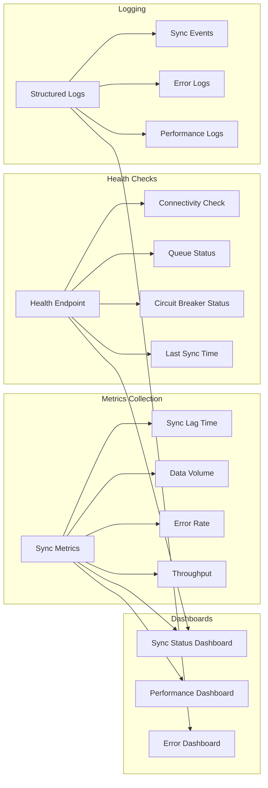

# Sync Service Architecture

## 8. Monitoring and Observability

このセクションでは、Sync Serviceの監視と可観測性の仕組みを説明します。システムの健全性を維持し、問題を早期に検出・解決するため、包括的なモニタリング体制を構築しています。

### メトリクス収集

システムパフォーマンスを測定する主要メトリクス：

#### Sync Lag Time（同期遅延時間）
- **定義**: データ変更から同期完了までの時間
- **目標値**: すべてのデータで1分以内（ポーリング間隔: 30秒〜1分）
- **アラート閾値**: 3分を超えた場合
- **用途**: 同期パフォーマンスの評価、ボトルネック特定

#### Data Volume（データ量）
- **定義**: 同期されたデータのサイズと件数
- **測定項目**: 
  - 1時間あたりの転送データ量（MB/GB）
  - 処理レコード数
  - ピーク時のデータ量
- **用途**: キャパシティプランニング、帯域幅最適化

#### Error Rate（エラー率）
- **定義**: 同期失敗の割合
- **計算式**: (失敗回数 / 総同期試行回数) × 100
- **目標値**: 0.1%未満
- **アラート閾値**: 1%以上
- **用途**: システム信頼性の評価、問題の早期発見

#### Throughput（スループット）
- **定義**: 単位時間あたりの処理能力
- **測定項目**:
  - 秒あたりの同期完了数
  - 並行処理数
  - キュー処理速度
- **用途**: システム性能の評価、スケーリング判断

### ヘルスチェック

システムの健全性を確認するエンドポイント：

#### Connectivity Check（接続性確認）
- **クラウド接続**: クラウドサービスへの到達性
- **データベース接続**: MongoDB/Redisの応答確認
- **ネットワーク遅延**: RTT（Round Trip Time）測定
- **応答例**: 
  ```json
  {
    "cloud": "connected",
    "database": "healthy",
    "latency_ms": 45
  }
  ```

#### Queue Status（キュー状態）
- **キューサイズ**: 待機中のタスク数
- **処理速度**: 分あたりの処理タスク数
- **滞留時間**: 最も古いタスクの待機時間
- **処理順序**: FIFO（先入先出）

#### Circuit Breaker Status（サーキットブレーカー状態）
- **状態**: Closed（正常）/ Open（遮断）/ Half-Open（回復試行）
- **失敗カウント**: 連続失敗回数
- **最終失敗時刻**: 直近のエラー発生時刻
- **自動復旧予定**: Half-Open移行までの時間

#### Last Sync Time（最終同期時刻）
- **サービス別**: 各サービスの最終同期時刻
- **データ種別**: データタイプごとの同期状況
- **成功/失敗**: 最後の同期結果
- **次回予定**: 次の同期実行予定時刻

### ロギング

構造化ログによる詳細な記録：

#### Sync Events（同期イベント）
- 同期開始・完了の記録
- データ種別と件数
- 処理時間と転送サイズ
- 成功/失敗の詳細

#### Error Logs（エラーログ）
- エラーコードと詳細メッセージ
- スタックトレース
- 影響範囲と重要度
- リトライ状況

#### Performance Logs（パフォーマンスログ）
- 処理時間の詳細分析
- リソース使用状況（CPU/メモリ/ネットワーク）
- ボトルネック箇所
- 最適化の機会

### ダッシュボード

視覚的な監視のための3つの専用ダッシュボード：

#### Sync Status Dashboard（同期状態ダッシュボード）
- リアルタイム同期状況
- エッジ/クラウド間の接続状態
- 各サービスの同期進捗
- アクティブなエッジインスタンス一覧

#### Performance Dashboard（パフォーマンスダッシュボード）
- スループットグラフ
- レイテンシ分布
- データ転送量の推移
- リソース使用率

#### Error Dashboard（エラーダッシュボード）
- エラー発生頻度のトレンド
- エラー種別の分類
- 影響を受けたサービス
- 復旧状況と所要時間

この包括的なモニタリング体制により、問題の早期発見と迅速な対応が可能となり、高い可用性とサービス品質を維持しています。

