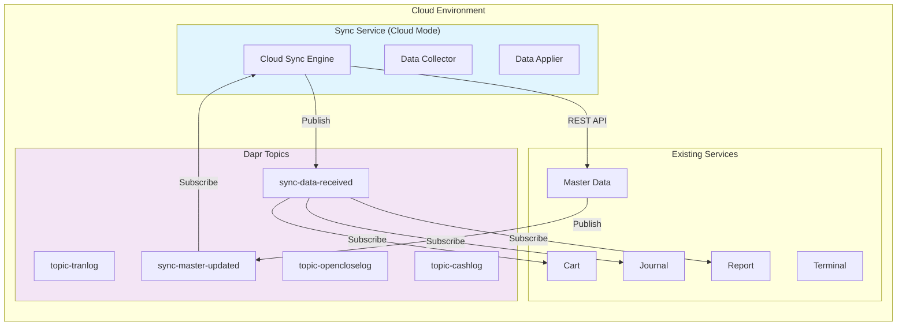
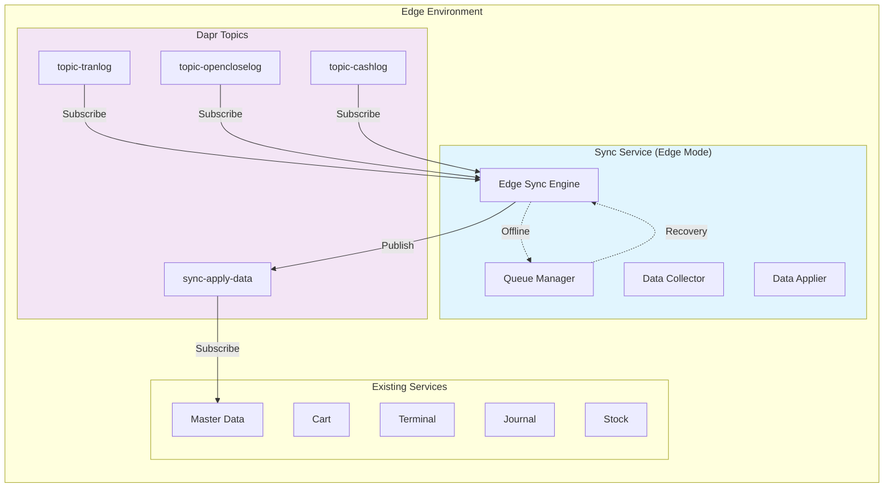
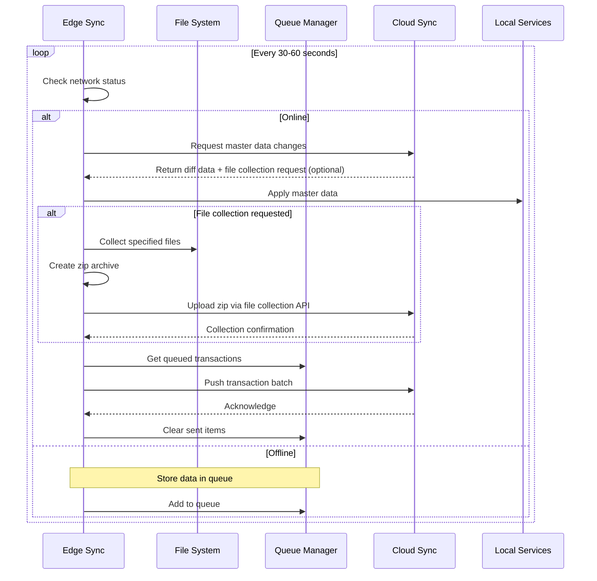
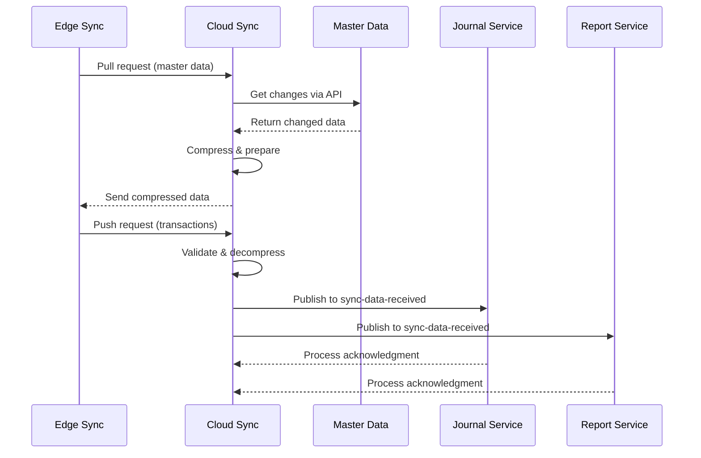

# Sync Service データ受け渡し方法 概要設計

## 1. 設計方針

### 1.1 基本原則
- **既存サービスへの影響最小化**: 既存のインターフェースを活用し、変更は最小限に留める
- **疎結合**: Syncサービスと各サービス間は疎結合を維持
- **非同期通信優先**: 可能な限り非同期のPub/Subパターンを使用
- **データ整合性**: 冪等性とトランザクション管理を重視
- **ファイル収集統合**: アプリケーションログはファイル収集機能で統合管理

### 1.2 通信方式の選択基準
| データ種別 | 通信方式 | 理由 |
|------------|----------|------|
| マスターデータ取得 | REST API (Pull) | 大量データの一括取得に適している |
| トランザクションログ | Pub/Sub (Subscribe) | 既存のpub/subトピックを活用 |
| ジャーナル | Pub/Sub (Subscribe) | 既存のフローに影響を与えない |
| ファイル収集 | HTTP Upload (Push) | zip圧縮ファイルのバイナリ転送に適している |
| 同期結果通知 | Pub/Sub (Publish) | 非同期での状態更新通知 |

## 2. クラウド側のデータ受け渡し

### 2.1 アーキテクチャ概要



### 2.2 マスターデータの収集（Cloud → Edge）

#### 2.2.1 差分データ取得方式
```yaml
方式: REST API + 変更通知
フロー:
  1. Syncサービスが定期的にMaster Dataサービスに差分取得APIを呼び出し
  2. Master DataサービスがAPIでupdated_at > last_syncのデータを返却
  3. Master Dataサービスが更新時にsync-master-updatedトピックに通知（オプション）
```

**Master Dataサービス側の新規APIエンドポイント:**
```python
# GET /api/v1/sync/changes
{
  "from_timestamp": "2025-01-01T00:00:00Z",
  "data_types": ["products", "prices", "staff", "tax_rules"],
  "store_code": "STORE001"  # 店舗別フィルタリング
}

# Response
{
  "data": {
    "products": [...],
    "prices": [...],
    "staff": [...],
    "tax_rules": [...]
  },
  "timestamp": "2025-01-15T10:30:00Z",
  "record_count": 150
}
```

### 2.3 トランザクションデータの受信（Edge → Cloud）

#### 2.3.1 新規Pub/Subトピックによる受信
```yaml
方式: 専用Pub/Subトピック
理由: 既存フローへの影響を避けるため、Syncサービス専用トピックを使用

新規トピック:
  - sync-data-received: エッジから受信したデータを各サービスに配信
```

**データフロー:**
1. Syncサービス（Cloud）がエッジからデータを受信
2. データ種別に応じて`sync-data-received`トピックにパブリッシュ
3. 各サービスがサブスクライブして必要なデータを処理

**トピックメッセージ形式:**
```json
{
  "edge_id": "EDGE001",
  "data_type": "tran_log",
  "records": [...],
  "sync_id": "SYNC_A1234_EDGE001_01JK3X9Y5Z8",
  "timestamp": "2025-01-15T10:30:00Z"
}
```

### 2.4 ファイル収集データの受信（Edge → Cloud）

#### 2.4.1 HTTP Uploadによるバイナリ転送
```yaml
方式: HTTP Multipart Upload
理由: zip圧縮されたバイナリファイルの効率的な転送

エンドポイント:
  - POST /api/v1/sync/file-collection/{collection_id}/upload
```

**処理フロー:**
1. エッジ側Syncサービスが同期レスポンスでファイル収集指示を受信
2. 指定パスのファイル・ディレクトリをzip形式で圧縮
3. HTTP Multipart Uploadでクラウドに送信
4. クラウド側Syncサービスがアーカイブを保存・管理

**アップロードAPI仕様:**
```python
# POST /api/v1/sync/file-collection/{collection_id}/upload
Content-Type: multipart/form-data
Authorization: Bearer <JWT_TOKEN>

# Form Data
archive: <zip_file_binary>
filename: "logs_EDGE001_20250115.zip"
metadata: {
  "file_count": 45,
  "total_size_bytes": 15728640,
  "compression_ratio": 0.65
}
```

### 2.5 各サービスの必要な変更

#### 2.5.1 Master Dataサービス
- **追加**: 差分取得API (`/api/v1/sync/changes`)
- **追加**: 一括取得API (`/api/v1/sync/bulk`)
- **オプション**: 更新通知のPub/Sub発行

#### 2.5.2 Cart/Journal/Reportサービス
- **追加**: `sync-data-received`トピックのサブスクリプション
- **追加**: 受信データの適用処理（冪等性保証）

#### 2.5.3 Syncサービス（Cloud Mode）
- **追加**: ファイル収集管理機能
- **追加**: zipアーカイブ保存・管理
- **追加**: ファイル収集履歴管理
- **追加**: アーカイブダウンロードAPI

## 3. エッジ側のデータ受け渡し

### 3.1 アーキテクチャ概要



### 3.2 トランザクションデータの収集（Edge → Cloud）

#### 3.2.1 既存Pub/Subトピックのサブスクライブ
```yaml
方式: 既存トピックをサブスクライブ
理由: データの重複を避け、既存フローを活用

サブスクライブトピック:
  - topic-tranlog: トランザクションログ
  - topic-opencloselog: 開設精算ログ
  - topic-cashlog: 入出金ログ
```

**処理フロー:**
1. Syncサービス（Edge）が既存トピックをサブスクライブ
2. 受信データをバッファリング
3. 定期的にクラウドへバッチ送信
4. オフライン時はローカルキューに保存

### 3.3 マスターデータの適用（Cloud → Edge）

#### 3.3.1 専用トピックによる配信
```yaml
方式: 専用Pub/Subトピック
理由: トランザクション管理と順序制御のため

新規トピック:
  - sync-apply-data: マスターデータの適用指示
```

**Master Dataサービス側の変更:**
```python
# sync-apply-dataトピックのサブスクライバー
@app.post("/dapr/subscribe/sync-apply-data")
async def apply_sync_data(request: SyncApplyDataRequest):
    """
    Syncサービスから受信したマスターデータを適用
    バージョニング方式でノーダウンタイム更新
    """
    # 実装詳細は後述
```

### 3.4 ファイル収集の実行（Edge → Cloud）

#### 3.4.1 同期レスポンス連動方式
```yaml
方式: 定期同期レスポンスに収集指示を含める
理由: 既存の定期ポーリングを活用し、オーバーヘッドを最小化

収集フロー:
  1. エッジ側の定期同期リクエスト送信
  2. クラウド側が同期データ + ファイル収集指示を返却
  3. エッジ側がファイル収集処理を実行
  4. zip圧縮後、専用APIでアップロード
```

**収集対象ファイル:**
- アプリケーションログ（全サービスのログファイル）
- APIリクエストログ
- システム設定ファイル
- エラーダンプファイル

**セキュリティ制限:**
```python
# 環境変数での許可パス設定
FILE_COLLECTION_ALLOWED_PATHS=/var/log/kugelpos,/opt/kugelpos/data,/tmp/kugelpos

# 禁止ディレクトリ
FORBIDDEN_PATHS = ["/etc", "/root", "/sys", "/proc", "/dev"]
```

### 3.5 ジャーナルデータの収集

#### 3.5.1 既存Pub/Subトピックのサブスクライブ
```yaml
方式: 既存トピックをサブスクライブ
理由: ジャーナルデータは既存のpub/subフローを活用

サブスクライブトピック:
  - topic-journal: 電子ジャーナル
  - topic-audit: 監査ログ（存在する場合）
```

## 4. データ同期の制御フロー

### 4.1 エッジ側の同期サイクル（ファイル収集を含む）



### 4.2 クラウド側の処理フロー



## 5. エラー処理とリカバリ

### 5.1 エッジ側のエラー処理

```yaml
オフライン検出:
  - HTTPタイムアウト（5秒）
  - 連続3回の接続失敗

ファイル収集エラー:
  - パス権限エラー: クラウドに状態通知、処理続行
  - 圧縮エラー: リトライ後、エラー通知
  - アップロードエラー: 指数バックオフでリトライ

リカバリ処理:
  - ローカルキューへの自動切り替え
  - 指数バックオフでのリトライ
  - ネットワーク復旧時の自動再同期
```

### 5.2 クラウド側のエラー処理

```yaml
エラー種別:
  - エッジ認証失敗: 401エラーを返却
  - データ検証エラー: 400エラーと詳細を返却
  - ファイル収集エラー: 収集状態を記録、後続処理は継続
  - サービス間通信エラー: リトライ後、失敗を記録

リカバリ処理:
  - 部分的成功の記録と再送信サポート
  - 同期履歴による監査ログ
  - ファイル収集の独立したリトライ機構
```

## 6. 実装の優先順位

### Phase 1（必須機能）
1. **エッジ側**: 既存pub/subトピックのサブスクライブ
2. **クラウド側**: トランザクションデータ受信API
3. **両側**: 基本的な差分同期メカニズム
4. **両側**: オフライン時のキューイング

### Phase 2（拡張機能）
1. **マスターデータ**: 差分取得API実装
2. **ジャーナル**: 既存pub/subサブスクライブ
3. **ファイル収集**: zip圧縮とHTTPアップロード機能
4. **監視**: メトリクスとアラート

### Phase 3（高度な機能）
1. **24時間営業対応**: ノーダウンタイム更新
2. **ファイル収集拡張**: 大容量ファイル対応、チャンク分割
3. **性能最適化**: 差分アルゴリズムの改善
4. **セキュリティ強化**: ファイルアクセス監査

## 7. 既存サービスへの影響まとめ

| サービス | 必要な変更 | 影響度 | 備考 |
|----------|------------|--------|------|
| Master Data | 差分取得API追加 | 小 | 既存ロジックの流用可能 |
| Cart | sync-data-receivedサブスクライブ | 小 | 既存のpub/sub処理を拡張 |
| Terminal | 変更なし | なし | 既存pub/subをそのまま利用 |
| Journal | sync-data-receivedサブスクライブ | 小 | 既存のpub/sub処理を拡張 |
| Report | sync-data-receivedサブスクライブ | 小 | 既存のpub/sub処理を拡張 |
| Stock | sync-data-receivedサブスクライブ | 小 | 既存のpub/sub処理を拡張 |
| 全サービス | ログファイルなし | なし | ファイル収集で統合管理 |

**注記**: アプリケーションログは各サービスから個別に収集するのではなく、ファイル収集機能で統合的に管理されます。各サービスのログファイルへの直接的な変更は不要です。

## 8. セキュリティ考慮事項

### 8.1 認証・認可
- エッジ端末の個別認証（JWT）
- テナント間のデータ分離
- API呼び出しの認証トークン必須化

### 8.2 データ保護
- 通信経路のTLS暗号化
- 機密データの暗号化保存
- ログのマスキング処理

## 9. 次のステップ

1. **詳細設計**: 各APIの詳細仕様定義
2. **ファイル収集プロトタイプ**: zip圧縮とアップロード機能の実装
3. **セキュリティテスト**: ファイルアクセス制限とパス検証の評価
4. **性能テスト**: データ量とネットワーク遅延の影響評価
5. **段階的導入**: 特定店舗でのパイロット運用