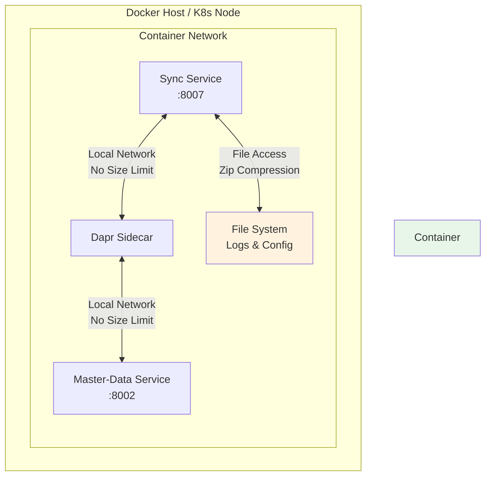
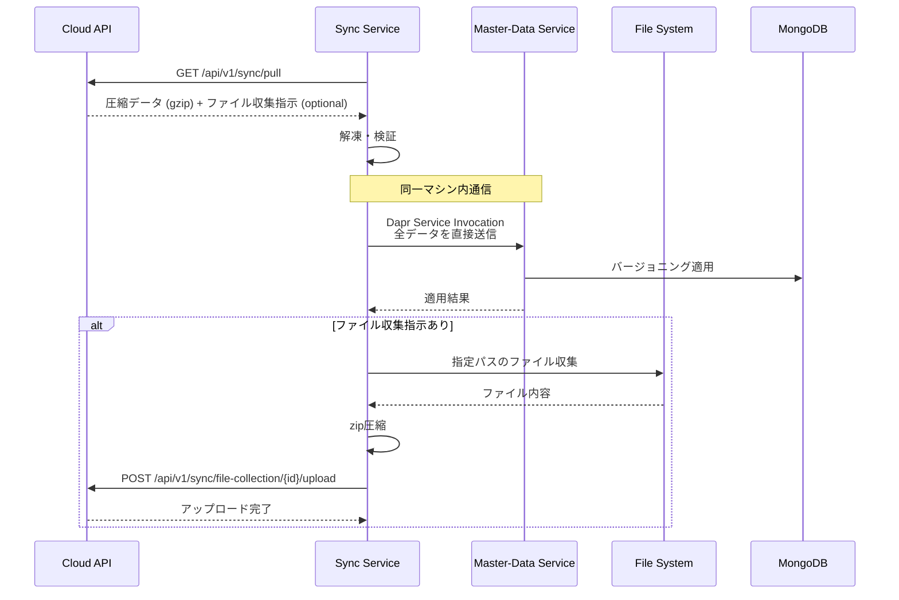

# エッジ内データ転送設計（簡潔版）

## 1. 前提条件の整理

### 同一マシン内での通信特性



**ポイント**:
- 同一ホスト内のコンテナ間通信
- ネットワーク帯域の制約なし
- Pub/SubのRedis制限も関係なし（Service Invocation使用）
- メモリ制限のみ考慮すれば良い
- ファイルシステムへの直接アクセス（ボリュームマウント）

## 2. シンプルな実装設計

### 2.1 データフロー（ファイル収集を含む）



### 2.2 Syncサービス実装（ファイル収集機能追加）

```python
# sync/app/core/edge_sync_engine.py

from kugel_common.utils.dapr_client_helper import get_dapr_client
import gzip
import json
import httpx
import zipfile
import os
import tempfile
from pathlib import Path
from typing import Dict, Any, List

class EdgeSyncEngine:
    """エッジ側同期エンジン（ファイル収集対応版）"""

    def __init__(self, config):
        self.config = config
        self.cloud_api_url = config.CLOUD_SYNC_URL
        self.allowed_paths = config.FILE_COLLECTION_ALLOWED_PATHS.split(',')

    async def pull_and_apply_master_data(self) -> Dict[str, Any]:
        """
        クラウドからマスターデータを取得してMaster-Dataサービスに適用
        ファイル収集指示があれば実行
        """
        try:
            # Step 1: クラウドAPIから圧縮データ取得
            response_data = await self._pull_from_cloud()

            # Step 2: 解凍と検証
            master_data = await self._decompress_and_validate(response_data["sync_data"])

            # Step 3: Master-Dataサービスへ直接転送（サイズ制限なし）
            sync_result = await self._transfer_to_master_data(master_data)

            # Step 4: ファイル収集処理（指示がある場合）
            if "file_collection_request" in response_data:
                collection_result = await self._handle_file_collection(
                    response_data["file_collection_request"]
                )
                sync_result["file_collection"] = collection_result

            return sync_result

        except Exception as e:
            logger.error(f"Master data sync failed: {e}")
            raise

    async def _pull_from_cloud(self) -> Dict[str, Any]:
        """
        クラウドAPIから圧縮データを取得（ファイル収集指示を含む可能性）
        """
        headers = {
            "Authorization": f"Bearer {self.edge_token}",
            "Accept-Encoding": "gzip"
        }

        request_data = {
            "edge_id": self.config.EDGE_ID,
            "data_type": "master_data",
            "last_sync_timestamp": self.last_sync_timestamp,
            "sync_type": self.sync_type
        }

        async with httpx.AsyncClient() as client:
            response = await client.post(
                f"{self.cloud_api_url}/request",
                json=request_data,
                headers=headers,
                timeout=300.0
            )

            if response.status_code != 200:
                raise Exception(f"Failed to pull data: {response.status_code}")

            return response.json()  # sync_data + file_collection_request (optional)

    async def _decompress_and_validate(self, compressed_data: bytes) -> Dict[str, Any]:
        """
        データ解凍と検証
        """
        # gzip解凍
        decompressed = gzip.decompress(compressed_data)

        # JSONパース
        data = json.loads(decompressed)

        # 基本的な構造検証
        if "records" not in data:
            raise ValueError("Invalid data structure: missing 'records'")

        logger.info(f"Decompressed data: {len(decompressed)} bytes")

        return data

    async def _transfer_to_master_data(self, master_data: Dict[str, Any]) -> Dict:
        """
        Master-Dataサービスへ直接転送
        同一マシン内なのでサイズ制限を考慮する必要なし
        """
        request_data = {
            "sync_id": master_data.get("sync_id"),
            "sync_type": master_data.get("sync_type", "differential"),
            "version": master_data.get("version", 1),
            "records": master_data["records"],  # 全データをそのまま送信
            "timestamp": master_data.get("timestamp")
        }

        # Dapr Service Invocation（ローカル通信）
        async with get_dapr_client() as client:
            response = await client.invoke_method(
                app_id="master-data",
                method_name="sync/apply",
                data=json.dumps(request_data),
                http_verb="POST"
            )

            if response.status_code == 200:
                result = response.json()
                logger.info(f"Sync {request_data['sync_id']} applied successfully")
                return result
            else:
                raise Exception(f"Master-Data service returned {response.status_code}")

    async def _handle_file_collection(self, request: Dict[str, Any]) -> Dict[str, Any]:
        """
        ファイル収集処理
        """
        collection_id = request["collection_id"]
        target_paths = request["target_paths"]
        exclude_patterns = request.get("exclude_patterns", [])
        max_size_mb = request.get("max_archive_size_mb", 100)

        try:
            # Step 1: パス検証
            validated_paths = await self._validate_collection_paths(target_paths)

            # Step 2: ファイル収集
            collected_files = await self._collect_files(validated_paths, exclude_patterns)

            # Step 3: zip圧縮
            archive_path = await self._create_zip_archive(
                collected_files, collection_id, max_size_mb
            )

            # Step 4: クラウドにアップロード
            upload_result = await self._upload_archive(collection_id, archive_path)

            # Step 5: 一時ファイル削除
            os.unlink(archive_path)

            logger.info(f"File collection {collection_id} completed successfully")
            return {
                "collection_id": collection_id,
                "status": "completed",
                "file_count": len(collected_files),
                "archive_size_bytes": upload_result["size"]
            }

        except Exception as e:
            logger.error(f"File collection {collection_id} failed: {e}")
            
            # エラー状態をクラウドに通知
            await self._notify_collection_error(collection_id, str(e))
            
            return {
                "collection_id": collection_id,
                "status": "failed",
                "error": str(e)
            }

    async def _validate_collection_paths(self, target_paths: List[str]) -> List[str]:
        """
        収集対象パスのセキュリティ検証
        """
        validated_paths = []
        
        for path in target_paths:
            # パストラバーサル攻撃対策
            normalized_path = os.path.normpath(path)
            if ".." in normalized_path:
                raise ValueError(f"Invalid path: {path}")
            
            # ホワイトリスト確認
            is_allowed = any(
                normalized_path.startswith(allowed) 
                for allowed in self.allowed_paths
            )
            
            if not is_allowed:
                raise ValueError(f"Path not in allowed list: {path}")
            
            # パスの存在確認
            if os.path.exists(normalized_path):
                validated_paths.append(normalized_path)
            else:
                logger.warning(f"Path not found: {path}")
        
        return validated_paths

    async def _collect_files(self, paths: List[str], exclude_patterns: List[str]) -> List[str]:
        """
        ファイル収集（ディレクトリの場合は再帰的に収集）
        """
        collected_files = []
        
        for path in paths:
            if os.path.isfile(path):
                collected_files.append(path)
            elif os.path.isdir(path):
                for root, dirs, files in os.walk(path):
                    for file in files:
                        file_path = os.path.join(root, file)
                        
                        # 除外パターンチェック
                        should_exclude = any(
                            self._match_pattern(file_path, pattern)
                            for pattern in exclude_patterns
                        )
                        
                        if not should_exclude:
                            collected_files.append(file_path)
        
        return collected_files

    async def _create_zip_archive(
        self, 
        files: List[str], 
        collection_id: str, 
        max_size_mb: int
    ) -> str:
        """
        ファイルをzip形式で圧縮
        """
        with tempfile.NamedTemporaryFile(
            suffix=f"_{collection_id}.zip", 
            delete=False
        ) as temp_file:
            archive_path = temp_file.name
        
        total_size = 0
        max_size_bytes = max_size_mb * 1024 * 1024
        
        with zipfile.ZipFile(archive_path, 'w', zipfile.ZIP_DEFLATED) as zipf:
            for file_path in files:
                try:
                    file_size = os.path.getsize(file_path)
                    
                    if total_size + file_size > max_size_bytes:
                        logger.warning(f"Archive size limit reached: {max_size_mb}MB")
                        break
                    
                    # アーカイブ内での相対パスを設定
                    arcname = os.path.relpath(file_path, '/')
                    zipf.write(file_path, arcname)
                    total_size += file_size
                    
                except (OSError, PermissionError) as e:
                    logger.warning(f"Cannot read file {file_path}: {e}")
        
        logger.info(f"Created archive: {archive_path} ({total_size} bytes)")
        return archive_path

    async def _upload_archive(self, collection_id: str, archive_path: str) -> Dict[str, Any]:
        """
        圧縮ファイルをクラウドにアップロード
        """
        headers = {"Authorization": f"Bearer {self.edge_token}"}
        
        with open(archive_path, 'rb') as f:
            files = {
                'archive': (
                    f"{collection_id}.zip",
                    f,
                    'application/zip'
                )
            }
            
            async with httpx.AsyncClient() as client:
                response = await client.post(
                    f"{self.cloud_api_url}/file-collection/{collection_id}/upload",
                    files=files,
                    headers=headers,
                    timeout=600.0  # 10分タイムアウト
                )
                
                if response.status_code != 200:
                    raise Exception(f"Upload failed: {response.status_code}")
                
                return response.json()

    def _match_pattern(self, filepath: str, pattern: str) -> bool:
        """
        ファイルパスがパターンにマッチするかチェック
        """
        import fnmatch
        return fnmatch.fnmatch(filepath, pattern)
```

### 2.3 Master-Dataサービス実装（簡潔版）

```python
# master-data/app/api/v1/sync.py

from fastapi import APIRouter, HTTPException, Depends
from pydantic import BaseModel
from typing import Dict, List, Any
from datetime import datetime

router = APIRouter(prefix="/sync", tags=["sync"])

class SyncApplyRequest(BaseModel):
    """同期データ適用リクエスト"""
    sync_id: str
    sync_type: str  # "differential" or "bulk"
    version: int
    records: Dict[str, List[Dict[str, Any]]]  # {collection_name: [documents]}
    timestamp: datetime

@router.post("/apply")
async def apply_sync_data(
    request: SyncApplyRequest,
    db: AsyncIOMotorDatabase = Depends(get_db),
    sync_service: MasterDataSyncService = Depends(get_sync_service)
):
    """
    Syncサービスから転送されたマスターデータを適用
    同一マシン内通信なのでサイズは問題なし
    """
    try:
        # データ適用（バージョニング or 差分更新）
        result = await sync_service.apply_sync_data(
            sync_id=request.sync_id,
            sync_type=request.sync_type,
            version=request.version,
            records=request.records
        )

        return {
            "success": True,
            "sync_id": request.sync_id,
            "results": result
        }

    except Exception as e:
        logger.error(f"Failed to apply sync data: {e}")
        raise HTTPException(
            status_code=500,
            detail=f"Sync application failed: {str(e)}"
        )
```

### 2.4 DB適用処理（変更なし）

```python
# master-data/app/services/master_data_sync_service.py

class MasterDataSyncService:
    """マスターデータ同期サービス"""

    async def apply_sync_data(
        self,
        sync_id: str,
        sync_type: str,
        version: int,
        records: Dict[str, List[Dict]]
    ) -> Dict[str, Any]:
        """
        マスターデータをDBに適用
        """
        if sync_type == "bulk":
            # 一括同期：バージョニング方式
            return await self._apply_bulk_sync(records, version)
        else:
            # 差分同期：個別更新
            return await self._apply_differential_sync(records)

    async def _apply_bulk_sync(self, records: Dict, version: int) -> Dict:
        """
        24時間営業対応のバージョニング適用
        （実装は前回と同じ）
        """
        # 1. 新バージョンを非アクティブで挿入
        # 2. トランザクションで切り替え
        # 3. 旧バージョンを遅延削除
        pass
```

## 3. メモリ考慮事項

### 3.1 メモリ使用量の目安

| データ種別 | レコード数 | メモリ使用量（概算） |
|-----------|-----------|-------------------|
| 商品マスター | 10,000 | 20-30MB |
| 価格情報 | 30,000 | 15-20MB |
| スタッフ | 100 | < 1MB |
| ファイル収集 | - | 5-10MB (一時的) |
| **合計** | 40,000+ | **60-70MB** |

**結論**: 現代のコンテナ環境では問題にならないレベル

### 3.2 ファイル収集のメモリ最適化

```python
# ファイル収集時のメモリ効率化
async def _create_zip_archive_streaming(
    self, 
    files: List[str], 
    collection_id: str, 
    max_size_mb: int
) -> str:
    """
    大容量ファイル用のストリーミング圧縮
    """
    with tempfile.NamedTemporaryFile(
        suffix=f"_{collection_id}.zip", 
        delete=False
    ) as temp_file:
        archive_path = temp_file.name
    
    total_size = 0
    max_size_bytes = max_size_mb * 1024 * 1024
    
    with zipfile.ZipFile(archive_path, 'w', zipfile.ZIP_DEFLATED) as zipf:
        for file_path in files:
            try:
                file_size = os.path.getsize(file_path)
                
                if total_size + file_size > max_size_bytes:
                    break
                
                # ストリーミング書き込みでメモリ使用量を抑制
                arcname = os.path.relpath(file_path, '/')
                
                with open(file_path, 'rb') as src:
                    with zipf.open(arcname, 'w') as dst:
                        while True:
                            chunk = src.read(8192)  # 8KB単位
                            if not chunk:
                                break
                            dst.write(chunk)
                
                total_size += file_size
                
            except (OSError, PermissionError) as e:
                logger.warning(f"Cannot read file {file_path}: {e}")
    
    return archive_path
```

## 4. エラーハンドリング

```python
class SyncErrorHandler:
    """同期エラー処理（簡潔版）"""

    async def handle_sync_error(self, error: Exception, sync_id: str):
        """
        エラー種別に応じた処理
        """
        if isinstance(error, httpx.TimeoutException):
            # クラウドAPIタイムアウト
            logger.error(f"Cloud API timeout for sync {sync_id}")
            await self.retry_with_backoff(sync_id)

        elif isinstance(error, json.JSONDecodeError):
            # データ破損
            logger.error(f"Invalid JSON data for sync {sync_id}")
            await self.request_full_resync(sync_id)

        elif "out of memory" in str(error).lower():
            # メモリ不足（稀）
            logger.error(f"Out of memory for sync {sync_id}")
            await self.switch_to_streaming_mode(sync_id)

        else:
            # その他
            logger.error(f"Unexpected error for sync {sync_id}: {error}")
            raise
```

## 5. 設定例

```yaml
# docker-compose.yml
services:
  sync:
    image: sync:latest
    mem_limit: 512m  # ファイル収集を考慮して少し増量
    volumes:
      - /var/log/kugelpos:/var/log/kugelpos:ro  # ログファイルアクセス
      - /opt/kugelpos/data:/opt/kugelpos/data:ro  # データファイルアクセス
    environment:
      - DAPR_HTTP_PORT=3500
      - SYNC_MODE=edge
      - FILE_COLLECTION_ALLOWED_PATHS=/var/log/kugelpos,/opt/kugelpos/data

  master-data:
    image: master-data:latest
    mem_limit: 512m
    environment:
      - DAPR_HTTP_PORT=3501
```

```python
# sync/app/config/settings.py
class SyncSettings(BaseSettings):
    # クラウドAPI設定
    CLOUD_SYNC_URL: str
    CLOUD_API_TIMEOUT: int = 300  # 5分

    # Dapr設定
    DAPR_HTTP_PORT: int = 3500

    # ファイル収集設定
    FILE_COLLECTION_ALLOWED_PATHS: str = "/var/log/kugelpos,/opt/kugelpos/data"
    FILE_COLLECTION_MAX_ARCHIVE_SIZE_MB: int = 100
    FILE_COLLECTION_TEMP_DIR: str = "/tmp"

    # メモリ設定（通常は不要）
    MAX_MEMORY_USAGE_MB: int = 450  # 警告閾値
```

## 6. パフォーマンス測定（ファイル収集を含む）

```python
import psutil
import time

class PerformanceMonitor:
    """パフォーマンス監視（ファイル収集対応）"""

    async def measure_file_collection_performance(
        self, 
        collection_func, 
        collection_id: str
    ):
        """ファイル収集のパフォーマンス測定"""
        
        start_time = time.time()
        start_memory = psutil.Process().memory_info().rss / 1024 / 1024
        
        result = await collection_func()
        
        end_time = time.time()
        end_memory = psutil.Process().memory_info().rss / 1024 / 1024
        
        metrics = {
            "collection_id": collection_id,
            "duration_seconds": end_time - start_time,
            "memory_used_mb": end_memory - start_memory,
            "file_count": result.get("file_count", 0),
            "archive_size_bytes": result.get("archive_size_bytes", 0)
        }
        
        logger.info(f"File collection performance: {metrics}")
        return result, metrics
```

## 7. まとめ

### 設計のポイント

1. **同一マシン内通信の利点を活用**
   - サイズ制限を考慮する必要なし
   - チャンク分割も不要
   - State Store経由も不要

2. **ファイル収集の統合**
   - アプリケーションログをファイル収集で統合管理
   - zip圧縮による効率的な転送
   - セキュリティ制限（ホワイトリスト、パストラバーサル対策）

3. **シンプルな実装**
   - Dapr Service Invocationで直接転送
   - 複雑な分割・組み立てロジック不要
   - エラーハンドリングも簡潔

4. **必要十分なメモリ**
   - 60-70MBのデータは問題なし（ファイル収集含む）
   - 通常のコンテナメモリ（512MB）で十分

5. **将来の拡張性**
   - データ量が増えた場合はストリーミング追加可能
   - 必要になってから実装すれば良い

この簡潔な設計により、開発工数を削減しながら、十分な性能と信頼性を確保できます。