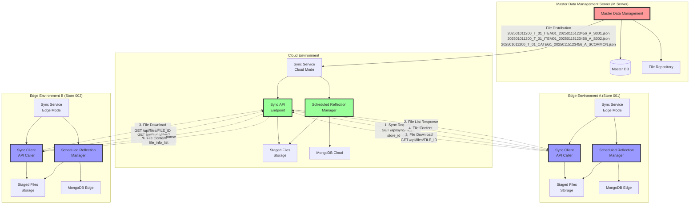
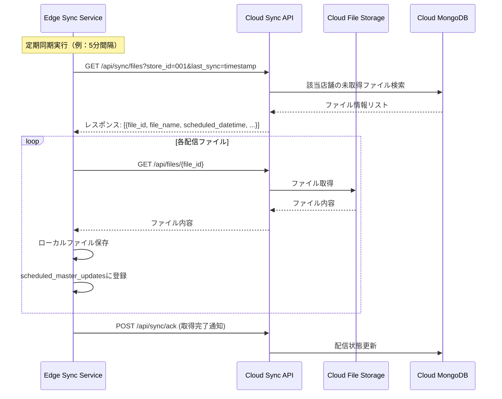
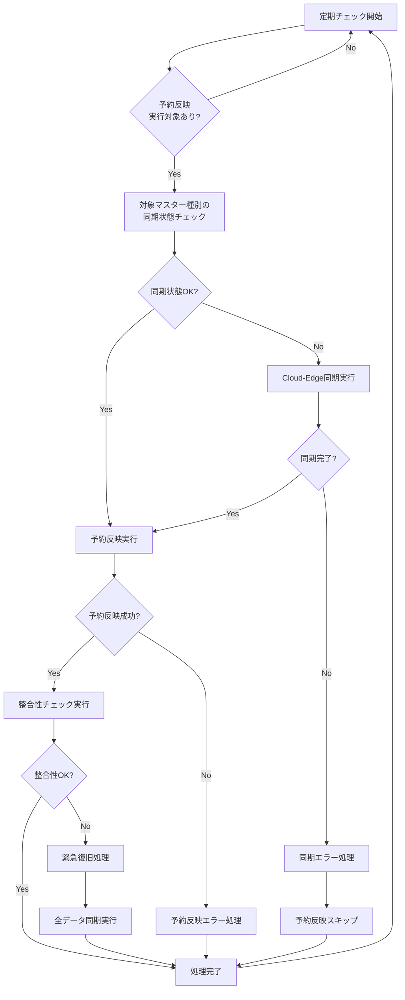

# マスタデータ予約反映システム 実装プラン

## 1. システム概要

マスタデータ管理サーバ（Mサーバ）から店舗単位で配信されるマスタファイルを事前受信し、ファイル名に含まれる反映日時に自動更新を実行する機能を実装する。全店共通マスタ（店舗ID=COMMON）は全店舗に配信される。

### 1.1 システム構成の拡張



## 2. ファイル命名規則（Mサーバ仕様）

### 2.1 ファイル名構成

```
[マスタ反映日時]_[更新タイミング]_[反映優先順位]_[ファイルID]_[マスタ作成日時]_[更新区分]_S[店舗ID].json

店舗固有マスタ例：202501011200_T_01_ITEM01_20250115123456_A_S001.json
全店共通マスタ例：202501011200_T_01_CATEG1_20250115123456_A_SCOMMON.json
```

### 2.2 各項目の詳細

| 項目名 | 内容 | 桁数 | フォーマット | 例 |
|--------|------|------|-------------|-----|
| マスタ反映日時 | マスタが反映される日付・時刻 | 12 | YYYYMMDDHHMM | 202501011200 |
| 更新タイミング | マスタ反映のタイミング種別 | 1 | S/T | T |
| 反映優先順位 | 同一日時反映時の優先順位 | 2 | 数値 | 01 |
| ファイルID | マスタレイアウトの識別子 | 6 | 英数字 | ITEM01 |
| マスタ作成日時 | マスタが作成された日時 | 14 | YYYYMMDDHHMMSS | 20250115123456 |
| 更新区分 | 更新処理の種別 | 1 | A/M | A |
| 店舗ID | 対象店舗の識別子 | 6 | 数値/COMMON | 001/COMMON |

### 2.3 店舗ID定義

- **001-999**: 店舗固有マスタ（該当店舗のみに配信）
- **COMMON**: 全店共通マスタ（全店舗に配信）

## 3. データベース設計

### 3.1 予約反映管理テーブル（`scheduled_master_updates`）

````python
class ScheduledMasterUpdateDocument(AbstractDocument):
    """予約反映管理ドキュメント"""
    
    tenant_id: str
    store_id: str                     # 店舗ID（ファイル名から抽出、COMMONも含む）
    file_name: str                    # 受信ファイル名（完全なファイル名）
    
    # ファイル名から解析される項目
    scheduled_datetime: datetime      # マスタ反映日時（YYYYMMDDHHMM）
    update_timing: str               # 更新タイミング（S/T）
    priority: int                    # 反映優先順位（01-99）
    file_id: str                     # ファイルID（6桁英数字）
    created_datetime: datetime       # マスタ作成日時（YYYYMMDDHHMMSS）
    update_type: str                 # 更新区分（A/M）
    
    # システム管理項目
    status: str                      # pending/processing/completed/failed/cancelled
    file_path: str                   # ステージングファイルパス
    file_hash: str                   # ファイル整合性チェック用
    received_at: datetime            # ファイル受信日時
    processed_at: Optional[datetime] # 処理完了日時
    error_message: Optional[str]     # エラーメッセージ
    retry_count: int                 # リトライ回数
    
    # 配信対象
    is_common_master: bool           # True: 全店共通, False: 店舗固有
    target_store_id: Optional[str]   # 実際の配信対象店舗ID（Edge環境での実行時店舗ID）
    
    class Config:
        collection = "scheduled_master_updates"
        indexes = [
            {"keys": [("tenant_id", 1), ("store_id", 1), ("scheduled_datetime", 1)]},
            {"keys": [("tenant_id", 1), ("target_store_id", 1), ("scheduled_datetime", 1)]},
            {"keys": [("status", 1), ("scheduled_datetime", 1)]},
            {"keys": [("file_id", 1), ("scheduled_datetime", 1)]},
            {"keys": [("priority", 1)]},
            {"keys": [("is_common_master", 1)]},
        ]
````

### 3.2 配信ロジック仕様

#### 3.2.1 Cloud環境での配信処理

1. **受信**: Mサーバからファイルを受信
2. **解析**: ファイル名から店舗IDを抽出
3. **保存**: Staged Files Storageに保存
4. **登録**: scheduled_master_updatesテーブルに登録

#### 3.2.2 Edge-Cloud間同期フロー



## 4. API仕様

### 4.1 同期ファイル一覧取得API

```
GET /api/sync/files?store_id={store_id}&last_sync={timestamp}
```

**パラメータ:**
- `store_id`: 店舗ID
- `last_sync`: 最後の同期タイムスタンプ（オプション）

**レスポンス:**
```json
{
  "files": [
    {
      "file_id": "uuid-string",
      "file_name": "202501011200_T_01_ITEM01_20250115123456_A_S001.json",
      "scheduled_datetime": "2025-01-01T12:00:00Z",
      "update_timing": "T",
      "priority": 1,
      "file_id_code": "ITEM01",
      "created_datetime": "2025-01-15T12:34:56Z",
      "update_type": "A",
      "store_id": "001",
      "file_hash": "sha256-hash",
      "file_size": 1024
    }
  ],
  "total_count": 1,
  "sync_timestamp": "2025-01-15T15:30:00Z"
}
```

### 4.2 ファイル取得API

```
GET /api/files/{file_id}
```

**レスポンス:**
- Content-Type: application/json
- ファイル内容（バイナリ）

### 4.3 取得完了通知API

```
POST /api/sync/ack
```

**リクエストボディ:**
```json
{
  "store_id": "001",
  "downloaded_files": [
    {
      "file_id": "uuid-string",
      "download_timestamp": "2025-01-15T15:35:00Z",
      "file_hash": "sha256-hash"
    }
  ]
}
```

## 5. Edge環境でのスケジュール実行仕様

### 5.1 同期処理スケジュール

- **同期間隔**: 5分間隔
- **リトライ**: 3回まで（指数バックオフ）
- **タイムアウト**: 30秒

### 5.2 反映処理スケジュール

- **チェック間隔**: 1分間隔
- **実行条件**: `scheduled_datetime <= 現在時刻 AND status = 'pending'`
- **優先順位**: `priority`昇順で実行

## 6. マスターデータ同期との統合仕様

### 6.1 統合の目的と課題

**解決すべき課題:**
- ファイルベース予約反映とリアルタイム同期の両方が存在する環境で、Cloud-Edge間のデータ完全一致を保証
- 予約反映実行タイミングでのデータ競合状態の回避
- 同期処理と予約反映処理の実行順序制御

**統合アプローチ:**
1. 予約反映実行前に必ずCloud-Edge同期状態を確認
2. 同期状態に問題がある場合は先に同期を完了
3. 予約反映実行後に整合性を検証
4. 不整合検出時は自動復旧を実行

### 6.2 実行フロー全体像



### 6.3 詳細実行手順

#### 6.3.1 Step 1: 予約反映対象の検出（1分間隔）

**実行条件:**
```python
# 実行対象の条件
scheduled_datetime <= 現在時刻 AND status = 'pending'
```

**実行内容:**
1. `scheduled_master_updates`テーブルから実行対象を検索
2. `priority`昇順でソートして実行順序を決定
3. 各予約反映に対してStep 2を実行

#### 6.3.2 Step 2: 同期状態チェック

**チェック対象:**
```python
# 対象マスター種別の同期状態を確認
sync_status = await get_master_data_sync_status(
    tenant_id=scheduled_update.tenant_id,
    store_id=scheduled_update.target_store_id,
    data_type=scheduled_update.file_id  # ITEM01, CATEG1等
)
```

**判定条件:**
- `sync_status.sync_status == "synced"` : 同期OK → Step 4へ
- `sync_status.sync_status != "synced"` : 同期NG → Step 3へ

#### 6.3.3 Step 3: Cloud-Edge同期実行（同期状態がNGの場合）

**実行トリガー:**
- 同期状態が`out_of_sync`, `syncing`, `error`の場合

**実行内容:**
```python
# 1. 同期プロセス開始
await execute_master_data_sync(
    tenant_id=scheduled_update.tenant_id,
    store_id=scheduled_update.target_store_id,
    data_type=scheduled_update.file_id
)

# 2. 同期完了まで待機（最大10分）
sync_result = await wait_for_sync_completion(
    sync_status, 
    timeout_minutes=10
)

# 3. 同期失敗時の処理
if not sync_result.success:
    # 予約反映をスキップし、次回実行に延期
    scheduled_update.status = "sync_failed"
    scheduled_update.error_message = sync_result.error
    await scheduled_update.save()
    return  # 処理終了
```

#### 6.3.4 Step 4: 予約反映実行

**実行前提条件:**
- Cloud-Edge同期状態が`synced`であること

**実行内容:**
```python
# 1. ステータス更新
scheduled_update.status = "processing"
await scheduled_update.save()

# 2. ファイル内容の適用
try:
    await apply_master_file_to_database(
        file_path=scheduled_update.file_path,
        update_type=scheduled_update.update_type,  # A(全件) or M(差分)
        data_type=scheduled_update.file_id
    )
    
    # 3. 成功時の状態更新
    scheduled_update.status = "completed"
    scheduled_update.processed_at = datetime.now()
    
except Exception as e:
    # 4. 失敗時の状態更新
    scheduled_update.status = "failed"
    scheduled_update.error_message = str(e)
    scheduled_update.retry_count += 1

await scheduled_update.save()
```

#### 6.3.5 Step 5: 整合性チェック実行（予約反映成功後）

**実行タイミング:**
- 予約反映が`completed`になった直後

**チェック内容:**
```python
# 1. Edge側データのチェックサム計算
edge_checksum = await calculate_master_data_checksum(
    tenant_id=scheduled_update.tenant_id,
    store_id=scheduled_update.target_store_id,
    data_type=scheduled_update.file_id
)

# 2. Cloud側チェックサムの取得
cloud_checksum = await get_cloud_master_data_checksum(
    tenant_id=scheduled_update.tenant_id,
    data_type=scheduled_update.file_id
)

# 3. 整合性判定
if edge_checksum == cloud_checksum:
    # 整合性OK: 処理完了
    await update_sync_status_success(sync_status)
else:
    # 整合性NG: Step 6へ
    await handle_consistency_failure(scheduled_update, edge_checksum, cloud_checksum)
```

#### 6.3.6 Step 6: 緊急復旧処理（整合性チェック失敗時）

**実行トリガー:**
- Step 5でチェックサム不一致を検出

**復旧手順:**
```python
# 1. 緊急アラート送信
await send_critical_alert({
    "type": "data_inconsistency",
    "tenant_id": scheduled_update.tenant_id,
    "store_id": scheduled_update.target_store_id,
    "data_type": scheduled_update.file_id,
    "edge_checksum": edge_checksum,
    "cloud_checksum": cloud_checksum
})

# 2. 該当マスター種別の予約反映を一時停止
await suspend_scheduled_updates(
    tenant_id=scheduled_update.tenant_id,
    store_id=scheduled_update.target_store_id,
    data_type=scheduled_update.file_id
)

# 3. 全データ同期を強制実行
await execute_full_master_data_sync(
    tenant_id=scheduled_update.tenant_id,
    store_id=scheduled_update.target_store_id,
    data_type=scheduled_update.file_id
)

# 4. 整合性確認後に予約反映を再開
consistency_ok = await verify_master_data_consistency(
    tenant_id=scheduled_update.tenant_id,
    store_id=scheduled_update.target_store_id,
    data_type=scheduled_update.file_id
)

if consistency_ok:
    await resume_scheduled_updates(
        tenant_id=scheduled_update.tenant_id,
        store_id=scheduled_update.target_store_id,
        data_type=scheduled_update.file_id
    )
```

### 6.4 実行スケジュール詳細

#### 6.4.1 メインスケジューラー

```python
class IntegratedMasterDataScheduler:
    """統合マスターデータスケジューラー"""
    
    async def run_main_loop(self):
        """メインループ（1分間隔実行）"""
        while True:
            try:
                # 1. 予約反映対象の検出と実行
                await self.process_scheduled_updates()
                
                # 2. 5分経過時: マスターデータ同期状態チェック
                if self.should_check_sync_status():
                    await self.check_master_data_sync_status()
                
                # 3. 30分経過時: 定期整合性チェック
                if self.should_run_consistency_check():
                    await self.run_periodic_consistency_check()
                
                await asyncio.sleep(60)  # 1分待機
                
            except Exception as e:
                logger.error(f"Scheduler error: {e}")
                await asyncio.sleep(60)
    
    async def process_scheduled_updates(self):
        """予約反映処理（Step 1-6の実行）"""
        
        # 実行対象の予約反映を取得
        pending_updates = await self.get_pending_scheduled_updates()
        
        for update in pending_updates:
            # 各予約反映に対してフル実行フローを適用
            await self.execute_integrated_flow(update)
    
    async def execute_integrated_flow(self, scheduled_update):
        """統合実行フロー（Step 2-6）"""
        
        # Step 2: 同期状態チェック
        sync_status = await self.check_sync_status(scheduled_update)
        
        # Step 3: 必要に応じて同期実行
        if sync_status.sync_status != "synced":
            sync_success = await self.execute_sync_if_needed(scheduled_update, sync_status)
            if not sync_success:
                return  # 同期失敗時は予約反映をスキップ
        
        # Step 4: 予約反映実行
        reflection_success = await self.execute_scheduled_reflection(scheduled_update)
        if not reflection_success:
            return  # 予約反映失敗時は終了
        
        # Step 5: 整合性チェック
        consistency_ok = await self.verify_consistency(scheduled_update)
        
        # Step 6: 必要に応じて緊急復旧
        if not consistency_ok:
            await self.execute_emergency_recovery(scheduled_update)
```

### 6.5 データベース設計（同期状態管理）

```python
class MasterDataSyncStatusDocument(AbstractDocument):
    """マスターデータ同期状態管理"""
    
    tenant_id: str
    store_id: str
    data_type: str                    # ITEM01, CATEG1等のマスター種別
    
    # 同期状態
    sync_status: str                  # synced/out_of_sync/syncing/error
    cloud_version: int                # Cloud側の最新バージョン
    edge_version: int                 # Edge側の最新バージョン
    last_sync_timestamp: datetime     # 最後の同期実行日時
    
    # 整合性チェック
    last_consistency_check: datetime  # 最後の整合性チェック日時
    checksum_cloud: str              # Cloud側チェックサム
    checksum_edge: str               # Edge側チェックサム
    
    # 予約反映制御
    scheduled_updates_suspended: bool # 予約反映の一時停止フラグ
    suspend_reason: Optional[str]     # 停止理由
    
    class Config:
        collection = "master_data_sync_status"
        indexes = [
            {"keys": [("tenant_id", 1), ("store_id", 1), ("data_type", 1)]},
            {"keys": [("sync_status", 1)]},
            {"keys": [("scheduled_updates_suspended", 1)]},
        ]
```

この仕様により、予約反映とリアルタイム同期が共存する環境で、明確な実行順序と条件に基づいてデータ整合性を保証します。