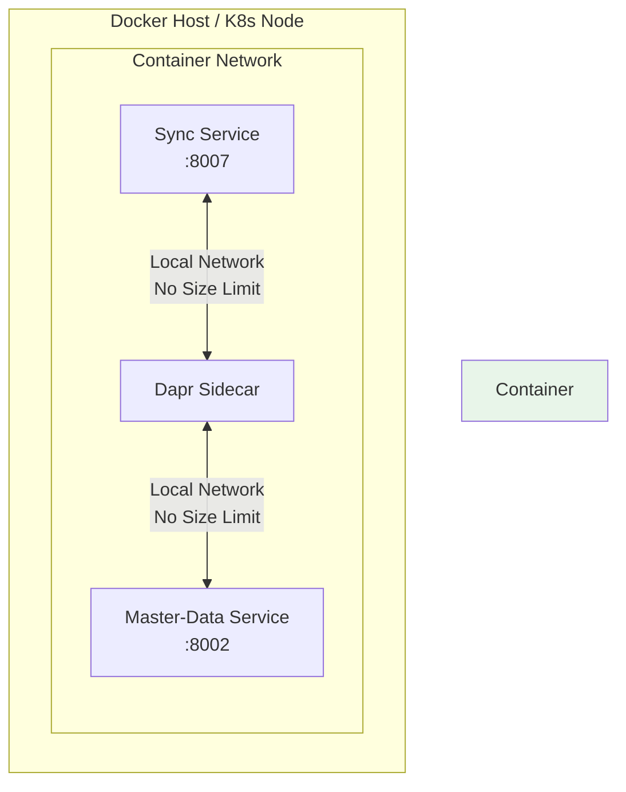
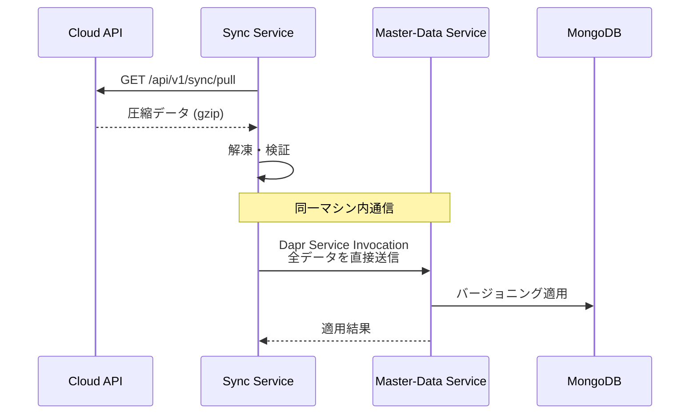

# エッジ内データ転送設計（簡潔版）

## 1. 前提条件の整理

### 同一マシン内での通信特性



**ポイント**:
- 同一ホスト内のコンテナ間通信
- ネットワーク帯域の制約なし
- Pub/SubのRedis制限も関係なし（Service Invocation使用）
- メモリ制限のみ考慮すれば良い

## 2. シンプルな実装設計

### 2.1 データフロー



### 2.2 Syncサービス実装（簡潔版）

```python
# sync/app/core/edge_sync_engine.py

from kugel_common.utils.dapr_client_helper import get_dapr_client
import gzip
import json
import httpx
from typing import Dict, Any

class EdgeSyncEngine:
    """エッジ側同期エンジン（簡潔版）"""

    def __init__(self, config):
        self.config = config
        self.cloud_api_url = config.CLOUD_SYNC_URL

    async def pull_and_apply_master_data(self) -> Dict[str, Any]:
        """
        クラウドからマスターデータを取得してMaster-Dataサービスに適用
        """
        try:
            # Step 1: クラウドAPIから圧縮データ取得
            compressed_data = await self._pull_from_cloud()

            # Step 2: 解凍と検証
            master_data = await self._decompress_and_validate(compressed_data)

            # Step 3: Master-Dataサービスへ直接転送（サイズ制限なし）
            result = await self._transfer_to_master_data(master_data)

            return result

        except Exception as e:
            logger.error(f"Master data sync failed: {e}")
            raise

    async def _pull_from_cloud(self) -> bytes:
        """
        クラウドAPIから圧縮データを取得
        """
        headers = {
            "Authorization": f"Bearer {self.edge_token}",
            "Accept-Encoding": "gzip"
        }

        request_data = {
            "edge_id": self.config.EDGE_ID,
            "data_type": "master_data",
            "last_sync_timestamp": self.last_sync_timestamp,
            "sync_type": self.sync_type  # "differential" or "bulk"
        }

        async with httpx.AsyncClient() as client:
            response = await client.post(
                f"{self.cloud_api_url}/pull",
                json=request_data,
                headers=headers,
                timeout=300.0  # 5分タイムアウト
            )

            if response.status_code != 200:
                raise Exception(f"Failed to pull data: {response.status_code}")

            return response.content  # 圧縮データ

    async def _decompress_and_validate(self, compressed_data: bytes) -> Dict[str, Any]:
        """
        データ解凍と検証
        """
        # gzip解凍
        decompressed = gzip.decompress(compressed_data)

        # JSONパース
        data = json.loads(decompressed)

        # 基本的な構造検証
        if "records" not in data:
            raise ValueError("Invalid data structure: missing 'records'")

        logger.info(f"Decompressed data: {len(decompressed)} bytes")

        return data

    async def _transfer_to_master_data(self, master_data: Dict[str, Any]) -> Dict:
        """
        Master-Dataサービスへ直接転送
        同一マシン内なのでサイズ制限を考慮する必要なし
        """
        request_data = {
            "sync_id": master_data.get("sync_id"),
            "sync_type": master_data.get("sync_type", "differential"),
            "version": master_data.get("version", 1),
            "records": master_data["records"],  # 全データをそのまま送信
            "timestamp": master_data.get("timestamp")
        }

        # Dapr Service Invocation（ローカル通信）
        async with get_dapr_client() as client:
            response = await client.invoke_method(
                app_id="master-data",
                method_name="sync/apply",
                data=json.dumps(request_data),
                http_verb="POST"
            )

            if response.status_code == 200:
                result = response.json()
                logger.info(f"Sync {request_data['sync_id']} applied successfully")
                return result
            else:
                raise Exception(f"Master-Data service returned {response.status_code}")
```

### 2.3 Master-Dataサービス実装（簡潔版）

```python
# master-data/app/api/v1/sync.py

from fastapi import APIRouter, HTTPException, Depends
from pydantic import BaseModel
from typing import Dict, List, Any
from datetime import datetime

router = APIRouter(prefix="/sync", tags=["sync"])

class SyncApplyRequest(BaseModel):
    """同期データ適用リクエスト"""
    sync_id: str
    sync_type: str  # "differential" or "bulk"
    version: int
    records: Dict[str, List[Dict[str, Any]]]  # {collection_name: [documents]}
    timestamp: datetime

@router.post("/apply")
async def apply_sync_data(
    request: SyncApplyRequest,
    db: AsyncIOMotorDatabase = Depends(get_db),
    sync_service: MasterDataSyncService = Depends(get_sync_service)
):
    """
    Syncサービスから転送されたマスターデータを適用
    同一マシン内通信なのでサイズは問題なし
    """
    try:
        # データ適用（バージョニング or 差分更新）
        result = await sync_service.apply_sync_data(
            sync_id=request.sync_id,
            sync_type=request.sync_type,
            version=request.version,
            records=request.records
        )

        return {
            "success": True,
            "sync_id": request.sync_id,
            "results": result
        }

    except Exception as e:
        logger.error(f"Failed to apply sync data: {e}")
        raise HTTPException(
            status_code=500,
            detail=f"Sync application failed: {str(e)}"
        )
```

### 2.4 DB適用処理（変更なし）

```python
# master-data/app/services/master_data_sync_service.py

class MasterDataSyncService:
    """マスターデータ同期サービス"""

    async def apply_sync_data(
        self,
        sync_id: str,
        sync_type: str,
        version: int,
        records: Dict[str, List[Dict]]
    ) -> Dict[str, Any]:
        """
        マスターデータをDBに適用
        """
        if sync_type == "bulk":
            # 一括同期：バージョニング方式
            return await self._apply_bulk_sync(records, version)
        else:
            # 差分同期：個別更新
            return await self._apply_differential_sync(records)

    async def _apply_bulk_sync(self, records: Dict, version: int) -> Dict:
        """
        24時間営業対応のバージョニング適用
        （実装は前回と同じ）
        """
        # 1. 新バージョンを非アクティブで挿入
        # 2. トランザクションで切り替え
        # 3. 旧バージョンを遅延削除
        pass
```

## 3. メモリ考慮事項

### 3.1 メモリ使用量の目安

| データ種別 | レコード数 | メモリ使用量（概算） |
|-----------|-----------|-------------------|
| 商品マスター | 10,000 | 20-30MB |
| 価格情報 | 30,000 | 15-20MB |
| スタッフ | 100 | < 1MB |
| **合計** | 40,000+ | **50-60MB** |

**結論**: 現代のコンテナ環境では問題にならないレベル

### 3.2 メモリ最適化（必要な場合のみ）

```python
# 大規模データ用のストリーミング処理（将来の拡張用）
async def apply_sync_data_streaming(self, records: Dict) -> Dict:
    """
    メモリを節約したい場合のストリーミング処理
    """
    results = {}

    # コレクションごとに順次処理
    for collection_name, items in records.items():
        # バッチ処理でメモリ使用を制限
        batch_size = 1000
        for i in range(0, len(items), batch_size):
            batch = items[i:i + batch_size]
            await self._process_batch(collection_name, batch)

            # ガベージコレクション促進
            if i % 10000 == 0:
                import gc
                gc.collect()

    return results
```

## 4. エラーハンドリング

```python
class SyncErrorHandler:
    """同期エラー処理（簡潔版）"""

    async def handle_sync_error(self, error: Exception, sync_id: str):
        """
        エラー種別に応じた処理
        """
        if isinstance(error, httpx.TimeoutException):
            # クラウドAPIタイムアウト
            logger.error(f"Cloud API timeout for sync {sync_id}")
            await self.retry_with_backoff(sync_id)

        elif isinstance(error, json.JSONDecodeError):
            # データ破損
            logger.error(f"Invalid JSON data for sync {sync_id}")
            await self.request_full_resync(sync_id)

        elif "out of memory" in str(error).lower():
            # メモリ不足（稀）
            logger.error(f"Out of memory for sync {sync_id}")
            await self.switch_to_streaming_mode(sync_id)

        else:
            # その他
            logger.error(f"Unexpected error for sync {sync_id}: {error}")
            raise
```

## 5. 設定例

```yaml
# docker-compose.yml
services:
  sync:
    image: sync:latest
    mem_limit: 512m  # 通常は256-512MBで十分
    environment:
      - DAPR_HTTP_PORT=3500
      - SYNC_MODE=edge

  master-data:
    image: master-data:latest
    mem_limit: 512m
    environment:
      - DAPR_HTTP_PORT=3501
```

```python
# sync/app/config/settings.py
class SyncSettings(BaseSettings):
    # クラウドAPI設定
    CLOUD_SYNC_URL: str
    CLOUD_API_TIMEOUT: int = 300  # 5分

    # Dapr設定
    DAPR_HTTP_PORT: int = 3500

    # メモリ設定（通常は不要）
    MAX_MEMORY_USAGE_MB: int = 400  # 警告閾値
```

## 6. パフォーマンス測定

```python
import psutil
import time

class PerformanceMonitor:
    """パフォーマンス監視"""

    async def measure_sync_performance(self, sync_func):
        """同期処理のパフォーマンス測定"""

        # 開始時の状態
        start_time = time.time()
        start_memory = psutil.Process().memory_info().rss / 1024 / 1024  # MB

        # 同期実行
        result = await sync_func()

        # 終了時の状態
        end_time = time.time()
        end_memory = psutil.Process().memory_info().rss / 1024 / 1024  # MB

        # メトリクス記録
        metrics = {
            "duration_seconds": end_time - start_time,
            "memory_used_mb": end_memory - start_memory,
            "peak_memory_mb": psutil.Process().memory_info().peak_wset / 1024 / 1024
        }

        logger.info(f"Sync performance: {metrics}")
        return result, metrics
```

## 7. まとめ

### 設計のポイント

1. **同一マシン内通信の利点を活用**
   - サイズ制限を考慮する必要なし
   - チャンク分割も不要
   - State Store経由も不要

2. **シンプルな実装**
   - Dapr Service Invocationで直接転送
   - 複雑な分割・組み立てロジック不要
   - エラーハンドリングも簡潔

3. **必要十分なメモリ**
   - 50-60MBのデータは問題なし
   - 通常のコンテナメモリ（256-512MB）で十分

4. **将来の拡張性**
   - データ量が増えた場合はストリーミング追加可能
   - 必要になってから実装すれば良い

この簡潔な設計により、開発工数を削減しながら、十分な性能と信頼性を確保できます。