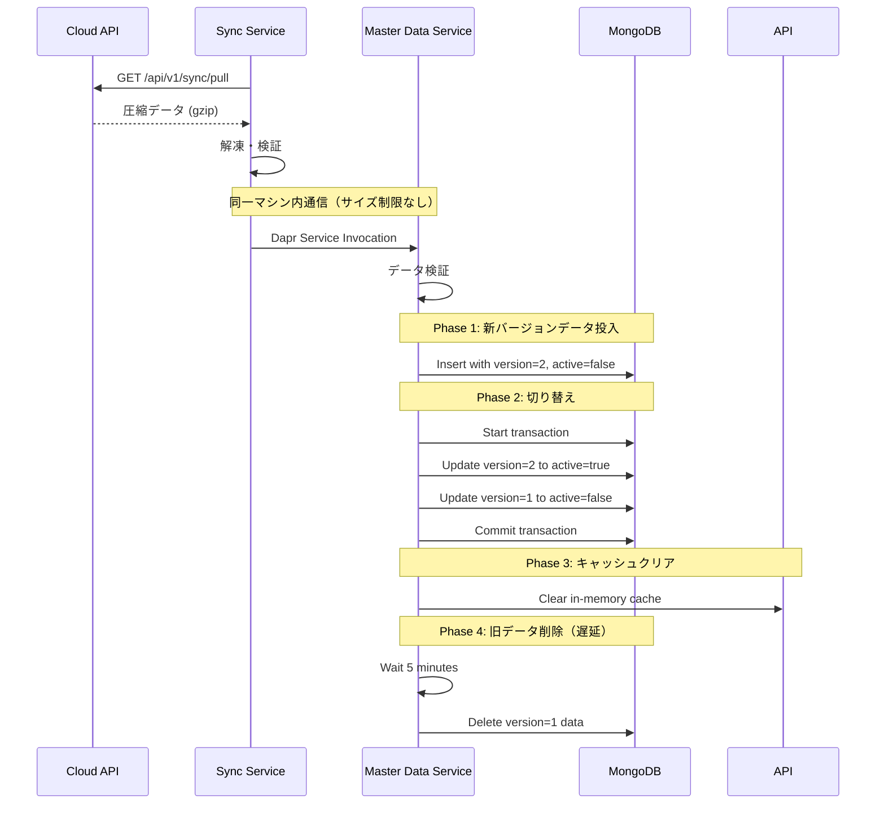
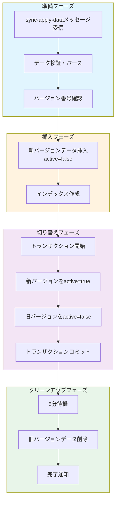

# Master Dataサービス データ反映インターフェース詳細設計

## 1. 概要

エッジ側のMaster DataサービスがSyncサービスからDapr Service Invocation経由でデータを受け取り、DBに反映する処理方法について、既存のインターフェースを活用した設計を提案します。

**重要**: エッジ内のSync-Master Data間は同一マシン内通信のため、サイズ制限を考慮する必要はありません。

## 2. 既存インターフェース分析

### 2.1 現在のMaster Dataサービス構造

```
master-data/
├── repositories/  # データアクセス層
│   ├── ItemStoreMasterRepository     # 店舗別商品
│   ├── ItemCommonMasterRepository    # 共通商品
│   ├── StaffMasterRepository         # スタッフ
│   ├── PaymentMasterRepository       # 決済方法
│   ├── TaxMasterRepository          # 税制
│   └── SettingsMasterRepository     # 設定
├── services/      # ビジネスロジック層
│   └── 各MasterService
└── api/          # APIエンドポイント層
```

### 2.2 既存の制限事項

現在のAbstractRepositoryには以下の制限があります：
- **バルク操作なし**: `insert_many`、`bulk_write`などのメソッドが未実装
- **トランザクション管理なし**: MongoDBトランザクションのサポートなし
- **単一ドキュメント操作のみ**: create、update、delete、replaceは1件ずつ

## 3. データ反映戦略

### 3.1 推奨アプローチ：バージョニング方式

24時間営業店舗のノーダウンタイム要件を満たすため、バージョニング方式を採用します。



## 4. 実装インターフェース

### 4.1 Dapr Service Invocation エンドポイント

```python
# master-data/app/api/v1/sync.py (新規作成)

from fastapi import APIRouter, HTTPException, status, Depends
from pydantic import BaseModel
from typing import List, Dict, Any
from datetime import datetime
from motor.motor_asyncio import AsyncIOMotorDatabase

router = APIRouter(prefix="/sync", tags=["sync"])

class SyncApplyRequest(BaseModel):
    """Syncサービスから受信するデータ形式"""
    sync_id: str
    sync_type: str  # "differential" | "bulk"
    version: int
    records: Dict[str, List[Dict[str, Any]]]  # コレクション別のデータ
    timestamp: datetime

@router.post("/apply")
async def apply_sync_data(
    request: SyncApplyRequest,
    db: AsyncIOMotorDatabase = Depends(get_db),
    sync_service: MasterDataSyncService = Depends(get_sync_service)
):
    """
    Syncサービスから転送されたマスターデータを適用
    同一マシン内通信なのでサイズは問題なし
    """
    try:
        # データ適用（バージョニング or 差分更新）
        result = await sync_service.apply_sync_data(
            sync_id=request.sync_id,
            sync_type=request.sync_type,
            version=request.version,
            records=request.records
        )

        logger.info(f"Sync {request.sync_id} applied successfully")

        return {
            "success": True,
            "sync_id": request.sync_id,
            "results": result
        }

    except Exception as e:
        logger.error(f"Failed to apply sync {request.sync_id}: {e}")
        raise HTTPException(
            status_code=status.HTTP_500_INTERNAL_SERVER_ERROR,
            detail=str(e)
        )
```

### 4.2 同期処理サービス層

```python
# master-data/app/services/sync_service.py (新規作成)

from typing import Dict, List, Any
from datetime import datetime
import asyncio
from motor.motor_asyncio import AsyncIOMotorDatabase

class MasterDataSyncService:
    """マスターデータ同期処理サービス"""

    def __init__(self, db: AsyncIOMotorDatabase):
        self.db = db
        self.collection_map = {
            "items_common": "item_common_master",
            "items_store": "item_store_master",
            "staff": "staff_master",
            "payments": "payment_master",
            "taxes": "tax_master",
            "settings": "settings_master"
        }

    async def apply_sync_data(
        self,
        sync_id: str,
        sync_type: str,
        records: Dict[str, List[Dict[str, Any]]],
        version: int
    ) -> Dict[str, Any]:
        """
        同期データを適用

        Args:
            sync_id: 同期処理ID
            sync_type: differential（差分）またはbulk（一括）
            records: コレクション別のレコード
            version: データバージョン
        """

        if sync_type == "bulk":
            return await self._apply_bulk_sync(records, version)
        else:
            return await self._apply_differential_sync(records, version)

    async def _apply_bulk_sync(
        self,
        records: Dict[str, List[Dict[str, Any]]],
        version: int
    ) -> Dict[str, Any]:
        """
        一括同期（バージョニング方式）
        """
        results = {}

        for data_type, items in records.items():
            collection_name = self.collection_map.get(data_type)
            if not collection_name:
                logger.warning(f"Unknown data type: {data_type}")
                continue

            try:
                # Phase 1: 新バージョンのデータを挿入（非アクティブ）
                await self._insert_versioned_data(
                    collection_name, items, version, active=False
                )

                # Phase 2: バージョン切り替え（トランザクション）
                await self._switch_version(collection_name, version)

                # Phase 3: 遅延削除をスケジュール
                asyncio.create_task(
                    self._delayed_cleanup(collection_name, version - 1, delay=300)
                )

                results[data_type] = {
                    "status": "success",
                    "count": len(items)
                }

            except Exception as e:
                logger.error(f"Failed to sync {data_type}: {e}")
                results[data_type] = {
                    "status": "failed",
                    "error": str(e)
                }

        return results

    async def _apply_differential_sync(
        self,
        records: Dict[str, List[Dict[str, Any]]],
        version: int
    ) -> Dict[str, Any]:
        """
        差分同期（個別更新）
        """
        results = {}

        for data_type, items in records.items():
            collection_name = self.collection_map.get(data_type)
            if not collection_name:
                continue

            success_count = 0
            failed_count = 0

            for item in items:
                try:
                    # updated_atで判定して更新
                    await self._upsert_item(collection_name, item)
                    success_count += 1
                except Exception as e:
                    logger.error(f"Failed to update item: {e}")
                    failed_count += 1

            results[data_type] = {
                "status": "partial" if failed_count > 0 else "success",
                "success_count": success_count,
                "failed_count": failed_count
            }

        return results

    async def _insert_versioned_data(
        self,
        collection_name: str,
        items: List[Dict[str, Any]],
        version: int,
        active: bool = False
    ):
        """
        バージョン付きデータを挿入
        """
        collection = self.db[collection_name]

        # バージョンとアクティブフラグを追加
        for item in items:
            item["_sync_version"] = version
            item["_sync_active"] = active
            item["_sync_updated_at"] = datetime.utcnow()

        # バッチ挿入（PyMongoのinsert_manyを使用）
        if items:
            await collection.insert_many(items)

    async def _switch_version(
        self,
        collection_name: str,
        new_version: int
    ):
        """
        バージョン切り替え（アトミック操作）
        """
        collection = self.db[collection_name]
        old_version = new_version - 1

        # MongoDBトランザクションを使用
        async with await self.db.client.start_session() as session:
            async with session.start_transaction():
                # 新バージョンをアクティブ化
                await collection.update_many(
                    {"_sync_version": new_version},
                    {"$set": {"_sync_active": True}},
                    session=session
                )

                # 旧バージョンを非アクティブ化
                await collection.update_many(
                    {"_sync_version": old_version},
                    {"$set": {"_sync_active": False}},
                    session=session
                )

    async def _delayed_cleanup(
        self,
        collection_name: str,
        version: int,
        delay: int = 300
    ):
        """
        旧バージョンの遅延削除
        """
        await asyncio.sleep(delay)

        collection = self.db[collection_name]
        result = await collection.delete_many({"_sync_version": version})
        logger.info(f"Cleaned up {result.deleted_count} old records from {collection_name}")

    async def _upsert_item(
        self,
        collection_name: str,
        item: Dict[str, Any]
    ):
        """
        アイテムの更新または挿入（差分同期用）
        """
        collection = self.db[collection_name]

        # プライマリキーの決定（コレクションごとに異なる）
        key_fields = self._get_key_fields(collection_name)
        filter_query = {field: item[field] for field in key_fields}

        # updated_atで新しい場合のみ更新
        filter_query["$or"] = [
            {"updated_at": {"$lt": item.get("updated_at", datetime.utcnow())}},
            {"updated_at": {"$exists": False}}
        ]

        result = await collection.replace_one(
            filter_query,
            item,
            upsert=True
        )

        return result.modified_count > 0 or result.upserted_id is not None

    def _get_key_fields(self, collection_name: str) -> List[str]:
        """
        コレクションごとのプライマリキーフィールドを取得
        """
        key_map = {
            "item_common_master": ["tenant_id", "item_code"],
            "item_store_master": ["tenant_id", "store_code", "item_code"],
            "staff_master": ["tenant_id", "staff_id"],
            "payment_master": ["tenant_id", "payment_code"],
            "tax_master": ["tenant_id", "tax_code"],
            "settings_master": ["tenant_id", "setting_key"]
        }
        return key_map.get(collection_name, ["_id"])
```

### 4.3 既存リポジトリの拡張

既存のリポジトリを拡張して、バージョン管理をサポートします：

```python
# master-data/app/models/repositories/abstract_repository.py への追加

class AbstractRepositoryWithVersioning(AbstractRepository):
    """バージョン管理対応のリポジトリ基底クラス"""

    async def get_active_items(self, filter: dict = None) -> List[Tdocument]:
        """
        アクティブバージョンのアイテムのみ取得
        """
        if filter is None:
            filter = {}

        # アクティブフィルターを追加
        filter["$or"] = [
            {"_sync_active": True},
            {"_sync_active": {"$exists": False}}  # 旧データ対応
        ]

        return await self.get_list_async(filter)

    async def bulk_insert_async(
        self,
        documents: List[Tdocument],
        version: int = None
    ) -> bool:
        """
        バルク挿入（バージョン付き）
        """
        if self.dbcollection is None:
            await self.initialize()

        try:
            docs_dict = []
            for doc in documents:
                doc_dict = doc.dict(exclude={"id"})
                if version:
                    doc_dict["_sync_version"] = version
                    doc_dict["_sync_active"] = False
                docs_dict.append(doc_dict)

            if docs_dict:
                result = await self.dbcollection.insert_many(docs_dict)
                return len(result.inserted_ids) == len(documents)
            return True

        except Exception as e:
            logger.error(f"Bulk insert failed: {e}")
            raise
```

## 5. エッジ内データフロー実装（簡潔版）

### 5.1 Syncサービス側の実装

```python
# sync/app/core/edge_sync_engine.py
from kugel_common.utils.dapr_client_helper import get_dapr_client
import gzip
import json
import httpx
from typing import Dict, Any

class EdgeSyncEngine:
    """エッジ側同期エンジン（簡潔版）"""

    def __init__(self, config):
        self.config = config
        self.cloud_api_url = config.CLOUD_SYNC_URL

    async def pull_and_apply_master_data(self) -> Dict[str, Any]:
        """
        クラウドからマスターデータを取得してMaster-Dataサービスに適用
        """
        try:
            # Step 1: クラウドAPIから圧縮データ取得
            compressed_data = await self._pull_from_cloud()

            # Step 2: 解凍と検証
            master_data = await self._decompress_and_validate(compressed_data)

            # Step 3: Master-Dataサービスへ直接転送（サイズ制限なし）
            result = await self._transfer_to_master_data(master_data)

            return result

        except Exception as e:
            logger.error(f"Master data sync failed: {e}")
            raise

    async def _transfer_to_master_data(self, master_data: Dict[str, Any]) -> Dict:
        """
        Master-Dataサービスへ直接転送
        同一マシン内なのでサイズ制限を考慮する必要なし
        """
        request_data = {
            "sync_id": master_data.get("sync_id"),
            "sync_type": master_data.get("sync_type", "differential"),
            "version": master_data.get("version", 1),
            "records": master_data["records"],  # 全データをそのまま送信
            "timestamp": master_data.get("timestamp")
        }

        # Dapr Service Invocation（ローカル通信）
        async with get_dapr_client() as client:
            response = await client.invoke_method(
                app_id="master-data",
                method_name="sync/apply",
                data=json.dumps(request_data),
                http_verb="POST"
            )

            if response.status_code == 200:
                result = response.json()
                logger.info(f"Sync {request_data['sync_id']} applied successfully")
                return result
            else:
                raise Exception(f"Master-Data service returned {response.status_code}")
```

### 5.2 一括同期（Bulk Sync）のフロー



### 5.3 差分同期（Differential Sync）のフロー

```python
# 差分同期の処理例
async def apply_differential_update(item_data: dict):
    """
    1件ずつの差分更新処理

    1. プライマリキーで既存レコードを検索
    2. updated_atタイムスタンプを比較
    3. 新しい場合のみ更新（upsert）
    4. キャッシュクリア
    """
    pass
```

## 6. メモリ考慮事項

### 6.1 メモリ使用量の目安

| データ種別 | レコード数 | メモリ使用量（概算） |
|-----------|-----------|-------------------|
| 商品マスター | 10,000 | 20-30MB |
| 価格情報 | 30,000 | 15-20MB |
| スタッフ | 100 | < 1MB |
| **合計** | 40,000+ | **50-60MB** |

**結論**: 現代のコンテナ環境では問題にならないレベル

## 7. エラーハンドリング

### 7.1 エラー種別と対処

| エラー種別 | 対処方法 | リトライ |
|-----------|---------|----------|
| データ検証エラー | エラーログ記録、該当データスキップ | なし |
| DB接続エラー | サーキットブレーカー発動 | あり（指数バックオフ） |
| トランザクション失敗 | ロールバック、全体を再試行 | あり（3回まで） |
| タイムアウト | 部分成功として記録 | なし |

### 7.2 リカバリ処理

```python
class SyncRecoveryHandler:
    """同期失敗時のリカバリハンドラ"""

    async def handle_partial_failure(
        self,
        sync_id: str,
        failed_items: List[Dict],
        error_type: str
    ):
        """
        部分的な失敗の処理

        1. 失敗アイテムをリカバリキューに保存
        2. Syncサービスに失敗を通知
        3. 次回同期で再試行
        """
        # 実装詳細
        pass
```

## 8. パフォーマンス最適化

### 8.1 バッチ処理の最適化

```python
# 大量データの効率的な処理
BATCH_SIZE = 1000  # 1バッチあたりのレコード数

async def batch_insert_with_progress(items: List[dict], collection_name: str):
    """
    プログレス付きバッチ挿入
    """
    total = len(items)
    inserted = 0

    for i in range(0, total, BATCH_SIZE):
        batch = items[i:i + BATCH_SIZE]
        await collection.insert_many(batch)
        inserted += len(batch)

        # プログレス通知
        progress = (inserted / total) * 100
        logger.info(f"Progress: {progress:.1f}% ({inserted}/{total})")
```

### 8.2 インデックス管理

```python
async def ensure_sync_indexes(collection_name: str):
    """
    同期用インデックスの作成
    """
    collection = db[collection_name]

    # バージョン管理用インデックス
    await collection.create_index([
        ("_sync_version", 1),
        ("_sync_active", 1)
    ])

    # 既存のビジネスインデックス
    await collection.create_index([
        ("tenant_id", 1),
        ("updated_at", -1)
    ])
```

## 9. 監視とログ

### 9.1 メトリクス収集

```python
class SyncMetrics:
    """同期メトリクス"""

    - sync_duration_seconds     # 同期処理時間
    - records_processed_total   # 処理レコード数
    - sync_failures_total       # 失敗回数
    - version_switch_duration   # バージョン切替時間
```

### 9.2 ログ出力

```python
# 構造化ログの例
logger.info("Sync completed", extra={
    "sync_id": sync_id,
    "data_type": "master_data",
    "records_count": 1500,
    "duration_ms": 2500,
    "version": 2,
    "status": "success"
})
```

## 10. テスト戦略

### 10.1 単体テスト

```python
@pytest.mark.asyncio
async def test_direct_transfer():
    """直接転送のテスト（同一マシン内）"""
    # 1. SyncサービスからMaster-Dataへの直接転送
    # 2. サイズ制限なしで大量データ送信
    # 3. バージョン切り替え実行
    # 4. アクティブデータが新バージョンであることを確認
    pass
```

### 10.2 統合テスト

```python
@pytest.mark.asyncio
async def test_end_to_end_sync():
    """エンドツーエンド同期テスト"""
    # 1. クラウドAPIからデータ取得
    # 2. Syncサービス経由でMaster-Dataへ転送
    # 3. DBへの適用確認
    # 4. APIから新データが取得できることを確認
    pass
```

## 11. 実装の段階的アプローチ

### Phase 1: 基本機能（簡潔版）
- Dapr Service Invocationでの直接転送
- 差分同期の基本実装
- エラーハンドリング

### Phase 2: 一括同期
- バージョニング機能実装
- トランザクション管理
- 遅延削除機能

### Phase 3: 最適化（必要時）
- メモリ使用量が問題になった場合のみ
- ストリーミング処理の追加
- バッチ処理の並列化

## 12. まとめ

### 設計のポイント

1. **同一マシン内通信の利点を活用**
   - サイズ制限を考慮する必要なし
   - チャンク分割も不要
   - GridFS/State Store経由も不要

2. **シンプルな実装**
   - Dapr Service Invocationで直接転送
   - 複雑な分割・組み立てロジック不要
   - エラーハンドリングも簡潔

3. **必要十分なメモリ**
   - 50-60MBのデータは問題なし
   - 通常のコンテナメモリ（256-512MB）で十分

4. **24時間営業対応**
   - バージョニング方式によるノーダウンタイム更新
   - MongoDBトランザクションで瞬時切り替え

この簡潔な設計により、開発工数を削減しながら、十分な性能と信頼性を確保できます。