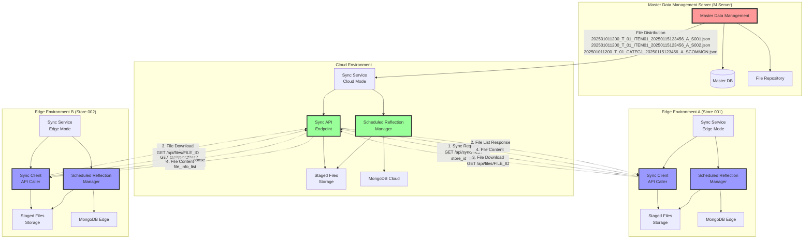
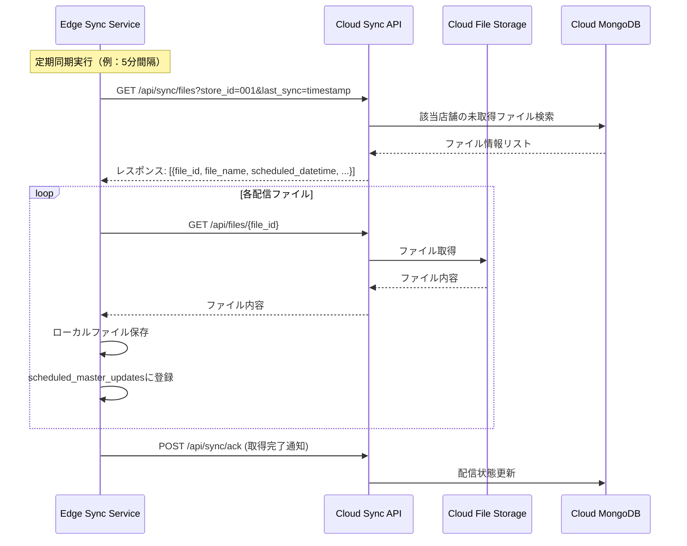

# マスタデータ予約反映システム 実装プラン

## 1. システム概要

マスタデータ管理サーバ（Mサーバ）から店舗単位で配信されるマスタファイルを事前受信し、ファイル名に含まれる反映日時に自動更新を実行する機能を実装する。全店共通マスタ（店舗ID=COMMON）は全店舗に配信される。

### 1.1 システム構成の拡張



## 2. ファイル命名規則（Mサーバ仕様）

### 2.1 ファイル名構成

```
[マスタ反映日時]_[更新タイミング]_[反映優先順位]_[ファイルID]_[マスタ作成日時]_[更新区分]_S[店舗ID].json

店舗固有マスタ例：202501011200_T_01_ITEM01_20250115123456_A_S001.json
全店共通マスタ例：202501011200_T_01_CATEG1_20250115123456_A_SCOMMON.json
```

### 2.2 各項目の詳細

| 項目名 | 内容 | 桁数 | フォーマット | 例 |
|--------|------|------|-------------|-----|
| マスタ反映日時 | マスタが反映される日付・時刻 | 12 | YYYYMMDDHHMM | 202501011200 |
| 更新タイミング | マスタ反映のタイミング種別 | 1 | S/T | T |
| 反映優先順位 | 同一日時反映時の優先順位 | 2 | 数値 | 01 |
| ファイルID | マスタレイアウトの識別子 | 6 | 英数字 | ITEM01 |
| マスタ作成日時 | マスタが作成された日時 | 14 | YYYYMMDDHHMMSS | 20250115123456 |
| 更新区分 | 更新処理の種別 | 1 | A/M | A |
| 店舗ID | 対象店舗の識別子 | 6 | 数値/COMMON | 001/COMMON |

### 2.3 店舗ID定義

- **001-999**: 店舗固有マスタ（該当店舗のみに配信）
- **COMMON**: 全店共通マスタ（全店舗に配信）

## 3. データベース設計

### 3.1 予約反映管理テーブル（`scheduled_master_updates`）

````python
class ScheduledMasterUpdateDocument(AbstractDocument):
    """予約反映管理ドキュメント"""
    
    tenant_id: str
    store_id: str                     # 店舗ID（ファイル名から抽出、COMMONも含む）
    file_name: str                    # 受信ファイル名（完全なファイル名）
    
    # ファイル名から解析される項目
    scheduled_datetime: datetime      # マスタ反映日時（YYYYMMDDHHMM）
    update_timing: str               # 更新タイミング（S/T）
    priority: int                    # 反映優先順位（01-99）
    file_id: str                     # ファイルID（6桁英数字）
    created_datetime: datetime       # マスタ作成日時（YYYYMMDDHHMMSS）
    update_type: str                 # 更新区分（A/M）
    
    # システム管理項目
    status: str                      # pending/processing/completed/failed/cancelled
    file_path: str                   # ステージングファイルパス
    file_hash: str                   # ファイル整合性チェック用
    received_at: datetime            # ファイル受信日時
    processed_at: Optional[datetime] # 処理完了日時
    error_message: Optional[str]     # エラーメッセージ
    retry_count: int                 # リトライ回数
    
    # 配信対象
    is_common_master: bool           # True: 全店共通, False: 店舗固有
    target_store_id: Optional[str]   # 実際の配信対象店舗ID（Edge環境での実行時店舗ID）
    
    class Config:
        collection = "scheduled_master_updates"
        indexes = [
            {"keys": [("tenant_id", 1), ("store_id", 1), ("scheduled_datetime", 1)]},
            {"keys": [("tenant_id", 1), ("target_store_id", 1), ("scheduled_datetime", 1)]},
            {"keys": [("status", 1), ("scheduled_datetime", 1)]},
            {"keys": [("file_id", 1), ("scheduled_datetime", 1)]},
            {"keys": [("priority", 1)]},
            {"keys": [("is_common_master", 1)]},
        ]
````

### 3.2 配信ロジック仕様

#### 3.2.1 Cloud環境での配信処理

1. **受信**: Mサーバからファイルを受信
2. **解析**: ファイル名から店舗IDを抽出
3. **保存**: Staged Files Storageに保存
4. **登録**: scheduled_master_updatesテーブルに登録

#### 3.2.2 Edge-Cloud間同期フロー



## 4. API仕様

### 4.1 同期ファイル一覧取得API

```
GET /api/sync/files?store_id={store_id}&last_sync={timestamp}
```

**パラメータ:**
- `store_id`: 店舗ID
- `last_sync`: 最後の同期タイムスタンプ（オプション）

**レスポンス:**
```json
{
  "files": [
    {
      "file_id": "uuid-string",
      "file_name": "202501011200_T_01_ITEM01_20250115123456_A_S001.json",
      "scheduled_datetime": "2025-01-01T12:00:00Z",
      "update_timing": "T",
      "priority": 1,
      "file_id_code": "ITEM01",
      "created_datetime": "2025-01-15T12:34:56Z",
      "update_type": "A",
      "store_id": "001",
      "file_hash": "sha256-hash",
      "file_size": 1024
    }
  ],
  "total_count": 1,
  "sync_timestamp": "2025-01-15T15:30:00Z"
}
```

### 4.2 ファイル取得API

```
GET /api/files/{file_id}
```

**レスポンス:**
- Content-Type: application/json
- ファイル内容（バイナリ）

### 4.3 取得完了通知API

```
POST /api/sync/ack
```

**リクエストボディ:**
```json
{
  "store_id": "001",
  "downloaded_files": [
    {
      "file_id": "uuid-string",
      "download_timestamp": "2025-01-15T15:35:00Z",
      "file_hash": "sha256-hash"
    }
  ]
}
```

## 5. Edge環境でのスケジュール実行仕様

### 5.1 同期処理スケジュール

- **同期間隔**: 5分間隔
- **リトライ**: 3回まで（指数バックオフ）
- **タイムアウト**: 30秒

### 5.2 反映処理スケジュール

- **チェック間隔**: 1分間隔
- **実行条件**: `scheduled_datetime <= 現在時刻 AND status = 'pending'`
- **優先順位**: `priority`昇順で実行