# アプリケーションバージョン管理システム - アーキテクチャ解説書

## 1. システム全体構成

### 1.1 システム概要

Kugelpos POSシステムにおけるアプリケーションバージョン管理システムは、クラウド環境からエッジ端末およびPOS端末へのアプリケーション更新を安全かつ効率的に配信する中核的なシステムです。Azure Container Registry (ACR)とAzure Blob Storageを活用し、Manifestベースのバージョン管理により、コンテナイメージとスクリプトファイルの自動更新を実現します。

### 1.2 全体アーキテクチャ図

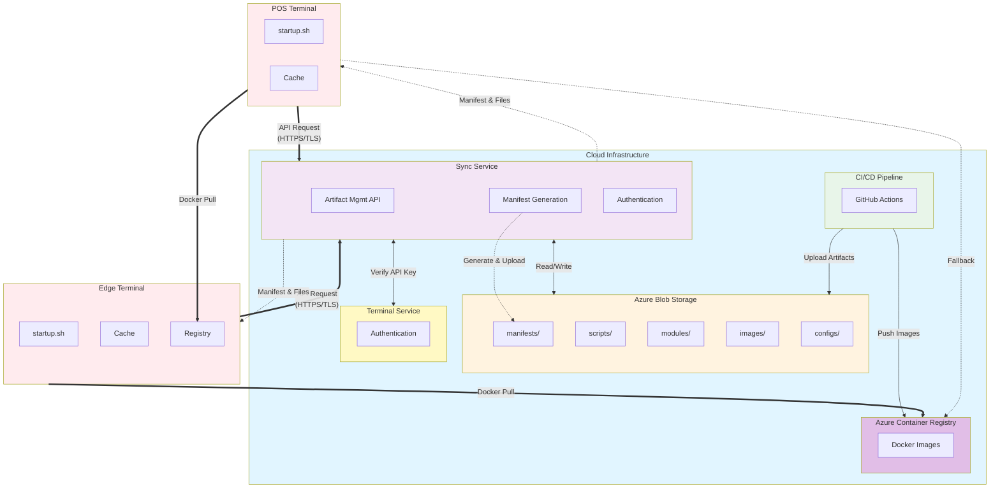

### 1.3 システムの特徴

- **Manifest駆動**: すべての更新はManifestファイルによって管理
- **差分更新**: チェックサムベースの差分検出により効率的な更新
- **自動ロールバック**: ヘルスチェック失敗時の自動復旧
- **自己更新**: スクリプト自身の自動更新機能
- **階層型配布**: Edge Registry経由のPOS端末への高速配布
- **オフライン対応**: ローカルキャッシュによる業務継続性

---

## 2. コンポーネントアーキテクチャ

### 2.1 主要コンポーネント

#### クラウド側

| コンポーネント | 役割 | 技術スタック |
|--------------|------|------------|
| **Azure Container Registry** | 全バージョンのコンテナイメージを集中管理 | ACR Premium (Geo-replication) |
| **Azure Blob Storage** | スクリプト、設定、画像ファイル等の配布物を集中管理 | Azure Blob Storage (Premium) |
| **Sync Service** | バージョン管理API、更新制御、ファイルダウンロードプロキシ | FastAPI, MongoDB |
| **Terminal Service** | POS端末認証、端末情報管理 | FastAPI, MongoDB |
| **Admin Console** | バージョン設定UI | React/Vue.js (想定) |
| **MongoDB** | バージョン設定、更新履歴保存 | MongoDB 7.0 |

#### エッジ側

| コンポーネント | 役割 | 技術スタック |
|--------------|------|------------|
| **Edge Registry** | イメージのローカルキャッシュ | Harbor/Docker Registry/Nexus |
| **edge-startup.sh** | 起動時更新チェック、自動更新 | Bash Script, systemd |
| **Edge Services** | エッジ端末で動作するサービス群 | Docker Compose |
| **Local Cache** | Manifest、Artifactキャッシュ | ファイルシステム |

#### POS端末側

| コンポーネント | 役割 | 技術スタック |
|--------------|------|------------|
| **pos-startup.sh** | 起動時更新チェック、自動更新 | Bash Script, systemd |
| **POS Services** | ローカル動作するサービス群 | Docker/Docker Compose |
| **POS Application** | POSフロントエンドアプリ | - |
| **Local Cache** | Manifest、Artifactキャッシュ | ファイルシステム |

### 2.2 コンポーネント関連図

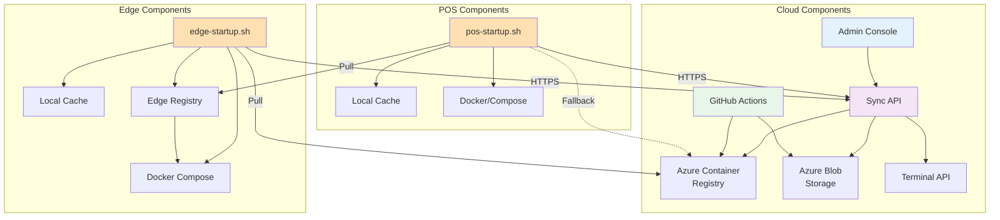

---

## 3. デプロイメントアーキテクチャ

### 3.1 環境別デプロイメント構成

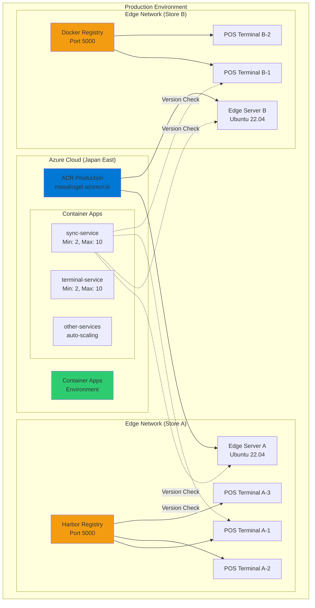

### 3.2 Azure Container Apps 構成

#### Sync Service

```yaml
resource syncService 'Microsoft.App/containerApps@2023-05-01' = {
  name: 'sync-service'
  location: 'japaneast'
  properties:
    managedEnvironmentId: containerAppEnv.id
    configuration:
      ingress:
        external: true
        targetPort: 8007
        transport: 'http'
      secrets: [
        {
          name: 'mongodb-connection'
          value: mongodbConnectionString
        }
      ]
      registries: [
        {
          server: 'masakugel.azurecr.io'
          username: acrUsername
          passwordSecretRef: 'acr-password'
        }
      ]
    template:
      containers: [
        {
          name: 'sync'
          image: 'masakugel.azurecr.io/production/services/sync:v1.2.3'
          resources:
            cpu: 0.5
            memory: '1Gi'
          env: [
            {
              name: 'SYNC_MODE'
              value: 'cloud'
            }
          ]
          probes: [
            {
              type: 'liveness'
              httpGet:
                path: '/health'
                port: 8007
              initialDelaySeconds: 30
              periodSeconds: 10
            }
          ]
        }
      ]
      scale:
        minReplicas: 2
        maxReplicas: 10
        rules: [
          {
            name: 'http-rule'
            http:
              metadata:
                concurrentRequests: '100'
          }
        ]
    }
}
```

### 3.3 エッジ端末 Docker Compose 構成

```yaml
version: '3.8'

services:
  # エッジレジストリ (Harbor)
  harbor-registry:
    image: goharbor/harbor-core:v2.9.0
    container_name: edge-registry
    ports:
      - "5000:5000"
    volumes:
      - ./harbor/data:/data
      - ./harbor/config:/etc/harbor
    restart: always
    networks:
      - kugelpos-edge

  # Sync Service (エッジモード)
  sync:
    image: masakugel.azurecr.io/production/services/sync:${SYNC_VERSION:-v1.2.3}
    container_name: sync-service
    environment:
      - SYNC_MODE=edge
      - EDGE_ID=${EDGE_ID}
      - CLOUD_SYNC_URL=${CLOUD_SYNC_URL}
    depends_on:
      - mongodb
      - redis
    ports:
      - "8007:8007"
    restart: always
    networks:
      - kugelpos-edge

  # その他のサービス
  account:
    image: masakugel.azurecr.io/production/services/account:${ACCOUNT_VERSION:-v1.2.3}
    container_name: account-service

  terminal:
    image: masakugel.azurecr.io/production/services/terminal:${TERMINAL_VERSION:-v1.2.3}
    container_name: terminal-service

  # インフラストラクチャ
  mongodb:
    image: mongo:7.0
    container_name: mongodb-edge
    volumes:
      - mongodb_data:/data/db
    command: mongod --replSet rs0
    restart: always
    networks:
      - kugelpos-edge

  redis:
    image: redis:7.4
    container_name: redis-edge
    restart: always
    networks:
      - kugelpos-edge

networks:
  kugelpos-edge:
    driver: bridge

volumes:
  mongodb_data:
  harbor_data:
```

### 3.4 POS端末 Docker Compose 構成

```yaml
version: '3.8'

services:
  # 必要最小限のサービス
  cart:
    image: ${EDGE_REGISTRY:-edge-local:5000}/cart:${CART_VERSION:-v1.2.3}
    container_name: pos-cart
    environment:
      - POS_MODE=local
      - TERMINAL_ID=${TERMINAL_ID}
    network_mode: host
    restart: always

  terminal:
    image: ${EDGE_REGISTRY:-edge-local:5000}/terminal:${TERMINAL_VERSION:-v1.2.3}
    container_name: pos-terminal
    environment:
      - POS_MODE=local
      - TERMINAL_ID=${TERMINAL_ID}
    network_mode: host
    restart: always

  # ローカルRedis
  redis-local:
    image: redis:7.4-alpine
    container_name: pos-redis
    command: redis-server --maxmemory 256mb --maxmemory-policy allkeys-lru
    network_mode: host
    restart: always

  # ローカルMongoDB
  mongodb-local:
    image: mongo:7.0
    container_name: pos-mongodb
    volumes:
      - mongodb_data:/data/db
    network_mode: host
    restart: always

volumes:
  mongodb_data:
```

---

## 4. データフロー

### 4.1 イメージ配布フロー

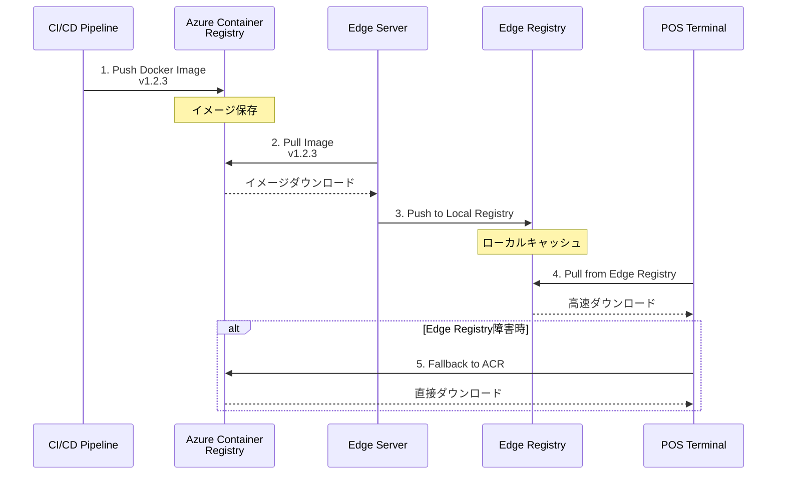

### 4.2 ファイル配布フロー

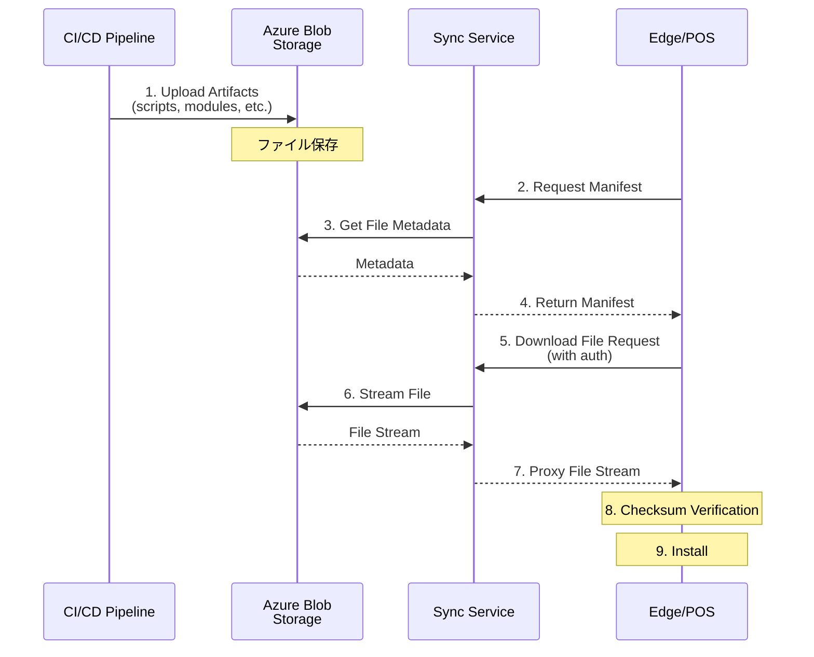

### 4.3 バージョン管理フロー

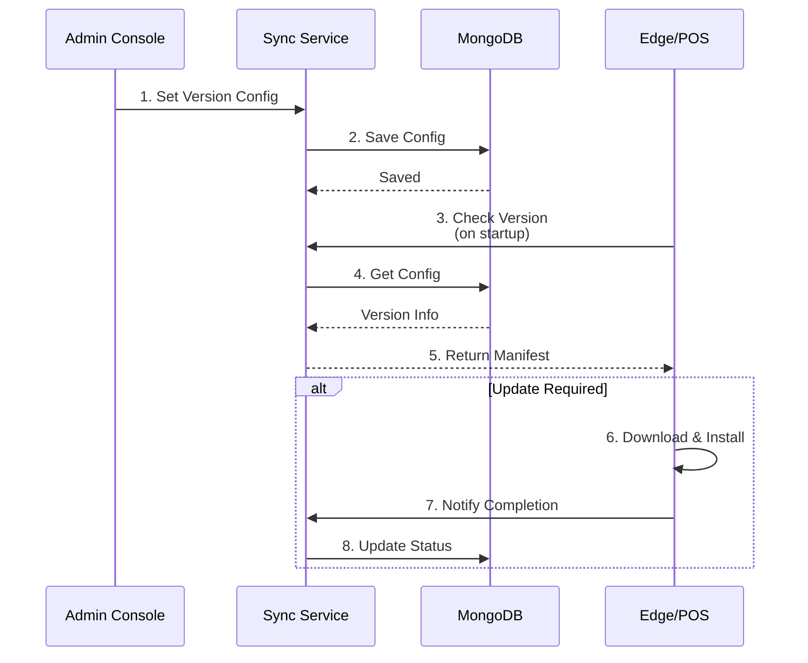

---

## 5. シーケンス図

### 5.1 エッジ端末の起動・更新シーケンス

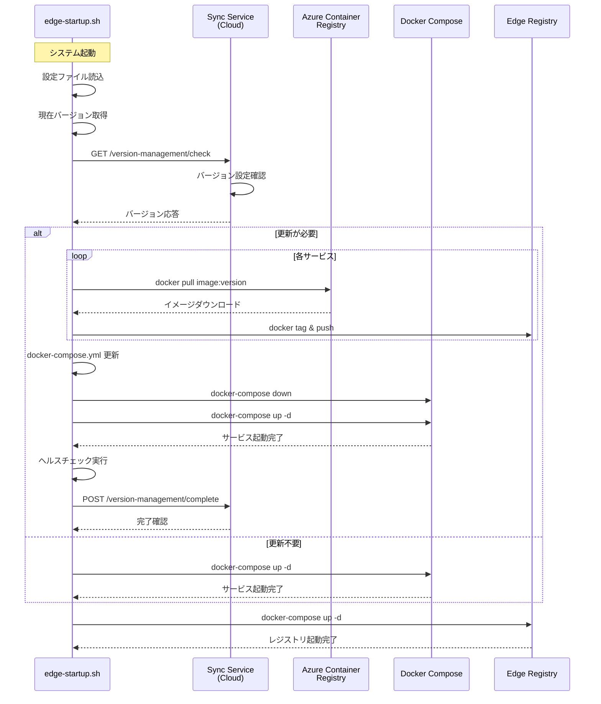

### 5.2 POS端末の起動・更新シーケンス（認証付き）

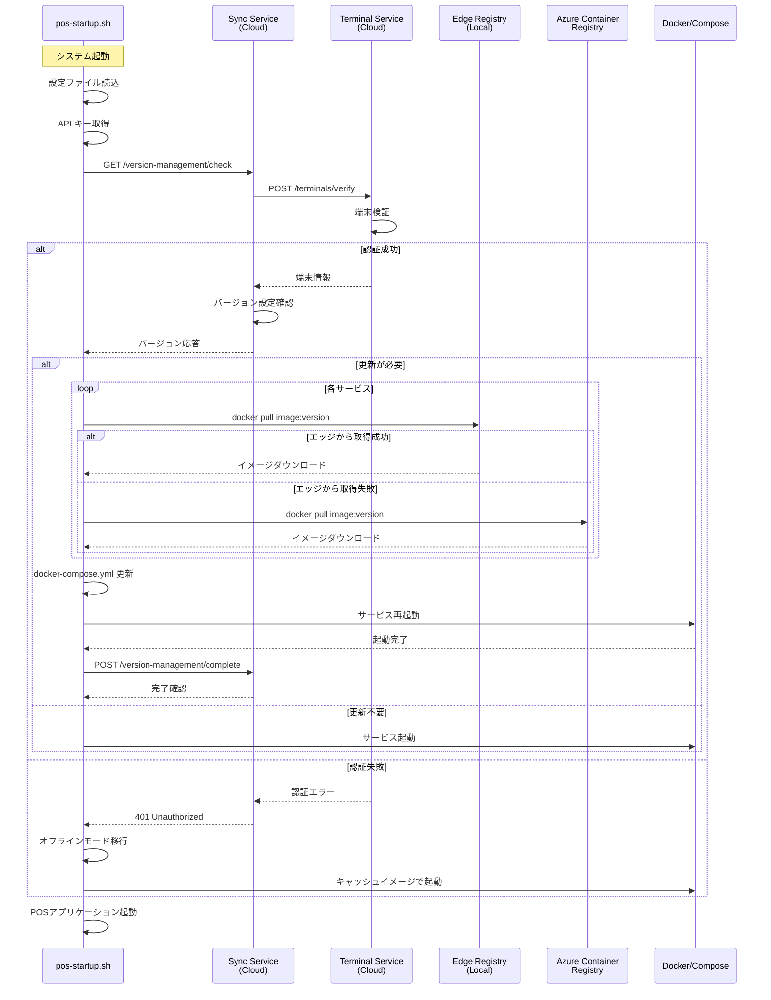

### 5.3 ロールバックシーケンス

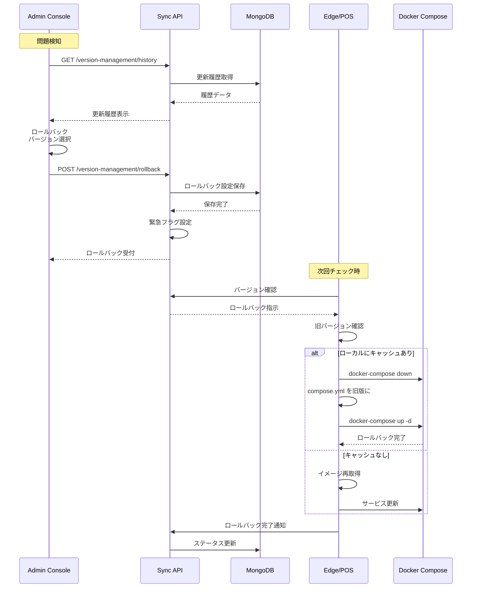

---

## 6. ネットワークアーキテクチャ

### 6.1 ネットワークセグメント

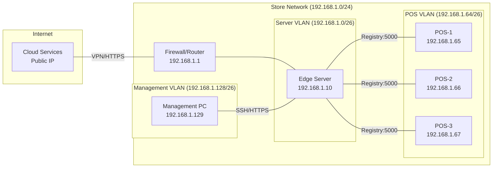

### 6.2 ポート設定

| サービス | ポート | プロトコル | 用途 | アクセス元 |
|---------|-------|-----------|-----|-----------|
| Edge Registry | 5000 | TCP/HTTPS | イメージ配布 | POS端末 |
| Sync Service (Cloud) | 8007 | TCP/HTTPS | バージョン管理API | Edge/POS |
| Sync Service (Edge) | 8007 | TCP/HTTPS | ローカルAPI | POS端末 |
| MongoDB | 27017 | TCP | データベース | 内部のみ |
| Redis | 6379 | TCP | キャッシュ | 内部のみ |
| SSH | 22 | TCP | 管理アクセス | 管理PC |
| HTTPS | 443 | TCP | Web管理画面 | 管理PC |

### 6.3 ファイアウォールルール

#### Edge Server (Inbound)

| 送信元 | ポート | プロトコル | 許可/拒否 | 用途 |
|-------|-------|-----------|---------|------|
| Internet (Cloud) | 443 | HTTPS | 許可 | Sync API |
| POS VLAN | 5000 | HTTPS | 許可 | Registry |
| Management VLAN | 22 | SSH | 許可 | 管理 |
| その他 | * | * | 拒否 | - |

#### Edge Server (Outbound)

| 宛先 | ポート | プロトコル | 許可/拒否 | 用途 |
|-----|-------|-----------|---------|------|
| Cloud (Sync API) | 443 | HTTPS | 許可 | バージョン確認 |
| ACR | 443 | HTTPS | 許可 | イメージpull |
| Blob Storage | 443 | HTTPS | 許可 | ファイルダウンロード |
| その他 | * | * | 拒否 | - |

---

## 7. データストア設計

### 7.1 Azure Blob Storage 構造

```
kugelpos-artifacts/
│
├── manifests/                      # Manifestファイル
│   ├── {tenant_id}/
│   │   └── {store_code}/
│   │       ├── edge/
│   │       │   ├── edge-001/
│   │       │   │   ├── manifest-v1.2.3.json
│   │       │   │   ├── manifest-v1.2.2.json
│   │       │   │   └── manifest-latest.json
│   │       │   └── default/
│   │       │       └── manifest-latest.json
│   │       └── pos/
│   │           ├── pos-001/
│   │           │   └── manifest-v1.2.3.json
│   │           └── default/
│   │               └── manifest-latest.json
│
├── scripts/                        # スクリプトファイル
│   ├── edge-startup.sh/
│   │   ├── v1.2.3/
│   │   │   ├── edge-startup.sh
│   │   │   └── checksums.txt
│   │   └── v1.2.2/
│   │       └── edge-startup.sh
│   └── pos-startup.sh/
│       └── v1.2.3/
│           ├── pos-startup.sh
│           └── checksums.txt
│
├── modules/                        # プログラムモジュール
│   ├── python/
│   │   ├── kugelpos_common-1.2.3-py3-none-any.whl
│   │   └── checksums.txt
│   └── system/
│       └── kugelpos-scripts_1.2.3_amd64.deb
│
├── images/                         # 画像ファイル
│   ├── logos/
│   │   ├── company-logo-v2.png
│   │   └── checksums.txt
│   └── backgrounds/
│       └── pos-background-v1.jpg
│
└── docs/                           # ドキュメント
    └── user-manuals/
        └── pos-manual-ja-v1.2.pdf
```

### 7.2 MongoDB スキーマ

#### Manifest設定コレクション

```javascript
{
  _id: ObjectId("..."),
  tenant_id: "tenant-001",
  store_code: "store-tokyo-001",
  device_type: "edge",  // "edge" or "pos"
  device_id: "edge-001",
  target_version: "v1.2.3",

  // 設定
  config: {
    auto_update: true,
    update_window: "02:00-05:00",
    force_update: false,
    max_retries: 3
  },

  // 現在のステータス
  status: {
    current_version: "v1.2.2",
    last_check: ISODate("2025-01-16T10:00:00Z"),
    last_update: ISODate("2025-01-16T09:30:00Z"),
    update_status: "success",  // "success", "failed", "in_progress"
    error_message: null
  },

  // 監査ログ
  created_at: ISODate("2025-01-15T00:00:00Z"),
  updated_at: ISODate("2025-01-16T10:00:00Z"),
  created_by: "admin@example.com",
  updated_by: "admin@example.com"
}
```

#### 更新履歴コレクション

```javascript
{
  _id: ObjectId("..."),
  tenant_id: "tenant-001",
  store_code: "store-tokyo-001",
  device_type: "edge",
  device_id: "edge-001",

  // 更新内容
  from_version: "v1.2.2",
  to_version: "v1.2.3",
  update_type: "upgrade",  // "upgrade", "downgrade", "rollback"

  // 結果
  status: "success",  // "success", "failed", "rollback"
  error_message: null,

  // 詳細
  artifacts_updated: [
    {
      name: "edge-startup.sh",
      type: "script",
      version: "v1.2.3",
      status: "success"
    }
  ],
  images_updated: [
    {
      service: "cart",
      version: "v1.2.3",
      status: "success"
    }
  ],

  // タイムスタンプ
  started_at: ISODate("2025-01-16T10:00:00Z"),
  completed_at: ISODate("2025-01-16T10:05:00Z"),
  duration_seconds: 300
}
```

---

## 8. インタフェース仕様

### 8.1 REST API エンドポイント

#### Sync Service API

| エンドポイント | メソッド | 説明 | 認証 |
|-------------|--------|------|------|
| `/api/v1/artifact-management/check` | POST | バージョン確認 | API Key (POS) / Device ID (Edge) |
| `/api/v1/artifact-management/download` | POST | ファイルダウンロード | API Key (POS) / Device ID (Edge) |
| `/api/v1/artifact-management/complete` | POST | 更新完了通知 | API Key (POS) / Device ID (Edge) |
| `/api/v1/artifact-management/rollback` | POST | ロールバック指示 | Admin Token |
| `/api/v1/admin/manifests` | GET | Manifest一覧取得 | Admin Token |
| `/api/v1/admin/manifests` | POST | Manifest登録 | Admin Token |
| `/api/v1/admin/manifests/generate` | POST | Manifest生成 | Admin Token |

#### Terminal Service API

| エンドポイント | メソッド | 説明 | 認証 |
|-------------|--------|------|------|
| `/api/v1/terminals/verify` | POST | 端末検証 | Service Token |

### 8.2 イベント通知

#### WebSocket (Admin Console用)

```javascript
// 接続
ws://sync.kugelpos.cloud/ws/updates

// メッセージフォーマット
{
  event_type: "update_completed",
  device_id: "edge-001",
  device_type: "edge",
  version: "v1.2.3",
  status: "success",
  timestamp: "2025-01-16T10:05:00Z"
}
```

---

## 9. セキュリティアーキテクチャ

### 9.1 認証フロー

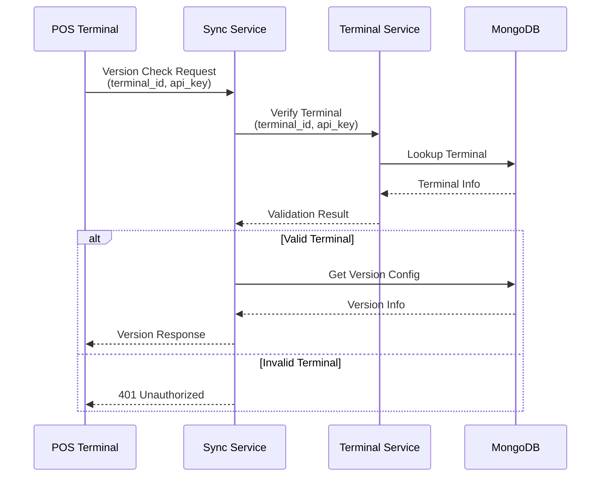

### 9.2 セキュリティ対策

| レイヤー | 対策 | 実装 |
|---------|-----|------|
| **通信** | TLS暗号化 | HTTPS/TLS 1.2以上 |
| **認証** | APIキー認証 | Bearer Token |
| **認可** | RBAC | Role-Based Access Control |
| **改ざん検出** | チェックサム | SHA256 |
| **ログ記録** | 監査ログ | すべてのアクセスを記録 |
| **レート制限** | DDoS対策 | 100リクエスト/分/デバイス |

---

## 10. 高可用性設計

### 10.1 冗長性

```mermaid
graph TB
    subgraph "Azure Region: Japan East"
        ACR_EAST[ACR<br/>Japan East]
        SYNC_EAST[Sync Service<br/>Replica 1-5]
        DB_EAST[MongoDB<br/>Primary]
    end

    subgraph "Azure Region: Japan West"
        ACR_WEST[ACR<br/>Japan West<br/>(Geo-replica)]
        DB_WEST[MongoDB<br/>Secondary]
    end

    subgraph "Edge Terminal"
        EDGE[Edge Server]
        CACHE[Local Cache]
    end

    ACR_EAST -.->|Geo-replication| ACR_WEST
    DB_EAST -.->|Replication| DB_WEST

    EDGE -->|Primary| SYNC_EAST
    EDGE -.->|Failover| ACR_WEST
    EDGE -->|Offline| CACHE

    style ACR_EAST fill:#0078d4
    style ACR_WEST fill:#0078d4,stroke-dasharray: 5 5
    style CACHE fill:#f39c12
```

### 10.2 障害シナリオと対応

| 障害箇所 | 影響 | 対応 | RTO/RPO |
|---------|-----|-----|---------|
| ACR障害 | 新規イメージ取得不可 | エッジキャッシュで継続運用 | RTO: 0分 |
| Sync API障害 | バージョン確認不可 | ローカルキャッシュで起動継続 | RTO: 0分 |
| エッジレジストリ障害 | POS高速配布不可 | ACR直接アクセスにフォールバック | RTO: 1分 |
| ネットワーク断 | 更新不可 | オフラインモードで運用継続 | RTO: 0分 |
| MongoDB障害 | 設定変更不可 | セカンダリへ自動フェイルオーバー | RTO: 30秒 |

### 10.3 バックアップ戦略

| 対象 | 頻度 | 保持期間 | 保存先 | 復旧方法 |
|-----|-----|---------|-------|---------|
| バージョン設定 | 変更時即座 | 1年 | Azure Blob Storage | API経由で復元 |
| docker-compose.yml | 更新前 | 1世代 | ローカル | ファイルコピー |
| startup.sh | 更新前 | 1世代 | ローカル | ファイルコピー |
| MongoDB | 日次 | 30日 | Azure Backup | Point-in-time復元 |
| ログファイル | 日次 | 90日 | Azure Log Analytics | クエリで参照 |

---

## 11. スケーラビリティ設計

### 11.1 想定規模

| 項目 | 初期 | 1年後 | 3年後 |
|-----|------|-------|-------|
| エッジ端末数 | 100台 | 500台 | 1,000台 |
| POS端末数/エッジ | 5台 | 10台 | 20台 |
| 総POS端末数 | 500台 | 5,000台 | 20,000台 |
| イメージサイズ | 100MB/サービス | 150MB/サービス | 200MB/サービス |
| 更新頻度 | 月2回 | 月4回 | 週1回 |

### 11.2 スケーリング戦略

#### 水平スケーリング

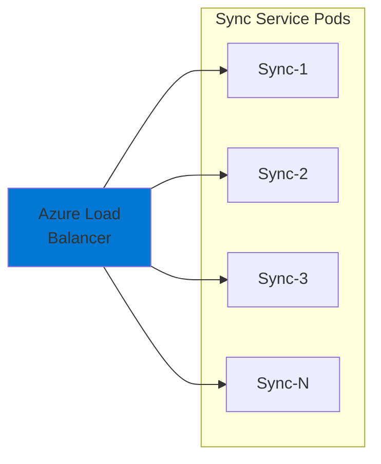

- Kubernetes HPA でCPU使用率70%を閾値に自動スケール
- 最小レプリカ数: 2
- 最大レプリカ数: 10

#### 多段階キャッシュ

```
Cloud (ACR/Blob)
  ↓
Edge Registry (Harbor)
  ↓
POS Local Cache
```

- Edge Registryで帯域使用量を80%削減
- POS Local Cacheでオフライン対応

### 11.3 負荷分散

- **時間帯分散**: 更新時間帯を店舗グループごとに分散（02:00-05:00を3つの時間帯に分割）
- **段階展開**: 10店舗 → 50店舗 → 全店舗の順で段階的に展開
- **レート制限**: デバイスあたり100リクエスト/分

---

## 12. 監視とログ

### 12.1 監視項目

| 項目 | メトリクス | 閾値 | アラート |
|-----|----------|------|---------|
| Sync Service CPU | 使用率 | 80% | Warning |
| Sync Service メモリ | 使用率 | 85% | Warning |
| API レスポンスタイム | 平均 | 3秒 | Warning |
| API エラー率 | 5xx | 5% | Critical |
| 更新失敗率 | 失敗率 | 10% | Warning |
| ディスク容量 | 空き容量 | 10GB | Warning |

### 12.2 ログ出力

#### アプリケーションログ

```json
{
  "timestamp": "2025-01-16T10:00:00Z",
  "level": "INFO",
  "service": "sync",
  "device_id": "edge-001",
  "device_type": "edge",
  "event": "version_check",
  "message": "Version check completed",
  "details": {
    "current_version": "v1.2.2",
    "target_version": "v1.2.3",
    "updates_required": true
  }
}
```

#### 監査ログ

```json
{
  "timestamp": "2025-01-16T10:00:00Z",
  "event_type": "download",
  "user_type": "device",
  "device_id": "edge-001",
  "artifact_name": "edge-startup.sh",
  "artifact_version": "v1.2.3",
  "status": "success",
  "ip_address": "192.168.1.10"
}
```

---

**ドキュメントバージョン**: 1.0.0
**作成日**: 2025-01-17
**最終更新日**: 2025-01-17
**ステータス**: 承認待ち
