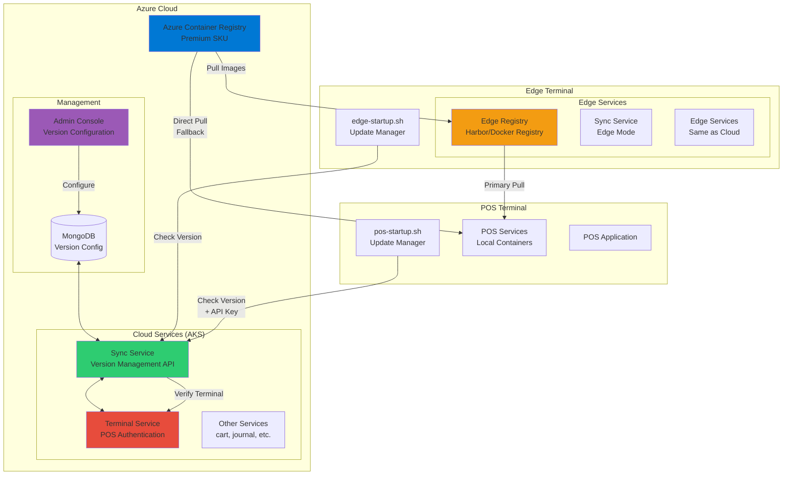
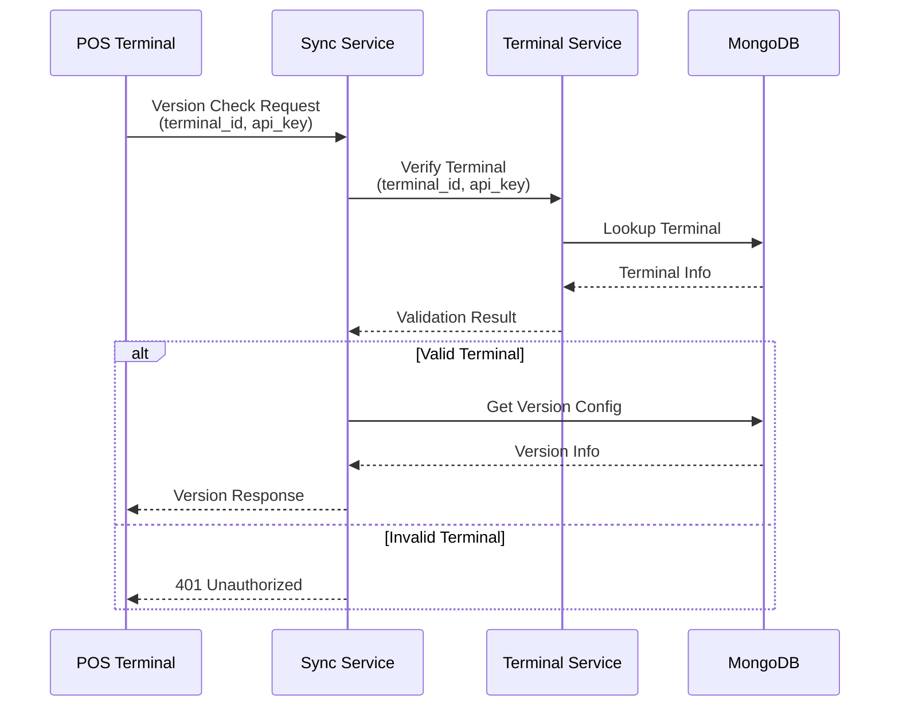

# アプリケーションバージョン管理システム - アーキテクチャ概要

## 1. システム全体構成

## 2. コンポーネント説明

### 2.1 クラウド側コンポーネント

| コンポーネント | 役割 | 技術スタック |
|--------------|------|------------|
| **Azure Container Registry** | 全バージョンのコンテナイメージを集中管理 | ACR Premium (Geo-replication) |
| **Sync Service** | バージョン管理API、更新制御 | FastAPI, MongoDB |
| **Terminal Service** | POS端末認証、端末情報管理 | FastAPI, MongoDB |
| **Admin Console** | バージョン設定UI | React/Vue.js (想定) |
| **MongoDB** | バージョン設定、更新履歴保存 | MongoDB 7.0 |

### 2.2 エッジ側コンポーネント

| コンポーネント | 役割 | 技術スタック |
|--------------|------|------------|
| **Edge Registry** | イメージのローカルキャッシュ | Harbor/Docker Registry/Nexus |
| **edge-startup.sh** | 起動時更新チェック、自動更新 | Bash Script, systemd |
| **Edge Services** | エッジ端末で動作するサービス群 | Docker Compose |

### 2.3 POS端末側コンポーネント

| コンポーネント | 役割 | 技術スタック |
|--------------|------|------------|
| **pos-startup.sh** | 起動時更新チェック、自動更新 | Bash Script, systemd |
| **POS Services** | ローカル動作するサービス群 | Docker/Docker Compose |
| **POS Application** | POSフロントエンドアプリ | - |

## 3. データフロー

### 3.1 イメージ配布フロー

1. **ビルド & プッシュ**
   - CI/CDパイプラインでコンテナイメージをビルド
   - バージョンタグを付けてACRにプッシュ

2. **エッジ端末への配布**
   - エッジ端末がACRから直接プル
   - エッジレジストリにキャッシュ

3. **POS端末への配布**
   - 優先順位1: エッジレジストリから取得（高速）
   - 優先順位2: ACRから直接取得（フォールバック）

### 3.2 バージョン管理フロー

1. **バージョン設定**
   - 管理者がAdmin Consoleで端末別バージョンを設定
   - MongoDBに保存

2. **バージョン確認**
   - 端末起動時にSync APIを呼び出し
   - 現在バージョンと目標バージョンを比較

3. **更新実行**
   - 更新が必要な場合、イメージをプル
   - docker-compose.yml を更新
   - サービスを再起動

## 4. セキュリティアーキテクチャ

### 4.1 認証・認可

### 4.2 セキュリティ対策

| レイヤー | 対策 |
|---------|-----|
| **通信** | 全通信をHTTPS/TLS暗号化 |
| **認証** | APIキーベース認証（POS）、サービス間認証（内部） |
| **イメージ** | Docker Content Trust による署名検証 |
| **アクセス制御** | RBAC、最小権限の原則 |
| **監査** | 全更新操作のログ記録 |

## 5. 高可用性設計

### 5.1 冗長性

- **ACR**: 東日本/西日本リージョンでジオレプリケーション
- **クラウドサービス**: Kubernetes による自動復旧
- **エッジレジストリ**: ローカルキャッシュによるACR障害時の継続運用

### 5.2 障害シナリオ

| 障害箇所 | 影響 | 対応 |
|---------|-----|-----|
| ACR障害 | 新規イメージ取得不可 | エッジキャッシュで継続運用 |
| Sync API障害 | バージョン確認不可 | 現行バージョンで起動継続 |
| エッジレジストリ障害 | POS高速配布不可 | ACR直接アクセスにフォールバック |
| ネットワーク断 | 更新不可 | オフラインモードで運用継続 |

## 6. スケーラビリティ

### 6.1 想定規模

| 項目 | 規模 |
|-----|-----|
| エッジ端末数 | 100〜1,000台 |
| POS端末数/エッジ | 5〜20台 |
| 総POS端末数 | 500〜20,000台 |
| イメージサイズ | 100MB〜500MB/サービス |
| 更新頻度 | 月1〜4回 |

### 6.2 スケーリング戦略

1. **水平スケーリング**
   - Sync Service: Kubernetes HPA で自動スケール
   - ACR: Premium SKU で無制限ストレージ

2. **キャッシュ戦略**
   - 多段階キャッシュ（ACR → エッジ → POS）
   - TTLベースの自動削除

3. **更新の段階展開**
   - エッジ端末グループ単位での更新
   - 時間帯分散による負荷平準化

---

**ドキュメントバージョン**: 1.0.0  
**作成日**: 2025-01-16  
**最終更新日**: 2025-01-16