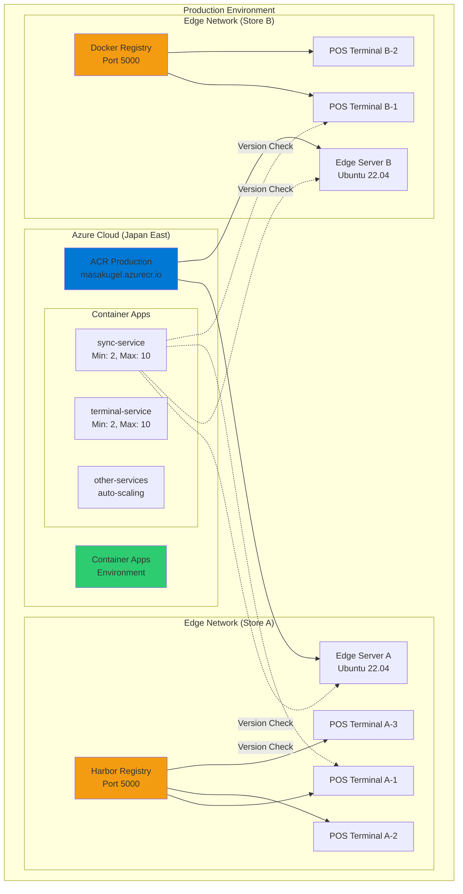
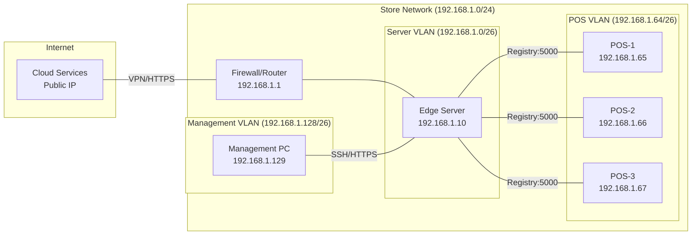

# デプロイメントアーキテクチャ

## 1. 環境別デプロイメント構成



## 2. コンテナイメージ管理構造

### 2.1 レジストリ階層

```
masakugel.azurecr.io/
├── production/
│   ├── services/
│   │   ├── account:v1.2.3
│   │   ├── terminal:v1.2.3
│   │   ├── master-data:v1.2.3
│   │   ├── cart:v1.2.3
│   │   ├── report:v1.2.3
│   │   ├── journal:v1.2.3
│   │   ├── stock:v1.2.3
│   │   └── sync:v1.2.3
│   └── infrastructure/
│       ├── mongodb:7.0
│       ├── redis:7.4
│       └── dapr:1.14
├── staging/
│   └── services/
│       └── [同構造]
└── development/
    └── services/
        └── [同構造]
```

### 2.2 タグ戦略

| タグパターン | 用途 | 例 |
|------------|------|-----|
| `vX.Y.Z` | 正式リリース | v1.2.3 |
| `vX.Y.Z-rc.N` | リリース候補 | v1.2.3-rc.1 |
| `vX.Y.Z-hotfix.N` | 緊急修正 | v1.2.3-hotfix.1 |
| `vX.Y.Z-edge.YYYYMMDD` | エッジ専用ビルド | v1.2.3-edge.20250116 |
| `latest` | 最新安定版（非推奨） | latest |

## 3. Azure Container Apps デプロイメント設定

### 3.1 Sync Service Configuration

```yaml
# Azure Container Apps 設定 (Bicep/ARM Template の一部)
resource syncService 'Microsoft.App/containerApps@2023-05-01' = {
  name: 'sync-service'
  location: 'japaneast'
  properties: {
    managedEnvironmentId: containerAppEnv.id
    configuration: {
      ingress: {
        external: true
        targetPort: 8007
        transport: 'http'
        traffic: [
          {
            latestRevision: true
            weight: 100
          }
        ]
      }
      secrets: [
        {
          name: 'mongodb-connection'
          value: mongodbConnectionString
        }
      ]
      registries: [
        {
          server: 'masakugel.azurecr.io'
          username: acrUsername
          passwordSecretRef: 'acr-password'
        }
      ]
    }
    template: {
      containers: [
        {
          name: 'sync'
          image: 'masakugel.azurecr.io/production/services/sync:v1.2.3'
          resources: {
            cpu: 0.5
            memory: '1Gi'
          }
          env: [
            {
              name: 'SYNC_MODE'
              value: 'cloud'
            }
            {
              name: 'MONGODB_URI'
              secretRef: 'mongodb-connection'
            }
          ]
          probes: [
            {
              type: 'liveness'
              httpGet: {
                path: '/health'
                port: 8007
              }
              initialDelaySeconds: 30
              periodSeconds: 10
            }
            {
              type: 'readiness'
              httpGet: {
                path: '/ready'
                port: 8007
              }
              initialDelaySeconds: 10
              periodSeconds: 5
            }
          ]
        }
      ]
      scale: {
        minReplicas: 2
        maxReplicas: 10
        rules: [
          {
            name: 'http-rule'
            http: {
              metadata: {
                concurrentRequests: '100'
              }
            }
          }
          {
            name: 'cpu-rule'
            custom: {
              type: 'cpu'
              metadata: {
                type: 'Utilization'
                value: '70'
              }
            }
          }
        ]
      }
    }
  }
}

# Terminal Service も同様に設定
resource terminalService 'Microsoft.App/containerApps@2023-05-01' = {
  name: 'terminal-service'
  // ... 同様の設定
}
```

## 4. エッジ端末デプロイメント

### 4.1 Docker Compose 構成

```yaml
# docker-compose.yml (エッジ端末)
version: '3.8'

services:
  # エッジレジストリ (Harbor の場合)
  harbor-registry:
    image: goharbor/harbor-core:v2.9.0
    container_name: edge-registry
    ports:
      - "5000:5000"
    volumes:
      - ./harbor/data:/data
      - ./harbor/config:/etc/harbor
    environment:
      - HARBOR_ADMIN_PASSWORD=${HARBOR_ADMIN_PASSWORD}
    restart: always
    networks:
      - kugelpos-edge

  # Sync Service (エッジモード)
  sync:
    image: masakugel.azurecr.io/production/services/sync:${SYNC_VERSION:-v1.2.3}
    container_name: sync-service
    environment:
      - SYNC_MODE=edge
      - EDGE_ID=${EDGE_ID}
      - CLOUD_SYNC_URL=${CLOUD_SYNC_URL}
      - MONGODB_URI=mongodb://mongodb:27017/kugelpos_edge
    depends_on:
      - mongodb
      - redis
    ports:
      - "8007:8007"
    restart: always
    networks:
      - kugelpos-edge

  # その他のサービス
  account:
    image: masakugel.azurecr.io/production/services/account:${ACCOUNT_VERSION:-v1.2.3}
    container_name: account-service
    # ... 設定省略

  terminal:
    image: masakugel.azurecr.io/production/services/terminal:${TERMINAL_VERSION:-v1.2.3}
    container_name: terminal-service
    # ... 設定省略

  # インフラストラクチャ
  mongodb:
    image: mongo:7.0
    container_name: mongodb-edge
    volumes:
      - mongodb_data:/data/db
    command: mongod --replSet rs0
    restart: always
    networks:
      - kugelpos-edge

  redis:
    image: redis:7.4
    container_name: redis-edge
    restart: always
    networks:
      - kugelpos-edge

networks:
  kugelpos-edge:
    driver: bridge

volumes:
  mongodb_data:
  harbor_data:
```

### 4.2 Systemd サービス設定

```ini
# /etc/systemd/system/kugelpos-edge.service
[Unit]
Description=Kugelpos Edge Services
After=docker.service network-online.target
Wants=network-online.target
Requires=docker.service

[Service]
Type=oneshot
RemainAfterExit=yes
WorkingDirectory=/opt/kugelpos
ExecStartPre=/opt/kugelpos/scripts/edge-startup.sh
ExecStart=/usr/local/bin/docker-compose up -d
ExecStop=/usr/local/bin/docker-compose down
Restart=on-failure
RestartSec=10

[Install]
WantedBy=multi-user.target
```

## 5. POS端末デプロイメント

### 5.1 軽量Docker Compose

```yaml
# docker-compose.yml (POS端末)
version: '3.8'

services:
  # 必要最小限のサービスのみ
  cart:
    image: ${EDGE_REGISTRY:-edge-local:5000}/cart:${CART_VERSION:-v1.2.3}
    container_name: pos-cart
    environment:
      - POS_MODE=local
      - TERMINAL_ID=${TERMINAL_ID}
      - MONGODB_URI=mongodb://localhost:27017/kugelpos_pos
    network_mode: host
    restart: always
    volumes:
      - ./data:/app/data
    depends_on:
      - mongodb-local
      - redis-local

  terminal:
    image: ${EDGE_REGISTRY:-edge-local:5000}/terminal:${TERMINAL_VERSION:-v1.2.3}
    container_name: pos-terminal
    environment:
      - POS_MODE=local
      - TERMINAL_ID=${TERMINAL_ID}
      - API_KEY=${API_KEY}
      - MONGODB_URI=mongodb://localhost:27017/kugelpos_pos
    network_mode: host
    restart: always
    depends_on:
      - mongodb-local

  # ローカルRedis (軽量キャッシュ)
  redis-local:
    image: redis:7.4-alpine
    container_name: pos-redis
    command: redis-server --maxmemory 256mb --maxmemory-policy allkeys-lru
    network_mode: host
    restart: always

  # ローカルMongoDB (POS端末用)
  mongodb-local:
    image: mongo:7.0
    container_name: pos-mongodb
    environment:
      - MONGO_INITDB_DATABASE=kugelpos_pos
    volumes:
      - mongodb_data:/data/db
    command: mongod --quiet --logpath /dev/null
    network_mode: host
    restart: always

volumes:
  pos_data:
  mongodb_data:
```

### 5.2 POS起動設定

```ini
# /etc/systemd/system/kugelpos-pos.service
[Unit]
Description=Kugelpos POS Services
After=docker.service network-online.target
Wants=network-online.target
Requires=docker.service

[Service]
Type=simple
User=kugelpos
WorkingDirectory=/opt/kugelpos-pos
ExecStartPre=/opt/kugelpos-pos/scripts/pos-startup.sh
ExecStart=/opt/kugelpos-pos/pos-app
Restart=always
RestartSec=5

[Install]
WantedBy=graphical.target
```

## 6. ネットワークアーキテクチャ

### 6.1 ネットワークセグメント



### 6.2 ポート設定

| サービス | ポート | プロトコル | 用途 |
|---------|-------|-----------|-----|
| Edge Registry | 5000 | TCP/HTTPS | イメージ配布 |
| Sync Service | 8007 | TCP/HTTPS | バージョン管理API |
| MongoDB | 27017 | TCP | データベース（内部） |
| Redis | 6379 | TCP | キャッシュ（内部） |
| SSH | 22 | TCP | 管理アクセス |
| HTTPS | 443 | TCP | Web管理画面 |

## 7. バックアップとリカバリ

### 7.1 バックアップ対象

| 対象 | 頻度 | 保持期間 | 保存先 |
|-----|-----|---------|-------|
| バージョン設定 | 変更時即座 | 1年 | Azure Blob Storage |
| docker-compose.yml | 日次 | 30日 | ローカル + クラウド |
| イメージキャッシュ | - | - | 再取得可能のため不要 |
| ログファイル | 日次 | 90日 | Azure Log Analytics |

---

**ドキュメントバージョン**: 1.0.0  
**作成日**: 2025-01-16  
**最終更新日**: 2025-01-16