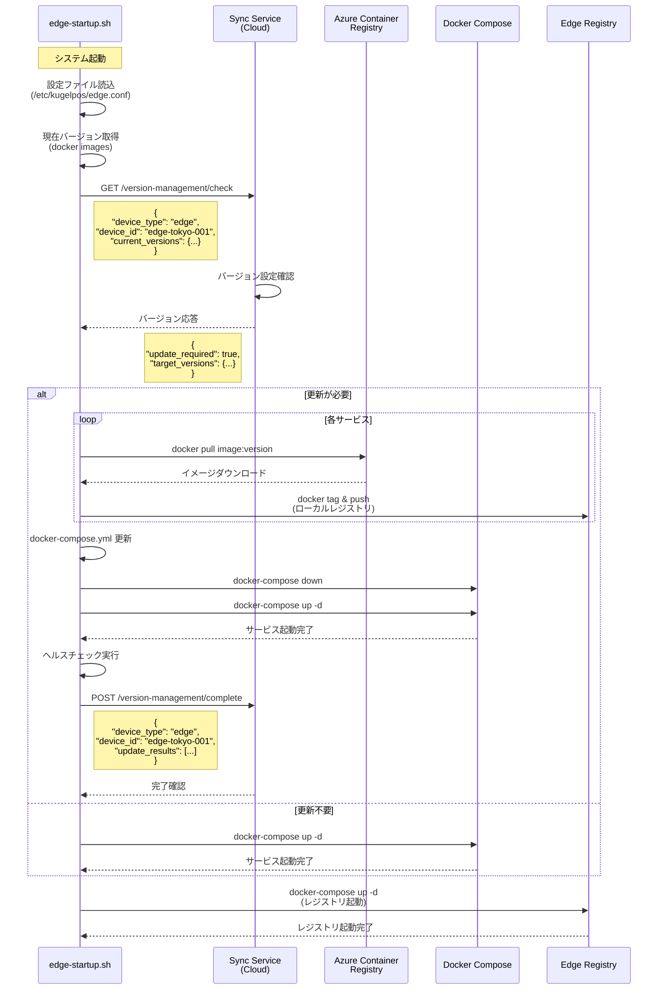
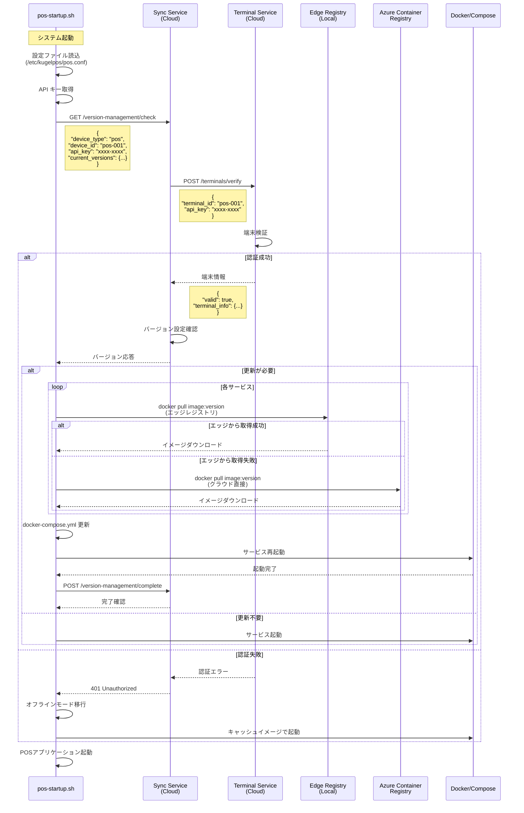
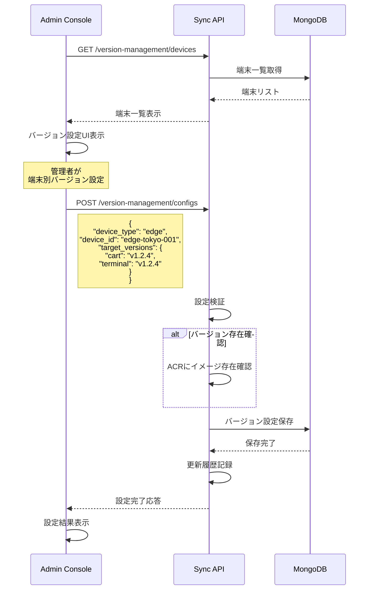
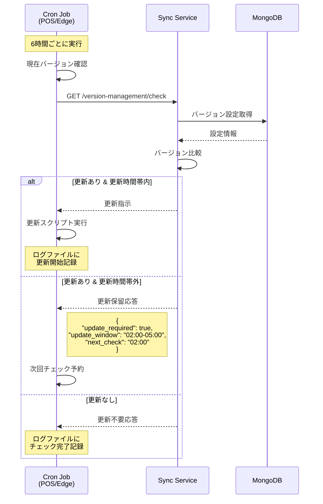
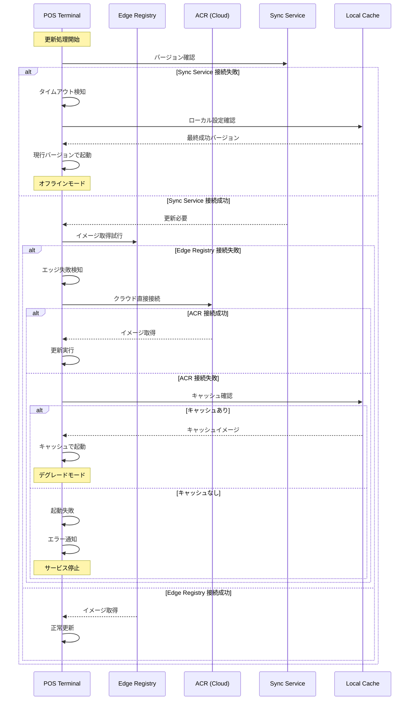
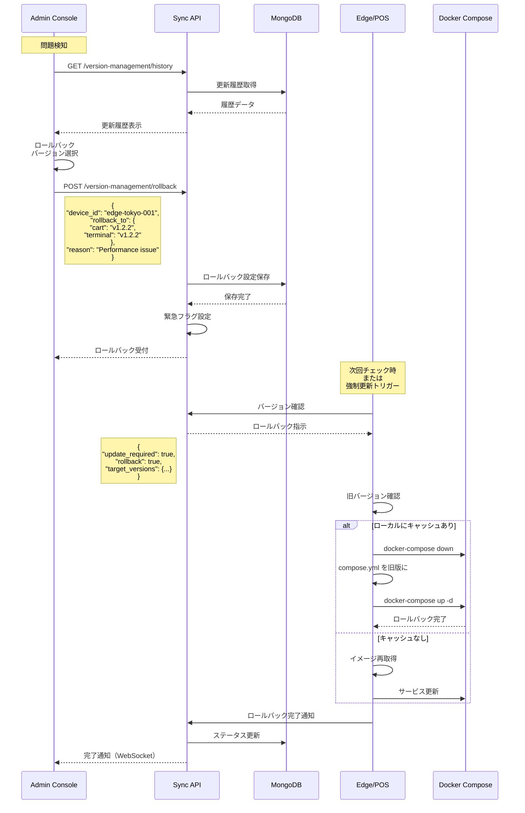

# シーケンス図 - コンポーネント間相互作用

## 1. エッジ端末の起動・更新シーケンス

## 2. POS端末の起動・更新シーケンス（認証付き）

## 3. 管理者によるバージョン設定シーケンス

## 4. 定期バージョンチェックシーケンス

## 5. 障害時のフォールバックシーケンス

## 6. ロールバックシーケンス

---

**ドキュメントバージョン**: 1.0.0  
**作成日**: 2025-01-16  
**最終更新日**: 2025-01-16