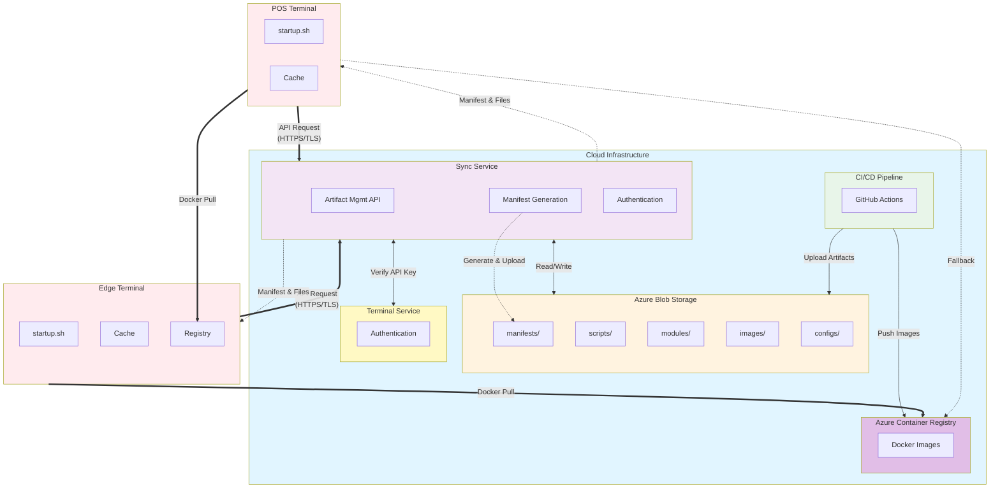

# 統合ファイル配布システム - 実装計画書

## 1. 概要

### 1.1 目的

Edge/POS端末上のstartup.shスクリプト自身や、画像ファイル、プログラムモジュールなど、多様なファイルの自動配布・更新を実現する統合システムの実装。

### 1.2 基本コンセプト

**Azure Blob Storageを中心とした統合配布システム**を構築し、すべての配布物（スクリプト、画像、モジュール等）を一元管理。Edge/POSは直接Gitにアクセスせず、Sync Service経由で認証・検証されたファイルのみをダウンロードする。

### 1.3 主要な要件

- Edge/POSからのGit直接アクセスを回避
- スクリプト、画像、プログラムモジュール等の多様なファイルを配布
- スクリプト自身の自己更新機能
- 差分更新によるネットワーク帯域の節約
- セキュアな認証・認可とファイル改ざん防止
- オフライン時の動作継続
- ロールバック機能

---

## 2. アーキテクチャ概要

### 2.1 システム構成図



### 2.2 主要コンポーネント

#### クラウド側

1. **Azure Blob Storage**
   - スクリプト、設定、画像ファイル等の配布物を集中管理
   - バージョン別フォルダ構造
   - SHA256チェックサムを付与
   - Edge/POSからの直接アクセスは不可

2. **Azure Container Registry (ACR)**
   - Dockerイメージの集中管理
   - マルチアーキテクチャ対応（x86_64, ARM64）
   - イメージのダイジェスト管理
   - Service Principalによるアクセス制御

3. **Sync Service（拡張）**
   - Artifact Management API追加
   - Manifest生成・配信
   - **ファイルダウンロードプロキシ機能**（通常ファイル用）
   - Terminal Serviceと連携した認証
   - すべてのアクセスをログ記録

4. **Terminal Service**
   - POS端末のAPIキー認証
   - 端末情報の管理

5. **CI/CD Pipeline**
   - 自動ビルド・パッケージング
   - Blob Storageへのアップロード
   - ACRへのDockerイメージpush

#### Edge/POS側

1. **Startup Script（改良版）**
   - 自己更新機能
   - Manifest処理
   - ファイルダウンロード・検証
   - ロールバック機能

2. **Local Cache**
   - Manifestキャッシュ
   - ファイルキャッシュ
   - オフライン対応

---

## 3. Manifestファイル仕様

### 3.1 概要

Manifestは更新が必要なすべてのファイル情報を含むJSON形式の設定ファイル。

### 3.2 Manifestの構造

```json
{
  "manifest_version": "1.0",
  "device_type": "edge",
  "device_id": "edge-tokyo-001",
  "target_version": "v1.2.3",
  "created_at": "2025-01-16T10:00:00Z",

  "artifacts": [
    {
      "type": "script",
      "name": "edge-startup.sh",
      "version": "v1.2.3",
      "url": "https://sync.kugelpos.cloud/api/v1/artifact-management/download",
      "checksum": "sha256:abc123...",
      "size": 15234,
      "destination": "/opt/kugelpos/scripts/edge-startup.sh",
      "permissions": "0755",
      "priority": 1,
      "required": true,
      "post_install_command": "systemctl restart kugelpos-edge.service",
      "timeout": 60
    }
  ],

  "container_registry": {
    "url": "masakugel.azurecr.io",
    "auth_method": "service_principal",
    "credentials": {
      "username_secret": "ACR_USERNAME",
      "password_secret": "ACR_PASSWORD"
    }
  },

  "container_images": [
    {
      "service": "account",
      "version": "v1.2.3",
      "registry": "masakugel.azurecr.io",
      "image": "production/services/account:v1.2.3",
      "checksum": "sha256:def789..."
    },
    {
      "service": "terminal",
      "version": "v1.2.3",
      "registry": "masakugel.azurecr.io",
      "image": "production/services/terminal:v1.2.3",
      "checksum": "sha256:abc123..."
    },
    {
      "service": "master-data",
      "version": "v1.2.3",
      "registry": "masakugel.azurecr.io",
      "image": "production/services/master-data:v1.2.3",
      "checksum": "sha256:ghi456..."
    },
    {
      "service": "cart",
      "version": "v1.2.3",
      "registry": "masakugel.azurecr.io",
      "image": "production/services/cart:v1.2.3",
      "checksum": "sha256:jkl789..."
    },
    {
      "service": "report",
      "version": "v1.2.3",
      "registry": "masakugel.azurecr.io",
      "image": "production/services/report:v1.2.3",
      "checksum": "sha256:mno012..."
    },
    {
      "service": "journal",
      "version": "v1.2.3",
      "registry": "masakugel.azurecr.io",
      "image": "production/services/journal:v1.2.3",
      "checksum": "sha256:pqr345..."
    },
    {
      "service": "stock",
      "version": "v1.2.3",
      "registry": "masakugel.azurecr.io",
      "image": "production/services/stock:v1.2.3",
      "checksum": "sha256:stu678..."
    }
  ],

  "post_install": [
    {
      "name": "restart-services",
      "command": "systemctl restart kugelpos-edge.service",
      "timeout": 60,
      "required": true
    }
  ],

  "rollback_version": "v1.2.2",

  "update_policy": {
    "window": "02:00-05:00",
    "auto_update": true,
    "force_update": false,
    "max_retries": 3
  }
}
```

### 3.3 Artifactフィールド詳細

| フィールド | 型 | 必須 | 説明 |
|-----------|-----|------|------|
| type | string | ○ | script, module, image, config, doc |
| name | string | ○ | ファイル名 |
| version | string | ○ | バージョン |
| url | string | ○ | ダウンロードURL（Sync Service API URL） |
| checksum | string | ○ | SHA256チェックサム |
| size | number | ○ | ファイルサイズ（bytes） |
| destination | string | ○ | 配置先パス |
| permissions | string | - | 実行権限（デフォルト: 0644） |
| priority | number | - | 優先順位（デフォルト: 5） |
| required | boolean | - | 必須フラグ（デフォルト: true） |
| post_install_command | string | - | 配置後に実行するコマンド |
| timeout | number | - | コマンドのタイムアウト（秒、デフォルト: 60） |

### 3.4 Container Registryフィールド詳細

| フィールド | 型 | 必須 | 説明 |
|-----------|-----|------|------|
| url | string | ○ | Container RegistryのURL（ACR） |
| auth_method | string | ○ | 認証方法（service_principal, managed_identity, token） |
| credentials | object | △ | 認証情報（auth_methodに応じて必須） |
| credentials.username_secret | string | △ | ユーザー名を保存したシークレット名 |
| credentials.password_secret | string | △ | パスワードを保存したシークレット名 |
| credentials.token | string | △ | 一時トークン（有効期限付き） |

---

## 4. 更新フロー詳細

### 4.1 起動時の処理フロー

```
起動
 │
 ├─ Phase 1: スクリプト自己更新チェック
 │   ├─ Sync ServiceからManifest取得
 │   ├─ 自分自身（startup.sh）の更新確認
 │   ├─ 更新あり？
 │   │   ├─ Yes: Sync Service API経由でダウンロード→検証→バックアップ→上書き→再起動
 │   │   └─ No: 次のPhaseへ
 │   └─ （ここで再起動される場合あり）
 │
 ├─ Phase 2: その他ファイルの更新（Sync Service API経由）
 │   ├─ Manifestの全artifactsを取得
 │   ├─ priority順にソート
 │   ├─ 各ファイルをSync Service APIからダウンロード
 │   │   ├─ POSTリクエスト（type, name, version, checksum指定）
 │   │   ├─ 認証ヘッダー付与（API Key/Device ID）
 │   │   ├─ チェックサム検証
 │   │   ├─ 配置先にコピー
 │   │   ├─ 権限設定
 │   │   ├─ 展開処理（必要な場合）
 │   │   └─ インストールコマンド実行（必要な場合）
 │   └─ 全ファイル処理完了
 │
 ├─ Phase 3: コンテナイメージの更新（ACR直接）
 │   ├─ Manifestのcontainer_registryから認証情報取得
 │   ├─ ACRにログイン（docker login）
 │   ├─ Manifestのcontainer_imagesを取得
 │   ├─ 各イメージをpull
 │   │   ├─ Edge: ACRから直接pull
 │   │   └─ POS: Edge Registry → ACR（フォールバック）
 │   ├─ ダイジェスト検証
 │   └─ docker-compose.yml更新
 │
 ├─ Phase 4: サービス再起動とヘルスチェック
 │   ├─ docker-compose down/up
 │   ├─ ヘルスチェック（最大5分）
 │   ├─ 成功？
 │   │   ├─ Yes: Sync Serviceに完了通知
 │   │   └─ No: 自動ロールバック
 │   └─ post_installアクション実行
 │
 └─ 起動完了
```

### 4.2 自己更新の詳細フロー

```bash
# 1. Manifestから自分自身のエントリを検索
script_artifact=$(jq '.artifacts[] | select(.name == "edge-startup.sh")' manifest.json)

# 2. バージョン比較
new_version=$(echo "$script_artifact" | jq -r '.version')
if [ "$new_version" != "$SCRIPT_VERSION" ]; then
    # 3. Sync Service API経由でダウンロード
    url=$(echo "$script_artifact" | jq -r '.url')
    checksum=$(echo "$script_artifact" | jq -r '.checksum')

    curl -X POST "$url" \
      -H "Authorization: Bearer ${API_KEY}" \
      -H "X-Device-ID: ${DEVICE_ID}" \
      -H "X-Device-Type: ${DEVICE_TYPE}" \
      -H "Content-Type: application/json" \
      -d "{
        \"artifact_type\": \"script\",
        \"artifact_name\": \"edge-startup.sh\",
        \"version\": \"$new_version\",
        \"checksum\": \"$checksum\"
      }" \
      -o /tmp/startup.sh.new

    # 4. チェックサム検証
    actual_checksum=$(sha256sum /tmp/startup.sh.new | cut -d' ' -f1)
    if [ "sha256:$actual_checksum" != "$checksum" ]; then
        echo "ERROR: Checksum mismatch"
        exit 1
    fi

    # 5. バックアップ
    cp "$0" "$0.backup.$(date +%Y%m%d_%H%M%S)"

    # 6. 上書き
    mv /tmp/startup.sh.new "$0"
    chmod +x "$0"

    # 7. 再起動（exec で現プロセスを置き換え）
    exec "$0" "$@"
fi
```

---

## 5. セキュリティ設計

### 5.1 認証・認可

#### Edge端末
- デバイスID（edge_id）による識別
- 事前登録されたデバイスのみアクセス可能
- Sync Serviceのデータベースで管理

#### POS端末
- Terminal ServiceのAPIキー認証
- 2段階検証:
  1. Sync ServiceがAPIキーとterminal_idを受信
  2. Terminal Serviceに検証依頼
  3. 検証成功時のみManifestを返却

#### Sync Service API（ファイルダウンロード）
- すべてのリクエストに認証ヘッダー必須
  - Authorization: Bearer {api_key}
  - X-Device-ID: {device_id}
  - X-Device-Type: {edge|pos}
- アクセス制御:
  - デバイスIDとAPIキーの組み合わせを検証
  - テナント・店舗レベルでのアクセス制御
  - ダウンロード履歴をログ記録
- レート制限:
  - デバイスあたり100リクエスト/分
  - 異常なアクセスパターンを検知・ブロック

#### Azure Container Registry (ACR)
- **Service Principal認証**（推奨）
  - 専用のService Principal作成（sp-edge-devices）
  - 最小権限の原則（AcrPull権限のみ）
  - 認証情報はEdge/POSローカルに暗号化保存
  - 定期的なパスワードローテーション（90日）
- **Managed Identity**（Azureホスト時）
  - Azure VMの場合はManaged Identityを使用
  - パスワード管理不要
- **Token認証**（一時的なアクセス用）
  - Sync ServiceがACR Tokenを生成
  - 有効期限1時間
  - Manifestに含めて配布

### 5.2 改ざん防止

1. **チェックサム検証**
   - すべてのファイルにSHA256チェックサム
   - ダウンロード後に必ず検証
   - 不一致時はエラーとしてリトライ

2. **TLS暗号化**
   - すべての通信をHTTPS/TLS 1.2以上
   - 証明書検証を必須に

3. **署名検証（将来実装）**
   - GPG署名によるファイル検証
   - 公開鍵をローカルに保存

### 5.3 セキュリティログ

- すべてのダウンロード操作をログ記録
- チェックサム不一致を検知・記録
- 認証失敗を即座にアラート
- syslogへの転送

---

## 6. オフライン対応とフォールバック

### 6.1 階層型キャッシュ

```
Cloud (Blob Storage)
  ↓ ネットワーク経由
Edge Server (Local Cache + Harbor Registry)
  ↓ ローカルネットワーク
POS Terminal (Local Cache)
```

### 6.2 キャッシュ戦略

| 項目 | キャッシュ場所 | 有効期限 | 備考 |
|-----|--------------|---------|------|
| Manifest | `/opt/kugelpos/cache/last-manifest.json` | 7日 | 最後に成功したManifest |
| Artifacts | `/opt/kugelpos/cache/artifacts/` | 30日 | バージョン別に保存 |
| Docker Images | Docker local storage | - | Dockerが自動管理 |
| Checksums | `/opt/kugelpos/cache/current-checksums.json` | - | 現在のファイル状態 |

### 6.3 段階的デグレード

| レベル | 状態 | 動作 |
|-------|------|------|
| 0 | 正常 | クラウドから最新Manifest取得、更新実行 |
| 1 | Sync Service接続失敗 | ローカルキャッシュのManifest使用 |
| 2 | キャッシュ期限切れ | 警告表示、現行バージョンで起動 |
| 3 | イメージダウンロード失敗 | ローカルキャッシュのイメージで起動 |
| 4 | 起動失敗 | 前回成功バージョンへ自動ロールバック |

### 6.4 オフライン時の挙動

1. **接続失敗の検知**
   - Sync Service接続タイムアウト: 30秒
   - リトライ: 3回（指数バックオフ）

2. **キャッシュの利用**
   - 最後に成功したManifestをロード
   - 有効期限チェック（7日以内）
   - 期限内: 情報ログのみ
   - 期限切れ: 警告ログ（起動は継続）

3. **ネットワーク復旧時**
   - 次回チェック時に自動で最新版を取得
   - 差分更新を実行

---

## 6.5 差分更新の仕組み

### 6.5.1 差分更新の概要

差分更新により、変更されたファイルのみをダウンロードし、ネットワーク帯域を節約します。

**ファイルタイプ別の取得方法**:

| ファイルタイプ | 取得方法 | プロトコル | 認証方式 |
|--------------|---------|-----------|---------|
| スクリプト（.sh） | **Sync Service API** | HTTPS | API Key/Device ID |
| 設定ファイル（.json, .yaml） | **Sync Service API** | HTTPS | API Key/Device ID |
| 画像（.png, .jpg） | **Sync Service API** | HTTPS | API Key/Device ID |
| モジュール（.whl, .deb） | **Sync Service API** | HTTPS | API Key/Device ID |
| **Dockerイメージ** | **ACR直接** | Docker pull | Service Principal/Token |

**重要**: 通常ファイルはSync Service API経由で取得することで、すべてのアクセスを認証・ログ記録します。Dockerイメージは大容量のためACR直接pullを使用し、Dockerのレイヤー差分機能を活用します。

### 6.5.2 チェックサムベースの差分検出

**仕組み**:
1. Edge/POSがManifest取得時に現在のチェックサムを送信
2. Sync ServiceがManifestと比較
3. 変更されたファイルのみを返却

**リクエスト例**:
```json
{
  "device_type": "edge",
  "device_id": "edge-tokyo-001",
  "current_version": "v1.2.2",
  "current_checksums": {
    "edge-startup.sh": "sha256:abc123...",
    "cart": "sha256:def456...",
    "account": "sha256:ghi789..."
  }
}
```

**レスポンス（差分のみ）**:
```json
{
  "target_version": "v1.2.3",
  "updates_required": true,
  "artifacts": [
    {
      "name": "edge-startup.sh",
      "action": "update",
      "reason": "checksum_mismatch",
      "current_checksum": "sha256:abc123...",
      "new_checksum": "sha256:xyz789...",
      "url": "https://..."
    }
  ],
  "container_images": [
    {
      "service": "cart",
      "action": "update",
      "reason": "version_upgrade",
      "current_version": "v1.2.2",
      "new_version": "v1.2.3",
      "current_checksum": "sha256:def456...",
      "new_checksum": "sha256:new789...",
      "image": "masakugel.azurecr.io/production/services/cart:v1.2.3"
    }
  ],
  "no_change": [
    {
      "service": "account",
      "checksum": "sha256:ghi789...",
      "message": "Already up to date"
    }
  ]
}
```

### 6.5.3 ファイルレベルの差分更新

**スクリプト・設定ファイル**:
- チェックサムが一致 → スキップ
- チェックサムが不一致 → ダウンロード

**Dockerイメージ**:
```bash
# 現在のイメージダイジェストを取得
current_digest=$(docker inspect --format='{{.RepoDigests}}' \
  masakugel.azurecr.io/production/services/cart:v1.2.2 | cut -d'@' -f2)

# Manifestのダイジェストと比較
if [ "$current_digest" != "$manifest_digest" ]; then
  echo "Pulling updated image..."
  docker pull masakugel.azurecr.io/production/services/cart:v1.2.3
else
  echo "Image already up to date, skipping download"
fi
```

### 6.5.4 Dockerイメージのレイヤー差分

Dockerイメージは自動的にレイヤー単位で差分ダウンロードされます：

```bash
# Docker pull時の動作例
$ docker pull masakugel.azurecr.io/production/services/cart:v1.2.3
v1.2.3: Pulling from production/services/cart
01fd6df81c8e: Already exists    # ベースイメージ
09aeb79b7b47: Already exists    # 既存レイヤー
8fc4f3c9f34a: Pull complete     # 新しいレイヤーのみダウンロード
f8d9c5b1fae2: Pull complete     # 新しいレイヤーのみダウンロード
Digest: sha256:new789...
Status: Downloaded newer image for cart:v1.2.3
```

**メリット**:
- 変更されたレイヤーのみダウンロード
- ベースイメージや共通ライブラリは再利用
- 帯域使用量を大幅削減

### 6.5.5 実装例（startup.shスクリプト）

```bash
#!/bin/bash

# 現在のチェックサムファイルを読み込み
if [ -f /opt/kugelpos/cache/current-checksums.json ]; then
  CURRENT_CHECKSUMS=$(cat /opt/kugelpos/cache/current-checksums.json)
else
  CURRENT_CHECKSUMS="{}"
fi

# Manifestを取得（現在のチェックサムを送信）
MANIFEST=$(curl -X POST https://sync.kugelpos.cloud/api/v1/artifact-management/check \
  -H "Authorization: Bearer ${API_KEY}" \
  -H "X-Device-ID: ${DEVICE_ID}" \
  -H "X-Device-Type: ${DEVICE_TYPE}" \
  -H "Content-Type: application/json" \
  -d "{
    \"device_type\": \"${DEVICE_TYPE}\",
    \"device_id\": \"${DEVICE_ID}\",
    \"current_version\": \"${CURRENT_VERSION}\",
    \"current_checksums\": ${CURRENT_CHECKSUMS}
  }")

# 更新が必要な通常ファイルのみ処理（Sync Service API経由）
for artifact in $(echo "$MANIFEST" | jq -c '.artifacts[] | select(.action == "update")'); do
  NAME=$(echo "$artifact" | jq -r '.name')
  TYPE=$(echo "$artifact" | jq -r '.type')
  VERSION=$(echo "$artifact" | jq -r '.version')
  URL=$(echo "$artifact" | jq -r '.url')
  CHECKSUM=$(echo "$artifact" | jq -r '.new_checksum')

  echo "Downloading updated file: $NAME (via Sync Service API)"

  # Sync Service API経由でダウンロード
  curl -X POST "$URL" \
    -H "Authorization: Bearer ${API_KEY}" \
    -H "X-Device-ID: ${DEVICE_ID}" \
    -H "X-Device-Type: ${DEVICE_TYPE}" \
    -H "Content-Type: application/json" \
    -d "{
      \"artifact_type\": \"$TYPE\",
      \"artifact_name\": \"$NAME\",
      \"version\": \"$VERSION\",
      \"checksum\": \"$CHECKSUM\"
    }" \
    -o "/tmp/${NAME}"

  # チェックサム検証
  ACTUAL_CHECKSUM=$(sha256sum "/tmp/${NAME}" | cut -d' ' -f1)
  if [ "sha256:$ACTUAL_CHECKSUM" != "$CHECKSUM" ]; then
    echo "ERROR: Checksum mismatch for $NAME"
    exit 1
  fi

  echo "Downloaded and verified: $NAME"
done

# ACRにログイン（Dockerイメージpull用）
ACR_URL=$(echo "$MANIFEST" | jq -r '.container_registry.url')
ACR_USERNAME=$(cat /opt/kugelpos/secrets/ACR_USERNAME)
ACR_PASSWORD=$(cat /opt/kugelpos/secrets/ACR_PASSWORD)

docker login "$ACR_URL" -u "$ACR_USERNAME" -p "$ACR_PASSWORD"

# 更新が必要なイメージのみpull（ACR直接）
for image in $(echo "$MANIFEST" | jq -c '.container_images[] | select(.action == "update")'); do
  SERVICE=$(echo "$image" | jq -r '.service')
  IMAGE=$(echo "$image" | jq -r '.image')
  NEW_DIGEST=$(echo "$image" | jq -r '.new_checksum')

  echo "Pulling updated image: $SERVICE (from ACR)"
  docker pull "$IMAGE"

  # ダイジェストを検証
  ACTUAL_DIGEST=$(docker inspect --format='{{index .RepoDigests 0}}' "$IMAGE" | cut -d'@' -f2)
  if [ "$ACTUAL_DIGEST" != "$NEW_DIGEST" ]; then
    echo "ERROR: Image digest mismatch for $SERVICE"
    exit 1
  fi
done

# 変更なしのファイル・イメージはスキップ
echo "Skipped $(echo "$MANIFEST" | jq '.no_change | length') unchanged components"

# 新しいチェックサムを保存
echo "$MANIFEST" | jq '{
  version: .target_version,
  checksums: (.artifacts + .container_images | map({(.name // .service): .new_checksum}) | add)
}' > /opt/kugelpos/cache/current-checksums.json
```

### 6.5.6 帯域節約の効果

**シナリオ例**: v1.2.2 → v1.2.3への更新

| コンポーネント | サイズ | 変更 | ダウンロード |
|---------------|--------|------|--------------|
| edge-startup.sh | 50KB | ✓ | 50KB |
| account イメージ | 200MB | - | 0MB（スキップ） |
| terminal イメージ | 180MB | - | 0MB（スキップ） |
| cart イメージ | 220MB | ✓ | 30MB（差分レイヤーのみ） |
| report イメージ | 190MB | ✓ | 25MB（差分レイヤーのみ） |
| **合計** | **840MB** | - | **55MB（93%削減）** |

### 6.5.7 将来の拡張（バイナリ差分）

現在はファイル単位の差分ですが、将来的にはバイナリレベルの差分も検討：

- **bsdiff/bspatch**: バイナリファイルの差分パッチ
- **rsync アルゴリズム**: ブロック単位の差分転送
- **zsync**: HTTPベースの差分同期

これらは「15.1 短期（3ヶ月以内）」で検討予定。

---

## 7. ロールバック機能

### 7.1 自動ロールバック

**トリガー条件**
- ヘルスチェック失敗（5分以内に全サービスが起動しない）
- 必須ファイルのダウンロード失敗
- チェックサム検証失敗（リトライ後）

**ロールバック手順**
1. docker-compose.ymlのバックアップをリストア
2. スクリプトのバックアップをリストア
3. サービスを前回成功バージョンで起動
4. エラー内容をSync Serviceに通知
5. 詳細ログをローカルに記録

### 7.2 手動ロールバック

**管理画面からの操作**
1. Sync Service管理画面で端末を選択
2. ロールバック先バージョンを指定
3. 理由を入力（監査ログ用）
4. 実行ボタン押下

**適用タイミング**
- 次回定期チェック時（デフォルト: 6時間ごと）
- 強制更新トリガー（即座）
- 次回起動時

### 7.3 ロールバック制約

#### ローカルバックアップ
- **前バージョン（1世代）のみ保持**
  - Edge/POS端末のストレージ容量を節約
  - 通常のロールバックは直前バージョンへの復帰で対応可能
  - バックアップファイルは起動成功後に作成

#### クラウド側バックアップ
- **Azure Blob Storageで複数世代（最低3世代）を管理**
  - より古いバージョンへのロールバックが必要な場合はクラウド経由で対応
  - 段階的ロールバック（例: v1.2.3 → v1.2.0 → v1.1.5）

#### 後方互換性要件
- データベーススキーマの後方互換性が必要
- APIの後方互換性が必要

---

## 8. 配布可能なファイルタイプ

### 8.1 ファイルカテゴリ

| カテゴリ | type値 | 拡張子例 | 用途 |
|---------|--------|---------|------|
| スクリプト | script | .sh, .bash | 起動・更新処理 |
| モジュール | module | .whl, .deb, .rpm, .tar.gz | プログラム機能追加 |
| 画像 | image | .png, .jpg, .svg | UI表示 |
| 設定 | config | .conf, .yaml, .json | サービス設定 |
| ドキュメント | doc | .pdf, .md | マニュアル |

### 8.2 各カテゴリの処理

#### スクリプトファイル
- バックアップを自動作成（前バージョンのみ保持）
- 実行権限を自動設定（755）
- 構文チェック（shellcheck、オプション）
- ロールバック時は前バージョンに復元

#### モジュール
- Python: pip install コマンドで自動インストール
- システムパッケージ: apt/yum で自動インストール
- アーカイブ: 指定ディレクトリに自動展開
- インストール済みバージョンをログに記録（前バージョンのみ保持）
- ロールバック: パッケージマネージャーの機能を利用（pip uninstall等）

#### 画像ファイル
- バックアップを自動作成（前バージョンのみ保持）
- 指定パスにコピー
- 権限は644
- ロールバック時は前バージョンに復元

#### 設定ファイル
- バックアップを自動作成（前バージョンのみ保持）
- 展開処理（tar.gz等）をサポート
- 環境変数の置換（オプション）
- ロールバック時は前バージョンに復元

#### ドキュメント
- バックアップを自動作成（前バージョンのみ保持）
- 指定パスにコピー
- 圧縮形式もサポート
- ロールバック時は前バージョンに復元

---

## 9. CI/CD統合

### 9.1 自動リリースパイプライン

#### トリガー
- Gitタグpush（例: v1.2.3）
- 手動トリガー（workflow_dispatch）

#### ステップ

**0. Dockerイメージのビルド・Push**
```yaml
- name: Set up Docker Buildx
  uses: docker/setup-buildx-action@v2

- name: Log in to Azure Container Registry
  uses: azure/docker-login@v1
  with:
    login-server: masakugel.azurecr.io
    username: ${{ secrets.ACR_USERNAME }}
    password: ${{ secrets.ACR_PASSWORD }}

- name: Build and push Docker images
  run: |
    VERSION=${{ github.ref_name }}  # タグ名を取得 (例: v1.2.3)
    
    # 各サービスをビルド・Push
    services=("account" "terminal" "master-data" "cart" "report" "journal" "stock")
    
    for service in "${services[@]}"; do
      echo "Building ${service}..."
      
      docker build \
        -t masakugel.azurecr.io/production/services/${service}:${VERSION} \
        -t masakugel.azurecr.io/production/services/${service}:latest \
        -f services/${service}/Dockerfile \
        services/${service}
      
      echo "Pushing ${service}..."
      docker push masakugel.azurecr.io/production/services/${service}:${VERSION}
      docker push masakugel.azurecr.io/production/services/${service}:latest
      
      # イメージのダイジェストを保存（後でManifest生成に使用）
      docker inspect --format='{{index .RepoDigests 0}}' \
        masakugel.azurecr.io/production/services/${service}:${VERSION} \
        | cut -d'@' -f2 > dist/digests/${service}.txt
    done

- name: Save image digests
  run: |
    mkdir -p dist/digests
    # 既に上記のステップで保存済み
```

**1. ビルドフェーズ（スクリプト・モジュール）**
```yaml
- name: Build scripts
  run: |
    VERSION=${{ github.ref_name }}
    # バージョン番号を埋め込み
    sed -i "s/SCRIPT_VERSION=.*/SCRIPT_VERSION=\"${VERSION}\"/" edge-startup.sh
    sed -i "s/SCRIPT_VERSION=.*/SCRIPT_VERSION=\"${VERSION}\"/" pos-startup.sh
    
    # チェックサム計算
    mkdir -p dist/scripts
    cp edge-startup.sh pos-startup.sh dist/scripts/
    cd dist/scripts
    sha256sum *.sh > checksums.txt
```

**2. パッケージングフェーズ**
```yaml
- name: Build Python modules
  run: |
    cd services/commons
    python -m build
    mkdir -p ../../dist/modules
    cp dist/*.whl ../../dist/modules/
    cd ../../dist/modules
    sha256sum *.whl > checksums.txt
```

**3. アップロードフェーズ**
```yaml
- name: Upload to Azure Blob Storage
  uses: azure/CLI@v1
  with:
    inlineScript: |
      VERSION=${{ github.ref_name }}
      
      # スクリプトをアップロード
      az storage blob upload-batch \
        --account-name kugelposartifacts \
        --destination kugelpos-artifacts/scripts/edge-startup.sh/${VERSION} \
        --source dist/scripts/ \
        --pattern "edge-startup.sh" \
        --auth-mode login
      
      az storage blob upload-batch \
        --account-name kugelposartifacts \
        --destination kugelpos-artifacts/scripts/pos-startup.sh/${VERSION} \
        --source dist/scripts/ \
        --pattern "pos-startup.sh" \
        --auth-mode login
      
      # モジュールをアップロード
      az storage blob upload-batch \
        --account-name kugelposartifacts \
        --destination kugelpos-artifacts/modules/python/ \
        --source dist/modules/ \
        --auth-mode login
```

**4. ビルド完了通知**
```yaml
- name: Notify build completion
  run: |
    VERSION=${{ github.ref_name }}
    echo "Build completed for version ${VERSION}"
    echo "Docker images pushed to ACR"
    echo "Scripts and modules uploaded to Blob Storage"
    echo "System administrators can now generate Manifests for specific stores/devices"
```

### 9.2 Manifestの手動生成（システム管理者向け）

Manifestは**システム管理者が店舗・デバイスを指定して生成**します。

#### 生成方法1: Web管理画面

**Sync Service管理画面での操作**:

1. **対象選択**
   - Tenant ID: `tenant-001`
   - Store Code: `store-tokyo-001`
   - Device Type: `edge` または `pos`
   - Device ID: `edge-001` または `pos-001`

2. **バージョン選択**
   - Target Version: `v1.2.3`（ドロップダウンから選択）
   - 利用可能なバージョン一覧はACRとBlob Storageから取得

3. **コンポーネント選択**
   - Scripts: ✓ edge-startup.sh v1.2.3
   - Container Images:
     - ✓ account v1.2.3
     - ✓ terminal v1.2.3
     - ✓ master-data v1.2.3
     - ✓ cart v1.2.3
     - ✓ report v1.2.3
     - ✓ journal v1.2.3
     - ✓ stock v1.2.3
   - Modules: ✓ kugelpos_common-1.2.3

4. **更新ポリシー設定**
   - Auto Update: Yes/No
   - Update Window: 02:00-05:00
   - Force Update: Yes/No

5. **生成・配布**
   - 「Generate Manifest」ボタンをクリック
   - Manifestが自動生成され、Blob Storageに保存される
   - 対象デバイスに通知（オプション）

#### 生成方法2: CLI ツール

```bash
# Manifest生成コマンド
python scripts/generate-manifest-for-device.py \
  --tenant-id tenant-001 \
  --store-code store-tokyo-001 \
  --device-type edge \
  --device-id edge-001 \
  --target-version v1.2.3 \
  --services account,terminal,master-data,cart,report,journal,stock \
  --output manifest.json

# Sync Serviceに登録
curl -X POST https://sync.kugelpos.cloud/api/v1/admin/manifests \
  -H "Authorization: Bearer ${ADMIN_API_TOKEN}" \
  -H "Content-Type: application/json" \
  -d @manifest.json
```

#### 生成方法3: API経由

```bash
# Manifest生成API
POST /api/v1/admin/manifests/generate
{
  "tenant_id": "tenant-001",
  "store_code": "store-tokyo-001",
  "device_type": "edge",
  "device_id": "edge-001",
  "target_version": "v1.2.3",
  "container_images": [
    {"service": "account", "version": "v1.2.3"},
    {"service": "terminal", "version": "v1.2.3"},
    {"service": "master-data", "version": "v1.2.3"},
    {"service": "cart", "version": "v1.2.3"},
    {"service": "report", "version": "v1.2.3"},
    {"service": "journal", "version": "v1.2.3"},
    {"service": "stock", "version": "v1.2.3"}
  ],
  "update_policy": {
    "auto_update": true,
    "window": "02:00-05:00",
    "force_update": false
  }
}
```

### 9.3 Manifest生成スクリプト

`scripts/generate-manifest-for-device.py`:

```python
import argparse
import json
from typing import List, Dict
from azure.storage.blob import BlobServiceClient
from azure.containerregistry import ContainerRegistryClient

def generate_manifest_for_device(
    tenant_id: str,
    store_code: str,
    device_type: str,
    device_id: str,
    target_version: str,
    services: List[str]
) -> Dict:
    """
    特定の店舗・デバイス向けのManifestを生成
    """
    manifest = {
        "manifest_version": "1.0",
        "device_type": device_type,
        "device_id": device_id,
        "tenant_id": tenant_id,
        "store_code": store_code,
        "target_version": target_version,
        "created_at": datetime.now().isoformat(),
        "artifacts": [],
        "container_registry": {
            "url": "masakugel.azurecr.io",
            "auth_method": "service_principal",
            "credentials": {
                "username_secret": "ACR_USERNAME",
                "password_secret": "ACR_PASSWORD"
            }
        },
        "container_images": []
    }

    # スクリプトの情報を取得
    script_name = f"{device_type}-startup.sh"
    script_info = get_script_info(script_name, target_version)
    manifest["artifacts"].append(script_info)

    # 各サービスのイメージ情報を取得
    for service in services:
        image_info = get_image_info(service, target_version)
        manifest["container_images"].append(image_info)

    return manifest

def get_script_info(script_name: str, version: str) -> Dict:
    """Azure Blob Storageからスクリプト情報を取得"""
    blob_client = BlobServiceClient.from_connection_string(BLOB_CONN_STR)
    blob_path = f"scripts/{script_name}/{version}/{script_name}"

    # Blob情報を取得
    blob_properties = blob_client.get_blob_client(
        container="kugelpos-artifacts",
        blob=blob_path
    ).get_blob_properties()

    # Sync Service APIのダウンロードURL（SAS URLではなく）
    download_url = "https://sync.kugelpos.cloud/api/v1/artifact-management/download"

    return {
        "type": "script",
        "name": script_name,
        "version": version,
        "url": download_url,
        "checksum": blob_properties.content_settings.content_md5,
        "size": blob_properties.size,
        "destination": f"/opt/kugelpos/scripts/{script_name}",
        "permissions": "0755",
        "priority": 1,
        "required": True
    }

def get_image_info(service: str, version: str) -> Dict:
    """ACRからイメージ情報を取得"""
    # Azure Container Registry クライアント
    acr_client = ContainerRegistryClient(
        endpoint=ACR_ENDPOINT,
        credential=ACR_CREDENTIAL
    )
    
    repository = f"production/services/{service}"
    image_name = f"{repository}:{version}"
    
    # イメージのダイジェストを取得
    manifest_props = acr_client.get_manifest_properties(repository, version)
    digest = manifest_props.digest
    
    return {
        "service": service,
        "version": version,
        "registry": "masakugel.azurecr.io",
        "image": image_name,
        "checksum": digest
    }
```

### 9.4 一括Manifest生成（複数店舗・デバイス）

複数の店舗・デバイスに対して一括でManifestを生成する場合：

```bash
# CSVファイルから読み込んで一括生成
python scripts/bulk-generate-manifests.py \
  --input devices.csv \
  --target-version v1.2.3

# devices.csv の例:
# tenant_id,store_code,device_type,device_id
# tenant-001,store-tokyo-001,edge,edge-001
# tenant-001,store-tokyo-001,pos,pos-001
# tenant-001,store-tokyo-001,pos,pos-002
# tenant-001,store-osaka-001,edge,edge-001
```

### 9.5 Manifest生成のワークフロー

```
1. CI/CDでビルド完了
   ├─ Dockerイメージ → ACR
   └─ Scripts/Modules → Blob Storage
   
2. 管理者が確認
   └─ テスト環境で動作確認
   
3. Manifest生成（店舗・デバイス指定）
   ├─ Web管理画面で選択
   ├─ または CLI/API で指定
   └─ Manifestが生成・保存される
   
4. デバイスが取得
   └─ 次回起動時またはスケジュールで更新
```

---

## 10. Blob Storage構造

### 10.1 ディレクトリ構成

```
kugelpos-artifacts/
│
├── manifests/                      # Manifestファイル
│   ├── {tenant_id}/
│   │   └── {store_code}/
│   │       ├── edge/
│   │       │   ├── edge-001/
│   │       │   │   ├── manifest-v1.2.3.json
│   │       │   │   ├── manifest-v1.2.2.json
│   │       │   │   └── manifest-latest.json (symlink)
│   │       │   ├── edge-002/
│   │       │   │   └── ...
│   │       │   └── default/
│   │       │       └── manifest-latest.json
│   │       └── pos/
│   │           ├── pos-001/
│   │           │   └── manifest-v1.2.3.json
│   │           ├── pos-002/
│   │           │   └── manifest-v1.2.3.json
│   │           └── default/
│   │               └── manifest-latest.json
│
├── scripts/                        # スクリプトファイル
│   ├── edge-startup.sh/
│   │   ├── v1.2.3/
│   │   │   ├── edge-startup.sh
│   │   │   └── checksums.txt
│   │   ├── v1.2.2/
│   │   │   └── edge-startup.sh
│   │   └── v1.2.1/
│   │       └── edge-startup.sh
│   ├── pos-startup.sh/
│   │   └── v1.2.3/
│   │       ├── pos-startup.sh
│   │       └── checksums.txt
│   └── helpers/
│       └── v1.2.3/
│           └── update-helper.sh
│
│   │   ├── v1.2.3/
│   │   │   ├── edge-startup.sh
│   │   │   └── checksums.txt
│   │   ├── v1.2.2/
│   │   │   └── edge-startup.sh
│   │   └── v1.2.1/
│   │       └── edge-startup.sh
│   ├── pos-startup.sh/
│   │   └── v1.2.3/
│   │       ├── pos-startup.sh
│   │       └── checksums.txt
│   └── helpers/
│       └── v1.2.3/
│           └── update-helper.sh
│
├── modules/                        # プログラムモジュール
│   ├── python/
│   │   ├── kugelpos_common-1.2.3-py3-none-any.whl
│   │   ├── kugelpos_common-1.2.2-py3-none-any.whl
│   │   └── checksums.txt
│   ├── system/
│   │   ├── kugelpos-scripts_1.2.3_amd64.deb
│   │   ├── kugelpos-scripts_1.2.2_amd64.deb
│   │   └── checksums.txt
│   └── config/
│       ├── default-config-v1.2.3.tar.gz
│       └── checksums.txt
│
├── images/                         # 画像ファイル
│   ├── logos/
│   │   ├── company-logo-v2.png
│   │   ├── company-logo-v1.png
│   │   └── checksums.txt
│   ├── backgrounds/
│   │   ├── pos-background-v1.jpg
│   │   └── checksums.txt
│   └── icons/
│       ├── payment-icons-v3.svg
│       ├── payment-icons-v2.svg
│       └── checksums.txt
│
└── docs/                           # ドキュメント
    └── user-manuals/
        ├── pos-manual-ja-v1.2.pdf
        ├── pos-manual-en-v1.2.pdf
        └── checksums.txt
```

### 10.2 命名規則

- **バージョン付きフォルダ**: `{artifact-type}/{artifact-name}/v{version}/`
- **ファイル名**: バージョン情報を含む（例: `kugelpos_common-1.2.3-py3-none-any.whl`）
- **チェックサムファイル**: 各ディレクトリに`checksums.txt`を配置

### 10.3 保持ポリシー

- **最新3世代**: 必ず保持
- **4世代以前**: 90日後に自動削除
- **manifest-latest.json**: 常に最新バージョンを指すシンボリックリンク

---

## 11. API仕様

### 11.1 Manifest取得API

**エンドポイント**
```
POST /api/v1/artifact-management/check
```

**リクエスト**
```json
{
  "device_type": "edge",
  "device_id": "edge-tokyo-001",
  "api_key": "xxxx-xxxx-xxxx-xxxx",
  "current_version": "v1.2.2",
  "current_checksums": {
    "edge-startup.sh": "sha256:abc123...",
    "update-helper.sh": "sha256:def456..."
  }
}
```

**レスポンス**
```json
{
  "manifest_version": "1.0",
  "device_type": "edge",
  "device_id": "edge-tokyo-001",
  "target_version": "v1.2.3",
  "created_at": "2025-01-16T10:00:00Z",
  "artifacts": [
    {
      "type": "script",
      "name": "edge-startup.sh",
      "version": "v1.2.3",
      "url": "https://kugelposartifacts.blob.core.windows.net/...",
      "checksum": "sha256:...",
      "size": 15234,
      "destination": "/opt/kugelpos/scripts/edge-startup.sh",
      "permissions": "0755",
      "priority": 1,
      "required": true
    }
  ],
  "container_images": [...],
  "post_install": [...],
  "rollback_version": null,
  "update_policy": {
    "window": "02:00-05:00",
    "auto_update": true,
    "force_update": false,
    "max_retries": 3
  }
}
```

**エラーレスポンス**
```json
{
  "error": "unauthorized",
  "message": "Invalid API key",
  "code": 401
}
```

### 11.2 ファイルダウンロードAPI

**エンドポイント**
```
POST /api/v1/artifact-management/download
```

**リクエスト**
```json
{
  "artifact_type": "script",
  "artifact_name": "edge-startup.sh",
  "version": "v1.2.3",
  "checksum": "sha256:abc123..."
}
```

**リクエストヘッダー**
```
Authorization: Bearer {api_key}
X-Device-ID: edge-tokyo-001
X-Device-Type: edge
Content-Type: application/json
```

**レスポンス**
- Content-Type: application/octet-stream
- Content-Disposition: attachment; filename=edge-startup.sh
- X-Checksum: sha256:abc123...
- X-File-Size: 15234
- **Body**: ファイルバイナリ（ストリーミング）

**エラーレスポンス**
```json
{
  "error": "not_found",
  "message": "Artifact not found",
  "code": 404
}
```

```json
{
  "error": "unauthorized",
  "message": "Invalid device credentials",
  "code": 401
}
```

**実装例（Sync Service）**
```python
from fastapi import APIRouter, HTTPException, Header, Depends
from fastapi.responses import StreamingResponse
from azure.storage.blob import BlobServiceClient
import logging

router = APIRouter()
logger = logging.getLogger(__name__)

@router.post("/artifact-management/download")
async def download_artifact(
    request: DownloadRequest,
    device_id: str = Header(..., alias="X-Device-ID"),
    device_type: str = Header(..., alias="X-Device-Type"),
    authorization: str = Header(..., alias="Authorization"),
    blob_service: BlobServiceClient = Depends(get_blob_service)
):
    # 1. 認証・認可チェック
    api_key = authorization.replace("Bearer ", "")
    if not await verify_device_access(device_id, device_type, api_key):
        logger.warning(f"Unauthorized download attempt: {device_id}")
        raise HTTPException(status_code=401, detail="Unauthorized")

    # 2. アクセスログ記録
    await log_download_request(
        device_id=device_id,
        artifact_name=request.artifact_name,
        version=request.version
    )

    # 3. Blob Storageからファイル取得
    blob_path = f"{request.artifact_type}s/{request.artifact_name}/{request.version}/{request.artifact_name}"
    blob_client = blob_service.get_blob_client(
        container="kugelpos-artifacts",
        blob=blob_path
    )

    # 4. ファイル存在チェック
    if not await blob_client.exists():
        logger.error(f"Artifact not found: {blob_path}")
        raise HTTPException(status_code=404, detail="Artifact not found")

    # 5. Blob情報を取得
    blob_properties = await blob_client.get_blob_properties()

    # 6. チェックサム検証（オプション）
    stored_checksum = blob_properties.metadata.get('checksum', request.checksum)

    # 7. ストリーミングでダウンロード
    async def stream_blob():
        stream = await blob_client.download_blob()
        async for chunk in stream.chunks():
            yield chunk

    logger.info(f"Streaming file: {request.artifact_name} to {device_id}")

    return StreamingResponse(
        stream_blob(),
        media_type="application/octet-stream",
        headers={
            "Content-Disposition": f"attachment; filename={request.artifact_name}",
            "X-Checksum": request.checksum,
            "X-File-Size": str(blob_properties.size)
        }
    )


class DownloadRequest(BaseModel):
    artifact_type: str
    artifact_name: str
    version: str
    checksum: str


async def verify_device_access(device_id: str, device_type: str, api_key: str) -> bool:
    """デバイスのアクセス権限を検証"""
    # Terminal Serviceまたはデバイス管理DBで検証
    # 実装詳細は省略
    return True


async def log_download_request(device_id: str, artifact_name: str, version: str):
    """ダウンロードリクエストをログ記録"""
    logger.info(f"Download: device={device_id}, artifact={artifact_name}, version={version}")
    # DBに記録する実装を追加
```

### 11.3 更新完了通知API

**エンドポイント**
```
POST /api/v1/artifact-management/complete
```

**リクエスト**
```json
{
  "device_type": "edge",
  "device_id": "edge-tokyo-001",
  "api_key": "xxxx-xxxx-xxxx-xxxx",
  "target_version": "v1.2.3",
  "update_results": [
    {
      "name": "edge-startup.sh",
      "type": "script",
      "version": "v1.2.3",
      "status": "success",
      "error": null
    },
    {
      "name": "company-logo.png",
      "type": "image",
      "version": "v2.0",
      "status": "success",
      "error": null
    }
  ],
  "timestamp": "2025-01-16T10:30:00Z"
}
```

**レスポンス**
```json
{
  "status": "acknowledged",
  "next_check": "2025-01-16T16:30:00Z"
}
```

### 11.4 ロールバック指示API

**エンドポイント**
```
POST /api/v1/artifact-management/rollback
```

**リクエスト**
```json
{
  "device_type": "edge",
  "device_id": "edge-tokyo-001",
  "rollback_to_version": "v1.2.2",
  "reason": "Performance degradation detected"
}
```

**レスポンス**
```json
{
  "status": "rollback_initiated",
  "target_version": "v1.2.2",
  "applied_at": null
}
```

---

## 12. 実装タスク一覧

### 12.1 フェーズ1: 基盤構築（2週間）

#### Azure Blob Storage構築
- [ ] Storageアカウント作成（Premium SKU）
- [ ] コンテナ作成（kugelpos-artifacts）
- [ ] フォルダ構造作成
- [ ] SAS URL生成機能の実装
- [ ] アクセスポリシー設定

#### Sync Service拡張
- [ ] Artifact Management APIの設計
- [ ] データベーススキーマ設計（manifest管理）
- [ ] `/check` エンドポイント実装
- [ ] `/complete` エンドポイント実装
- [ ] Terminal Service連携実装

#### 認証機能
- [ ] Edge端末のデバイスID認証
- [ ] POS端末のAPIキー認証
- [ ] Terminal Serviceの検証API実装

### 12.2 フェーズ2: スクリプト開発（2週間）

#### Edge Startup Script
- [ ] ベーススクリプト作成
- [ ] Manifest取得機能
- [ ] 自己更新機能
- [ ] ファイルダウンロード機能
- [ ] チェックサム検証機能
- [ ] ロールバック機能
- [ ] ヘルスチェック機能
- [ ] ログ記録機能

#### POS Startup Script
- [ ] Edge版をベースに作成
- [ ] API認証機能追加
- [ ] Edge Registry優先ロジック
- [ ] フォールバック処理

#### ヘルパースクリプト
- [ ] ダウンロード処理
- [ ] チェックサム検証
- [ ] ファイル展開処理

### 12.3 フェーズ3: CI/CD統合（1週間）

#### GitHub Actions
- [ ] ビルドワークフロー作成
- [ ] Blob Storageアップロードタスク
- [ ] Manifest生成スクリプト
- [ ] Sync Service登録タスク
- [ ] 通知機能（Slack等）

#### テスト環境
- [ ] テスト用Edge環境構築
- [ ] テスト用POS環境構築
- [ ] 自動テストスクリプト作成

### 12.4 フェーズ4: テスト・検証（2週間）

#### 単体テスト
- [ ] スクリプトの構文チェック
- [ ] 各機能の単体テスト
- [ ] エラーハンドリングのテスト

#### 統合テスト
- [ ] エンドツーエンドテスト
- [ ] ネットワーク障害テスト
- [ ] ロールバックテスト
- [ ] オフラインテスト

#### 負荷テスト
- [ ] 同時アクセステスト（100台）
- [ ] 大容量ファイルのテスト
- [ ] ネットワーク帯域制限テスト

### 12.5 フェーズ5: 本番展開（1週間）

#### パイロット運用
- [ ] 1店舗での先行展開
- [ ] 動作確認
- [ ] 問題の洗い出し

#### 段階的展開
- [ ] 10店舗への展開
- [ ] 全店舗への展開
- [ ] 運用監視開始

---

## 13. リスクと対策

### 13.1 技術的リスク

| リスク | 影響度 | 対策 |
|-------|--------|------|
| ネットワーク障害時の更新失敗 | 中 | ローカルキャッシュで運用継続 |
| スクリプト更新失敗によるシステムダウン | 高 | 自動ロールバック、バックアップ保持 |
| チェックサム不一致による更新ブロック | 中 | 自動リトライ、エラー通知 |
| Blob Storage障害 | 低 | ジオレプリケーション、キャッシュ |
| 大量アクセスによる負荷 | 中 | Sync Serviceのスケーリング、時間帯分散 |

### 13.2 運用リスク

| リスク | 影響度 | 対策 |
|-------|--------|------|
| 誤ったバージョンの配布 | 高 | パイロット運用、段階的展開、承認フロー |
| ロールバック失敗 | 高 | 複数世代のバックアップ保持 |
| 設定ミスによるサービス停止 | 中 | 設定ファイルの検証、ドライラン機能 |
| 監視不足による問題検知遅延 | 中 | 監視ダッシュボード、アラート設定 |

### 13.3 セキュリティリスク

| リスク | 影響度 | 対策 |
|-------|--------|------|
| 不正なファイルの配布 | 高 | チェックサム検証、署名検証（将来） |
| 認証情報の漏洩 | 高 | APIキーの暗号化、定期ローテーション |
| 中間者攻撃 | 中 | TLS暗号化、証明書検証 |
| DDoS攻撃 | 低 | Azure DDoS Protection、レート制限 |

---

**ドキュメントバージョン**: 1.0.0  
**作成日**: 2025-01-17  
**最終更新日**: 2025-01-17  
**ステータス**: 計画中
