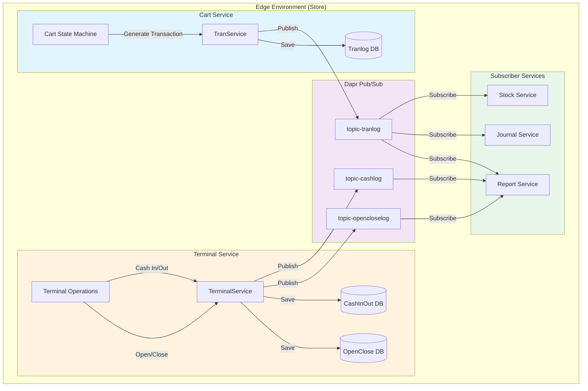
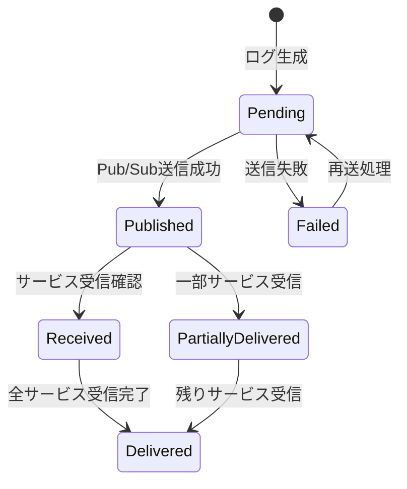

# トランザクションログフロー解析

## 1. 概要

このドキュメントでは、POSシステムにおける各種トランザクションログの生成から他サービスへの連携までのフローを解説します。主に以下の3種類のログを対象とします：

- **Transaction Logs（取引ログ）**: Cartサービスで生成される売上・返品・取消のログ
- **Open/Close Logs（開設精算ログ）**: Terminalサービスで生成される開店・閉店処理のログ
- **Cash In/Out Logs（入出金ログ）**: Terminalサービスで生成される現金入出金のログ

## 2. アーキテクチャ概要

### 2.1 全体フロー図



## 3. トランザクションログ（Cart Service）

### 3.1 ログ生成フロー

Cartサービスでは、取引が完了するタイミングで`TranService`がトランザクションログを生成します。

#### 処理の流れ：

1. **Cart State Machine**が取引を処理し、支払い完了状態に遷移
2. **TranService.create_tranlog()**メソッドが呼ばれる
3. トランザクション番号の採番（TerminalCounterRepositoryを使用）
4. レシートデータの生成（ReceiptDataStrategyを使用）
5. トランザクションログをMongoDBに保存
6. 配信ステータスの初期化（report, journal, stockサービス向け）
7. Dapr Pub/Sub経由でログをパブリッシュ

### 3.2 データ構造

```python
# トランザクションログの主要フィールド
{
    "event_id": "unique-event-id",
    "tenant_id": "A1234",
    "store_code": "STORE001",
    "terminal_no": "T001",
    "transaction_no": "2024010100001",
    "transaction_type": "sale",  # sale/refund/void
    "business_date": "2024-01-01",
    "generate_date_time": "2024-01-01T10:30:00Z",
    "items": [...],
    "payments": [...],
    "receipt_text": "...",
    "journal_text": "..."
}
```

### 3.3 配信管理

TranServiceは配信状態を管理し、各サービスへの配信を保証します：

```python
# 配信先サービスの定義
event_destinations = [
    {"service_name": "report", "status": "pending"},
    {"service_name": "journal", "status": "pending"},
    {"service_name": "stock", "status": "pending"},
]
```

## 4. 開設精算ログ・入出金ログ（Terminal Service）

### 4.1 開設精算ログの生成

端末の開設（Open）・精算（Close）時に生成されます。

#### 開設時の処理フロー：

1. **TerminalService.open_terminal_async()**が実行される
2. 端末ステータスを"Opened"に更新
3. 初期現金がある場合、Cash In/Out Logを生成
4. Open/Close Logを生成
5. 両ログをMongoDBに保存（トランザクション処理）
6. Dapr Pub/Sub経由で各ログをパブリッシュ

### 4.2 入出金ログの生成

現金の入出金操作時に生成されます：

```python
# 入出金ログの主要フィールド
{
    "event_id": "unique-cash-event-id",
    "tenant_id": "A1234",
    "store_code": "STORE001",
    "terminal_no": "T001",
    "cash_type": "cash_in",  # cash_in/cash_out
    "amount": 10000.00,
    "staff_id": "STAFF001",
    "generate_date_time": "2024-01-01T09:00:00Z"
}
```

## 5. Dapr Pub/Sub統合

### 5.1 パブリッシャー側（送信）

各サービスは`PubsubManager`クラスを使用してメッセージをパブリッシュします：

```python
# Cart Service - トランザクションログの送信
pubsub_name = "pubsub-tranlog-report"
topic_name = "topic-tranlog"
await pubsub_manager.publish_message_async(
    pubsub_name=pubsub_name,
    topic_name=topic_name,
    message=tranlog_dict
)

# Terminal Service - 開設精算ログの送信
pubsub_name = "pubsub-opencloselog-report"
topic_name = "topic-opencloselog"
await pubsub_manager.publish_message_async(
    pubsub_name=pubsub_name,
    topic_name=topic_name,
    message=open_close_dict
)

# Terminal Service - 入出金ログの送信
pubsub_name = "pubsub-cashlog-report"
topic_name = "topic-cashlog"
await pubsub_manager.publish_message_async(
    pubsub_name=pubsub_name,
    topic_name=topic_name,
    message=cash_dict
)
```

### 5.2 サブスクライバー側（受信）

各サービスはDaprのサブスクリプション機能でメッセージを受信します：

```python
# Report Service - サブスクリプション設定
@app.get("/dapr/subscribe")
def subscribe():
    return [
        {"pubsubname": "pubsub-tranlog-report", "topic": "topic-tranlog", "route": "/api/v1/tranlog"},
        {"pubsubname": "pubsub-cashlog-report", "topic": "topic-cashlog", "route": "/api/v1/cashlog"},
        {"pubsubname": "pubsub-opencloselog-report", "topic": "topic-opencloselog", "route": "/api/v1/opencloselog"},
    ]
```

## 6. 信頼性保証機能

### 6.1 Circuit Breaker パターン

`DaprClientHelper`クラスにCircuit Breakerが実装されており、外部サービス障害時の影響を最小化します：

- **閾値**: 3回連続失敗でサーキットオープン
- **タイムアウト**: 60秒後にハーフオープン状態へ遷移
- **状態**: Closed（正常） → Open（遮断） → Half-Open（復旧試行）

### 6.2 配信ステータス管理

各ログには配信ステータスが管理され、未配信ログの再送処理が実装されています：



### 6.3 再送処理

定期的に未配信ログをチェックし、自動的に再送します：

```python
async def republish_undelivered_tranlog_async():
    # 指定時間以内の未配信ログを取得
    undelivered_logs = await find_pending_deliveries(hours_ago=24)

    for log in undelivered_logs:
        # 作成から一定時間経過したログは再送
        if log.created_at < threshold:
            await publish_tranlog_async(log.payload)
```

## 7. サービス間の責任分担

### 7.1 Cart Service
- **責任**: 取引トランザクションログの生成と配信
- **保証**: At-least-once delivery（最低1回配信）
- **永続化**: MongoDBへの保存とDapr State Storeでの重複排除

### 7.2 Terminal Service
- **責任**: 端末操作ログ（開設精算・入出金）の生成と配信
- **保証**: At-least-once delivery
- **永続化**: MongoDBへの保存

### 7.3 Report Service
- **責任**: 各種ログの集計とレポート生成
- **冪等性**: event_idによる重複処理の防止
- **データ保存**: 日次サマリーの生成と保存

### 7.4 Journal Service
- **責任**: 電子ジャーナルの保管と監査ログ管理
- **冪等性**: event_idによる重複処理の防止
- **長期保存**: 法的要件に基づく保存期間管理

### 7.5 Stock Service
- **責任**: 在庫の更新と管理
- **冪等性**: transaction_noによる重複処理の防止
- **一貫性**: 取引タイプ（sale/refund/void）に応じた在庫調整

## 8. エラーハンドリング

### 8.1 送信側エラー処理

```python
# PubsubManagerのエラーハンドリング
success, error_msg = await pubsub_manager.publish_message_async(...)
if not success:
    # 配信ステータスを"failed"に更新
    await update_delivery_status(event_id, "failed", error_msg)
    # 処理は継続（ノンブロッキング）
    logger.error(f"Failed to publish: {error_msg}")
```

### 8.2 受信側エラー処理

各サービスは受信したメッセージの処理結果を送信元に通知：

```python
# 成功時
await update_delivery_status(event_id, "received", "report", None)

# 失敗時
await update_delivery_status(event_id, "failed", "report", error_message)
```

## 9. まとめ

本システムのトランザクションログフローは以下の特徴を持ちます：

1. **疎結合**: Dapr Pub/Subによるサービス間の疎結合
2. **信頼性**: Circuit BreakerとAt-least-once deliveryによる高信頼性
3. **追跡可能性**: event_idによる全ログの追跡とステータス管理
4. **拡張性**: 新規サブスクライバーの追加が容易
5. **障害耐性**: 自動再送とフェイルオーバー機能

これらの設計により、店舗のPOSシステムで発生する全てのトランザクションが確実に記録・連携され、レポート生成、在庫管理、監査要件を満たすことが可能となっています。