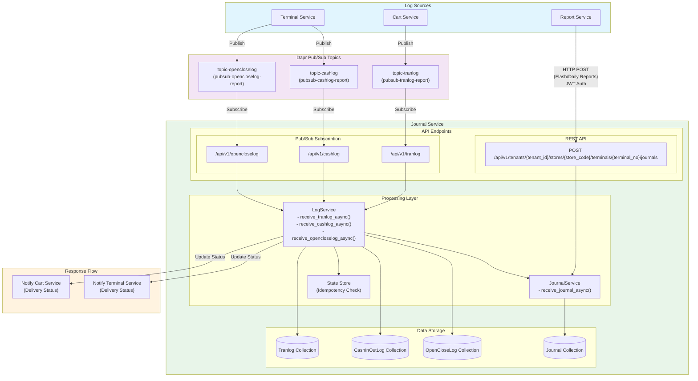
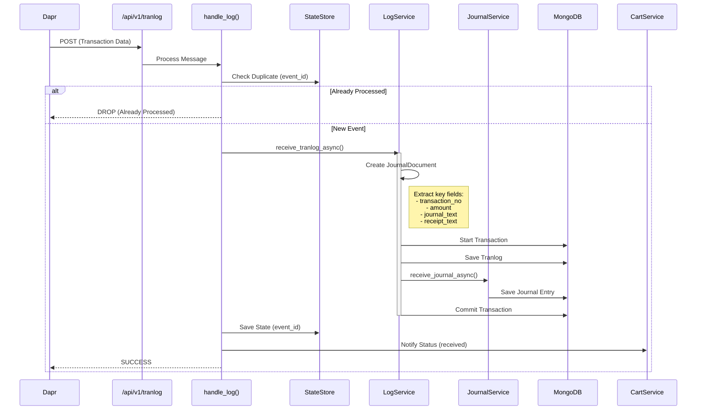
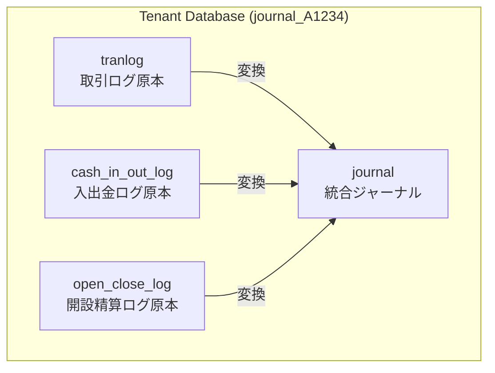
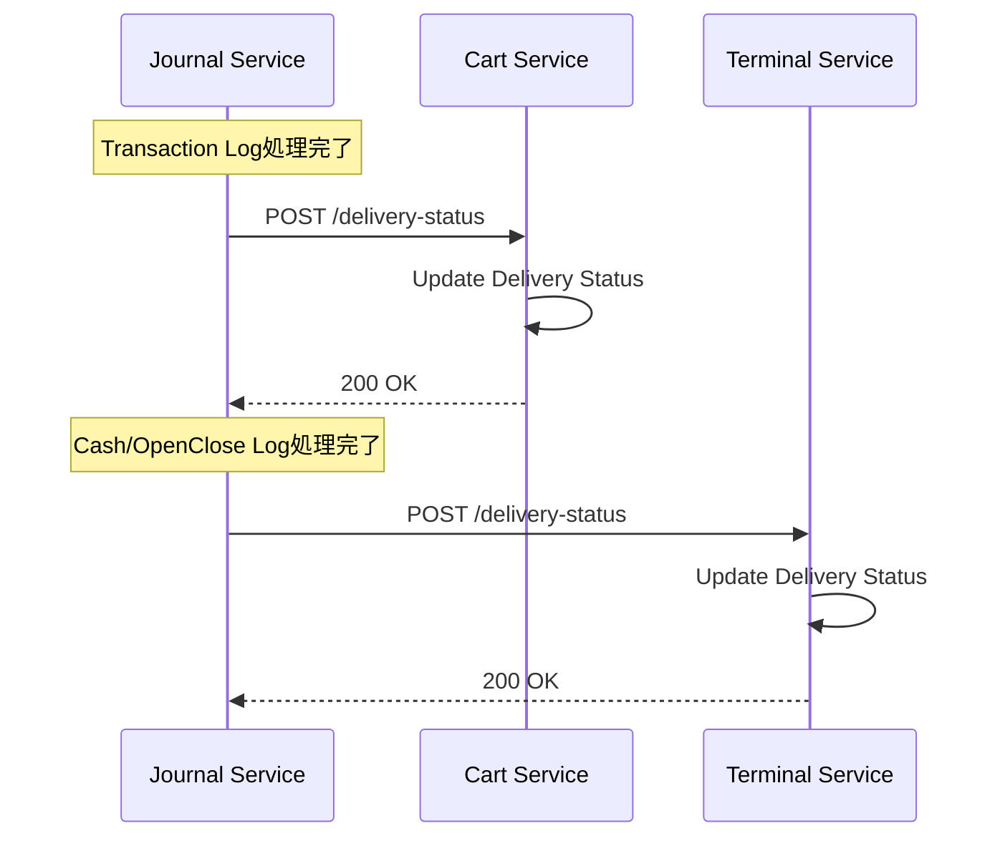
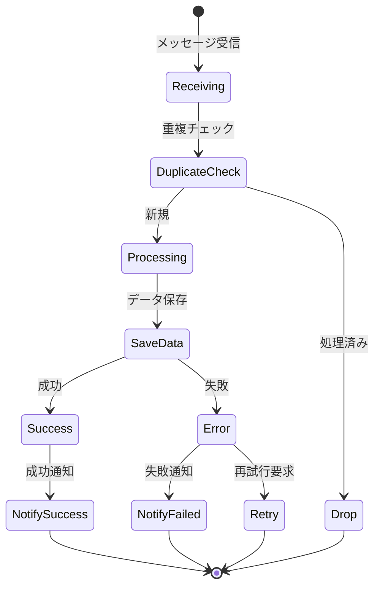
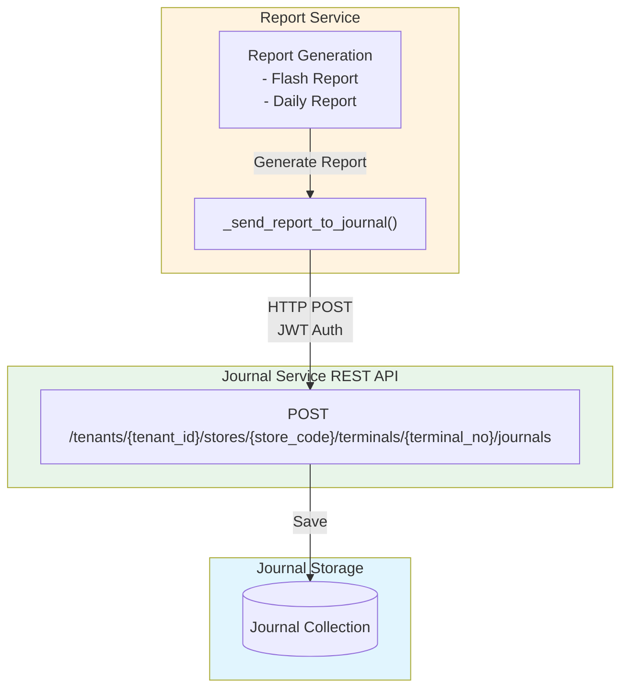

# Journal Service データフロー解析

## 1. 概要

Journal Service（ジャーナルサービス）は、POSシステムで発生する全ての取引と操作のジャーナル（電子記録）を管理するサービスです。各サービスから発生するログデータを受信し、統一されたフォーマットでジャーナルエントリーを生成・保存します。

### 主な役割
- **電子ジャーナルの生成と保存**: 全取引の詳細な記録を保持
- **法的要件への対応**: 税務監査等で必要な取引記録の長期保存
- **レシート・ジャーナルテキストの保管**: 人間が読める形式での記録保存
- **検索可能な記録管理**: 日付、端末、取引タイプ等での高速検索

## 2. データ受信アーキテクチャ

### 2.1 全体フロー図



## 3. サブスクリプション設定

### 3.1 Dapr Pub/Sub サブスクリプション

Journal Serviceは起動時にDaprに対して以下のトピックをサブスクライブします：

```python
@app.get("/dapr/subscribe")
def subscribe_topics():
    return [
        {
            "pubsubname": "pubsub-tranlog-report",
            "topic": "topic-tranlog",
            "route": "/api/v1/tranlog"
        },
        {
            "pubsubname": "pubsub-cashlog-report",
            "topic": "topic-cashlog",
            "route": "/api/v1/cashlog"
        },
        {
            "pubsubname": "pubsub-opencloselog-report",
            "topic": "topic-opencloselog",
            "route": "/api/v1/opencloselog"
        }
    ]
```

### 3.2 受信するデータの種類

| データ種別 | 送信元サービス | トピック | 内容 |
|-----------|--------------|---------|------|
| Transaction Log | Cart Service | topic-tranlog | 売上・返品・取消取引 |
| Cash In/Out Log | Terminal Service | topic-cashlog | 現金入出金記録 |
| Open/Close Log | Terminal Service | topic-opencloselog | 開設精算記録 |

## 4. データ処理フロー

### 4.1 トランザクションログ処理



### 4.2 処理の詳細

#### 4.2.1 重複処理の防止

```python
async def handle_log(request, log_type, log_model, receive_method):
    # Event IDの取得
    event_id = message["data"]["event_id"]

    # State Storeで重複チェック
    state = await get_state(event_id)
    if state:
        # 既に処理済み
        return {"status": "DROP"}

    # 新規イベントとして処理
    await receive_method(log_data)

    # 処理済みとしてマーク
    await save_state(event_id, {"event_id": event_id})
```

#### 4.2.2 ジャーナルドキュメントの生成

トランザクションログからジャーナルエントリーへの変換：

```python
journal_doc = JournalDocument(
    tenant_id=tran.tenant_id,
    store_code=tran.store_code,
    terminal_no=tran.terminal_no,
    transaction_no=tran.transaction_no,
    transaction_type=tran_type,  # 取引タイプを判定
    business_date=tran.business_date,
    amount=tran.sales.total_amount_with_tax,
    quantity=tran.sales.total_quantity,
    staff_id=tran.staff.id,
    journal_text=tran.journal_text,  # フォーマット済みジャーナルテキスト
    receipt_text=tran.receipt_text,  # フォーマット済みレシートテキスト
)
```

## 5. データ保存構造

### 5.1 コレクション構成

Journal Serviceは各テナントごとに以下のコレクションを管理：



### 5.2 ジャーナルドキュメント構造

```typescript
interface JournalDocument {
    // 識別情報
    tenant_id: string;           // テナントID
    store_code: string;          // 店舗コード
    terminal_no: number;         // 端末番号

    // 取引情報
    transaction_no?: number;     // 取引番号（取引の場合）
    transaction_type: number;    // 取引種別
    business_date: string;       // 営業日
    open_counter: number;        // 開設カウンター
    business_counter: number;    // ビジネスカウンター

    // 金額情報
    amount?: number;             // 取引金額
    quantity?: number;           // 数量
    receipt_no?: number;         // レシート番号

    // スタッフ情報
    staff_id?: string;           // スタッフID
    user_id?: string;            // ユーザーID

    // テキストデータ
    journal_text: string;        // ジャーナル表示用テキスト
    receipt_text: string;        // レシート印刷用テキスト

    // メタデータ
    generate_date_time: string;  // 生成日時
    created_at: Date;           // 作成日時
    updated_at: Date;           // 更新日時
}
```

## 6. 配信ステータス通知

### 6.1 通知フロー

Journal Serviceは受信したログの処理結果を送信元サービスに通知します：



### 6.2 通知内容

```python
# Cart Serviceへの通知
payload = {
    "event_id": event_id,
    "service": "journal",
    "status": "received",  # または "failed"
    "message": error_message  # エラー時のみ
}

# エンドポイント
endpoint = f"/tenants/{tenant_id}/stores/{store_code}/terminals/{terminal_no}/transactions/{transaction_no}/delivery-status"
```

## 7. エラーハンドリング

### 7.1 エラー処理フロー



### 7.2 トランザクション管理

データの整合性を保証するため、原本ログとジャーナルエントリーは同一トランザクションで保存：

```python
async with await self.tran_repository.start_transaction() as session:
    try:
        # セッションを共有
        self.journal_service.journal_repository.set_session(session)

        # 原本ログを保存
        await self.tran_repository.create_tranlog_async(tran)

        # ジャーナルエントリーを保存
        await self.journal_service.receive_journal_async(journal_doc)

        # コミット
        await self.tran_repository.commit_transaction()
    except Exception as e:
        # ロールバック
        await self.tran_repository.abort_transaction()
        raise e
```

## 8. 検索機能

### 8.1 検索条件

Journal Serviceは以下の条件でジャーナルを検索可能：

- **店舗コード**: 特定店舗のジャーナル
- **端末番号リスト**: 複数端末での絞り込み
- **取引タイプ**: 売上、返品、入金、出金等
- **営業日範囲**: 開始日〜終了日
- **生成日時範囲**: タイムスタンプベースの検索
- **レシート番号範囲**: レシート番号での検索
- **キーワード**: ジャーナルテキスト内の文字列検索

### 8.2 ページネーション

大量のジャーナルデータに対応するためのページネーション機能：

```python
async def get_journals_paginated_async(
    store_code: str,
    limit: int = 100,      # ページサイズ
    page: int = 1,         # ページ番号
    sort: list = None      # ソート条件
) -> PaginatedResult:
    # ページネーション付き検索結果を返す
    pass
```

## 9. システム特性

### 9.1 信頼性保証

| 特性 | 実装方法 |
|------|---------|
| **冪等性** | State Storeによるevent_id重複チェック |
| **原子性** | MongoDBトランザクションによる一括保存 |
| **追跡可能性** | event_idによる全処理の追跡 |
| **障害回復** | 送信元への配信ステータス通知 |

### 9.2 パフォーマンス考慮

- **非同期処理**: 全ての受信処理は非同期で実行
- **バッチ保存**: トランザクション内で複数コレクションへ一括保存
- **インデックス**: 検索性能向上のための適切なインデックス設計
- **State Store**: Redis による高速な重複チェック

## 10. Report Service からのレポートデータ受信

### 10.1 REST API による直接連携

Journal ServiceはPub/Sub経由のログデータに加えて、Report ServiceからREST API経由でレポートデータも受信します：



### 10.2 レポート送信の条件

Report ServiceはAPI Key経由でリクエストされた場合のみ、生成したレポートをJournal Serviceへ送信：

```python
# Report Service内の処理
if is_api_key_request:
    logger.info("API key request detected, sending to journal")
    await self._send_report_to_journal(
        store_code=store_code,
        terminal_no=terminal_no,
        report_scope=report_scope,  # "flash" or "daily"
        report_type=report_type,    # "sales" 等
        report_data=report_data,
        requesting_terminal_no=requesting_terminal_no,
        requesting_staff_id=requesting_staff_id,
    )
```

### 10.3 レポートのジャーナル化

#### 取引タイプマッピング
- **Flash Report**: `TransactionType.FlashReport` (速報レポート)
- **Daily Report**: `TransactionType.DailyReport` (日次レポート)

#### ジャーナルデータ構造
```json
{
    "tenantId": "A1234",
    "storeCode": "STORE001",
    "terminalNo": 1,  // リクエストした端末番号
    "transactionType": 501,  // Flash=501, Daily=502
    "businessDate": "20250110",
    "openCounter": 1,
    "businessCounter": 1,
    "generateDateTime": "2025-01-10T15:30:00",
    "receiptNo": 0,
    "amount": 0.0,
    "quantity": 0,
    "staffId": "STAFF001",
    "userId": null,
    "journalText": "{ レポートデータJSON }",
    "receiptText": "レポート印刷用テキスト"
}
```

### 10.4 認証方式

Report ServiceはJWT（JSON Web Token）を使用してJournal Serviceへ認証：

```python
# Service-to-Service認証トークンの生成
service_token = create_service_token(
    tenant_id=self.tenant_id,
    service_name="report"
)

headers = {"Authorization": f"Bearer {service_token}"}
```

## 11. まとめ

Journal Serviceは以下の重要な役割を果たします：

1. **統合ジャーナル管理**: Cart/Terminal/Reportサービスからの全ログを統合管理
2. **複数の受信方式**:
   - Dapr Pub/Sub経由（トランザクション、入出金、開設精算ログ）
   - REST API経由（レポートデータ）
3. **法的要件対応**: 税務監査等に必要な完全な取引記録の保持
4. **高信頼性**: Dapr Pub/Sub、State Store、MongoDBトランザクションによる確実な記録
5. **検索可能性**: 多様な条件での高速なジャーナル検索
6. **レシート再印刷**: 保存されたreceipt_textによる再印刷対応
7. **レポートアーカイブ**: 生成されたレポートの永続的保存

この設計により、POSシステムで発生する全ての取引、操作、およびレポートが確実に記録され、必要に応じて検索・参照することが可能となっています。