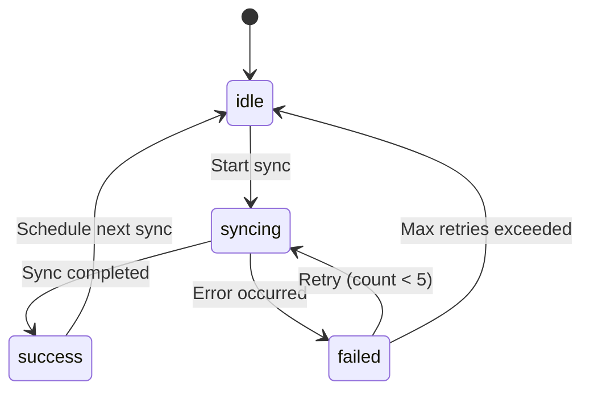
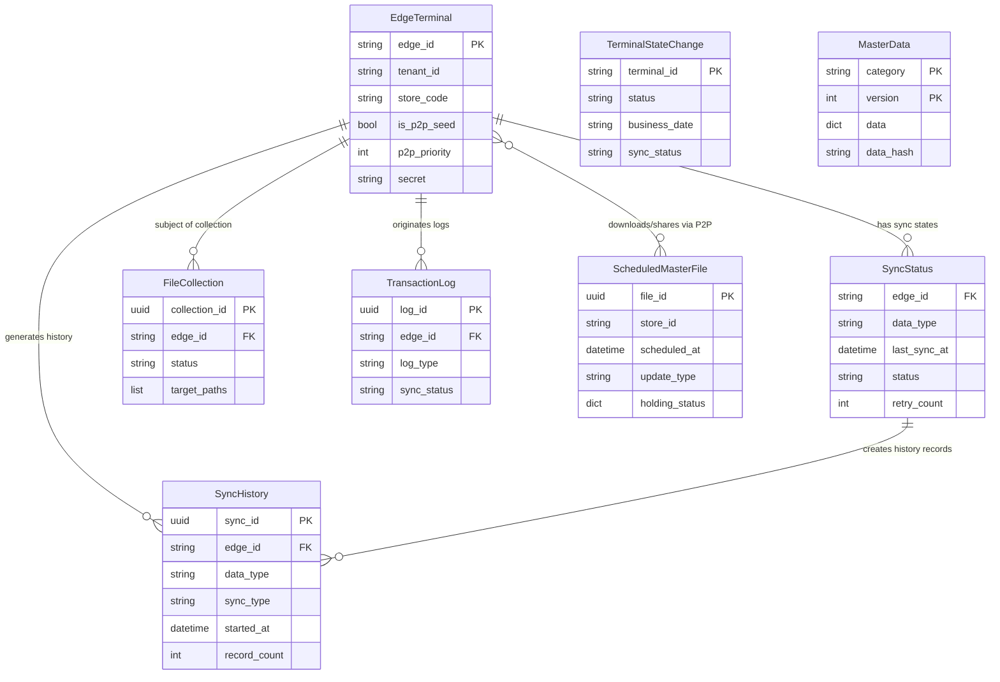

# Data Model Design: Sync Service

## Overview

This document defines the detailed data model for the Sync Service, including entity schemas, relationships, validation rules, state transitions, and indexing strategies. All entities follow the Kugelpos architecture patterns with MongoDB document model, multi-tenancy support, and async operations.

## Database Strategy

### Multi-Tenancy Isolation

- **Database Naming Pattern**: `sync_{tenant_id}`
- **Tenant Separation**: Complete database-level isolation per tenant
- **Collection Names**: snake_case convention (e.g., `sync_status`, `sync_history`)

### Connection Management

```python
# MongoDB connection string pattern
MONGODB_URI = "mongodb://{host}:{port}/sync_{tenant_id}?replicaSet=rs0"
```

## Entity Definitions

### 1. SyncStatus (Collection: `sync_status`)

**Purpose**: Tracks the current synchronization state for each edge terminal and data type combination.

#### Schema

```python
from kugel_common.models.base import BaseDocumentModel
from pydantic import Field
from typing import Optional, Literal
from datetime import datetime

class SyncStatusModel(BaseDocumentModel):
    """Synchronization status tracking for edge terminals"""

    # Primary identifiers
    edge_id: str = Field(
        ...,
        description="Edge terminal ID (format: edge-{tenant_id}-{store_code}-{seq})",
        pattern="^edge-[a-zA-Z0-9]+-[a-zA-Z0-9]+-[0-9]{3}$",
        example="edge-tenant001-store001-001"
    )

    data_type: Literal["master_data", "transaction_log", "journal", "terminal_state"] = Field(
        ...,
        description="Type of data being synchronized"
    )

    # Synchronization state
    last_sync_at: Optional[datetime] = Field(
        None,
        description="Timestamp of last successful sync (ISO 8601 format)"
    )

    sync_type: Optional[Literal["full", "incremental", "complete"]] = Field(
        None,
        description="Type of last sync: full (snapshot), incremental (delta), complete (gap fill)"
    )

    status: Literal["idle", "syncing", "success", "failed"] = Field(
        default="idle",
        description="Current sync status"
    )

    retry_count: int = Field(
        default=0,
        ge=0,
        le=5,
        description="Number of retry attempts after failure (max 5)"
    )

    error_message: Optional[str] = Field(
        None,
        max_length=2000,
        description="Detailed error message if failed"
    )

    next_sync_at: Optional[datetime] = Field(
        None,
        description="Scheduled timestamp for next sync (ISO 8601 format)"
    )

    # Metadata (inherited from BaseDocumentModel)
    # _id: ObjectId
    # created_at: datetime
    # updated_at: datetime
```

#### Validation Rules

- **Composite Uniqueness**: `(edge_id, data_type)` must be unique per database
- **Status Transitions**:
  - `idle` → `syncing` → `success` OR `failed`
  - `failed` → `syncing` (retry)
  - `success` → `idle` (next cycle)
- **Retry Count**: Must be reset to 0 on successful sync
- **Next Sync Calculation**: `next_sync_at = last_sync_at + SYNC_POLL_INTERVAL` (30-60s)

#### Indexes

```python
# Compound index for primary lookups
{"edge_id": 1, "data_type": 1}  # unique=True

# Query optimization indexes
{"status": 1, "next_sync_at": 1}  # for scheduled sync job queries
{"edge_id": 1, "updated_at": -1}  # for edge terminal status dashboard
```

#### State Transitions



---

### 2. SyncHistory (Collection: `sync_history`)

**Purpose**: Immutable audit log of all synchronization executions for monitoring and troubleshooting.

#### Schema

```python
from uuid import UUID, uuid4
from typing import Optional, Literal

class SyncHistoryModel(BaseDocumentModel):
    """Immutable sync execution history for audit and troubleshooting"""

    # Primary identifier
    sync_id: UUID = Field(
        default_factory=uuid4,
        description="Unique sync history record ID"
    )

    # Sync target
    edge_id: str = Field(
        ...,
        description="Edge terminal ID",
        pattern="^edge-[a-zA-Z0-9]+-[a-zA-Z0-9]+-[0-9]{3}$"
    )

    data_type: Literal["master_data", "transaction_log", "journal", "terminal_state"] = Field(
        ...,
        description="Type of synchronized data"
    )

    sync_type: Literal["full", "incremental", "complete"] = Field(
        ...,
        description="Sync method: full, incremental, or gap completion"
    )

    direction: Literal["cloud_to_edge", "edge_to_cloud"] = Field(
        ...,
        description="Data flow direction"
    )

    # Execution timestamps
    started_at: datetime = Field(
        ...,
        description="Sync process start time (ISO 8601 format)"
    )

    completed_at: Optional[datetime] = Field(
        None,
        description="Sync process completion time (ISO 8601 format)"
    )

    # Sync metrics
    record_count: int = Field(
        default=0,
        ge=0,
        description="Number of records synchronized"
    )

    data_size_bytes: int = Field(
        default=0,
        ge=0,
        description="Total data size in bytes"
    )

    # Result
    status: Literal["success", "failed"] = Field(
        ...,
        description="Sync execution result"
    )

    error_detail: Optional[str] = Field(
        None,
        max_length=5000,
        description="Detailed error message and stack trace if failed"
    )

    retry_count: int = Field(
        default=0,
        ge=0,
        le=5,
        description="Number of retry attempts"
    )

    duration_ms: int = Field(
        ...,
        ge=0,
        description="Sync processing time in milliseconds"
    )
```

#### Validation Rules

- **Immutability**: Records are write-once, never updated after creation
- **Duration Calculation**: `duration_ms = (completed_at - started_at).total_seconds() * 1000`
- **Retention Policy**: Archive records older than 90 days to cold storage

#### Indexes

```python
# Query optimization indexes
{"edge_id": 1, "started_at": -1}  # for edge terminal history queries
{"data_type": 1, "started_at": -1}  # for data type analytics
{"status": 1, "started_at": -1}  # for failure analysis
{"sync_id": 1}  # unique=True, for direct lookups
{"started_at": -1}  # for time-range queries (TTL index: 90 days)
```

---

### 3. EdgeTerminal (Collection: `edge_terminals`)

**Purpose**: Manages edge terminal registration, authentication credentials, and P2P configuration.

#### Schema

```python
from typing import Literal, Optional
from datetime import datetime

class EdgeTerminalModel(BaseDocumentModel):
    """Edge terminal registration and configuration"""

    # Primary identifier
    edge_id: str = Field(
        ...,
        description="Global unique edge terminal ID",
        pattern="^edge-[a-zA-Z0-9]+-[a-zA-Z0-9]+-[0-9]{3}$",
        example="edge-tenant001-store001-001"
    )

    # Multi-tenancy
    tenant_id: str = Field(
        ...,
        description="Tenant identifier for multi-tenancy isolation",
        min_length=3,
        max_length=50
    )

    store_code: str = Field(
        ...,
        description="Store identifier",
        min_length=3,
        max_length=50
    )

    # Device classification
    device_type: Literal["edge", "pos"] = Field(
        default="edge",
        description="Terminal type: edge (dedicated Edge device) or pos (POS terminal)"
    )

    # P2P configuration
    is_p2p_seed: bool = Field(
        default=False,
        description="Whether this terminal is a P2P seed for file sharing"
    )

    p2p_priority: int = Field(
        default=99,
        ge=0,
        le=99,
        description="P2P access priority: 0=highest (primary seed), 1-9=secondary seeds, 99=non-seed"
    )

    # Authentication
    secret: str = Field(
        ...,
        description="JWT authentication secret (SHA256 hashed)",
        min_length=64,
        max_length=64,
        pattern="^[a-f0-9]{64}$"
    )

    # Health monitoring
    last_heartbeat_at: Optional[datetime] = Field(
        None,
        description="Last health check timestamp (ISO 8601 format)"
    )

    status: Literal["online", "offline"] = Field(
        default="offline",
        description="Terminal online/offline status"
    )
```

#### Validation Rules

- **Edge ID Format**: `edge-{tenant_id}-{store_code}-{seq:003d}`
- **Secret Storage**: Store SHA256 hash only (never plaintext)
- **P2P Priority Logic**:
  - 0: Primary seed (first to receive from cloud)
  - 1-9: Secondary seeds (receive from cloud, serve to peers)
  - 99: Non-seed (receive from P2P peers only)
- **Status Update**: Mark `offline` if `last_heartbeat_at` > 5 minutes ago

#### Indexes

```python
# Primary lookup
{"edge_id": 1}  # unique=True

# P2P peer discovery
{"store_code": 1, "p2p_priority": 1, "status": 1}  # for P2P seed selection

# Multi-tenancy filtering
{"tenant_id": 1, "store_code": 1}

# Health monitoring
{"status": 1, "last_heartbeat_at": -1}
```

---

### 4. ScheduledMasterFile (Collection: `scheduled_master_files`)

**Purpose**: Manages scheduled master data files for future application at specified timestamps.

#### Schema

```python
from uuid import UUID, uuid4
from typing import Optional, Dict, Literal
from datetime import datetime

class ScheduledMasterFileModel(BaseDocumentModel):
    """Scheduled master file for future application"""

    # Primary identifier
    file_id: UUID = Field(
        default_factory=uuid4,
        description="Unique file identifier"
    )

    # Target specification
    store_id: str = Field(
        ...,
        description="Target store ID, or '*' for all stores",
        min_length=1,
        max_length=50
    )

    # Scheduling
    scheduled_at: datetime = Field(
        ...,
        description="Target application timestamp (ISO 8601 format, extracted from filename)"
    )

    timing_type: Literal["scheduled", "immediate"] = Field(
        ...,
        description="Application timing: scheduled (future) or immediate (past timestamp)"
    )

    priority: int = Field(
        default=50,
        ge=0,
        le=99,
        description="Application priority for same timestamp (lower = higher priority)"
    )

    # Update specification
    update_type: Literal["A", "M"] = Field(
        ...,
        description="Update mode: A (All/full replace) or M (Modify/delta update)"
    )

    # File metadata
    created_at: datetime = Field(
        default_factory=datetime.utcnow,
        description="File registration timestamp (ISO 8601 format)"
    )

    file_path: str = Field(
        ...,
        description="Blob storage file path",
        max_length=500
    )

    file_size_bytes: int = Field(
        ...,
        ge=0,
        description="File size in bytes"
    )

    checksum: str = Field(
        ...,
        description="SHA-256 checksum for integrity verification",
        pattern="^[a-f0-9]{64}$"
    )

    # Distribution tracking
    holding_status: Dict[str, str] = Field(
        default_factory=dict,
        description="Per-edge file possession status: {edge_id: status}"
    )

    applied_count: int = Field(
        default=0,
        ge=0,
        description="Number of edge terminals that applied this file"
    )
```

#### Validation Rules

- **Filename Pattern**: `[マスタ反映日時]_[更新タイミング]_[反映優先順位]_[ファイルID]_[マスタ作成日時]_[更新区分]_S[店舗ID].json`
  - Example: `202501011200_S_01_ITEM01_20250115123456_A_S001.json`
- **Timing Type Logic**:
  - `scheduled`: `scheduled_at > current_time`
  - `immediate`: `scheduled_at <= current_time`
- **Holding Status Values**: `pending`, `downloading`, `downloaded`, `applied`, `failed`
- **Application Rule**: Files are applied in order of `(scheduled_at ASC, priority ASC)`

#### Indexes

```python
# Scheduled job scanning (every 1 minute)
{"scheduled_at": 1, "timing_type": 1, "priority": 1}

# Distribution tracking
{"store_id": 1, "applied_count": 1}

# File lookup
{"file_id": 1}  # unique=True

# Cleanup query
{"scheduled_at": -1, "applied_count": 1}  # for archiving old files
```

---

### 5. FileCollection (Collection: `file_collections`)

**Purpose**: Tracks remote file collection tasks from edge terminals for troubleshooting.

#### Schema

```python
from uuid import UUID, uuid4
from typing import List, Optional, Literal
from datetime import datetime

class FileCollectionModel(BaseDocumentModel):
    """Remote file collection task for edge terminals"""

    # Primary identifier
    collection_id: UUID = Field(
        default_factory=uuid4,
        description="Unique collection task ID"
    )

    # Target specification (1 record per edge terminal)
    edge_id: str = Field(
        ...,
        description="Target edge terminal ID (must be specific, not wildcard)",
        pattern="^edge-[a-zA-Z0-9]+-[a-zA-Z0-9]+-[0-9]{3}$"
    )

    # Collection specification
    collection_name: str = Field(
        ...,
        description="Human-readable collection task name",
        min_length=1,
        max_length=100,
        example="error-logs-2025-10-12"
    )

    target_paths: List[str] = Field(
        ...,
        description="List of file/directory paths to collect",
        min_items=1,
        max_items=50
    )

    exclude_patterns: List[str] = Field(
        default_factory=list,
        description="Glob patterns for files to exclude",
        max_items=20
    )

    max_size_mb: int = Field(
        default=100,
        ge=1,
        le=100,
        description="Maximum compressed archive size in MB"
    )

    # Execution state
    status: Literal["pending", "collecting", "completed", "failed"] = Field(
        default="pending",
        description="Collection task status"
    )

    file_count: int = Field(
        default=0,
        ge=0,
        description="Number of files collected"
    )

    archive_size_bytes: int = Field(
        default=0,
        ge=0,
        description="Compressed archive size in bytes"
    )

    download_url: Optional[str] = Field(
        None,
        description="Signed URL for admin to download archive (time-limited)",
        max_length=500
    )

    # Timestamps
    started_at: Optional[datetime] = Field(
        None,
        description="Collection start timestamp (ISO 8601 format)"
    )

    completed_at: Optional[datetime] = Field(
        None,
        description="Collection completion timestamp (ISO 8601 format)"
    )

    error_message: Optional[str] = Field(
        None,
        max_length=2000,
        description="Detailed error message if failed"
    )
```

#### Validation Rules

- **Whitelist Validation**: All `target_paths` must match whitelist patterns (security)
- **Size Limit**: Archive generation stops if `archive_size_bytes` exceeds `max_size_mb * 1024 * 1024`
- **URL Expiration**: `download_url` expires after 7 days
- **Batch Creation**: For "all edge terminals" collection request, create 1 record per terminal

#### Indexes

```python
# Primary lookups
{"collection_id": 1}  # unique=True

# Edge terminal queries
{"edge_id": 1, "created_at": -1}  # for edge terminal collection history

# Status monitoring
{"status": 1, "created_at": -1}  # for pending/failed task cleanup

# Cleanup query (delete completed tasks after 30 days)
{"completed_at": 1, "status": 1}
```

---

### 6. MasterData (Collection: `master_data`)

**Purpose**: Cached master data synchronized from cloud to edge terminals.

#### Schema

```python
from typing import Dict, Any, Literal
from datetime import datetime

class MasterDataModel(BaseDocumentModel):
    """Master data synchronized from cloud (master-data service)"""

    # Category identifier
    category: Literal[
        "categories",
        "products_common",
        "products_store",
        "payment_methods",
        "staff",
        "tax_rules",
        "settings"
    ] = Field(
        ...,
        description="Master data category"
    )

    # Versioning
    version: int = Field(
        ...,
        ge=1,
        description="Sequential version number for change tracking"
    )

    updated_at: datetime = Field(
        ...,
        description="Master data update timestamp (ISO 8601 format)"
    )

    # Data payload
    data: Dict[str, Any] = Field(
        ...,
        description="Actual master data content (category-specific structure)"
    )

    # Metadata
    data_hash: str = Field(
        ...,
        description="SHA-256 hash of data field for integrity verification",
        pattern="^[a-f0-9]{64}$"
    )

    record_count: int = Field(
        default=0,
        ge=0,
        description="Number of records in this master data version"
    )
```

#### Validation Rules

- **Version Sequence**: Versions must be sequential per category (detect gaps with FR-009)
- **Data Hash Verification**: `data_hash = sha256(json.dumps(data, sort_keys=True)).hexdigest()`
- **Category-Specific Schemas**: Each category has its own data structure (defined by master-data service)

#### Indexes

```python
# Primary lookup
{"category": 1, "version": 1}  # unique=True

# Latest version queries
{"category": 1, "version": -1}

# Gap detection
{"category": 1, "updated_at": 1}
```

---

### 7. TransactionLog (Collection: `transaction_logs`)

**Purpose**: Edge-originated transaction data queued for cloud transmission.

#### Schema

```python
from uuid import UUID, uuid4
from typing import Dict, Any, Literal, Optional
from datetime import datetime

class TransactionLogModel(BaseDocumentModel):
    """Transaction log from edge to cloud"""

    # Primary identifier
    log_id: UUID = Field(
        default_factory=uuid4,
        description="Unique transaction log ID"
    )

    # Source
    edge_id: str = Field(
        ...,
        description="Originating edge terminal ID",
        pattern="^edge-[a-zA-Z0-9]+-[a-zA-Z0-9]+-[0-9]{3}$"
    )

    # Log type
    log_type: Literal["transaction", "opening_closing", "cash_inout", "journal"] = Field(
        ...,
        description="Transaction log type"
    )

    # Occurrence
    occurred_at: datetime = Field(
        ...,
        description="Transaction occurrence timestamp (ISO 8601 format)"
    )

    # Payload
    data: Dict[str, Any] = Field(
        ...,
        description="Transaction data content (type-specific structure)"
    )

    # Sync tracking
    sync_status: Literal["pending", "sending", "sent", "failed"] = Field(
        default="pending",
        description="Cloud transmission status"
    )

    synced_at: Optional[datetime] = Field(
        None,
        description="Cloud transmission completion timestamp (ISO 8601 format)"
    )

    retry_count: int = Field(
        default=0,
        ge=0,
        le=5,
        description="Transmission retry count (max 5)"
    )

    error_message: Optional[str] = Field(
        None,
        max_length=2000,
        description="Transmission error message if failed"
    )
```

#### Validation Rules

- **Idempotency**: `log_id` must be UUID to ensure unique identification
- **At-Least-Once Delivery**: Retry up to 5 times with exponential backoff
- **Garbage Collection**: Delete `sent` records older than 30 days (configurable retention)
- **Queue Capacity**: If unsent queue exceeds 10,000 records, delete oldest `pending` records

#### Indexes

```python
# Transmission queue queries
{"sync_status": 1, "occurred_at": 1}  # for batch transmission

# Edge terminal queries
{"edge_id": 1, "occurred_at": -1}

# Cleanup queries
{"sync_status": 1, "synced_at": 1}  # for garbage collection (TTL index: 30 days)

# Primary lookup
{"log_id": 1}  # unique=True
```

---

### 8. TerminalStateChange (Collection: `terminal_state_changes`)

**Purpose**: Tracks terminal status changes for cloud synchronization (from terminal service).

#### Schema

```python
from typing import Literal, Optional
from datetime import datetime

class TerminalStateChangeModel(BaseDocumentModel):
    """Terminal status change tracking for cloud sync"""

    # Primary identifier
    terminal_id: str = Field(
        ...,
        description="Terminal unique ID (format: {tenant_id}-{store_code}-{terminal_no})",
        pattern="^[a-zA-Z0-9]+-[a-zA-Z0-9]+-[0-9]+$",
        example="tenant001-store001-1"
    )

    # Terminal state
    status: Literal["Idle", "Opened", "Closed"] = Field(
        ...,
        description="Current terminal status: Idle (not opened), Opened (active), Closed (settled)"
    )

    function_mode: str = Field(
        ...,
        description="Current function mode: Sales, Returns, etc.",
        max_length=50
    )

    business_date: str = Field(
        ...,
        description="Current business date (YYYYMMDD format)",
        pattern="^[0-9]{8}$",
        example="20251012"
    )

    # Counters
    open_counter: int = Field(
        ...,
        ge=0,
        description="Opening count within the same business date (resets daily)"
    )

    business_counter: int = Field(
        ...,
        ge=0,
        description="Cumulative opening count (never resets)"
    )

    # Change tracking
    status_changed_at: datetime = Field(
        ...,
        description="Status change timestamp (ISO 8601 format)"
    )

    previous_status: Optional[Literal["Idle", "Opened", "Closed"]] = Field(
        None,
        description="Previous status before this change"
    )

    operator_id: str = Field(
        ...,
        description="Staff ID who performed the status change",
        max_length=50
    )

    # Sync tracking
    sync_status: Literal["pending", "sent"] = Field(
        default="pending",
        description="Cloud transmission status"
    )

    synced_at: Optional[datetime] = Field(
        None,
        description="Cloud transmission timestamp (ISO 8601 format)"
    )
```

#### Validation Rules

- **Terminal ID Format**: `{tenant_id}-{store_code}-{terminal_no}` (matches TerminalInfo in terminal service)
- **Status Transitions**:
  - `Idle` → `Opened` (terminal opening)
  - `Opened` → `Closed` (terminal settlement)
  - `Closed` → `Opened` (re-opening)
- **Business Date Format**: `YYYYMMDD` string (8 digits)
- **Sync Retention**: Keep `sent` records for 90 days

#### Indexes

```python
# Primary lookup
{"terminal_id": 1, "status_changed_at": -1}

# Transmission queue
{"sync_status": 1, "status_changed_at": 1}

# Analytics queries
{"business_date": 1, "status": 1}

# Cleanup (TTL index: 90 days)
{"sync_status": 1, "synced_at": 1}
```

---

## Entity Relationships



## Repository Pattern Implementation

### Base Repository

All entity repositories inherit from `AbstractRepository` (from commons library):

```python
from kugel_common.models.repositories.abstract_repository import AbstractRepository
from motor.motor_asyncio import AsyncIOMotorDatabase

class SyncStatusRepository(AbstractRepository[SyncStatusModel]):
    """Repository for SyncStatus operations"""

    def __init__(self, db: AsyncIOMotorDatabase):
        super().__init__(db, "sync_status", SyncStatusModel)

    async def find_by_edge_and_type(
        self,
        edge_id: str,
        data_type: str
    ) -> Optional[SyncStatusModel]:
        """Find sync status by edge ID and data type"""
        return await self.find_one({"edge_id": edge_id, "data_type": data_type})

    async def find_pending_syncs(
        self,
        current_time: datetime
    ) -> List[SyncStatusModel]:
        """Find sync tasks ready for execution"""
        query = {
            "status": "idle",
            "next_sync_at": {"$lte": current_time}
        }
        return await self.find_many(query, limit=100)
```

### Index Creation

Indexes are created during service initialization:

```python
async def create_indexes(db: AsyncIOMotorDatabase) -> None:
    """Create all indexes for sync service collections"""

    # SyncStatus indexes
    await db.sync_status.create_index(
        [("edge_id", 1), ("data_type", 1)],
        unique=True,
        name="edge_data_unique"
    )
    await db.sync_status.create_index(
        [("status", 1), ("next_sync_at", 1)],
        name="scheduled_sync"
    )

    # SyncHistory indexes
    await db.sync_history.create_index(
        [("sync_id", 1)],
        unique=True,
        name="sync_id_unique"
    )
    await db.sync_history.create_index(
        [("edge_id", 1), ("started_at", -1)],
        name="edge_history"
    )

    # EdgeTerminal indexes
    await db.edge_terminals.create_index(
        [("edge_id", 1)],
        unique=True,
        name="edge_id_unique"
    )
    await db.edge_terminals.create_index(
        [("store_code", 1), ("p2p_priority", 1), ("status", 1)],
        name="p2p_discovery"
    )

    # ScheduledMasterFile indexes
    await db.scheduled_master_files.create_index(
        [("file_id", 1)],
        unique=True,
        name="file_id_unique"
    )
    await db.scheduled_master_files.create_index(
        [("scheduled_at", 1), ("timing_type", 1), ("priority", 1)],
        name="scheduled_application"
    )

    # FileCollection indexes
    await db.file_collections.create_index(
        [("collection_id", 1)],
        unique=True,
        name="collection_id_unique"
    )
    await db.file_collections.create_index(
        [("edge_id", 1), ("created_at", -1)],
        name="edge_collections"
    )

    # TransactionLog indexes
    await db.transaction_logs.create_index(
        [("log_id", 1)],
        unique=True,
        name="log_id_unique"
    )
    await db.transaction_logs.create_index(
        [("sync_status", 1), ("occurred_at", 1)],
        name="transmission_queue"
    )
    await db.transaction_logs.create_index(
        [("synced_at", 1)],
        expireAfterSeconds=2592000,  # 30 days TTL
        name="cleanup_ttl"
    )

    # MasterData indexes
    await db.master_data.create_index(
        [("category", 1), ("version", 1)],
        unique=True,
        name="category_version_unique"
    )

    # TerminalStateChange indexes
    await db.terminal_state_changes.create_index(
        [("terminal_id", 1), ("status_changed_at", -1)],
        name="terminal_state_history"
    )
    await db.terminal_state_changes.create_index(
        [("sync_status", 1), ("status_changed_at", 1)],
        name="state_transmission_queue"
    )
```

## Data Integrity Guarantees

### Checksum Verification (FR-007)

```python
import hashlib

def calculate_checksum(data: dict) -> str:
    """Calculate SHA-256 checksum of data"""
    data_json = json.dumps(data, sort_keys=True)
    return hashlib.sha256(data_json.encode()).hexdigest()

async def verify_master_data_integrity(
    received_data: dict,
    received_checksum: str
) -> bool:
    """Verify master data integrity with checksum"""
    calculated = calculate_checksum(received_data)
    if calculated != received_checksum:
        logger.error(
            f"Checksum mismatch: expected {received_checksum}, got {calculated}"
        )
        return False
    return True
```

### Record Count Verification (FR-008)

```python
async def verify_record_count(
    sync_id: UUID,
    expected_count: int,
    actual_count: int
) -> bool:
    """Verify record count matches expected"""
    if expected_count != actual_count:
        logger.error(
            f"Record count mismatch for sync {sync_id}: "
            f"expected {expected_count}, got {actual_count}"
        )
        return False
    return True
```

### Version Gap Detection (FR-009)

```python
async def detect_version_gaps(
    category: str,
    repository: MasterDataRepository
) -> List[int]:
    """Detect missing version numbers in master data sequence"""
    all_versions = await repository.find_versions_by_category(category)
    if not all_versions:
        return []

    max_version = max(all_versions)
    expected_versions = set(range(1, max_version + 1))
    actual_versions = set(all_versions)
    gaps = sorted(expected_versions - actual_versions)

    if len(gaps) > 50:
        logger.warning(
            f"Version gap count {len(gaps)} exceeds threshold (50), "
            f"recommend full sync for category {category}"
        )

    return gaps[:20]  # Return max 20 gaps per cycle (FR-009)
```

## Constitution Compliance

### Async-First Principle (II)

All repository operations are async:

```python
# ✅ Correct
result = await repository.find_one({"edge_id": edge_id})

# ❌ Incorrect
result = repository.find_one_sync({"edge_id": edge_id})  # No sync methods
```

### Multi-Tenancy (VI)

Database-level isolation enforced:

```python
def get_database(tenant_id: str) -> AsyncIOMotorDatabase:
    """Get tenant-specific database"""
    db_name = f"sync_{tenant_id}"
    return mongo_client[db_name]
```

### TDD (III)

All models have comprehensive tests:

```python
# Example test structure
# tests/test_models/test_sync_status.py
async def test_sync_status_validation():
    """Test SyncStatusModel field validation"""
    # Valid model
    valid_status = SyncStatusModel(
        edge_id="edge-tenant001-store001-001",
        data_type="master_data",
        status="idle"
    )
    assert valid_status.edge_id == "edge-tenant001-store001-001"

    # Invalid edge_id pattern
    with pytest.raises(ValidationError):
        SyncStatusModel(
            edge_id="invalid-format",
            data_type="master_data"
        )
```

## Next Steps

With `data-model.md` complete, proceed to:

1. **Phase 1: contracts/** - Generate OpenAPI specifications for:
   - `auth-api.yaml`: Authentication endpoints
   - `sync-api.yaml`: Synchronization endpoints
   - `scheduled-master-api.yaml`: Scheduled master file endpoints
   - `file-collection-api.yaml`: File collection endpoints

2. **Phase 1: quickstart.md** - Create developer quickstart guide

---

**Document Version**: 1.0.0
**Last Updated**: 2025-10-13
**Status**: Complete
