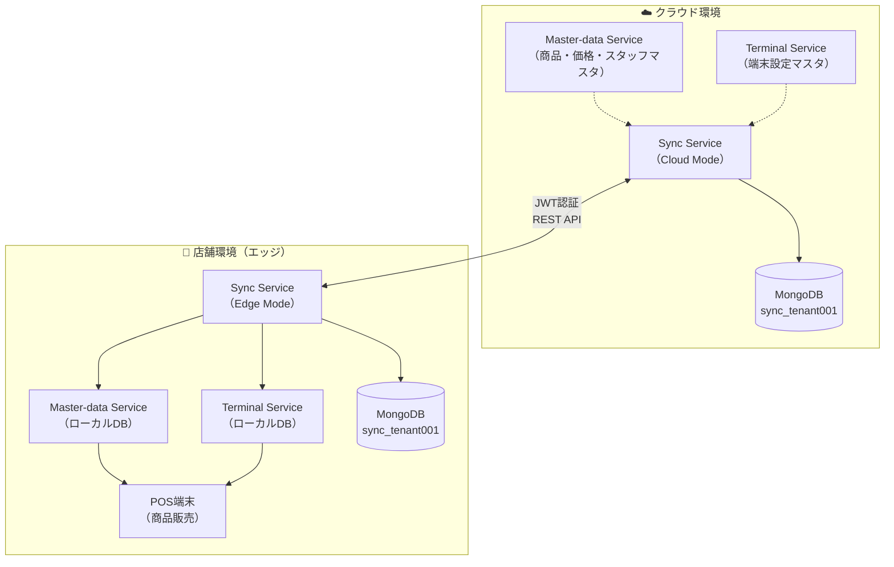
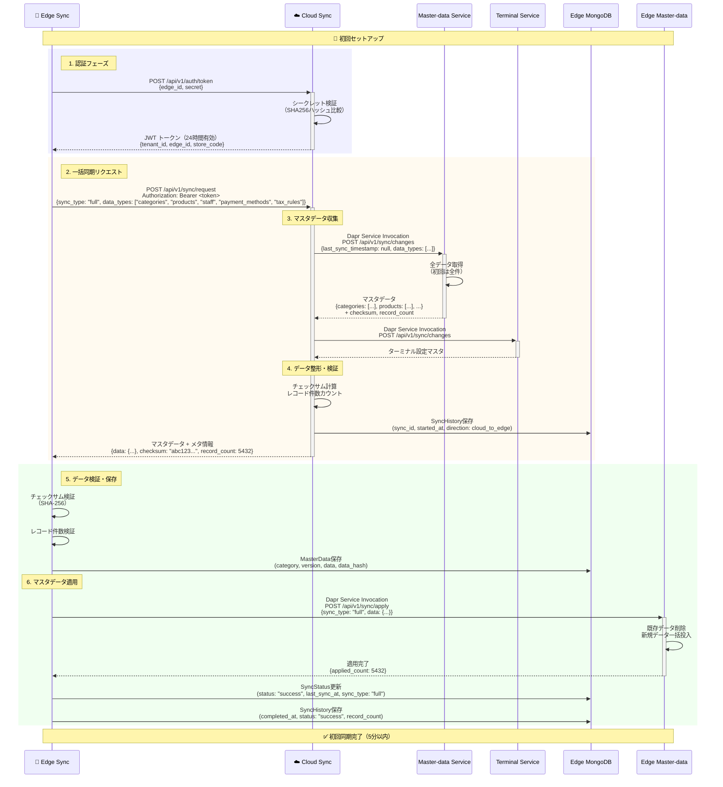
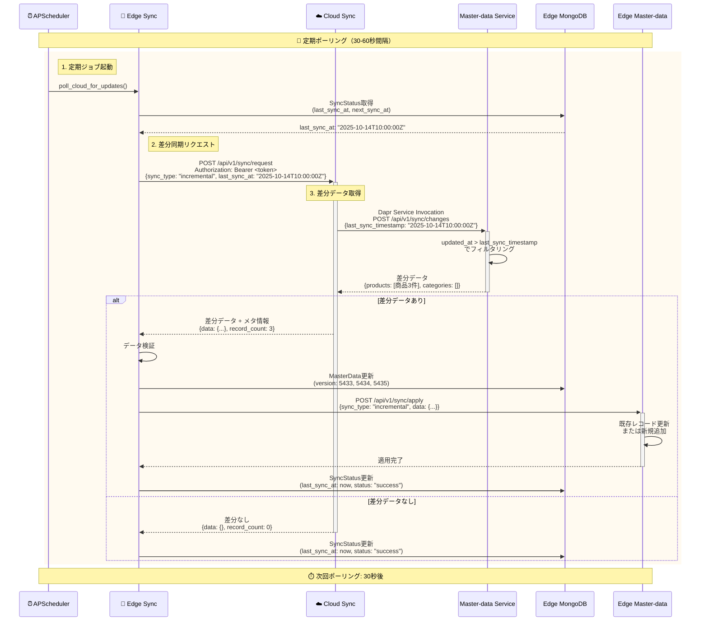
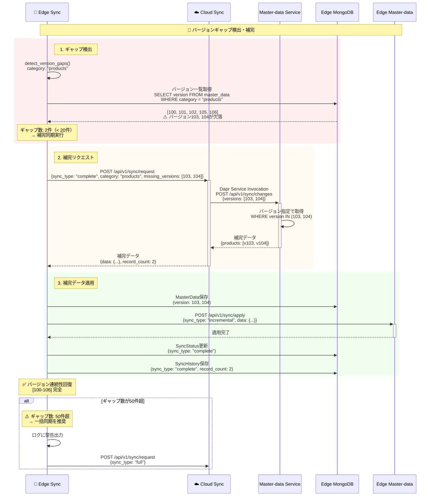
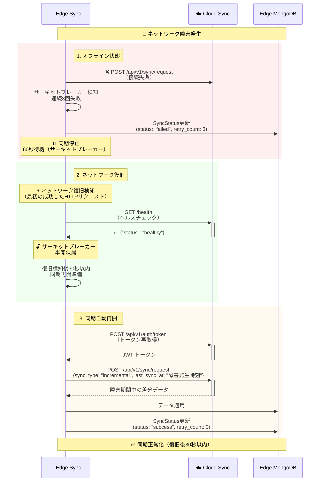
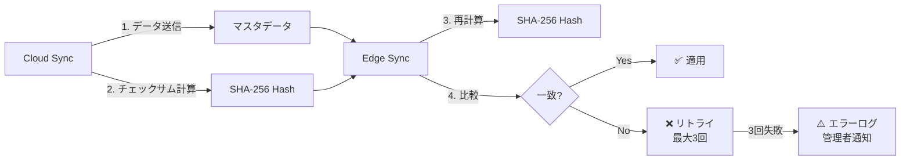
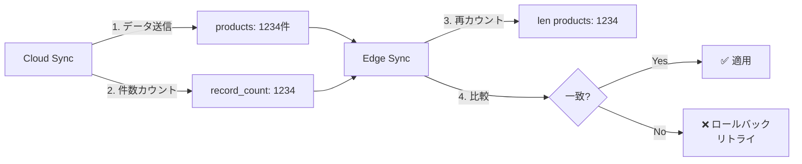
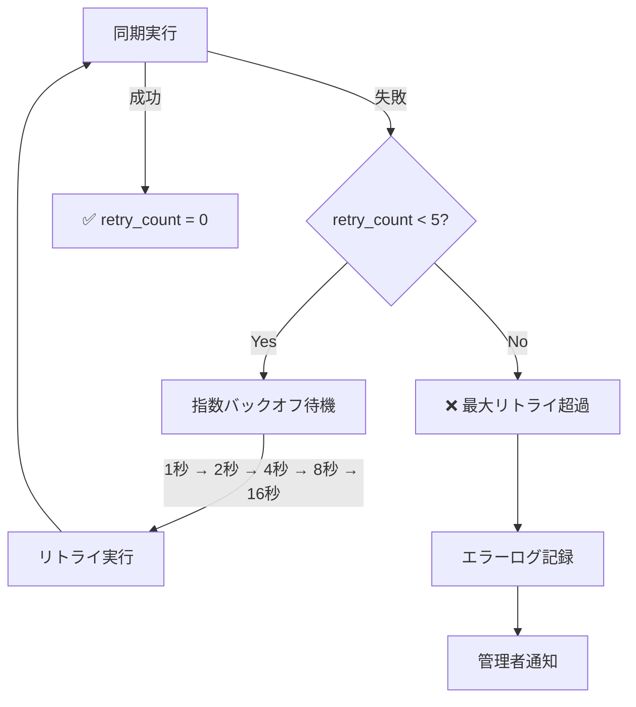
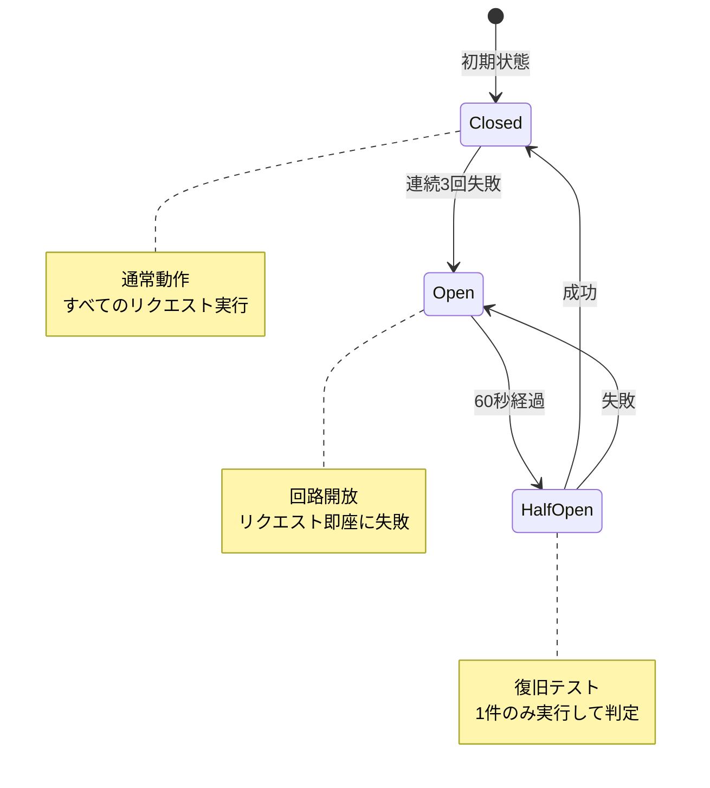

# ユーザストーリー1: マスタデータ同期 - 処理フロー図

## 概要

このドキュメントは、ユーザストーリー1「マスターデータの自動同期」の処理フローを視覚的に説明します。クラウドからエッジ端末へのマスタデータ配信の全体像を、ユーザが理解しやすい形で図解します。

## シナリオ

店舗管理者がクラウド側でマスターデータ（商品、価格、決済方法、スタッフ情報）を更新すると、すべての店舗のエッジ端末に自動的に同期され、最新の情報で販売業務を継続できる。

## 主要コンポーネント



## 処理フロー全体

### フロー1: 初回セットアップ（一括同期）

新しいエッジ端末を設置した際の初回マスタデータ取得フローです。



**主要ステップ**:
1. **認証**: Edge Syncがedge_id + secretでJWT トークンを取得
2. **一括同期リクエスト**: `sync_type: "full"` で全データを要求
3. **データ収集**: Cloud SyncがMaster-dataサービスとTerminalサービスから全データを取得
4. **整形・検証**: チェックサム計算、レコード件数カウント
5. **データ検証**: Edge側でチェックサムとレコード件数を検証
6. **適用**: Edge Master-dataサービスにデータを一括投入

### フロー2: 定期同期（差分同期）

通常運用時の30-60秒間隔での差分データ取得フローです。



**ポーリング間隔**: 30-60秒（環境変数 `SYNC_POLL_INTERVAL` で調整可能）

**主要ステップ**:
1. **定期ジョブ起動**: APSchedulerが30-60秒間隔でポーリング実行
2. **前回同期時刻取得**: SyncStatusから `last_sync_at` を取得
3. **差分リクエスト**: `sync_type: "incremental"` + `last_sync_at` で差分のみ要求
4. **差分データ取得**: Master-dataサービスが `updated_at > last_sync_at` でフィルタリング
5. **差分適用**: 変更されたレコードのみ更新

### フロー3: バージョンギャップ補完

ネットワーク障害などで一部バージョンが欠落した場合の自動補完フローです。



**補完ルール**:
- **最大20件/回**: 1回の補完同期で最大20バージョンまで取得
- **50件超の場合**: 一括同期への切り替えを推奨（警告ログ出力）

**主要ステップ**:
1. **ギャップ検出**: カテゴリごとにバージョン番号の連続性をチェック
2. **補完リクエスト**: 欠落バージョンを指定して `sync_type: "complete"` でリクエスト
3. **適用**: 欠落バージョンのみを取得・適用

### フロー4: ネットワーク復旧後の自動再開

オフライン状態から復旧した際の自動同期再開フローです。



**復旧検知**: エッジ端末からクラウドへの最初の成功したHTTPリクエスト完了時点

**自動再開時間**: 復旧検知後30秒以内（SC-006）

**主要ステップ**:
1. **オフライン検知**: 連続3回失敗でサーキットブレーカーがオープン
2. **復旧検知**: 最初の成功したHTTPリクエスト（ヘルスチェック等）で検知
3. **自動再開**: トークン再取得 → 差分同期実行

## データ整合性保証の仕組み

### チェックサム検証（FR-006）



**検証アルゴリズム**:
```python
# Cloud側でチェックサム計算
data_json = json.dumps(data, sort_keys=True)
checksum = hashlib.sha256(data_json.encode()).hexdigest()

# Edge側で検証
received_checksum = response["checksum"]
calculated_checksum = calculate_checksum(response["data"])
if received_checksum != calculated_checksum:
    raise ChecksumMismatchError()
```

### レコード件数検証（FR-007）



**検証タイミング**:
- Cloud側: データ送信前にカウント
- Edge側: 受信後、DB保存前に再カウント
- 不一致時: トランザクションロールバック → リトライ

## データベース構造

### SyncStatus（同期状態管理）

マスタデータ同期の現在状態を追跡するコレクション：

```
コレクション: status_sync

ドキュメント例:
{
  "_id": ObjectId("..."),
  "edge_id": "edge-tenant001-store001-001",
  "data_type": "master_data",
  "last_sync_at": ISODate("2025-10-14T10:30:00Z"),
  "sync_type": "incremental",
  "status": "success",
  "retry_count": 0,
  "error_message": null,
  "next_sync_at": ISODate("2025-10-14T10:31:00Z"),
  "created_at": ISODate("2025-10-14T08:00:00Z"),
  "updated_at": ISODate("2025-10-14T10:30:00Z")
}
```

**インデックス**:
- `{edge_id: 1, data_type: 1}` (unique) - エッジ端末・データ種別での検索
- `{status: 1, next_sync_at: 1}` - ポーリングジョブ用

### SyncHistory（同期履歴）

各同期実行の監査ログ：

```
コレクション: info_sync_history

ドキュメント例:
{
  "_id": ObjectId("..."),
  "sync_id": "550e8400-e29b-41d4-a716-446655440000",
  "edge_id": "edge-tenant001-store001-001",
  "data_type": "master_data",
  "sync_type": "incremental",
  "direction": "cloud_to_edge",
  "started_at": ISODate("2025-10-14T10:30:00Z"),
  "completed_at": ISODate("2025-10-14T10:30:15Z"),
  "record_count": 12,
  "data_size_bytes": 45678,
  "status": "success",
  "error_detail": null,
  "retry_count": 0,
  "duration_ms": 15000
}
```

**保持期間**: 90日間（TTLインデックス）

### MasterData（マスタデータキャッシュ）

エッジ端末に同期されたマスタデータ：

```
コレクション: cache_master_data

ドキュメント例:
{
  "_id": ObjectId("..."),
  "category": "products_common",
  "version": 5433,
  "updated_at": ISODate("2025-10-14T10:30:00Z"),
  "data": {
    "product_id": "P001",
    "name": "商品A",
    "price": 1000,
    ...
  },
  "data_hash": "abc123...",
  "record_count": 1
}
```

**バージョン管理**: カテゴリごとに連続したバージョン番号で管理

## パフォーマンス指標

| 指標 | 目標値 | 測定方法 |
|------|--------|---------|
| **同期遅延** | 95パーセンタイルで5分以内 | Cloud側でマスタ更新 → Edge側で適用完了までの時間 |
| **スループット（全件）** | 10,000件/秒以上 | 初回一括同期時のレコード処理速度 |
| **スループット（差分）** | 1,000件/秒以上 | 定期差分同期時のレコード処理速度 |
| **チェックサム検証成功率** | 99.9%以上 | 検証成功回数 / 全同期回数 |
| **ネットワーク復旧後の再開** | 30秒以内 | 復旧検知 → 同期再開までの時間 |

## エラーハンドリング

### リトライ戦略



**指数バックオフ**: 1秒 → 2秒 → 4秒 → 8秒 → 16秒（最大5回）

### サーキットブレーカー



**しきい値**: 連続3回失敗でオープン

**回復時間**: 60秒後に半開状態

## 受入シナリオの検証

### シナリオ1: 新商品登録の同期

```
Given: クラウド側で新商品を登録
When: 60秒経過後
Then: すべてのエッジ端末で新商品が利用可能

検証方法:
1. Master-data Serviceで商品追加 (product_id: "P999")
2. Edge Sync のポーリング待機（最大60秒）
3. Edge Master-data Service のDBを確認
4. 商品 P999 が存在することを確認
```

### シナリオ2: オフライン時の更新・復旧後自動同期

```
Given: エッジ端末がオフライン状態
When: クラウド側でマスターデータを更新
Then: オンライン復旧後30秒以内に自動同期完了

検証方法:
1. Edge Sync のネットワーク接続を切断
2. Master-data Service で価格更新（10件）
3. Edge Sync のネットワーク接続を復旧
4. 復旧検知からの経過時間を測定
5. 30秒以内に10件の価格更新が反映されることを確認
```

### シナリオ3: 初期セットアップ・一括同期

```
Given: 初期セットアップ時
When: 一括同期を実行
Then: すべてのマスターデータが5分以内に同期完了

検証方法:
1. 新規エッジ端末を登録（edge_id, secret）
2. Edge Sync 起動 → 認証 → 一括同期実行
3. 開始時刻と完了時刻を記録
4. 全カテゴリ（categories, products, staff, payment_methods, tax_rules）のデータ件数を確認
5. 処理時間が5分以内であることを確認
```

### シナリオ4: 差分同期

```
Given: 定期同期実行中
When: 差分データが存在
Then: 差分のみが30秒間隔で同期される

検証方法:
1. 定期ポーリング中のEdge Syncを監視
2. Master-data Serviceで商品3件を更新
3. 次回ポーリング（30-60秒後）を待機
4. Edge側で更新された3件のみが適用されることを確認
5. SyncHistoryで record_count: 3 を確認
```

## 関連ドキュメント

- [spec.md](./spec.md) - 機能仕様書
- [plan.md](./plan.md) - 実装計画
- [data-model.md](./data-model.md) - データモデル設計
- [contracts/sync-api.yaml](./contracts/sync-api.yaml) - 同期API仕様
- [contracts/auth-api.yaml](./contracts/auth-api.yaml) - 認証API仕様

---

**ドキュメントバージョン**: 1.0.0
**最終更新日**: 2025-10-14
**ステータス**: 完成
