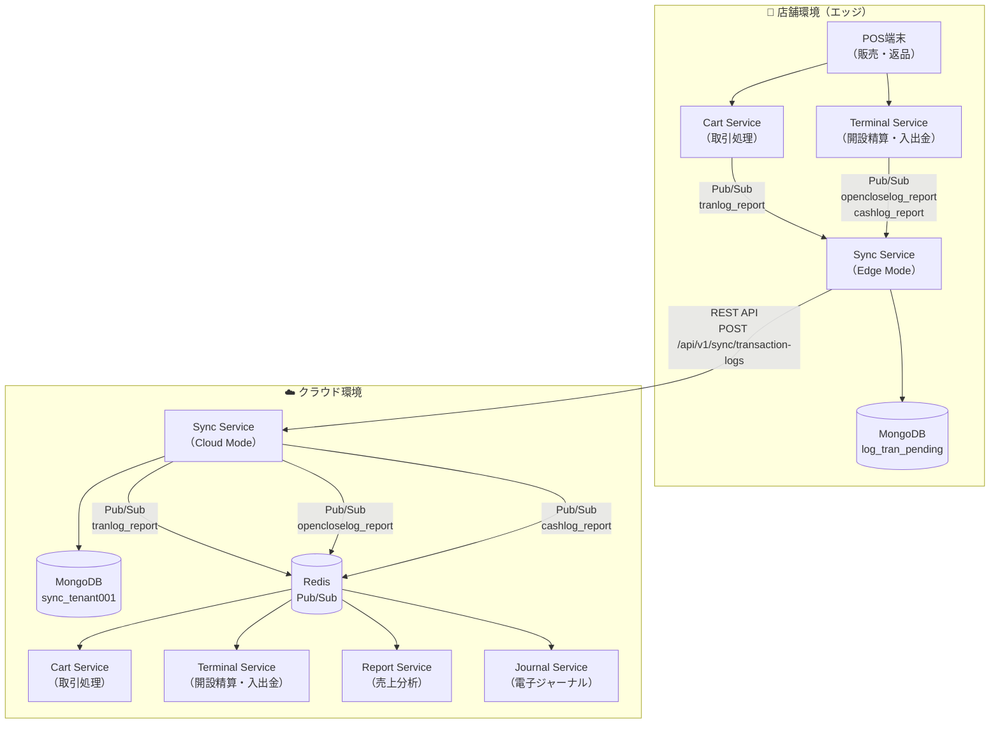
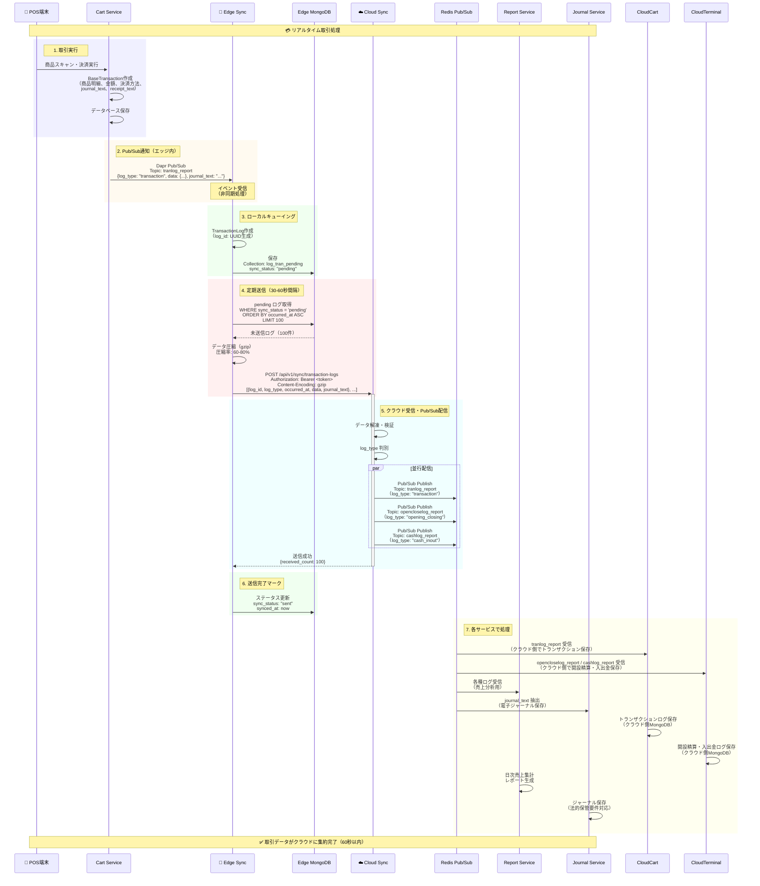
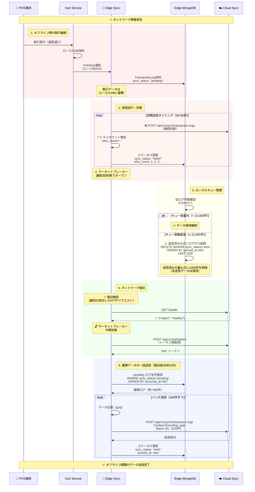
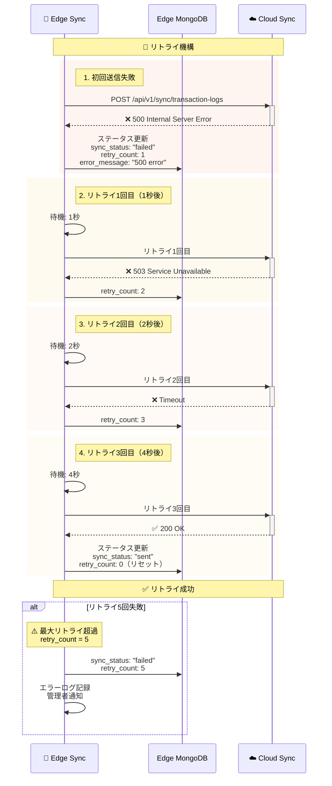
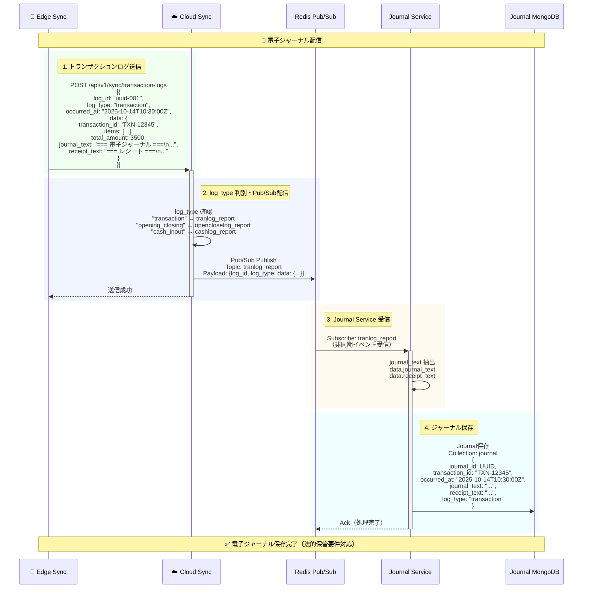
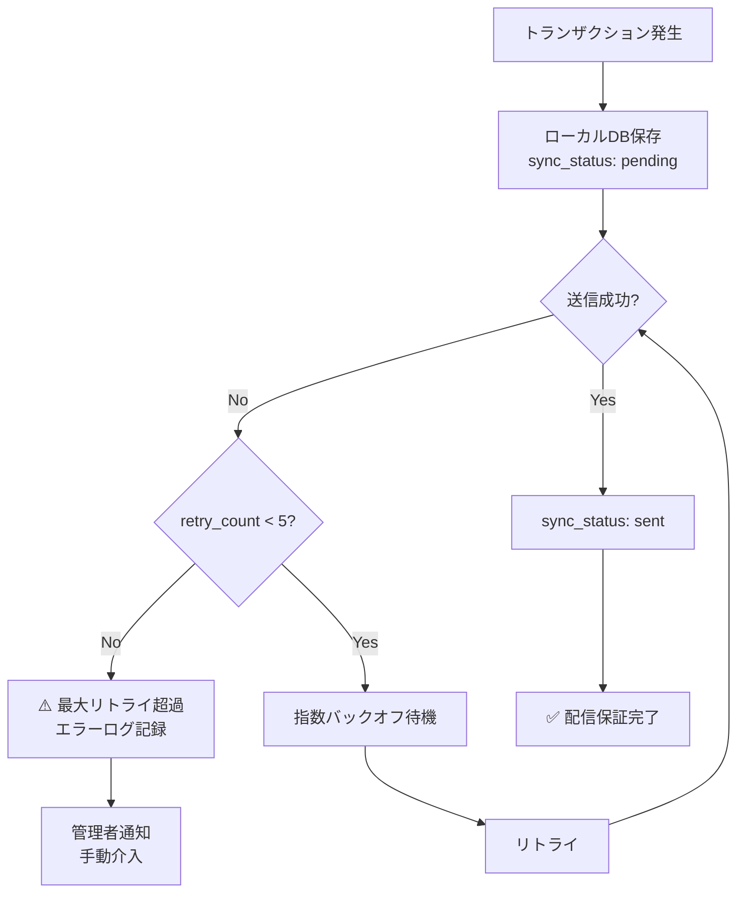
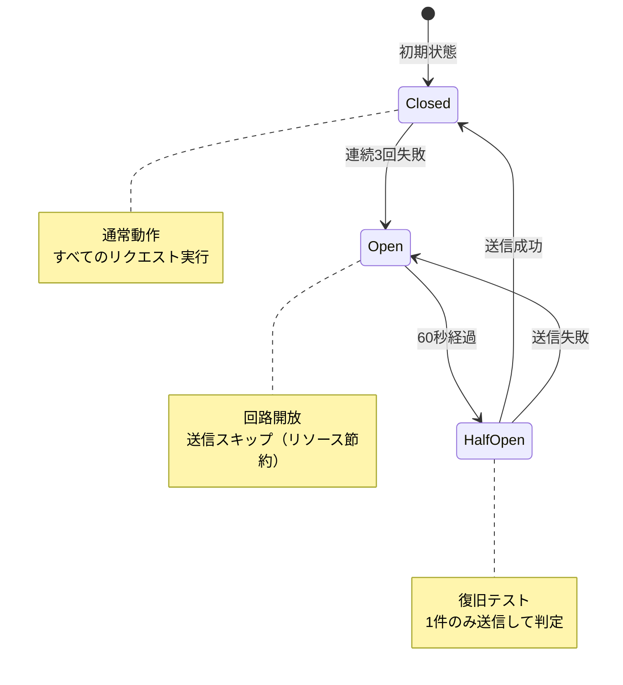

# ユーザストーリー2: トランザクションデータのクラウド集約 - 処理フロー図

## 概要

このドキュメントは、ユーザストーリー2「トランザクションデータのクラウド集約」の処理フローを視覚的に説明します。店舗のレジ端末で発生したトランザクションデータ（売上、返品、入出金等）がクラウドに送信され、本部での売上分析やレポート生成が可能になる仕組みを図解します。

## シナリオ

店舗のレジ端末で発生した売上取引、返品、入出金などのトランザクションデータが、リアルタイムでクラウドに送信され、本部での売上分析やレポート生成が可能になる。トランザクションデータには電子ジャーナル情報（journal_textフィールド）も含まれており、クラウド側でDapr Pub/Subを通じてJournal Serviceへ自動配信される。

## 主要コンポーネント



## トランザクションログの種類

### log_type別のデータフロー

| log_type | 日本語名 | ソース | Pub/Subトピック | 含まれるデータ |
|----------|---------|--------|----------------|--------------|
| **transaction** | 取引ログ | Cart Service | `tranlog_report` | 売上取引、返品、値引き、商品明細、決済方法、journal_text |
| **opening_closing** | 開設精算ログ | Terminal Service | `opencloselog_report` | レジ開設・精算、開設金額、売上金額、差異、journal_text |
| **cash_inout** | 入出金ログ | Terminal Service | `cashlog_report` | 入金・出金、金額、理由、承認者、journal_text |

**共通フィールド**: すべてのlog_typeに `journal_text`（電子ジャーナル）と `receipt_text`（レシート）が含まれます。

## 処理フロー全体

### フロー1: リアルタイムトランザクション送信（オンライン時）

POS端末で取引が完了した際の、リアルタイム送信フローです。



**所要時間**: 60秒以内（取引発生 → クラウド反映）

**主要ステップ**:
1. **取引実行**: POS端末で商品スキャン・決済完了
2. **Pub/Sub通知**: Cart/Terminalサービスが既存トピックでイベント発行
3. **ローカルキューイング**: Edge Syncがローカルデータベースに一時保存
4. **定期送信**: 30-60秒間隔でバッチ送信（最大100件/回）
5. **クラウド配信**: log_type別にPub/Subトピックへ振り分け
6. **送信完了**: Edge側でステータスを `sent` に更新
7. **各サービス処理**: Report ServiceとJournal Serviceが非同期処理

### フロー2: オフライン時のトランザクション蓄積・復旧後送信

ネットワーク障害時の動作とオンライン復旧後の自動送信フローです。



**復旧時の動作**:
- **復旧検知**: 最初の成功したHTTPリクエスト完了時点
- **自動再開**: 復旧後30秒以内に蓄積データ送信開始
- **バッチ送信**: 100件ずつに分割して順次送信
- **キュー管理**: 容量超過時は送信済み（`sync_status='sent'`）の古いデータから削除、未送信データ（`pending`）は確実に保持（デフォルト: 10,000件または100MB）

**主要ステップ**:
1. **オフライン時取引**: 通常通りPOS業務継続、ローカルDB保存
2. **送信試行失敗**: 定期送信タイミングで接続失敗、リトライ
3. **キュー管理**: 容量監視、超過時は古いデータ削除
4. **復旧検知**: ヘルスチェック成功でネットワーク復旧を検知
5. **一括送信**: 蓄積データを100件ずつバッチ送信

### フロー3: リトライ機構（指数バックオフ）

送信失敗時の自動リトライフローです。



**指数バックオフ戦略**:
- **リトライ間隔**: 1秒 → 2秒 → 4秒 → 8秒 → 16秒
- **最大リトライ回数**: 5回
- **成功時**: retry_count を 0 にリセット
- **5回失敗時**: エラーログ記録、管理者通知

### フロー4: journal_text の配信（Journal Serviceへ）

トランザクションログに含まれる電子ジャーナルデータの配信フローです。



**journal_text の流れ**:
1. **Edge側**: Cart/Terminal ServiceがBaseTransactionやOpenCloseLogに `journal_text` を含めてPub/Sub発行
2. **Edge Sync**: TransactionLogとしてローカルDB保存、クラウドへ送信
3. **Cloud Sync**: 受信後、log_type別にPub/Subトピックへ振り分け
4. **Journal Service**: Pub/Sub経由で受信、journal_textを抽出してMongoDB保存

**メリット**:
- **単一データフロー**: トランザクションデータとジャーナルデータを別々に同期する必要なし
- **At-least-once delivery**: トランザクション送信のリトライ機構がジャーナルにも適用
- **リアルタイム性**: Pub/Sub経由で即座にJournal Serviceへ配信

## データベース構造

### TransactionLog（送信キュー）

エッジ側でクラウド送信待ちのトランザクションログを管理：

```
コレクション: log_tran_pending

ドキュメント例:
{
  "_id": ObjectId("..."),
  "log_id": "550e8400-e29b-41d4-a716-446655440000",
  "edge_id": "edge-tenant001-store001-001",
  "log_type": "transaction",
  "occurred_at": ISODate("2025-10-14T10:30:00Z"),
  "data": {
    "transaction_id": "TXN-12345",
    "store_code": "store001",
    "terminal_no": "1",
    "items": [
      {"product_id": "P001", "quantity": 2, "price": 1000},
      {"product_id": "P002", "quantity": 1, "price": 1500}
    ],
    "total_amount": 3500,
    "payment_method": "cash",
    "journal_text": "=== 電子ジャーナル ===\n取引番号: TXN-12345\n...",
    "receipt_text": "=== レシート ===\nありがとうございました\n..."
  },
  "sync_status": "pending",  // pending, sending, sent, failed
  "synced_at": null,
  "retry_count": 0,
  "error_message": null,
  "created_at": ISODate("2025-10-14T10:30:05Z"),
  "updated_at": ISODate("2025-10-14T10:30:05Z")
}
```

**インデックス**:
- `{sync_status: 1, occurred_at: 1}` - 送信キュー検索用
- `{log_id: 1}` (unique) - 冪等性保証
- `{synced_at: 1}` (TTL: 30日) - 古いデータ自動削除

### SyncStatus（送信状態管理）

トランザクションログ送信の状態を追跡：

```
コレクション: status_sync

ドキュメント例:
{
  "_id": ObjectId("..."),
  "edge_id": "edge-tenant001-store001-001",
  "data_type": "transaction_log",
  "last_sync_at": ISODate("2025-10-14T10:30:00Z"),
  "sync_type": "incremental",
  "status": "success",
  "retry_count": 0,
  "error_message": null,
  "next_sync_at": ISODate("2025-10-14T10:31:00Z")
}
```

## パフォーマンス指標

| 指標 | 目標値 | 測定方法 |
|------|--------|---------|
| **送信遅延** | 60秒以内 | 取引発生（occurred_at） → クラウド受信完了までの時間 |
| **At-least-once delivery** | 100%保証 | リトライ機構により全トランザクションが最低1回配信 |
| **バッチサイズ** | 最大100件/回 | 定期送信時のバッチサイズ |
| **送信間隔** | 30-60秒 | ポーリング間隔（環境変数 `SYNC_POLL_INTERVAL`） |
| **データ圧縮率** | 50%以上（gzip） | 圧縮前サイズ vs 圧縮後サイズ |
| **復旧後再開時間** | 30秒以内 | ネットワーク復旧検知 → 送信再開までの時間 |
| **キュー容量** | 10,000件または100MB | 容量超過時は送信済みデータから削除（未送信データは保持） |

## エラーハンドリング

### At-least-once Delivery保証



**保証メカニズム**:
1. **ローカルDB永続化**: トランザクション発生時に必ずローカルDB保存
2. **ステータス管理**: `pending` → `sent` の遷移で送信状況を追跡
3. **リトライ機構**: 最大5回の自動リトライ
4. **冪等性**: `log_id`（UUID）で重複配信を防止
5. **ガベージコレクション**: 30日経過した `sent` レコードを自動削除（キュー容量超過時は即座に削除対象）
6. **未送信データ保護**: キュー容量超過時も `sync_status='pending'` のデータは削除せず確実に送信

### サーキットブレーカー

オフライン状態での無駄なリトライを防止：



**動作**:
- **Closed（閉）**: 通常動作、すべての送信リクエスト実行
- **Open（開）**: 連続3回失敗で開放、送信スキップ
- **Half-Open（半開）**: 60秒後に1件テスト送信、成功なら通常復帰

## 受入シナリオの検証

### シナリオ1: リアルタイム送信

```
Given: エッジ端末で売上取引を完了
When: 60秒経過後
Then: クラウド側でトランザクションデータが参照可能、かつjournal_textがJournal Serviceに配信済み

検証方法:
1. POS端末で売上取引実行（商品2点、合計3,500円）
2. Cart ServiceがPub/Sub発行 → Edge Syncが受信
3. 60秒待機
4. Cloud SyncのMongoDBを確認（SyncHistory）
5. Journal ServiceのMongoDBを確認（journal_textが保存されていること）
```

### シナリオ2: オフライン時の蓄積・復旧後送信

```
Given: エッジ端末がオフライン状態
When: トランザクションを実行
Then: ローカルDBに保存され、オンライン復旧後に自動送信

検証方法:
1. Edge SyncのネットワークをOFF
2. POS端末で取引10件実行
3. Edge MongoDBのlog_tran_pendingを確認（10件、sync_status: pending）
4. ネットワークをON
5. 復旧後30秒以内に全10件が送信完了（sync_status: sent）
```

### シナリオ3: バッチ処理

```
Given: 複数の取引ログが蓄積
When: 定期送信タイミング到達
Then: バッチ処理で一括送信され、送信完了ステータスに更新

検証方法:
1. Edge側でトランザクションログ150件を作成（sync_status: pending）
2. 定期送信タイミング（30-60秒）待機
3. バッチ1（100件）送信 → sync_status: sent
4. バッチ2（50件）送信 → sync_status: sent
5. 全150件の送信完了を確認
```

### シナリオ4: リトライ機構

```
Given: 送信失敗したトランザクション
When: リトライ機構が動作
Then: 最大5回まで指数バックオフでリトライ

検証方法:
1. Cloud Syncを一時停止（送信失敗をシミュレート）
2. Edge Syncでトランザクション送信試行 → 失敗
3. リトライ動作確認:
   - 1秒後にリトライ1回目 → 失敗（retry_count: 1）
   - 2秒後にリトライ2回目 → 失敗（retry_count: 2）
   - 4秒後にリトライ3回目 → 失敗（retry_count: 3）
4. Cloud Syncを再起動
5. リトライ4回目 → 成功（sync_status: sent, retry_count: 0）
```

### シナリオ5: log_type別配信

```
Given: log_type別のトランザクションログ（transaction/opening_closing/cash_inout）
When: クラウド受信後
Then: log_typeに応じた適切なDapr Pub/Subトピックに振り分けられJournal Serviceで処理

検証方法:
1. 3種類のトランザクション作成:
   - transaction（Cart Service）
   - opening_closing（Terminal Service）
   - cash_inout（Terminal Service）
2. Edge Sync → Cloud Sync 送信
3. Cloud SyncのログでPub/Sub配信確認:
   - transaction → tranlog_report
   - opening_closing → opencloselog_report
   - cash_inout → cashlog_report
4. Journal Serviceで全3種類のjournal_textが保存されていることを確認
```

## 関連ドキュメント

- [spec.md](../spec.md) - 機能仕様書
- [plan.md](../plan.md) - 実装計画
- [data-model.md](../data-model.md) - データモデル設計
- [contracts/sync-api.yaml](../contracts/sync-api.yaml) - 同期API仕様
- [us-001-flow.md](./us-001-flow.md) - ユーザストーリー1（マスタデータ同期）

---

**ドキュメントバージョン**: 1.0.0
**最終更新日**: 2025-10-14
**ステータス**: 完成
