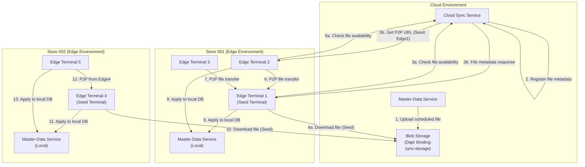
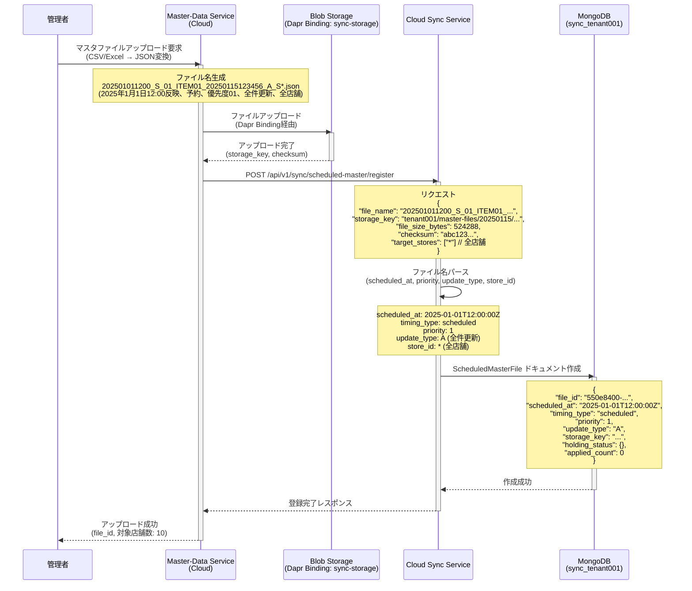
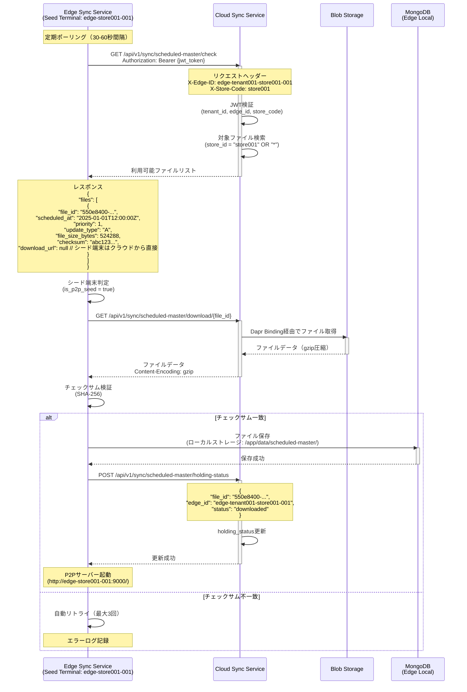
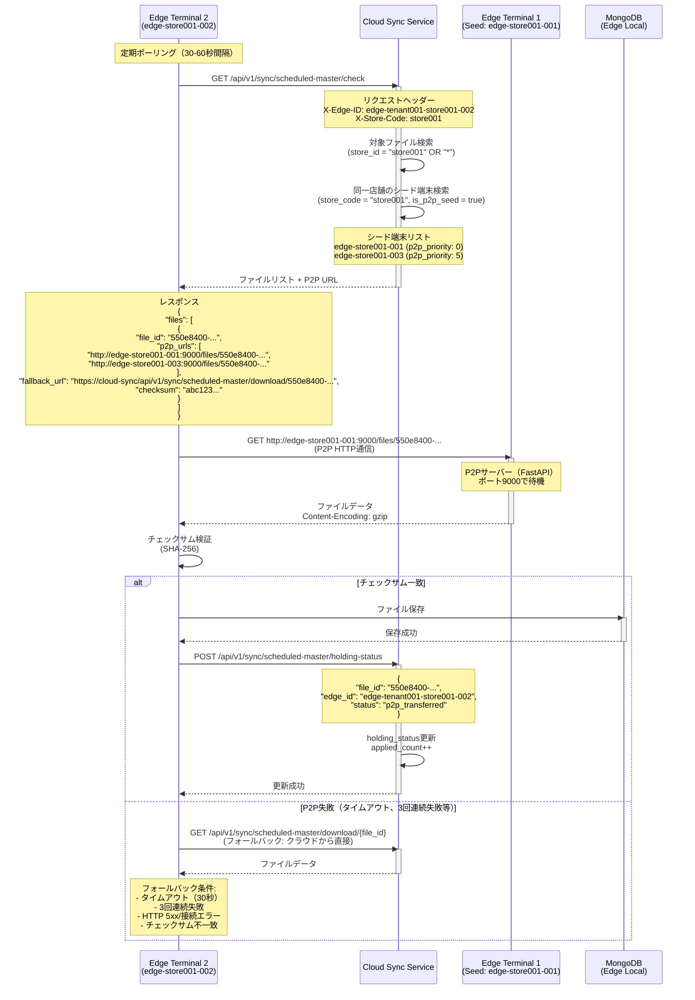
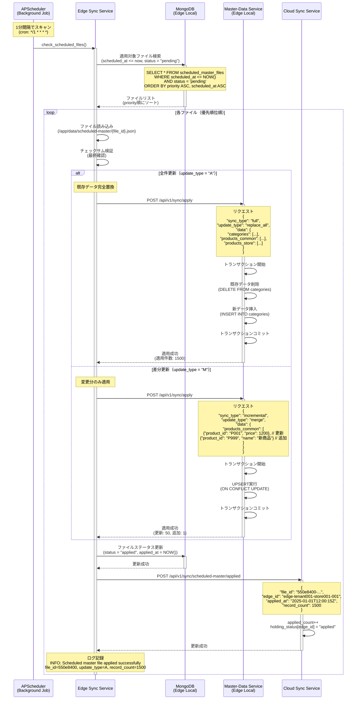
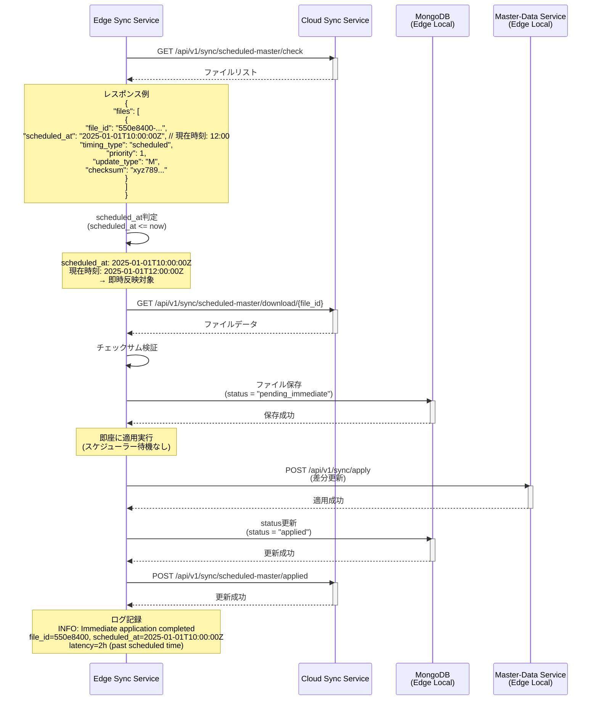

# User Story 3: マスターデータ予約反映フロー

## 概要

本部が事前に設定した日時（例: 翌日12時）に、新しい商品価格やキャンペーン設定を全店舗に自動反映し、価格変更の作業負荷を軽減する機能。

**主要機能**:
- ファイル名に含まれる反映日時に基づく自動反映
- 全件更新（A）と差分更新（M）の2つの更新区分
- P2Pファイル共有によるクラウド負荷軽減
- 優先順位に基づく複数ファイルの順次適用

## コンポーネント図



## フロー1: 予約マスタファイルの登録と配信準備

**シナリオ**: クラウド側でマスタファイルをアップロードし、全エッジ端末への配信準備を行う。



**データベース構造（info_scheduled_master_file）**:

```javascript
{
  "_id": ObjectId("..."),
  "file_id": "550e8400-e29b-41d4-a716-446655440000",
  "store_id": "*",  // 全店舗対象
  "scheduled_at": ISODate("2025-01-01T12:00:00Z"),
  "timing_type": "scheduled",  // 予約反映
  "priority": 1,
  "update_type": "A",  // 全件更新
  "created_at": ISODate("2025-01-15T12:34:56Z"),
  "file_path": "tenant001/master-files/20250115/202501011200_S_01_ITEM01_20250115123456_A_S*.json",
  "file_size_bytes": 524288,
  "checksum": "abc123def456...",
  "holding_status": {
    // エッジ端末ごとのファイル保持状況（動的に更新）
    "edge-tenant001-store001-001": "downloaded",
    "edge-tenant001-store001-002": "p2p_transferred",
    "edge-tenant001-store002-001": "pending"
  },
  "applied_count": 0  // 適用完了した端末数
}
```

## フロー2: エッジ端末によるファイル取得（クラウド → シード端末）

**シナリオ**: シード端末（各店舗の1台目）がクラウドから直接ファイルをダウンロード。



**ローカルファイル構造**:

```
/app/data/scheduled-master/
├── 550e8400-e29b-41d4-a716-446655440000.json  # ファイルID = ファイル名
├── 550e8400-e29b-41d4-a716-446655440001.json
└── metadata.db  # SQLiteでメタデータ管理（scheduled_at, priority, checksum等）
```

## フロー3: エッジ端末間P2Pファイル共有

**シナリオ**: 同一店舗内の2台目以降の端末が、シード端末からP2P通信でファイルを取得。



**P2P通信の実装**:

```python
# Edge Sync Service の P2P サーバー（FastAPI）
# services/sync/app/api/v1/p2p.py

from fastapi import APIRouter, HTTPException, Path
from fastapi.responses import FileResponse
import os
import logging

router = APIRouter(prefix="/files", tags=["P2P File Sharing"])
logger = logging.getLogger(__name__)

P2P_FILE_DIR = "/app/data/scheduled-master/"

@router.get("/{file_id}")
async def download_file_p2p(
    file_id: str = Path(..., description="File ID")
):
    """P2P file transfer endpoint for edge terminals"""
    file_path = os.path.join(P2P_FILE_DIR, f"{file_id}.json")

    if not os.path.exists(file_path):
        logger.warning(f"P2P file not found", extra={"file_id": file_id})
        raise HTTPException(status_code=404, detail="File not found")

    logger.info(f"P2P file transfer started", extra={"file_id": file_id})

    return FileResponse(
        path=file_path,
        media_type="application/json",
        headers={"Content-Encoding": "gzip"}
    )
```

**P2P優先度設定（info_edge_terminal）**:

```javascript
{
  "_id": ObjectId("..."),
  "edge_id": "edge-tenant001-store001-001",
  "tenant_id": "tenant001",
  "store_code": "store001",
  "is_p2p_seed": true,  // シード端末
  "p2p_priority": 0,     // 0 = 最優先（最初にアクセスされる）
  "status": "online",
  "last_heartbeat_at": ISODate("2025-10-14T10:00:00Z")
}

{
  "_id": ObjectId("..."),
  "edge_id": "edge-tenant001-store001-002",
  "tenant_id": "tenant001",
  "store_code": "store001",
  "is_p2p_seed": false,  // 非シード端末
  "p2p_priority": 99,     // 99 = P2Pクライアントのみ
  "status": "online",
  "last_heartbeat_at": ISODate("2025-10-14T10:00:00Z")
}

{
  "_id": ObjectId("..."),
  "edge_id": "edge-tenant001-store001-003",
  "tenant_id": "tenant001",
  "store_code": "store001",
  "is_p2p_seed": true,   // セカンダリシード端末
  "p2p_priority": 5,      // 1-9 = セカンダリシード（Edge1障害時のバックアップ）
  "status": "online",
  "last_heartbeat_at": ISODate("2025-10-14T10:00:00Z")
}
```

## フロー4: 予約反映の自動実行

**シナリオ**: 指定日時（scheduled_at）に達したマスタファイルを自動的にローカルDBに適用。



**ローカルメタデータDB（SQLite）**:

```sql
-- /app/data/scheduled-master/metadata.db

CREATE TABLE scheduled_master_files (
    file_id TEXT PRIMARY KEY,
    scheduled_at TEXT NOT NULL,  -- ISO 8601
    priority INTEGER NOT NULL,
    update_type TEXT NOT NULL,   -- 'A' or 'M'
    file_path TEXT NOT NULL,
    file_size_bytes INTEGER,
    checksum TEXT NOT NULL,
    status TEXT NOT NULL,        -- 'pending', 'applied', 'failed'
    applied_at TEXT,             -- ISO 8601
    error_message TEXT,
    created_at TEXT DEFAULT CURRENT_TIMESTAMP
);

CREATE INDEX idx_scheduled_at ON scheduled_master_files(scheduled_at, priority);
CREATE INDEX idx_status ON scheduled_master_files(status);
```

## フロー5: 即時反映（scheduled_at が過去のファイル）

**シナリオ**: scheduled_at が過去のマスタファイルを受信した場合、即座に反映実行。



## 受入シナリオ検証

### シナリオ1: 反映日時が未来のマスタファイルを配信、指定日時到達で全エッジ端末で自動反映実行

**前提条件**:
- クラウド側に予約マスタファイルを登録（scheduled_at: 明日12:00）
- 対象店舗: 3店舗（各店舗3台、合計9台のエッジ端末）

**検証手順**:
1. 管理者がマスタファイルをアップロード（scheduled_at: 2025-01-02T12:00:00Z）
2. 各エッジ端末がポーリングでファイルを取得（シード端末: クラウド、非シード端末: P2P）
3. 指定日時（2025-01-02T12:00:00Z）到達
4. 各エッジ端末のSchedulerが1分間隔スキャンで検出
5. 優先順位順にファイル適用実行

**期待結果**:
- 全9台のエッジ端末で適用完了（applied_count = 9）
- 適用タイミング: scheduled_at ± 30秒以内（SC-010）
- クラウド側 holding_status に全端末の "applied" ステータスが記録

### シナリオ2: 反映日時が過去のマスタファイル受信、即座に反映実行

**前提条件**:
- エッジ端末がオフライン中にクラウド側にファイル登録（scheduled_at: 昨日12:00）
- エッジ端末がオンライン復旧

**検証手順**:
1. エッジ端末がオンライン復旧
2. ポーリングでファイルリスト取得
3. scheduled_at判定で「即時反映対象」と判断
4. ファイルダウンロード後、即座に適用実行（スケジューラー待機なし）

**期待結果**:
- ファイル取得から30秒以内に適用完了
- status = "applied"、applied_at に現在時刻が記録
- 遅延時間（現在時刻 - scheduled_at）がログに記録

### シナリオ3: 同一店舗に複数エッジ端末、1台目がクラウドからファイル取得、2台目以降はP2P通信で取得しクラウド負荷軽減

**前提条件**:
- 店舗001に3台のエッジ端末（edge-store001-001: シード、edge-store001-002, edge-store001-003）
- マスタファイル: 500KB

**検証手順**:
1. Edge1（シード）がクラウドからダウンロード
2. Edge1がP2Pサーバー起動（ポート9000）
3. Edge2がポーリングでP2P URLを取得
4. Edge2がEdge1からP2P転送でファイル取得
5. Edge3も同様にP2P転送

**期待結果**:
- クラウドからのダウンロード: 1回のみ（Edge1）
- P2P転送: 2回（Edge2, Edge3）
- トラフィック削減率: 66%（2/3がP2P）
- holding_status: Edge1="downloaded", Edge2="p2p_transferred", Edge3="p2p_transferred"

### シナリオ4: 全件更新(A)のマスタファイル、反映実行で既存データを完全置換

**前提条件**:
- 既存の商品マスタ: 1,000件
- 新しいマスタファイル（update_type: A）: 1,200件

**検証手順**:
1. scheduled_at到達でSchedulerが検出
2. update_type="A" 判定
3. Master-Data Serviceに全件更新リクエスト
4. トランザクション内で既存データ削除 → 新データ挿入

**期待結果**:
- 既存1,000件が削除され、新1,200件が挿入
- 最終件数: 1,200件
- トランザクション保証（途中失敗時はロールバック）
- 適用時間: 5秒以内（1,200件）

### シナリオ5: 差分更新(M)のマスタファイル、反映実行で変更分のみ適用

**前提条件**:
- 既存の商品マスタ: 1,000件
- 差分マスタファイル（update_type: M）: 50件（価格変更）、1件（新商品追加）

**検証手順**:
1. scheduled_at到達でSchedulerが検出
2. update_type="M" 判定
3. Master-Data Serviceに差分更新リクエスト
4. UPSERT実行（ON CONFLICT UPDATE）

**期待結果**:
- 更新: 50件（価格変更）
- 追加: 1件（新商品）
- 既存データ（949件）は保持
- 最終件数: 1,001件
- 適用時間: 1秒以内（51件）

## パフォーマンス指標

| 指標 | 目標値 | 実装戦略 |
|-----|-------|---------|
| **予約反映精度** | scheduled_at ± 30秒以内 | 1分間隔スキャン、優先順位順処理 |
| **P2Pトラフィック削減率** | 50%以上 | シード端末経由、p2p_priority設定 |
| **ファイルダウンロード時間** | 500KB: 5秒以内 | gzip圧縮（60-80%削減）、HTTP/1.1接続再利用 |
| **適用実行時間（全件更新）** | 1,000件: 5秒以内 | トランザクションバッチ処理 |
| **適用実行時間（差分更新）** | 100件: 1秒以内 | UPSERT効率化 |
| **同時適用対応** | 1,000台同時 | 各エッジ端末で独立実行 |

## エラーハンドリング

### P2Pファイル共有失敗

**失敗条件**:
- タイムアウト（30秒）
- 3回連続失敗
- HTTP 5xx/接続エラー
- チェックサム不一致

**フォールバック処理**:
1. 同一店舗内の別のシード端末にリトライ（p2p_priority順）
2. すべてのP2P失敗時、クラウドから直接ダウンロード
3. エラーログ記録（P2P失敗理由、フォールバック結果）

```python
# P2P失敗時のフォールバック実装例
async def download_file_with_p2p_fallback(file_id: str, p2p_urls: list[str], fallback_url: str) -> bytes:
    # P2P URL優先度順にリトライ
    for p2p_url in p2p_urls:
        try:
            async with httpx.AsyncClient(timeout=30.0) as client:
                response = await client.get(p2p_url)
                response.raise_for_status()
                file_data = response.content

                # チェックサム検証
                if verify_checksum(file_data, expected_checksum):
                    logger.info(f"P2P transfer successful", extra={"file_id": file_id, "p2p_url": p2p_url})
                    return file_data
        except (httpx.TimeoutException, httpx.HTTPStatusError, httpx.ConnectError) as e:
            logger.warning(f"P2P transfer failed, trying next", extra={"file_id": file_id, "error": str(e)})
            continue

    # すべてのP2P失敗時、クラウドからフォールバック
    logger.warning(f"All P2P transfers failed, falling back to cloud", extra={"file_id": file_id})
    async with httpx.AsyncClient(timeout=60.0) as client:
        response = await client.get(fallback_url, headers={"Authorization": f"Bearer {jwt_token}"})
        response.raise_for_status()
        return response.content
```

### 適用失敗（全件更新）

**失敗条件**:
- トランザクションタイムアウト
- データベース接続エラー
- データ検証エラー（不正なJSON等）

**リトライ処理**:
1. 指数バックオフ（1s, 2s, 4s, 8s, 16s）
2. 最大5回リトライ
3. 5回失敗時、status="failed"、error_message記録
4. 管理者にアラート通知（重要度: High）

### 適用失敗（差分更新）

**失敗条件**:
- UPSERT競合
- 外部キー制約違反
- データ型不一致

**リトライ処理**:
1. 最大3回リトライ
2. 失敗レコードをスキップして処理続行（部分適用許容）
3. 失敗レコードリストをログに記録
4. 管理者にアラート通知（重要度: Medium）

## セキュリティ考慮事項

### ファイル改ざん検知

- **SHA-256チェックサム検証**: ダウンロード時、P2P転送時、適用実行前の3段階で検証
- **不一致時の対応**: 自動リトライ（最大3回）、ログ記録、管理者アラート

### P2P通信のセキュリティ

- **認証**: P2Pサーバーは店舗内ネットワークのみアクセス可能（ファイアウォール設定）
- **TLS 1.2+**: P2P通信も暗号化（自己署名証明書使用）
- **ファイルアクセス制限**: ホワイトリストに登録されたfile_idのみアクセス可能

### Blob Storageの抽象化

- **Dapr Binding**: `sync-storage` コンポーネント経由でストレージ操作を抽象化
- **サポートするバックエンド**: Local Storage（開発環境）、AWS S3、Google Cloud Storage、Azure Blob Storage（本番環境）
- **環境切り替え**: Dapr YAMLコンポーネント設定のみで切り替え可能
- **テスト容易性**: 開発環境ではLocal Storageを使用し、本番環境と同じAPIで操作

### ファイル命名規則の検証

```python
# ファイル名パース時の検証
import re
from datetime import datetime

FILE_NAME_PATTERN = re.compile(
    r"^(?P<scheduled_at>\d{12})_(?P<timing>[SI])_(?P<priority>\d{2})_"
    r"(?P<file_id>[A-Z0-9]+)_(?P<created_at>\d{14})_(?P<update_type>[AM])_"
    r"S(?P<store_id>\d{3}|\*)\.json$"
)

def parse_file_name(file_name: str) -> dict:
    match = FILE_NAME_PATTERN.match(file_name)
    if not match:
        raise ValueError(f"Invalid file name format: {file_name}")

    data = match.groupdict()

    # 日時フォーマット検証
    scheduled_at = datetime.strptime(data["scheduled_at"], "%Y%m%d%H%M")
    created_at = datetime.strptime(data["created_at"], "%Y%m%d%H%M%S")

    return {
        "scheduled_at": scheduled_at,
        "timing_type": "scheduled" if data["timing"] == "S" else "immediate",
        "priority": int(data["priority"]),
        "file_id": data["file_id"],
        "created_at": created_at,
        "update_type": data["update_type"],
        "store_id": data["store_id"]
    }
```

## まとめ

User Story 3（マスターデータ予約反映）は、以下の5つの主要フローで構成されます:

1. **予約マスタファイルの登録と配信準備**: クラウド側でファイルアップロード、メタデータ登録
2. **エッジ端末によるファイル取得（クラウド → シード端末）**: シード端末が直接ダウンロード
3. **エッジ端末間P2Pファイル共有**: 2台目以降がP2P通信で取得、クラウド負荷軽減
4. **予約反映の自動実行**: scheduled_at到達時に優先順位順で適用
5. **即時反映**: scheduled_at が過去のファイルは即座に適用

**主要な設計ポイント**:
- **P2P通信によるクラウド負荷軽減**: 50%以上のトラフィック削減（SC-011）
- **優先順位管理**: 同一日時に複数ファイルがある場合、priority順で適用
- **全件更新（A）と差分更新（M）**: update_typeに基づく適切な適用方式
- **フォールバック機構**: P2P失敗時はクラウドから直接ダウンロード
- **チェックサム検証**: 3段階での改ざん検知
- **即時反映**: scheduled_at が過去の場合は待機せず即座に適用

この機能により、価格改定やキャンペーン開始時の運用効率が大幅に向上します。
