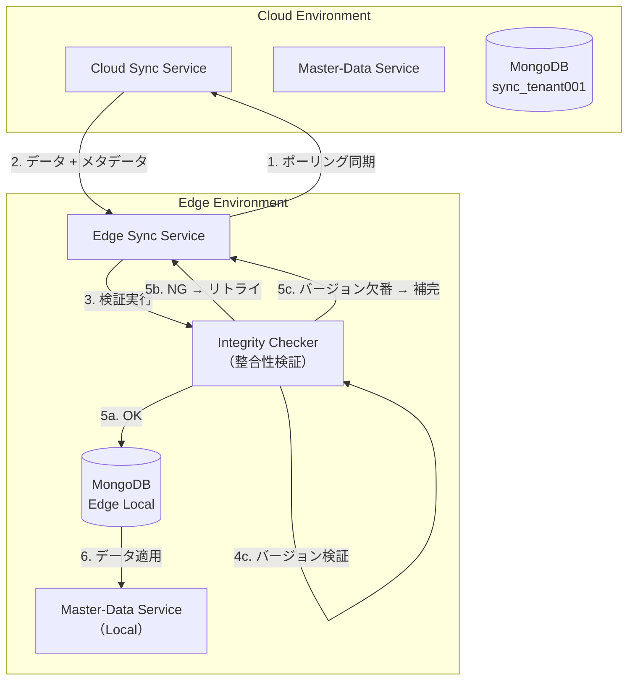
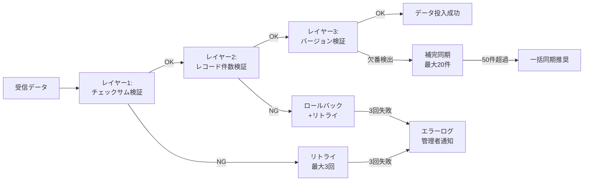

# User Story 4: データ整合性の自動保証フロー

## 概要

マスターデータ同期時に、チェックサム検証、レコード件数検証、バージョン検証が自動実行され、データの破損や欠落が検出された場合は自動で補完または再同期が実行される機能。

**主要機能**:
- SHA-256チェックサム検証による改ざん検知
- レコード件数検証によるデータ欠落検知
- バージョン番号検証による連続性確認
- 自動リトライ・ロールバック・補完機構

## コンポーネント図



## 検証レイヤー



## フロー1: チェックサム検証（SHA-256）

**シナリオ**: データ受信時にチェックサム不一致を検出し、自動リトライを実行。

```mermaid
sequenceDiagram
    participant EdgeSync as Edge Sync Service
    participant CloudSync as Cloud Sync Service
    participant Checker as Integrity Checker
    participant EdgeDB as MongoDB<br/>(Edge Local)

    Note over EdgeSync,EdgeDB: 🔐 チェックサム検証（レイヤー1）

    rect rgb(240, 255, 240)
        Note right of EdgeSync: 1. 差分同期リクエスト
        EdgeSync->>CloudSync: POST /api/v1/sync/request<br/>{<br/> "data_type": "master_data",<br/> "sync_type": "incremental",<br/> "last_version": 150<br/>}
        activate CloudSync
    end

    rect rgb(240, 245, 255)
        Note right of CloudSync: 2. データ準備 + チェックサム計算
        CloudSync->>CloudSync: マスターデータ取得<br/>(version 151-155, 5件)

        Note over CloudSync: チェックサム計算<br/>data_json = json.dumps(data, sort_keys=True)<br/>checksum = sha256(data_json).hexdigest()

        CloudSync-->>EdgeSync: レスポンス<br/>{<br/> "data": {...},<br/> "checksum": "abc123...",<br/> "record_count": 5,<br/> "version_range": [151, 155]<br/>}
        deactivate CloudSync
    end

    rect rgb(255, 250, 240)
        Note right of EdgeSync: 3. チェックサム検証
        EdgeSync->>Checker: verify_checksum(data, checksum)
        activate Checker

        Checker->>Checker: 受信データのチェックサム計算<br/>calculated = sha256(json.dumps(data, sort_keys=True))

        alt チェックサム一致
            Checker-->>EdgeSync: ✅ 検証成功
            deactivate Checker

            Note over EdgeSync: レイヤー2（レコード件数検証）へ進む
        else チェックサム不一致（改ざん検知）
            Checker-->>EdgeSync: ❌ ChecksumMismatchError<br/>expected: abc123...<br/>calculated: def456...
            deactivate Checker

            Note over EdgeSync: ⚠️ データ破損検出<br/>リトライ機構起動
        end
    end

    rect rgb(255, 245, 240)
        Note right of EdgeSync: 4. 自動リトライ（最大3回）
        loop リトライ（1回目）
            EdgeSync->>CloudSync: POST /api/v1/sync/request<br/>（同じリクエスト）
            activate CloudSync
            CloudSync-->>EdgeSync: レスポンス<br/>（再送信）
            deactivate CloudSync

            EdgeSync->>Checker: verify_checksum(data, checksum)
            activate Checker
            Checker-->>EdgeSync: ✅ 検証成功
            deactivate Checker

            Note over EdgeSync: リトライ1回目で成功<br/>retry_count: 1
        end
    end

    rect rgb(240, 255, 240)
        Note right of EdgeSync: 5. 検証成功 → 次のレイヤーへ
        EdgeSync->>EdgeSync: record_count_verification()
        Note over EdgeSync: レイヤー2へ進む
    end

    alt 3回リトライ失敗
        Note over EdgeSync: ❌ 最大リトライ超過<br/>sync_status: "failed"<br/>error_message: "Checksum verification failed after 3 retries"

        EdgeSync->>EdgeSync: エラーログ記録<br/>管理者通知
    end
```

**チェックサム検証コード例**:

```python
import hashlib
import json
from typing import Dict, Any

def calculate_checksum(data: Dict[str, Any]) -> str:
    """Calculate SHA-256 checksum of data"""
    data_json = json.dumps(data, sort_keys=True, ensure_ascii=False)
    return hashlib.sha256(data_json.encode('utf-8')).hexdigest()

async def verify_checksum(
    received_data: Dict[str, Any],
    expected_checksum: str,
    retry_count: int = 0
) -> bool:
    """Verify data integrity with checksum"""
    calculated_checksum = calculate_checksum(received_data)

    if calculated_checksum != expected_checksum:
        logger.error(
            f"Checksum mismatch detected",
            extra={
                "expected": expected_checksum,
                "calculated": calculated_checksum,
                "retry_count": retry_count,
                "data_size": len(json.dumps(received_data))
            }
        )
        return False

    logger.info(
        f"Checksum verification passed",
        extra={
            "checksum": calculated_checksum,
            "retry_count": retry_count
        }
    )
    return True
```

## フロー2: レコード件数検証

**シナリオ**: データベース投入後にレコード件数が一致しない場合、ロールバックして自動リトライ。

```mermaid
sequenceDiagram
    participant EdgeSync as Edge Sync Service
    participant Checker as Integrity Checker
    participant EdgeDB as MongoDB<br/>(Edge Local)
    participant LocalMaster as Master-Data Service<br/>(Local)

    Note over EdgeSync,LocalMaster: 📊 レコード件数検証（レイヤー2）

    rect rgb(240, 255, 240)
        Note right of EdgeSync: 1. チェックサム検証完了
        EdgeSync->>EdgeSync: ✅ チェックサム検証成功<br/>expected_record_count: 5
    end

    rect rgb(255, 250, 240)
        Note right of EdgeSync: 2. データベース投入（トランザクション）
        EdgeSync->>EdgeDB: トランザクション開始
        activate EdgeDB

        EdgeSync->>EdgeDB: マスターデータ投入<br/>(cache_master_data)
        Note over EdgeDB: INSERT 5 documents

        EdgeDB-->>EdgeSync: 投入完了<br/>inserted_count: 5
    end

    rect rgb(240, 245, 255)
        Note right of EdgeSync: 3. レコード件数検証
        EdgeSync->>Checker: verify_record_count(<br/> expected=5,<br/> actual=5<br/>)
        activate Checker

        alt レコード件数一致
            Checker-->>EdgeSync: ✅ 検証成功
            deactivate Checker

            EdgeSync->>EdgeDB: トランザクションコミット
            deactivate EdgeDB

            Note over EdgeSync: レイヤー3（バージョン検証）へ進む
        else レコード件数不一致
            Checker-->>EdgeSync: ❌ RecordCountMismatchError<br/>expected: 5, actual: 3
            deactivate Checker

            Note over EdgeSync: ⚠️ データ欠落検出<br/>ロールバック実行
        end
    end

    rect rgb(255, 245, 240)
        Note right of EdgeSync: 4. ロールバック + リトライ
        EdgeSync->>EdgeDB: ロールバック実行
        activate EdgeDB
        EdgeDB-->>EdgeSync: ロールバック完了
        deactivate EdgeDB

        Note over EdgeSync: データベース状態を元に戻す<br/>retry_count++

        loop リトライ（1回目）
            EdgeSync->>EdgeDB: トランザクション開始（再試行）
            activate EdgeDB
            EdgeSync->>EdgeDB: マスターデータ投入
            EdgeDB-->>EdgeSync: inserted_count: 5
            deactivate EdgeDB

            EdgeSync->>Checker: verify_record_count(5, 5)
            activate Checker
            Checker-->>EdgeSync: ✅ 検証成功
            deactivate Checker

            EdgeSync->>EdgeDB: トランザクションコミット
            activate EdgeDB
            EdgeDB-->>EdgeSync: コミット完了
            deactivate EdgeDB
        end
    end

    rect rgb(240, 255, 240)
        Note right of EdgeSync: 5. マスターデータ適用
        EdgeSync->>LocalMaster: POST /api/v1/sync/apply<br/>{<br/> "sync_type": "incremental",<br/> "data": {...}<br/>}
        activate LocalMaster
        LocalMaster-->>EdgeSync: 適用成功
        deactivate LocalMaster
    end

    alt 3回リトライ失敗
        Note over EdgeSync: ❌ 最大リトライ超過<br/>sync_status: "failed"<br/>error_message: "Record count mismatch after 3 retries"

        EdgeSync->>EdgeSync: エラーログ記録<br/>管理者通知
    end
```

**レコード件数検証コード例**:

```python
from typing import Optional
from motor.motor_asyncio import AsyncIOMotorClientSession

async def verify_record_count(
    expected_count: int,
    actual_count: int,
    sync_id: str,
    session: Optional[AsyncIOMotorClientSession] = None
) -> bool:
    """Verify record count matches expected"""
    if expected_count != actual_count:
        logger.error(
            f"Record count mismatch detected",
            extra={
                "sync_id": sync_id,
                "expected_count": expected_count,
                "actual_count": actual_count,
                "difference": abs(expected_count - actual_count)
            }
        )

        # ロールバック実行
        if session:
            await session.abort_transaction()
            logger.info(f"Transaction rolled back due to record count mismatch")

        return False

    logger.info(
        f"Record count verification passed",
        extra={
            "sync_id": sync_id,
            "record_count": actual_count
        }
    )
    return True
```

## フロー3: バージョン検証と自動補完

**シナリオ**: バージョン番号に欠番を検出し、欠落バージョンを自動補完（最大20件/回）。

```mermaid
sequenceDiagram
    participant EdgeSync as Edge Sync Service
    participant Checker as Integrity Checker
    participant EdgeDB as MongoDB<br/>(Edge Local)
    participant CloudSync as Cloud Sync Service

    Note over EdgeSync,CloudSync: 🔢 バージョン検証（レイヤー3）

    rect rgb(240, 255, 240)
        Note right of EdgeSync: 1. レコード件数検証完了
        EdgeSync->>EdgeSync: ✅ レコード件数検証成功
    end

    rect rgb(255, 250, 240)
        Note right of EdgeSync: 2. バージョン連続性確認
        EdgeSync->>EdgeDB: カテゴリ別バージョン取得<br/>SELECT version FROM cache_master_data<br/>WHERE category = 'products_common'<br/>ORDER BY version ASC
        activate EdgeDB
        EdgeDB-->>EdgeSync: versions: [1, 2, 3, 5, 7, 8, 10, ..., 150]
        deactivate EdgeDB

        EdgeSync->>Checker: detect_version_gaps(category, versions)
        activate Checker
    end

    rect rgb(240, 245, 255)
        Note right of Checker: 3. ギャップ検出アルゴリズム
        Checker->>Checker: max_version = max(versions) = 150<br/>expected = set(1..150)<br/>actual = set(versions)<br/>gaps = expected - actual

        Note over Checker: 検出結果:<br/>gaps = [4, 6, 9, 11, 12, 15, ...]<br/>gap_count = 25件

        alt ギャップなし
            Checker-->>EdgeSync: ✅ バージョン連続性OK<br/>gaps: []
            deactivate Checker
            Note over EdgeSync: 同期完了
        else ギャップ検出（25件）
            Checker-->>EdgeSync: ⚠️ バージョン欠番検出<br/>gaps: [4, 6, 9, 11, 12, 15, ...]<br/>gap_count: 25
            deactivate Checker

            Note over EdgeSync: 補完同期が必要<br/>（最大20件/回）
        end
    end

    rect rgb(255, 245, 240)
        Note right of EdgeSync: 4. 補完同期実行（最大20件）
        EdgeSync->>EdgeSync: gaps_to_fetch = gaps[:20]<br/>= [4, 6, 9, 11, 12, 15, ..., 45]

        EdgeSync->>CloudSync: POST /api/v1/sync/request<br/>{<br/> "sync_type": "complete",<br/> "category": "products_common",<br/> "versions": [4, 6, 9, 11, 12, 15, ..., 45]<br/>}
        activate CloudSync

        CloudSync->>CloudSync: 指定バージョンのデータ取得
        CloudSync-->>EdgeSync: レスポンス<br/>{<br/> "data": {...},<br/> "checksum": "xyz789...",<br/> "record_count": 20<br/>}
        deactivate CloudSync
    end

    rect rgb(240, 255, 240)
        Note right of EdgeSync: 5. 補完データ検証・投入
        EdgeSync->>Checker: verify_checksum(data, checksum)
        activate Checker
        Checker-->>EdgeSync: ✅ 検証成功
        deactivate Checker

        EdgeSync->>EdgeDB: 補完データ投入<br/>INSERT 20 documents
        activate EdgeDB
        EdgeDB-->>EdgeSync: 投入完了
        deactivate EdgeDB

        Note over EdgeSync: 残りギャップ: 5件<br/>（次回ポーリングで補完）
    end

    rect rgb(255, 250, 240)
        Note right of EdgeSync: 6. ギャップ数判定
        alt ギャップ < 50件
            Note over EdgeSync: ✅ 補完同期継続<br/>（次回ポーリングで残り5件補完）
        else ギャップ ≥ 50件
            Note over EdgeSync: ⚠️ ギャップ数が閾値超過<br/>gap_count: 50+

            EdgeSync->>EdgeSync: 一括同期推奨アラート<br/>recommend_full_sync()

            Note over EdgeSync: ログ記録:<br/>WARN: Version gap count exceeds threshold (50+)<br/>Recommend full sync for category: products_common
        end
    end
```

**バージョン検証コード例**:

```python
from typing import List, Set

async def detect_version_gaps(
    category: str,
    repository: MasterDataRepository
) -> List[int]:
    """Detect missing version numbers in master data sequence"""
    # 既存バージョン取得
    all_versions = await repository.find_versions_by_category(category)

    if not all_versions:
        return []

    max_version = max(all_versions)
    expected_versions: Set[int] = set(range(1, max_version + 1))
    actual_versions: Set[int] = set(all_versions)
    gaps = sorted(expected_versions - actual_versions)

    gap_count = len(gaps)

    if gap_count == 0:
        logger.info(
            f"Version continuity verified",
            extra={
                "category": category,
                "max_version": max_version
            }
        )
        return []

    if gap_count > 50:
        logger.warning(
            f"Version gap count exceeds threshold",
            extra={
                "category": category,
                "gap_count": gap_count,
                "max_version": max_version,
                "recommendation": "full_sync"
            }
        )

    # 最大20件のギャップを返す（FR-008）
    gaps_to_return = gaps[:20]

    logger.info(
        f"Version gaps detected, starting completion sync",
        extra={
            "category": category,
            "total_gaps": gap_count,
            "fetching_gaps": len(gaps_to_return),
            "gap_versions": gaps_to_return
        }
    )

    return gaps_to_return
```

## フロー4: 統合検証フロー（3レイヤー連携）

**シナリオ**: チェックサム検証 → レコード件数検証 → バージョン検証の3段階検証を順次実行。

```mermaid
sequenceDiagram
    participant EdgeSync as Edge Sync Service
    participant CloudSync as Cloud Sync Service
    participant Checker as Integrity Checker
    participant EdgeDB as MongoDB<br/>(Edge Local)

    Note over EdgeSync,EdgeDB: 🛡️ 統合整合性検証（3レイヤー）

    rect rgb(240, 255, 240)
        Note right of EdgeSync: Phase 1: データ受信
        EdgeSync->>CloudSync: POST /api/v1/sync/request
        activate CloudSync
        CloudSync-->>EdgeSync: {data, checksum, record_count, version_range}
        deactivate CloudSync
    end

    rect rgb(255, 250, 240)
        Note right of EdgeSync: Phase 2: レイヤー1検証（チェックサム）
        EdgeSync->>Checker: verify_checksum(data, checksum)
        activate Checker

        alt チェックサム OK
            Checker-->>EdgeSync: ✅ Pass
            deactivate Checker
        else チェックサム NG
            Checker-->>EdgeSync: ❌ Fail → Retry (max 3)
            deactivate Checker
            EdgeSync->>CloudSync: リトライリクエスト
            Note over EdgeSync: リトライ後、レイヤー1へ戻る
        end
    end

    rect rgb(240, 245, 255)
        Note right of EdgeSync: Phase 3: レイヤー2検証（レコード件数）
        EdgeSync->>EdgeDB: トランザクション開始
        activate EdgeDB
        EdgeSync->>EdgeDB: データ投入
        EdgeDB-->>EdgeSync: inserted_count
        deactivate EdgeDB

        EdgeSync->>Checker: verify_record_count(expected, actual)
        activate Checker

        alt レコード件数 OK
            Checker-->>EdgeSync: ✅ Pass
            deactivate Checker
            EdgeSync->>EdgeDB: トランザクションコミット
            activate EdgeDB
            EdgeDB-->>EdgeSync: Commit OK
            deactivate EdgeDB
        else レコード件数 NG
            Checker-->>EdgeSync: ❌ Fail → Rollback
            deactivate Checker
            EdgeSync->>EdgeDB: ロールバック
            activate EdgeDB
            EdgeDB-->>EdgeSync: Rollback OK
            deactivate EdgeDB
            EdgeSync->>CloudSync: リトライリクエスト
            Note over EdgeSync: リトライ後、レイヤー1へ戻る
        end
    end

    rect rgb(255, 255, 240)
        Note right of EdgeSync: Phase 4: レイヤー3検証（バージョン）
        EdgeSync->>EdgeDB: カテゴリ別バージョン取得
        activate EdgeDB
        EdgeDB-->>EdgeSync: versions: [1, 2, 3, 5, ...]
        deactivate EdgeDB

        EdgeSync->>Checker: detect_version_gaps(category, versions)
        activate Checker

        alt バージョン連続
            Checker-->>EdgeSync: ✅ Pass (gaps: [])
            deactivate Checker
            Note over EdgeSync: 同期完了
        else ギャップ検出（< 50件）
            Checker-->>EdgeSync: ⚠️ Gaps detected: 25件
            deactivate Checker
            EdgeSync->>CloudSync: 補完同期リクエスト<br/>(versions: [...], max 20)
            activate CloudSync
            CloudSync-->>EdgeSync: 補完データ
            deactivate CloudSync
            Note over EdgeSync: 補完データをレイヤー1から検証
        else ギャップ検出（≥ 50件）
            Checker-->>EdgeSync: ⚠️ Gaps: 50+<br/>recommend_full_sync
            deactivate Checker
            EdgeSync->>EdgeSync: 一括同期推奨ログ<br/>管理者通知
        end
    end

    rect rgb(240, 255, 240)
        Note right of EdgeSync: Phase 5: 同期完了
        EdgeSync->>EdgeDB: SyncHistory記録<br/>status: "success"
        activate EdgeDB
        EdgeDB-->>EdgeSync: 記録完了
        deactivate EdgeDB

        Note over EdgeSync: ✅ データ整合性保証完了
    end
```

## 受入シナリオ検証

### シナリオ1: チェックサム不一致検出、自動リトライ（最大3回）実行

**前提条件**:
- エッジ端末が差分同期実行中
- ネットワーク不安定でデータ破損が発生

**検証手順**:
1. Edge Syncが差分同期リクエスト送信（version 100-110）
2. クラウドからレスポンス受信（データ + チェックサム）
3. チェックサム検証実行 → 不一致検出
4. 自動リトライ1回目 → 不一致
5. 自動リトライ2回目 → 不一致
6. 自動リトライ3回目 → 一致

**期待結果**:
- リトライ3回目でチェックサム検証成功
- retry_count: 3 がログに記録
- sync_status: "success" に更新
- レイヤー2（レコード件数検証）へ進む

### シナリオ2: DB投入後、レコード件数不一致検出、ロールバックして自動リトライ

**前提条件**:
- チェックサム検証完了
- データベース投入中に一部レコードが失敗

**検証手順**:
1. チェックサム検証成功（expected_record_count: 100）
2. トランザクション開始、データ投入
3. inserted_count: 97 （3件失敗）
4. レコード件数検証実行 → 不一致検出
5. ロールバック実行 → データベース状態を元に戻す
6. リトライ1回目 → inserted_count: 100 → 検証成功

**期待結果**:
- ロールバック成功、データベース状態が元に戻る
- リトライ1回目でレコード件数検証成功
- トランザクションコミット成功
- レイヤー3（バージョン検証）へ進む

### シナリオ3: バージョン番号に欠番検出、欠落バージョンを自動補完（最大20件/回）

**前提条件**:
- レコード件数検証完了
- バージョン: [1, 2, 3, 5, 7, 8, 10, ..., 150] （欠番: 4, 6, 9, 11, ..., 合計25件）

**検証手順**:
1. カテゴリ別バージョン取得
2. ギャップ検出アルゴリズム実行 → 25件のギャップ検出
3. 最大20件のギャップを補完同期リクエスト
4. クラウドから補完データ受信
5. 補完データをレイヤー1（チェックサム検証）から検証
6. 補完データ投入成功
7. 残りギャップ（5件）は次回ポーリングで補完

**期待結果**:
- 1回の補完同期で20件のギャップを埋める
- 残りギャップ: 5件 をログに記録
- 次回ポーリング時に残り5件を補完
- 全ギャップ補完後、バージョン連続性確認

### シナリオ4: 欠落バージョンが50件超過、一括同期への切り替えを推奨

**前提条件**:
- バージョンギャップ: 75件検出

**検証手順**:
1. ギャップ検出アルゴリズム実行 → 75件のギャップ検出
2. ギャップ数判定 → 50件超過
3. 一括同期推奨ログ記録
4. 管理者通知（アラート送信）

**期待結果**:
- ログにWARNレベルで記録:
  ```
  WARN: Version gap count exceeds threshold (50+)
  Recommend full sync for category: products_common
  gap_count: 75, max_version: 200
  ```
- 管理者にアラート通知（メール/Slack等）
- 補完同期ではなく、一括同期を推奨

## パフォーマンス指標

| 指標 | 目標値 | 測定方法 |
|-----|-------|---------|
| **チェックサム検証成功率** | 99.9%以上 | (成功回数 / 全検証回数) × 100 |
| **バージョン補完成功率** | 95%以上 | (補完成功件数 / 全ギャップ件数) × 100 |
| **チェックサム計算時間** | 10ms以内（1MBデータ） | SHA-256計算時間 |
| **レコード件数検証時間** | 5ms以内 | MongoDB COUNT クエリ時間 |
| **バージョンギャップ検出時間** | 100ms以内（10,000件） | セット演算実行時間 |
| **リトライ成功率** | 90%以上（3回以内） | リトライ成功 / 全リトライ実行回数 |
| **ロールバック成功率** | 100% | ロールバック成功回数 / 全ロールバック実行回数 |

## エラーハンドリング

### チェックサム検証失敗（3回リトライ失敗）

**エラーコード**: `800201`

**対応**:
1. sync_status: "failed" に更新
2. error_message: "Checksum verification failed after 3 retries"
3. エラーログ記録（ERROR レベル）
4. 管理者通知（重要度: High）
5. 次回ポーリングで自動的に再試行

**ログ例**:
```json
{
  "level": "ERROR",
  "timestamp": "2025-10-14T10:30:00Z",
  "service": "sync",
  "error_code": "800201",
  "message": "Checksum verification failed after 3 retries",
  "context": {
    "edge_id": "edge-tenant001-store001-001",
    "sync_id": "550e8400-...",
    "expected_checksum": "abc123...",
    "calculated_checksum": "def456...",
    "retry_count": 3,
    "data_size_bytes": 1048576
  }
}
```

### レコード件数不一致（3回リトライ失敗）

**エラーコード**: `800202`

**対応**:
1. 最後のロールバック実行（データベース状態を元に戻す）
2. sync_status: "failed" に更新
3. error_message: "Record count mismatch after 3 retries"
4. エラーログ記録（ERROR レベル）
5. 管理者通知（重要度: High）

**ログ例**:
```json
{
  "level": "ERROR",
  "timestamp": "2025-10-14T10:30:00Z",
  "service": "sync",
  "error_code": "800202",
  "message": "Record count mismatch after 3 retries",
  "context": {
    "edge_id": "edge-tenant001-store001-001",
    "sync_id": "550e8400-...",
    "expected_count": 100,
    "actual_count": 97,
    "difference": 3,
    "retry_count": 3
  }
}
```

### バージョンギャップ50件超過

**エラーコード**: `800203`

**対応**:
1. ログに警告記録（WARN レベル）
2. 一括同期推奨アラート送信（重要度: Medium）
3. 補完同期は継続実行（自動停止しない）
4. 管理者判断で一括同期に切り替え

**ログ例**:
```json
{
  "level": "WARN",
  "timestamp": "2025-10-14T10:30:00Z",
  "service": "sync",
  "error_code": "800203",
  "message": "Version gap count exceeds threshold, recommend full sync",
  "context": {
    "edge_id": "edge-tenant001-store001-001",
    "category": "products_common",
    "gap_count": 75,
    "threshold": 50,
    "max_version": 200,
    "recommendation": "full_sync"
  }
}
```

## まとめ

User Story 4（データ整合性の自動保証）は、以下の3レイヤー検証で構成されます:

1. **レイヤー1: チェックサム検証（SHA-256）**: データ受信時の改ざん検知、自動リトライ（最大3回）
2. **レイヤー2: レコード件数検証**: データベース投入後の件数確認、不一致時はロールバック + リトライ
3. **レイヤー3: バージョン検証**: バージョン連続性確認、ギャップ検出時は自動補完（最大20件/回）

**主要な設計ポイント**:
- **多段階防御**: 3つの独立した検証レイヤーで高い信頼性を実現
- **自動リトライ機構**: チェックサム・レコード件数検証で最大3回自動リトライ
- **トランザクション保証**: レコード件数不一致時は必ずロールバック実行
- **段階的補完**: バージョンギャップは最大20件/回で補完、50件超過時は一括同期推奨
- **包括的ログ**: すべての検証結果とエラー詳細をログに記録、管理者通知

この機能により、ネットワーク不安定やデータ破損が発生しても、データの信頼性が自動的に保証されます。
