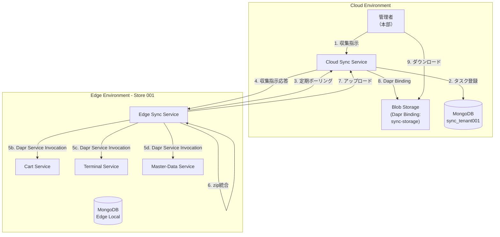
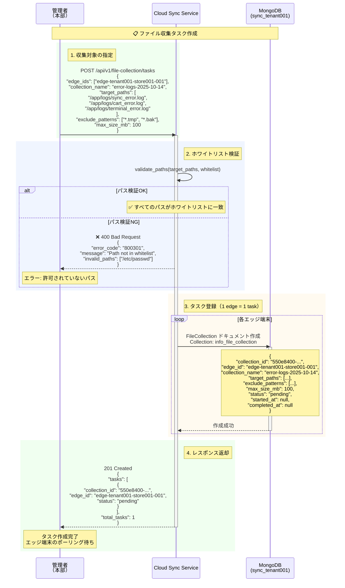
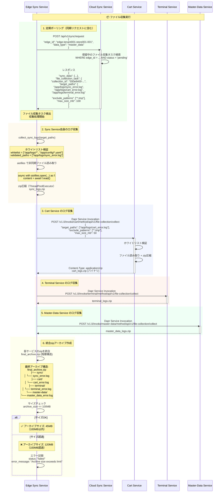
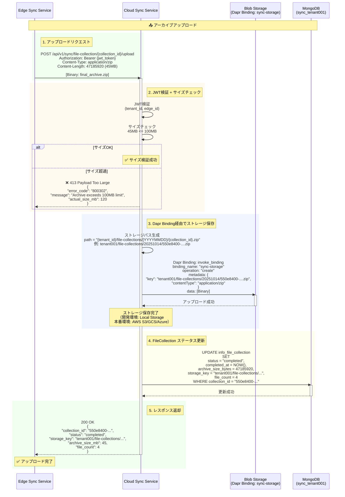

# User Story 5: ファイル収集とトラブルシューティングフロー

## 概要

店舗でシステム障害やエラーが発生した際、本部がエッジ端末のアプリケーションログやシステムファイルを遠隔で収集し、迅速な問題解決が可能になる機能。

**主要機能**:
- クラウドからエッジ端末への遠隔ファイル収集指示
- 複数サービスのログを統合収集（Dapr Service Invocation経由）
- ホワイトリストによるセキュリティ保護
- zip形式での圧縮・転送（最大100MB）
- Dapr Binding経由でのストレージ保管

## コンポーネント図



## 収集対象ファイル

### サービス別収集対象

| サービス | ログパス | ホワイトリスト例 |
|---------|---------|---------------|
| **Sync Service** | `/app/logs/sync.log`<br>`/app/logs/sync_error.log` | `/app/logs/*`<br>`/app/config/*.yaml` |
| **Cart Service** | `/app/logs/cart.log`<br>`/app/logs/cart_error.log` | `/app/logs/*`<br>`/app/config/*.yaml` |
| **Terminal Service** | `/app/logs/terminal.log`<br>`/app/logs/terminal_error.log` | `/app/logs/*`<br>`/app/config/*.yaml` |
| **Master-Data Service** | `/app/logs/master_data.log`<br>`/app/logs/master_data_error.log` | `/app/logs/*`<br>`/app/config/*.yaml` |
| **Report Service** | `/app/logs/report.log` | `/app/logs/*` |
| **Journal Service** | `/app/logs/journal.log` | `/app/logs/*` |
| **Stock Service** | `/app/logs/stock.log` | `/app/logs/*` |

**セキュリティ制約**:
- ホワイトリストに登録されたパスのみアクセス可能
- データベースファイル（`.db`, `.mdb`）は収集禁止
- 機密ファイル（`.env`, `credentials.json`）は収集禁止

## フロー1: ファイル収集指示の作成と配信

**シナリオ**: 管理者がクラウドからエッジ端末に対してファイル収集を指示。



## フロー2: エッジ端末でのファイル収集実行

**シナリオ**: エッジ端末が定期ポーリングで収集指示を受信し、各サービスからログを収集。



**実装例（Sync Service自身のログ収集）**:

```python
import aiofiles
import zipfile
from pathlib import Path
from concurrent.futures import ThreadPoolExecutor
import asyncio

async def collect_sync_logs(
    target_paths: list[str],
    whitelist: list[str]
) -> bytes:
    """Collect Sync Service's own logs"""
    # ホワイトリスト検証
    validated_paths = []
    for path in target_paths:
        path_obj = Path(path)
        if any(path_obj.match(pattern) for pattern in whitelist):
            validated_paths.append(path)
        else:
            logger.warning(f"Path not in whitelist: {path}")

    if not validated_paths:
        raise ValueError("No valid paths after whitelist filtering")

    # 非同期ファイル読み取り
    files_data = []
    for path in validated_paths:
        if Path(path).exists():
            async with aiofiles.open(path, 'rb') as f:
                content = await f.read()
                files_data.append((path, content))

    # zip圧縮（ThreadPoolExecutorで非同期化）
    loop = asyncio.get_event_loop()
    with ThreadPoolExecutor() as executor:
        zip_bytes = await loop.run_in_executor(
            executor,
            create_zip_archive,
            files_data
        )

    return zip_bytes

def create_zip_archive(files_data: list[tuple[str, bytes]]) -> bytes:
    """Create zip archive from file data (sync operation)"""
    import io
    zip_buffer = io.BytesIO()

    with zipfile.ZipFile(zip_buffer, 'w', zipfile.ZIP_DEFLATED) as zip_file:
        for file_path, content in files_data:
            # アーカイブ内のパス: sync/sync_error.log
            archive_path = f"sync/{Path(file_path).name}"
            zip_file.writestr(archive_path, content)

    return zip_buffer.getvalue()
```

## フロー3: 統合アーカイブのクラウドアップロード

**シナリオ**: エッジ端末で収集・統合したzipアーカイブをクラウドにアップロード。



## フロー4: 管理者によるファイルダウンロード

**シナリオ**: 管理者が収集完了したファイルをダウンロード。

```mermaid
sequenceDiagram
    participant Admin as 管理者<br/>（本部）
    participant CloudSync as Cloud Sync Service
    participant CloudDB as MongoDB<br/>(sync_tenant001)
    participant CloudStorage as Blob Storage<br/>(Dapr Binding: sync-storage)

    Note over Admin,CloudStorage: 📥 ファイルダウンロード

    rect rgb(240, 255, 240)
        Note right of Admin: 1. タスク一覧取得
        Admin->>CloudSync: GET /api/v1/file-collection/tasks?status=completed
        activate CloudSync

        CloudSync->>CloudDB: SELECT FROM info_file_collection<br/>WHERE status = 'completed'<br/>ORDER BY completed_at DESC
        activate CloudDB
        CloudDB-->>CloudSync: タスクリスト
        deactivate CloudDB

        CloudSync-->>Admin: 200 OK<br/>{<br/> "tasks": [<br/>  {<br/>   "collection_id": "550e8400-...",<br/>   "edge_id": "edge-tenant001-store001-001",<br/>   "collection_name": "error-logs-2025-10-14",<br/>   "status": "completed",<br/>   "archive_size_mb": 45,<br/>   "file_count": 4,<br/>   "completed_at": "2025-10-14T10:35:00Z"<br/>  }<br/> ]<br/>}
        deactivate CloudSync
    end

    rect rgb(255, 250, 240)
        Note right of Admin: 2. ダウンロードURL取得
        Admin->>CloudSync: GET /api/v1/file-collection/tasks/{collection_id}/download
        activate CloudSync

        CloudSync->>CloudDB: SELECT storage_key FROM info_file_collection<br/>WHERE collection_id = "550e8400-..."
        activate CloudDB
        CloudDB-->>CloudSync: storage_key: "tenant001/file-collections/20251014/550e8400-....zip"
        deactivate CloudDB

        CloudSync->>CloudStorage: Dapr Binding: invoke_binding<br/>binding_name: "sync-storage"<br/>operation: "presignURL"<br/>metadata: {<br/> "key": "tenant001/file-collections/...",<br/> "expiresInSec": "604800" (7 days)<br/>}
        activate CloudStorage

        alt ストレージがpresignURL対応（S3/GCS/Azure）
            CloudStorage-->>CloudSync: {<br/> "url": "https://s3.amazonaws.com/.../550e8400-....zip?X-Amz-...",<br/> "expires_at": "2025-10-21T10:35:00Z"<br/>}
            deactivate CloudStorage

            CloudSync-->>Admin: 200 OK<br/>{<br/> "download_url": "https://s3.amazonaws.com/...",<br/> "expires_at": "2025-10-21T10:35:00Z",<br/> "download_method": "direct"<br/>}
            deactivate CloudSync
        else ストレージがpresignURL非対応（Local Storage）
            CloudStorage-->>CloudSync: ❌ presignURL not supported
            deactivate CloudStorage

            Note over CloudSync: フォールバック:<br/>Cloud Sync経由でプロキシダウンロード

            CloudSync-->>Admin: 200 OK<br/>{<br/> "download_url": "https://cloud-sync/api/v1/file-collection/download/tenant001/...",<br/> "expires_at": null,<br/> "download_method": "proxy"<br/>}
            deactivate CloudSync
        end
    end

    rect rgb(240, 245, 255)
        Note right of Admin: 3. ファイルダウンロード
        alt 直接ダウンロード（S3/GCS/Azure）
            Admin->>CloudStorage: GET https://s3.amazonaws.com/.../550e8400-....zip
            activate CloudStorage
            CloudStorage-->>Admin: Content-Type: application/zip<br/>[Binary: final_archive.zip]
            deactivate CloudStorage
        else プロキシダウンロード（Local Storage）
            Admin->>CloudSync: GET /api/v1/file-collection/download/tenant001/...
            activate CloudSync
            CloudSync->>CloudStorage: Dapr Binding: invoke_binding<br/>operation: "get"
            activate CloudStorage
            CloudStorage-->>CloudSync: [Binary]
            deactivate CloudStorage
            CloudSync-->>Admin: Content-Type: application/zip<br/>[Binary: final_archive.zip]
            deactivate CloudSync
        end

        Note over Admin: ✅ ダウンロード完了<br/>解凍してログ分析
    end
```

## データベース構造

### FileCollection（info_file_collection）

```javascript
{
  "_id": ObjectId("..."),
  "collection_id": "550e8400-e29b-41d4-a716-446655440000",
  "edge_id": "edge-tenant001-store001-001",
  "collection_name": "error-logs-2025-10-14",
  "target_paths": [
    "/app/logs/sync_error.log",
    "/app/logs/cart_error.log",
    "/app/logs/terminal_error.log"
  ],
  "exclude_patterns": ["*.tmp", "*.bak"],
  "max_size_mb": 100,
  "status": "completed",  // pending, collecting, completed, failed
  "file_count": 4,
  "archive_size_bytes": 47185920,  // 45MB
  "storage_key": "tenant001/file-collections/20251014/550e8400-e29b-41d4-a716-446655440000.zip",
  "download_url_expires_at": ISODate("2025-10-21T10:35:00Z"),
  "started_at": ISODate("2025-10-14T10:30:00Z"),
  "completed_at": ISODate("2025-10-14T10:35:00Z"),
  "error_message": null,
  "created_at": ISODate("2025-10-14T10:25:00Z"),
  "updated_at": ISODate("2025-10-14T10:35:00Z")
}
```

**インデックス**:
- `{collection_id: 1}` (unique) - 主キー
- `{edge_id: 1, created_at: -1}` - エッジ端末別タスク検索
- `{status: 1, created_at: -1}` - ステータス別検索
- `{completed_at: 1, status: 1}` - クリーンアップ（30日後削除）

## 受入シナリオ検証

### シナリオ1: エッジ端末でエラー発生、クラウドからファイル収集指示、指定パスのファイルを圧縮してクラウドに送信（最大100MB）

**前提条件**:
- エッジ端末 `edge-tenant001-store001-001` でエラー発生
- 管理者がトラブルシューティングのためログ収集を決定

**検証手順**:
1. 管理者がクラウド管理画面からファイル収集指示
   - 対象: `edge-tenant001-store001-001`
   - パス: `/app/logs/sync_error.log`, `/app/logs/cart_error.log`, `/app/logs/terminal_error.log`
2. Cloud Syncがタスク登録（`status: pending`）
3. Edge Syncが定期ポーリングで収集指示を検知
4. Edge Syncが各サービスからログ収集（Dapr Service Invocation）
5. 統合zipアーカイブ作成（サイズ: 45MB）
6. Cloud Syncへアップロード
7. Dapr Binding経由でストレージ保存

**期待結果**:
- ファイル収集完了時間: 5分以内（SC-012）
- アーカイブサイズ: 45MB（100MB以内）
- file_count: 4（sync, cart, terminal, master-data）
- status: "completed"
- storage_key: `tenant001/file-collections/20251014/550e8400-....zip`

### シナリオ2: ホワイトリストに登録されていないパス指定、セキュリティエラーで拒否

**前提条件**:
- 管理者が誤って許可されていないパスを指定

**検証手順**:
1. 管理者がファイル収集指示
   - パス: `/etc/passwd`, `/root/.ssh/id_rsa`（ホワイトリスト外）
2. Cloud Syncがホワイトリスト検証実行
3. パス検証失敗

**期待結果**:
- HTTPステータス: 400 Bad Request
- エラーコード: 800301
- エラーメッセージ: "Path not in whitelist"
- invalid_paths: `["/etc/passwd", "/root/.ssh/id_rsa"]`
- タスク登録されない

### シナリオ3: ファイル収集完了、クラウド側で確認、ダウンロードURLが生成され、管理者がダウンロード可能

**前提条件**:
- ファイル収集完了（status: "completed"）
- ストレージ: AWS S3（本番環境）

**検証手順**:
1. 管理者がタスク一覧取得
   - `GET /api/v1/file-collection/tasks?status=completed`
2. 完了タスク確認（collection_id: `550e8400-...`）
3. ダウンロードURL取得
   - `GET /api/v1/file-collection/tasks/550e8400-.../download`
4. Dapr BindingがpresignURL生成（有効期限: 7日間）
5. 管理者が直接S3からダウンロード

**期待結果**:
- download_url: `https://s3.amazonaws.com/.../550e8400-....zip?X-Amz-...`
- expires_at: 7日後
- download_method: "direct"
- ダウンロード成功（Content-Type: application/zip）

### シナリオ4: アプリケーションログ収集指示、定期同期レスポンスに収集指示含む、エッジ端末が自動で収集・送信

**前提条件**:
- 定期ポーリング間隔: 30秒
- ファイル収集タスク: pending

**検証手順**:
1. Cloud Syncがタスク登録（10:25:00）
2. Edge Syncが定期ポーリング（10:25:30）
   - 同期リクエストに収集指示を含めて応答
3. Edge Syncが収集処理開始（10:25:31）
4. 各サービスからログ収集（10:25:35）
5. 統合zip作成（10:26:00）
6. アップロード完了（10:26:30）

**期待結果**:
- 収集指示から完了まで: 1分30秒（SC-012: 5分以内）
- 自動収集・送信（管理者の追加操作不要）
- status: "pending" → "collecting" → "completed"

## パフォーマンス指標

| 指標 | 目標値 | 測定方法 |
|-----|-------|---------|
| **ファイル収集完了時間** | 5分以内（100MB以下） | 指示受信 → アップロード完了までの時間 |
| **zip圧縮時間** | 1分以内（100MB） | ThreadPoolExecutor実行時間 |
| **アップロード時間** | 3分以内（100MB） | Edge → Cloud 転送時間 |
| **ホワイトリスト検証時間** | 10ms以内 | パターンマッチング処理時間 |
| **Dapr Service Invocation応答時間** | 500ms以内 | 各サービスのログ収集API応答時間 |
| **ストレージ保存時間** | 30秒以内（100MB） | Dapr Binding → S3/GCS保存時間 |
| **presignURL生成時間** | 100ms以内 | Dapr Binding presignURL操作時間 |

## エラーハンドリング

### ホワイトリスト検証失敗

**エラーコード**: `800301`

**対応**:
- HTTPステータス: 400 Bad Request
- エラーメッセージ: "Path not in whitelist"
- invalid_paths配列で不正なパスを返却
- タスク登録されない

### アーカイブサイズ超過

**エラーコード**: `800302`

**対応**:
- HTTPステータス: 413 Payload Too Large
- エラーメッセージ: "Archive exceeds 100MB limit"
- actual_size_mbで実際のサイズを返却
- 管理者に通知（アラート）
- max_size_mbを調整して再収集を推奨

### サービスログ収集失敗（Dapr Service Invocation タイムアウト）

**エラーコード**: `800303`

**対応**:
- タイムアウト: 300秒（5分）
- 失敗したサービスをスキップして処理続行
- error_messageに失敗サービス名を記録
- 部分的な収集完了として status: "completed"
- 管理者に警告通知（収集されなかったサービスを明示）

### ストレージアップロード失敗

**エラーコード**: `800304`

**対応**:
- 自動リトライ（最大3回、指数バックオフ: 1s, 2s, 4s）
- 3回失敗時: status: "failed"
- error_message: "Storage upload failed after 3 retries"
- 管理者通知（重要度: High）
- 次回ポーリングで自動的に再試行

## セキュリティ考慮事項

### ホワイトリスト管理

**設定方法**: 環境変数 `FILE_COLLECTION_WHITELIST`

```bash
FILE_COLLECTION_WHITELIST=/app/logs/*,/app/config/*.yaml,/app/data/temp/*
```

**検証ロジック**:
```python
from pathlib import Path

def validate_path(path: str, whitelist: list[str]) -> bool:
    """Validate path against whitelist patterns"""
    path_obj = Path(path)

    for pattern in whitelist:
        if path_obj.match(pattern):
            return True

    return False
```

**禁止パターン**:
- データベースファイル: `*.db`, `*.mdb`, `*.sqlite`
- 機密ファイル: `.env`, `credentials.json`, `*.key`, `*.pem`
- システムファイル: `/etc/*`, `/root/*`, `/home/*`

### JWT認証

- すべてのファイル収集API操作でJWT検証
- JWT ペイロードから tenant_id, edge_id を抽出
- クロステナントアクセス防止

### 監査ログ

- ファイル収集タスクの作成・実行・完了をすべて記録
- 管理者のダウンロード操作も記録
- 不正なパスアクセス試行をログに記録（セキュリティ監視）

## まとめ

User Story 5（ファイル収集とトラブルシューティング）は、以下の4つの主要フローで構成されます:

1. **ファイル収集指示の作成と配信**: 管理者がクラウドからタスク作成、ホワイトリスト検証
2. **エッジ端末でのファイル収集実行**: 定期ポーリングで指示受信、Dapr Service Invocation経由で各サービスからログ収集
3. **統合アーカイブのクラウドアップロード**: 統合zip作成、Dapr Binding経由でストレージ保存
4. **管理者によるファイルダウンロード**: presignURL生成（S3/GCS/Azure）またはプロキシダウンロード（Local Storage）

**主要な設計ポイント**:
- **Dapr Service Invocation**: 各サービスが独立してログ収集エンドポイントを提供
- **ホワイトリスト検証**: セキュリティ保護、許可されたパスのみアクセス可能
- **Dapr Binding抽象化**: ストレージバックエンド（S3/GCS/Azure/Local）を環境変数で切り替え
- **presignURL対応**: 本番環境では直接ダウンロード、開発環境ではプロキシダウンロード
- **部分的収集許容**: 一部サービスのログ収集失敗時もスキップして処理続行
- **サイズ制限**: 最大100MB、超過時はエラーで中止

この機能により、店舗でのシステム障害時に本部が迅速にログを収集し、問題解決時間を大幅に短縮できます。
