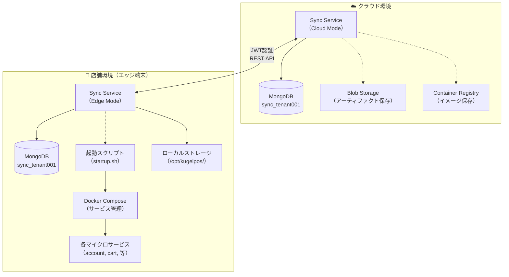
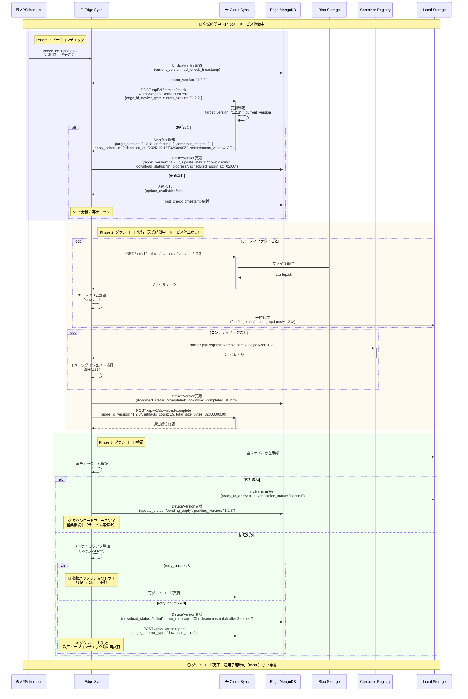
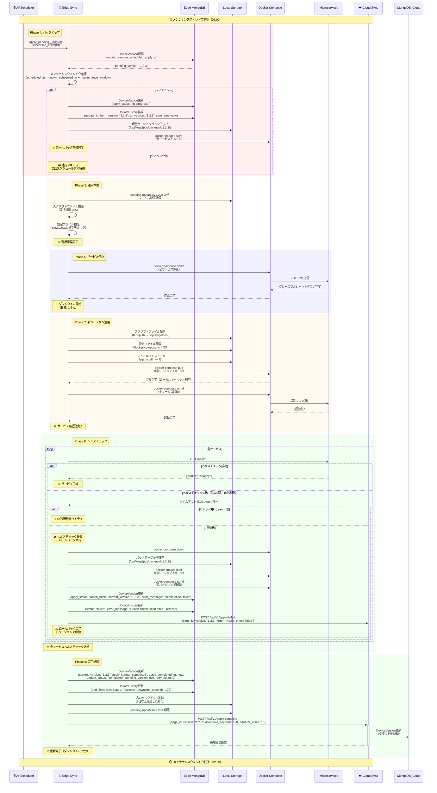
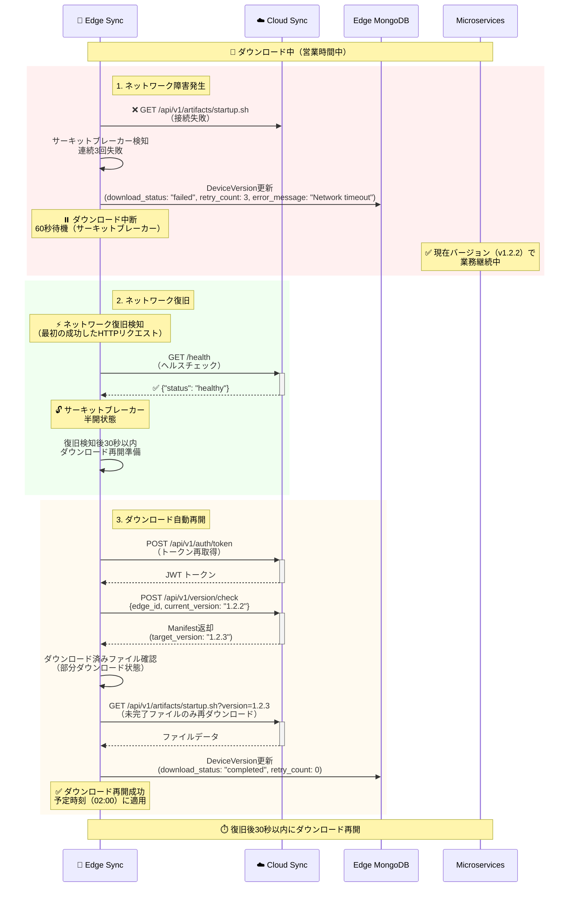
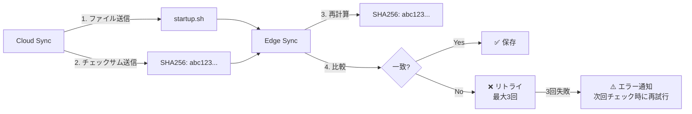
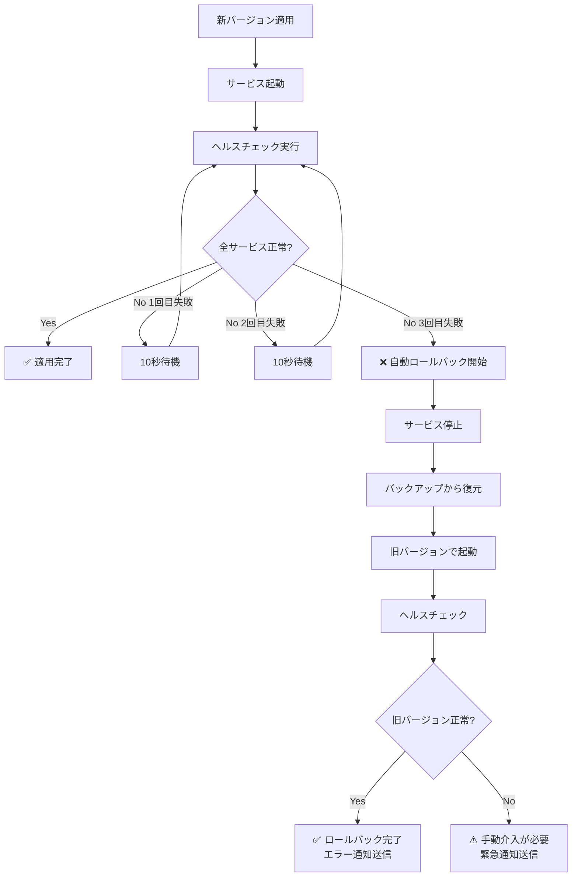
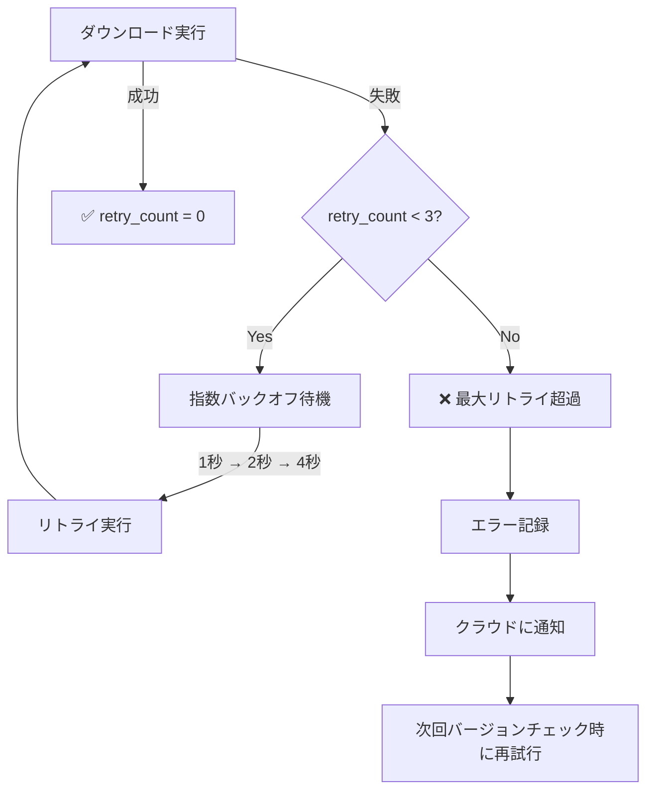
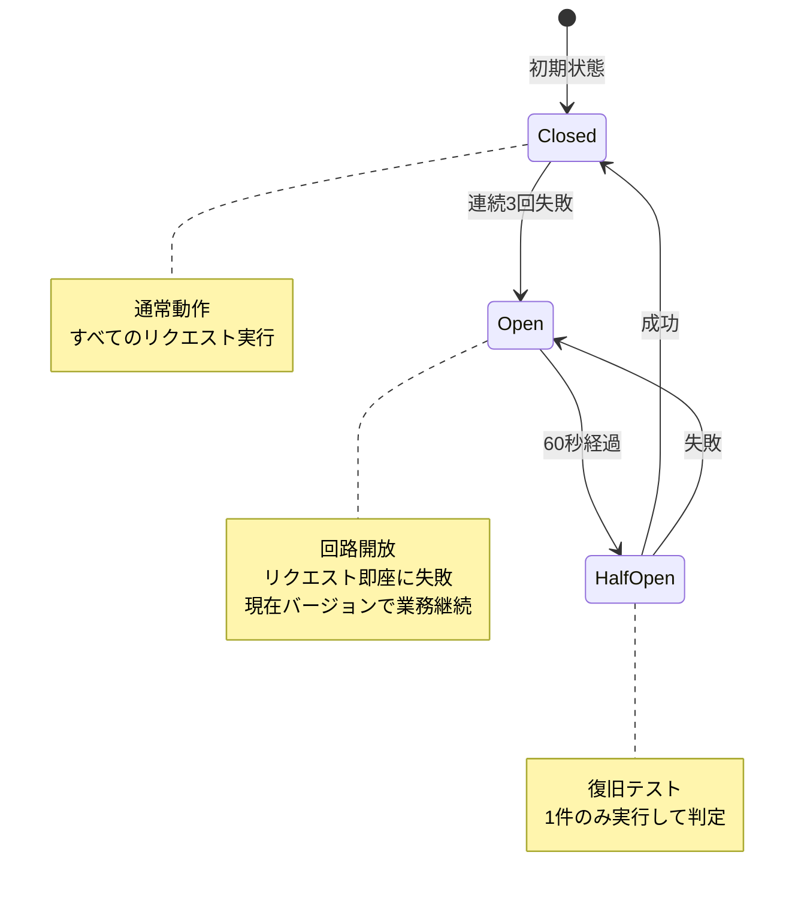

# ユーザーストーリー1: エッジ端末の自動更新とオフライン耐性 - 処理フロー図

## 概要

このドキュメントは、ユーザーストーリー1「エッジ端末の自動更新とオフライン耐性」の処理フローを視覚的に説明します。店舗のエッジ端末（Edge/POS）が、営業時間中に新バージョンをダウンロードし、営業終了後に自動適用する全体像を、ユーザーが理解しやすい形で図解します。

## シナリオ

店舗のエッジ端末（Edge/POS）が、営業時間中に新しいバージョンのアプリケーションファイルをダウンロードし、営業終了後の指定時刻に自動的に適用される。ネットワーク障害時でも現在適用されているバージョンで業務を継続できる。

## 主要コンポーネント



## 処理フロー全体

### フロー1: 営業時間中の自動ダウンロード（ダウンロードフェーズ: Phase 1-3）

営業時間中（サービス稼働中）にバージョンチェックを実行し、新バージョンをダウンロードするフローです。



**主要ステップ**:
1. **Phase 1: バージョンチェック**: 起動時および15分ごとにクラウドに現在バージョンを送信し、更新要否を確認
2. **Phase 2: ダウンロード実行**: 営業時間中にファイルとコンテナイメージをダウンロード（サービス停止なし）
3. **Phase 3: ダウンロード検証**: SHA256チェックサム検証、検証失敗時は最大3回リトライ

### フロー2: メンテナンスウィンドウでの自動適用（適用フェーズ: Phase 4-9）

ダウンロード完了後、指定されたメンテナンスウィンドウ内（深夜2:00-2:30）に自動的に適用するフローです。



**主要ステップ**:
1. **Phase 4: バックアップ**: 現行バージョンをバックアップ（ロールバック用）
2. **Phase 5: 適用準備**: ファイル配置準備、検証
3. **Phase 6: サービス停止**: 全サービスをグレースフルシャットダウン（ダウンタイム開始）
4. **Phase 7: 新バージョン適用**: ファイル配置、モジュールインストール、サービス起動
5. **Phase 8: ヘルスチェック**: 全サービスの正常性確認、失敗時は自動ロールバック
6. **Phase 9: 完了通知**: クラウドに適用完了を通知、ローカルクリーンアップ

### フロー3: ネットワーク障害時のリトライとオフライン耐性

ダウンロード中にネットワーク障害が発生した場合の自動復旧フローです。



**主要ステップ**:
1. **ネットワーク障害検知**: 連続3回失敗でサーキットブレーカーがオープン、ダウンロード中断
2. **業務継続**: 現在バージョンで業務を継続（オフライン耐性）
3. **復旧検知**: 最初の成功したHTTPリクエストで復旧を検知
4. **自動再開**: トークン再取得 → 未完了ファイルのみ再ダウンロード（復旧後30秒以内）

## データ整合性保証の仕組み

### チェックサム検証（FR-009）



**検証アルゴリズム**:
```python
# Cloud側でチェックサム計算（Manifestに含める）
checksum = hashlib.sha256(file_data).hexdigest()

# Edge側で検証
downloaded_checksum = hashlib.sha256(downloaded_file).hexdigest()
if manifest["checksum"] != downloaded_checksum:
    raise ChecksumMismatchError()
```

### 自動ロールバック（FR-010, FR-011）



**ロールバック条件**:
- ヘルスチェック3回連続失敗（10秒間隔）
- サービス起動失敗

**ロールバック時間**: 3分以内（SC-009）

## データベース構造

### DeviceVersion（デバイスバージョン管理）

各エッジ端末の現在バージョン、目標バージョン、更新状態を管理するコレクション：

```
コレクション: info_edge_version

ドキュメント例:
{
  "_id": ObjectId("..."),
  "edge_id": "edge-tenant001-store001-001",
  "device_type": "edge",
  "current_version": "1.2.3",
  "target_version": "1.2.3",
  "update_status": "completed",
  "download_status": "completed",
  "download_completed_at": ISODate("2025-10-14T16:30:00Z"),
  "apply_status": "completed",
  "scheduled_apply_at": ISODate("2025-10-15T02:00:00Z"),
  "apply_completed_at": ISODate("2025-10-15T02:02:30Z"),
  "pending_version": null,
  "last_check_timestamp": ISODate("2025-10-15T10:00:00Z"),
  "retry_count": 0,
  "error_message": null,
  "created_at": ISODate("2025-10-01T00:00:00Z"),
  "updated_at": ISODate("2025-10-15T02:02:30Z")
}
```

**インデックス**:
- `{edge_id: 1}` (unique) - エッジ端末での検索
- `{device_type: 1, update_status: 1}` - 更新状態での集計
- `{target_version: 1, download_status: 1}` - ダウンロード進捗追跡

### UpdateHistory（更新履歴）

各更新実行の監査ログ：

```
コレクション: info_update_history

ドキュメント例:
{
  "_id": ObjectId("..."),
  "update_id": "550e8400-e29b-41d4-a716-446655440000",
  "edge_id": "edge-tenant001-store001-001",
  "from_version": "1.2.2",
  "to_version": "1.2.3",
  "start_time": ISODate("2025-10-15T02:00:00Z"),
  "end_time": ISODate("2025-10-15T02:02:30Z"),
  "status": "success",
  "error_message": null,
  "artifacts_count": 15,
  "total_size_bytes": 3200000000,
  "downtime_seconds": 120
}
```

**インデックス**:
- `{update_id: 1}` (unique) - 更新IDでの検索
- `{edge_id: 1, start_time: -1}` - エッジ端末ごとの履歴取得

**保持期間**: 90日間（TTLインデックス）

### PendingUpdate（ダウンロード済み未適用更新）

エッジ端末のローカルストレージに保存されるダウンロード状態管理：

```
ファイルパス: /opt/kugelpos/pending-updates/v1.2.3/status.json

ドキュメント例:
{
  "version": "1.2.3",
  "download_status": "completed",
  "download_started_at": "2025-10-14T16:00:00Z",
  "download_completed_at": "2025-10-14T16:30:00Z",
  "verification_status": "passed",
  "ready_to_apply": true,
  "artifacts_count": 15,
  "total_size_bytes": 3200000000,
  "manifest_json": { ... },
  "status_json": {
    "files": {
      "startup.sh": {"status": "completed", "checksum_verified": true},
      "docker-compose.yml": {"status": "completed", "checksum_verified": true}
    },
    "images": {
      "cart:1.2.3": {"status": "completed", "digest_verified": true}
    }
  }
}
```

**保持期限**: 7日間、期限超過時は自動削除（FR-028）

## パフォーマンス指標

| 指標 | 目標値 | 測定方法 |
|------|--------|---------|
| **ダウンロード時間（エッジ端末）** | 10分以内 | バージョンチェック → ダウンロード完了までの時間（全8サービス、合計3200MB） |
| **ダウンロード時間（POS端末）** | 5分以内 | バージョンチェック → ダウンロード完了までの時間 |
| **ダウンタイム** | 1-3分 | Phase 6開始 → Phase 7完了までの時間 |
| **チェックサム検証成功率** | 99.9%以上 | 検証成功回数 / 全ダウンロード回数 |
| **ヘルスチェック成功率** | 99.9%以上 | 新バージョン適用後のヘルスチェック成功率 |
| **自動ロールバック時間** | 3分以内 | ヘルスチェック失敗検出 → ロールバック完了までの時間 |
| **ネットワーク復旧後の再開** | 30秒以内 | 復旧検知 → ダウンロード再開までの時間 |
| **適用開始時刻精度** | scheduled_at ±30秒 | 予定時刻と実際の適用開始時刻の差 |

## エラーハンドリング

### リトライ戦略（FR-027）



**指数バックオフ**: 1秒 → 2秒 → 4秒（最大3回）

### サーキットブレーカー



**しきい値**: 連続3回失敗でオープン

**回復時間**: 60秒後に半開状態

## 受入シナリオの検証

### シナリオ1: 営業時間中のダウンロード、営業終了後の自動適用

```
Given: クラウドに新バージョン（v1.2.3）が登録されている、scheduled_at=深夜2:00に設定
When: エッジ端末が15分ごとのバージョンチェックを実行（14:00）
Then:
  1. 更新が検知され、即座にダウンロードが開始される（営業時間中、サービス停止なし）
  2. ダウンロード完了後、深夜2:00まで待機
  3. 深夜2:00に自動的に適用フェーズが実行される
  4. サービス停止→新バージョンに更新→サービス起動→ヘルスチェック完了
  5. ダウンタイム1-3分以内

検証方法:
1. Cloud Sync Serviceで新バージョン登録 (target_version: "1.2.3", scheduled_at: "02:00")
2. Edge Sync のバージョンチェック実行（14:00）
3. ダウンロードフェーズ完了を確認（DeviceVersion.download_status: "completed"）
4. scheduled_at到達時（02:00）に適用フェーズが自動実行されることを確認
5. ダウンタイムを測定（Phase 6開始 → Phase 7完了）
6. 最終的に DeviceVersion.current_version: "1.2.3", apply_status: "completed" を確認
```

### シナリオ2: ネットワーク障害時の業務継続と復旧後の自動再開

```
Given: ダウンロード中にネットワーク障害発生
When: 障害が継続
Then:
  1. ダウンロードを中断し、現在バージョンで業務継続
  2. ネットワーク障害が復旧後30秒以内にダウンロード自動再開
  3. 完了後は予定時刻に適用

検証方法:
1. Edge Sync のダウンロード中にネットワーク接続を切断
2. Edge Sync が現在バージョン（v1.2.2）で継続稼働することを確認
3. ネットワーク接続を復旧
4. 復旧検知からの経過時間を測定
5. 30秒以内にダウンロード再開されることを確認
6. ダウンロード完了後、scheduled_atに適用されることを確認
```

### シナリオ3: ヘルスチェック失敗時の自動ロールバック

```
Given: 新バージョン適用後、サービス起動失敗
When: ヘルスチェック3回連続失敗
Then:
  1. 自動的にロールバックが実行される
  2. 直前のバージョンに復元され、サービスが正常起動
  3. ロールバック時間3分以内

検証方法:
1. 意図的に不正な設定ファイルを含むバージョンを作成
2. 適用フェーズ実行
3. ヘルスチェック失敗を3回確認
4. 自動ロールバック実行を確認
5. ロールバック完了までの時間を測定（3分以内）
6. DeviceVersion.apply_status: "rolled_back", current_version: "1.2.2" を確認
7. UpdateHistory.status: "failed" を確認
```

### シナリオ4: チェックサム検証失敗時のリトライ

```
Given: ファイルダウンロード完了後、チェックサム不一致検出
When: 検証失敗
Then:
  1. ダウンロードファイルを削除
  2. エラーをクラウドに通知
  3. 指数バックオフ（1秒→2秒→4秒）でリトライ（最大3回）
  4. 3回失敗後は次回バージョンチェック時に再試行

検証方法:
1. 意図的にファイルを改ざんしてチェックサム不一致を発生させる
2. Edge Sync がリトライを実行することを確認
3. リトライ間隔を測定（1秒→2秒→4秒）
4. 3回失敗後、DeviceVersion.download_status: "failed", retry_count: 3 を確認
5. クラウドにエラー通知が送信されることを確認
```

## 関連ドキュメント

- [spec.md](../spec.md) - 機能仕様書
- [plan.md](../plan.md) - 実装計画
- [data-model.md](../data-model.md) - データモデル設計
- [contracts/sync-api.yaml](../contracts/sync-api.yaml) - Sync API仕様
- [contracts/auth-api.yaml](../contracts/auth-api.yaml) - 認証API仕様

---

**ドキュメントバージョン**: 1.0.0
**最終更新日**: 2025-10-14
**ステータス**: 完成
