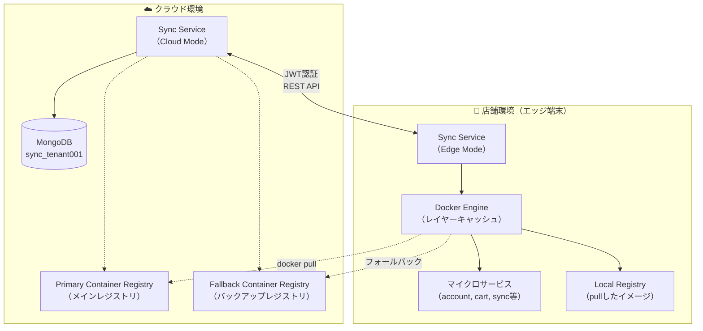
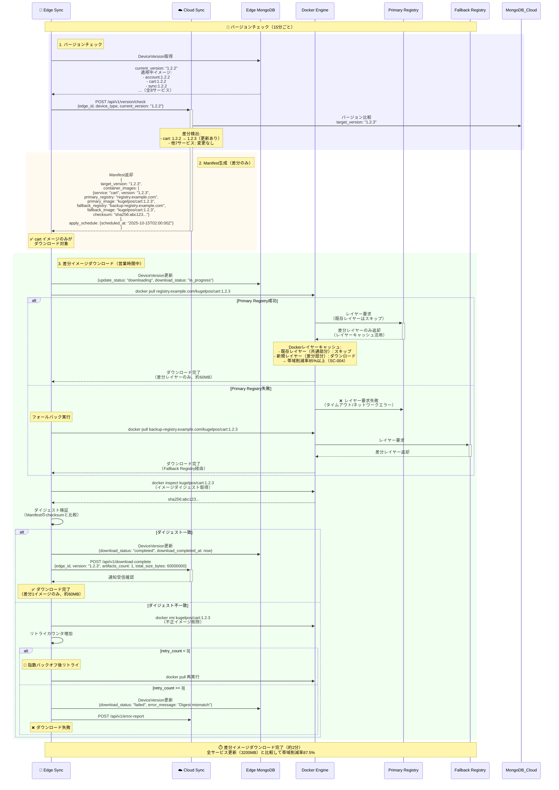
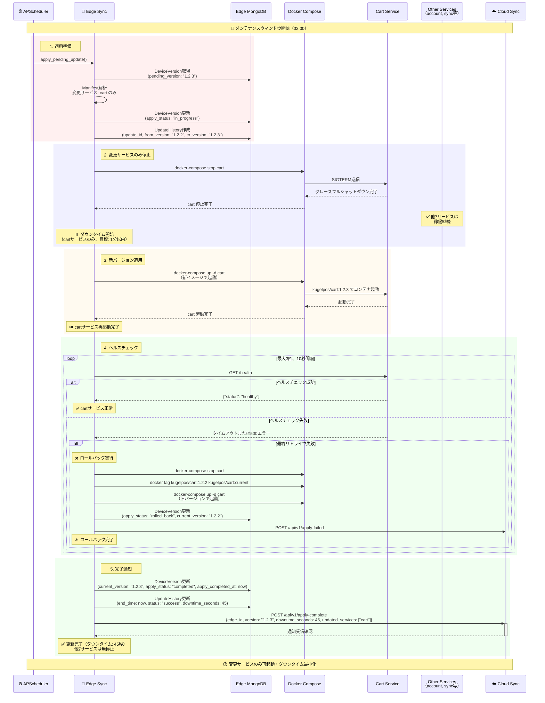
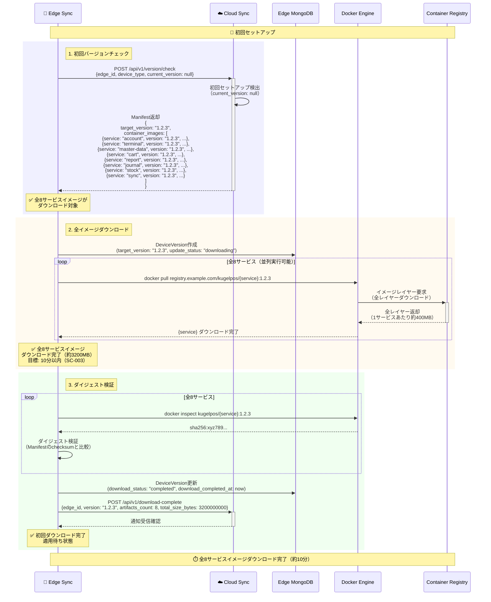
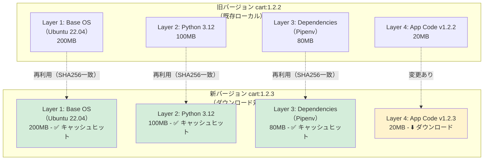
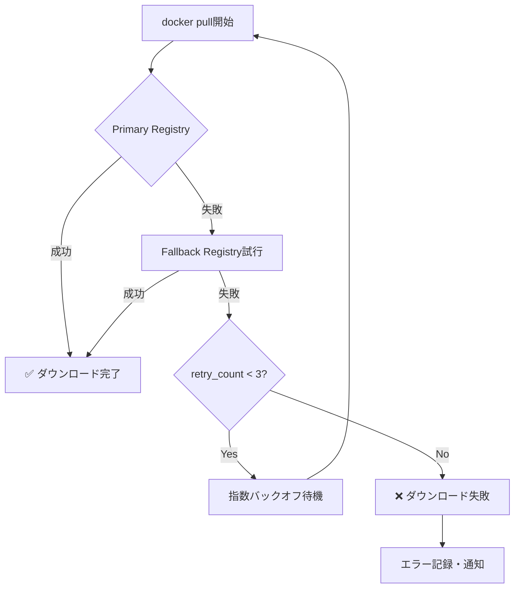
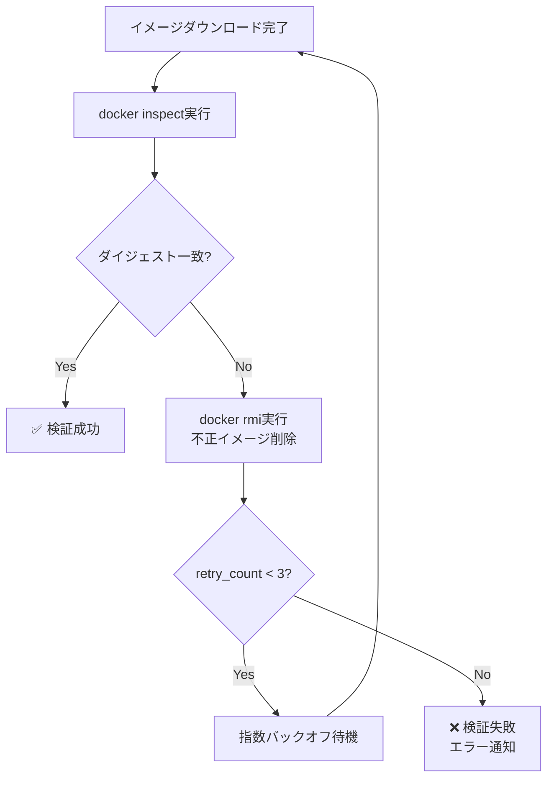

# ユーザーストーリー2: コンテナイメージの差分更新 - 処理フロー図

## 概要

このドキュメントは、ユーザーストーリー2「コンテナイメージの差分更新」の処理フローを視覚的に説明します。マイクロサービス（account, cart, sync等）のコンテナイメージが更新された際、変更されたサービスのイメージのみを効率的にダウンロードし、Dockerのレイヤーキャッシュを活用して帯域を削減する仕組みを、ユーザーが理解しやすい形で図解します。

## シナリオ

マイクロサービス（account, terminal, master-data, cart, report, journal, stock, sync）のコンテナイメージが更新された際、変更されたサービスのイメージのみを効率的にダウンロードし、Dockerのレイヤーキャッシュを活用して帯域を削減する。

## 主要コンポーネント



## 処理フロー全体

### フロー1: 差分イメージのダウンロード（変更1サービスのみ）

8つのサービスのうち1つ（例: cart）のみが更新された際の差分ダウンロードフローです。



**主要ステップ**:
1. **バージョンチェック**: クラウド側で変更されたサービスを検出（cart: 1.2.2 → 1.2.3）
2. **Manifest生成**: 変更されたサービスのイメージのみを含むManifestを返却
3. **差分ダウンロード**: Dockerレイヤーキャッシュを活用して差分レイヤーのみダウンロード
4. **ダイジェスト検証**: イメージダイジェスト（SHA256）がManifestの値と一致することを確認

**帯域削減効果**:
- 全サービス更新時: 3200MB（8サービス × 400MB）
- 差分更新時（1サービス）: 約60MB（Dockerレイヤーキャッシュ活用）
- 削減率: 約98%（実際の差分レイヤーサイズに依存）

### フロー2: 適用フェーズ（変更サービスのみ再起動）

ダウンロード完了後、メンテナンスウィンドウ内に変更されたサービスのみを再起動するフローです。



**主要ステップ**:
1. **適用準備**: Manifestを解析して変更されたサービス（cart）を特定
2. **変更サービスのみ停止**: cartサービスのみ停止（他7サービスは稼働継続）
3. **新バージョン適用**: cartサービスを新イメージ（1.2.3）で起動
4. **ヘルスチェック**: cartサービスの正常性確認、失敗時はロールバック
5. **完了通知**: クラウドに適用完了を通知

**ダウンタイム**:
- 変更サービスのみ: 約45秒（1サービス）
- 全サービス更新時: 約2-3分（8サービス）
- ダウンタイム削減効果: 約75%

### フロー3: 初回セットアップ（全イメージダウンロード）

新規エッジ端末設置時の全イメージダウンロードフローです。



**主要ステップ**:
1. **初回バージョンチェック**: `current_version: null` で全イメージが対象
2. **全イメージダウンロード**: 8サービス × 400MB ≈ 3200MB をダウンロード
3. **ダイジェスト検証**: 全イメージのダイジェストを検証

**パフォーマンス**:
- 目標: 10分以内（SC-003）
- 実際のダウンロード時間はネットワーク帯域に依存

## Dockerレイヤーキャッシュの仕組み

### レイヤーキャッシュ活用例



**レイヤーキャッシュ効果**:
- 旧バージョン全体: 400MB
- 新バージョン全体: 400MB
- 実際のダウンロード: 20MB（差分レイヤーのみ）
- 削減率: 95%（= 380MB / 400MB）

### docker pull 実行時の動作

```
$ docker pull registry.example.com/kugelpos/cart:1.2.3

1.2.3: Pulling from kugelpos/cart
Layer 1 (sha256:abc123...): Already exists  ← キャッシュヒット
Layer 2 (sha256:def456...): Already exists  ← キャッシュヒット
Layer 3 (sha256:ghi789...): Already exists  ← キャッシュヒット
Layer 4 (sha256:jkl012...): Downloading     ← 差分ダウンロード
Layer 4 (sha256:jkl012...): Download complete
Digest: sha256:xyz789...
Status: Downloaded newer image for registry.example.com/kugelpos/cart:1.2.3
```

**検証ポイント**:
- 各レイヤーはSHA256ハッシュで識別
- ローカルに同じSHA256のレイヤーが存在すれば再利用
- 変更されたレイヤーのみダウンロード

## データベース構造

### DeviceVersion（イメージバージョン管理）

```
コレクション: info_edge_version

ドキュメント例（差分更新時）:
{
  "_id": ObjectId("..."),
  "edge_id": "edge-tenant001-store001-001",
  "device_type": "edge",
  "current_version": "1.2.3",
  "target_version": "1.2.3",
  "update_status": "completed",
  "download_status": "completed",
  "download_completed_at": ISODate("2025-10-14T16:05:00Z"),
  "apply_status": "completed",
  "apply_completed_at": ISODate("2025-10-15T02:01:00Z"),
  "updated_services": ["cart"],  // 差分更新時のみ記録
  "total_size_bytes": 60000000,  // 実際のダウンロードサイズ（レイヤーキャッシュ後）
  "artifacts_count": 1,
  "retry_count": 0,
  "error_message": null,
  "created_at": ISODate("2025-10-01T00:00:00Z"),
  "updated_at": ISODate("2025-10-15T02:01:00Z")
}
```

**差分更新の記録**:
- `updated_services`: 更新されたサービスのリスト
- `total_size_bytes`: 実際のダウンロードサイズ（レイヤーキャッシュ適用後）
- `artifacts_count`: ダウンロードしたイメージ数

## パフォーマンス指標

| 指標 | 目標値 | 測定方法 |
|------|--------|---------|
| **全イメージダウンロード時間** | 10分以内 | 初回セットアップ時の全8サービスダウンロード時間（合計3200MB） |
| **差分イメージダウンロード時間** | 2分以内 | 1サービス更新時のダウンロード時間（レイヤーキャッシュ適用後） |
| **帯域削減率（差分更新）** | 85%以上 | (全サービス更新時のサイズ - 差分更新時のサイズ) / 全サービス更新時のサイズ |
| **ダウンタイム（差分適用）** | 1分以内 | 変更サービスのみ停止・再起動（他サービス稼働継続） |
| **ダイジェスト検証成功率** | 99.9%以上 | 検証成功回数 / 全ダウンロード回数 |

**帯域削減率の計算例**:
- 全サービス更新: 3200MB（8サービス × 400MB）
- 差分更新（1サービス、レイヤーキャッシュ適用後）: 約60MB
- 削減率: (3200 - 60) / 3200 = 98.1%

## エラーハンドリング

### レジストリアクセス失敗時のフォールバック



**フォールバック戦略**:
1. Primary Registryからダウンロード試行
2. 失敗時はFallback Registryへ自動切り替え
3. 両方失敗時は指数バックオフでリトライ（最大3回）

### ダイジェスト検証失敗時のリトライ



**検証失敗時の対応**:
1. 不正なイメージをローカルから削除（`docker rmi`）
2. リトライカウンタ増加
3. 指数バックオフ後に再ダウンロード（最大3回）
4. 3回失敗後はクラウドにエラー通知

## 受入シナリオの検証

### シナリオ1: 1サービスのみ更新（差分ダウンロード）

```
Given: 8つのサービスのうちcartサービスのみv1.2.3に更新
When: エッジ端末がバージョンチェック実行
Then:
  1. cartイメージのみがダウンロード対象として返却される
  2. Dockerレイヤーキャッシュにより差分のみダウンロード（全サービス更新と比較して帯域を大幅に削減）
  3. 適用時はcartサービスのみ再起動、他サービスは稼働継続

検証方法:
1. Cloud側でcartサービスのみv1.2.3に更新
2. Edge Sync のバージョンチェック実行
3. Manifestにcartイメージのみが含まれることを確認
4. docker pull実行時、レイヤーキャッシュが活用されることを確認（ログ出力: "Already exists"）
5. ダウンロードサイズを測定（目標: 全サービス更新時の15%以下）
6. 適用時、cartサービスのみ再起動されることを確認
```

### シナリオ2: 初回セットアップ（全イメージダウンロード）

```
Given: 初回セットアップ時
When: 全イメージダウンロード
Then: 10分以内に全8サービスのイメージ取得完了

検証方法:
1. 新規エッジ端末を登録（edge_id, secret）
2. Edge Sync 起動 → 認証 → バージョンチェック実行（current_version: null）
3. Manifestに全8サービスイメージが含まれることを確認
4. 開始時刻と完了時刻を記録
5. 全イメージダウンロード完了時刻を確認（目標: 10分以内）
6. 各イメージのダイジェスト検証が成功することを確認
```

### シナリオ3: レイヤーキャッシュの効果検証

```
Given: cartイメージの前バージョン（v1.2.2）が既に存在
When: v1.2.3をpull
Then: Dockerレイヤーキャッシュにより差分のみダウンロード

検証方法:
1. Edge Sync で cart:1.2.2 を適用済みの状態
2. docker images でローカルイメージを確認
3. Cloud側で cart:1.2.3 を登録（アプリコードのみ変更、ベースイメージは同じ）
4. Edge Sync で cart:1.2.3 をダウンロード
5. docker pull のログ出力を確認:
   - "Already exists" が複数回表示される（共通レイヤー）
   - "Downloading" は差分レイヤーのみ
6. ダウンロードサイズを測定:
   - 全レイヤーサイズ: 400MB
   - 実際のダウンロード: 約20-60MB
   - 削減率: 85%以上
```

### シナリオ4: Primary Registry失敗時のフォールバック

```
Given: Primary Registryがダウン
When: イメージダウンロード実行
Then: Fallback Registryから自動的にダウンロード

検証方法:
1. Primary Registry を意図的に停止
2. Edge Sync でバージョンチェック → ダウンロード実行
3. docker pull のログで Primary Registry への接続失敗を確認
4. 自動的に Fallback Registry へフォールバックすることを確認
5. Fallback Registry からダウンロード完了することを確認
6. DeviceVersion に成功として記録されることを確認
```

## 関連ドキュメント

- [spec.md](../spec.md) - 機能仕様書
- [plan.md](../plan.md) - 実装計画
- [data-model.md](../data-model.md) - データモデル設計
- [contracts/sync-api.yaml](../contracts/sync-api.yaml) - Sync API仕様

---

**ドキュメントバージョン**: 1.0.0
**最終更新日**: 2025-10-14
**ステータス**: 完成
