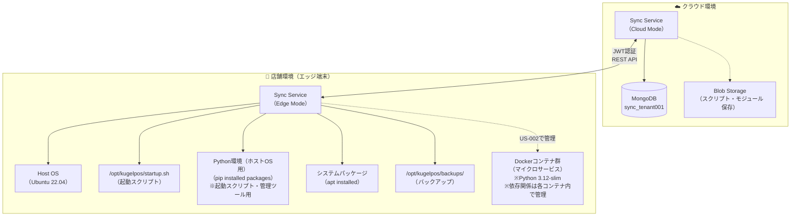
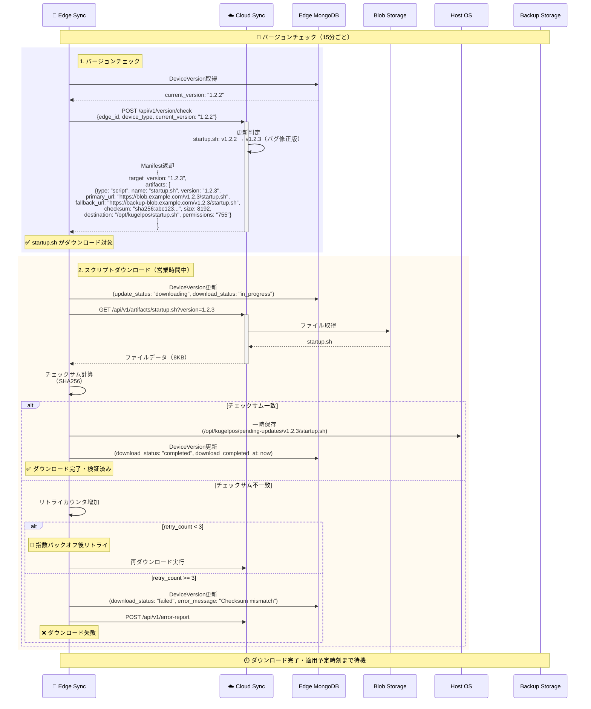
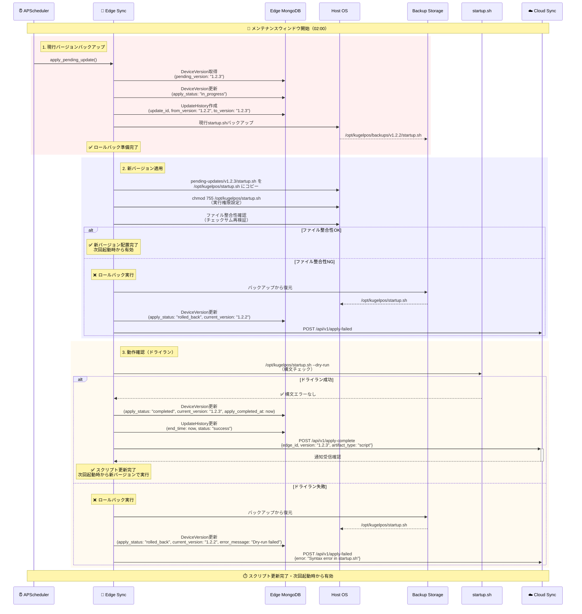
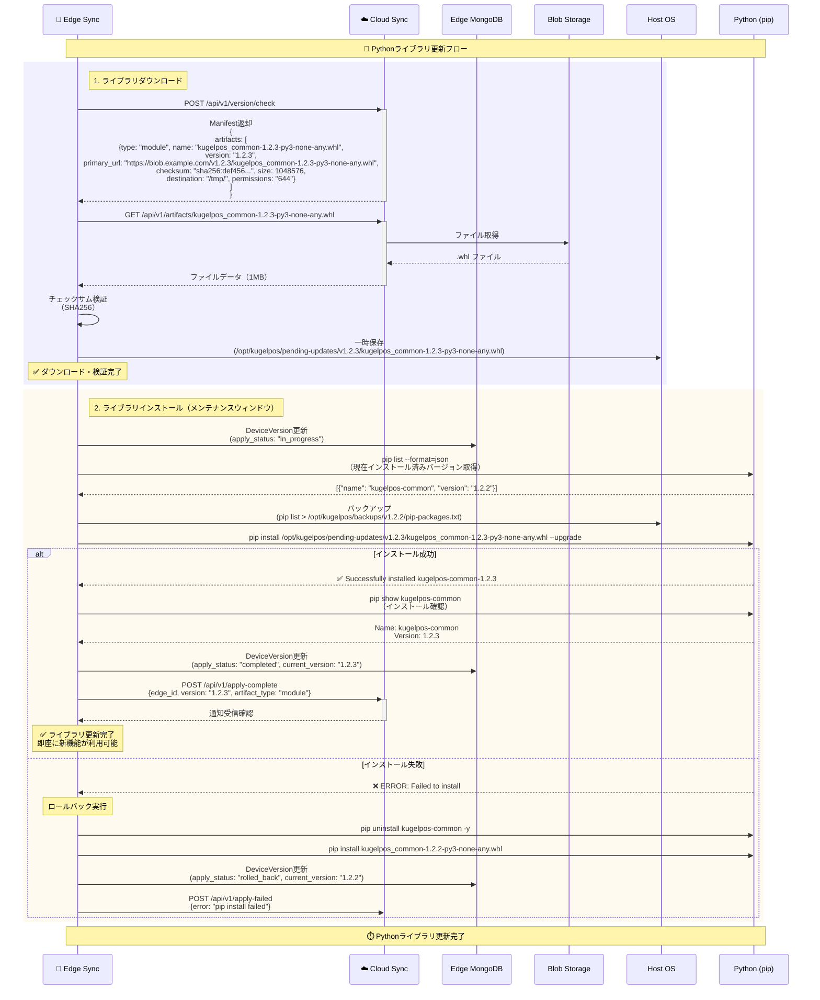
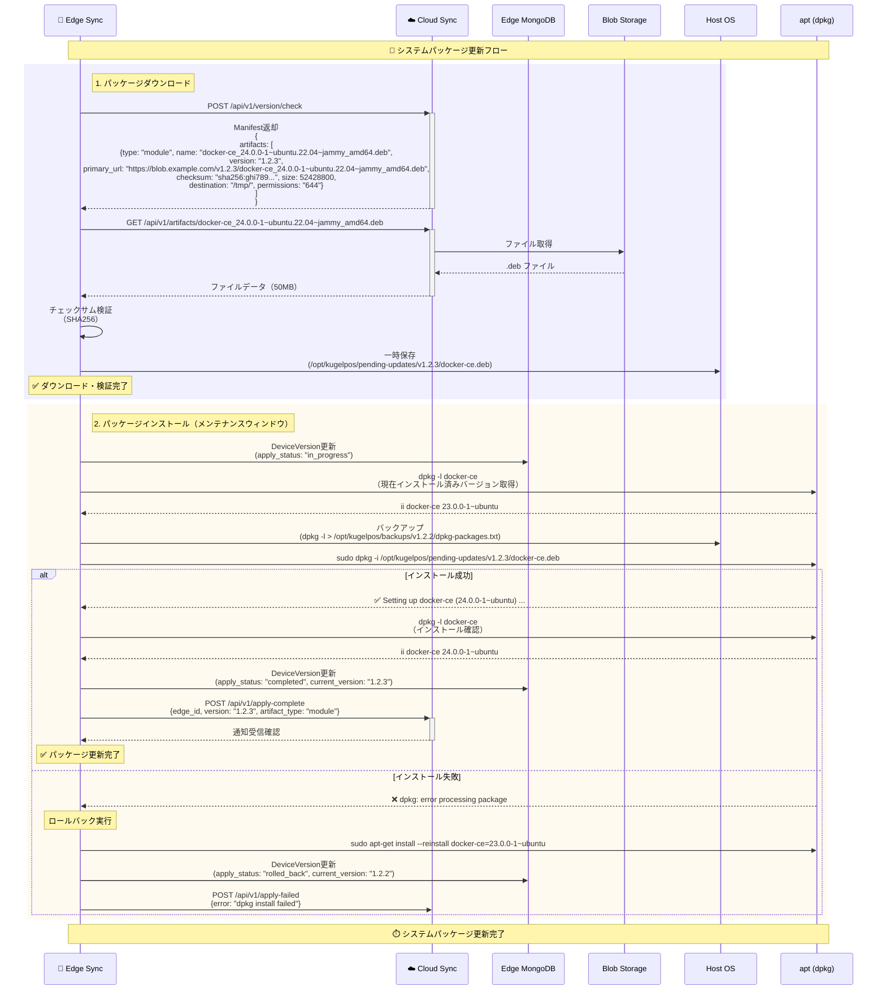
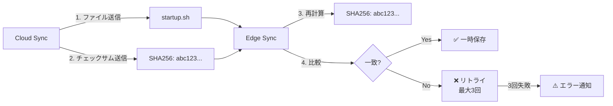
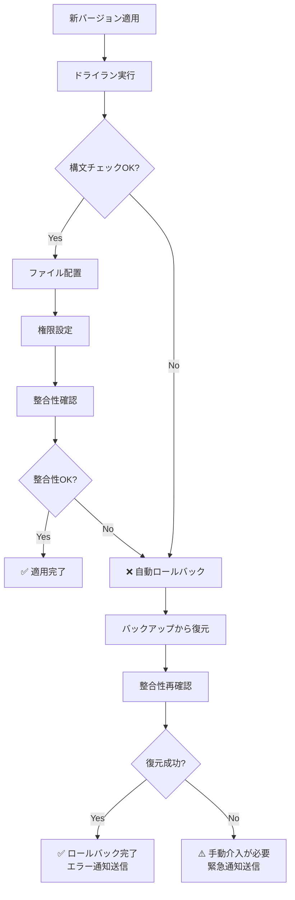
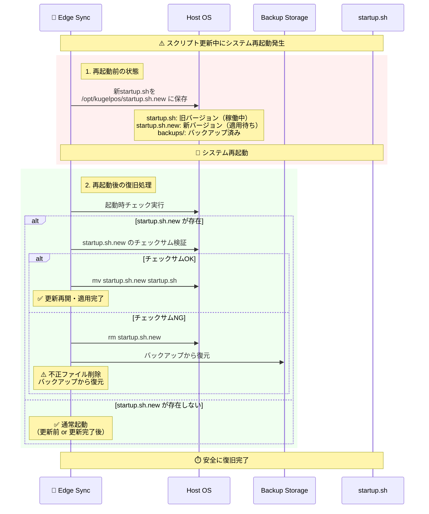

# ユーザーストーリー3: スクリプトとモジュールの自己更新 - 処理フロー図

## 概要

このドキュメントは、ユーザーストーリー3「スクリプトとモジュールの自己更新」の処理フローを視覚的に説明します。起動スクリプト（startup.sh）自身や、ホストOS上のPythonライブラリ（.whl）、システムパッケージ（.deb）などを安全に更新し、次回起動時から新バージョンのスクリプトで動作する仕組みを、ユーザーが理解しやすい形で図解します。

**注**: コンテナイメージ内のPythonライブラリ更新はユーザーストーリー2（コンテナイメージの差分更新）でカバーされます。本ストーリーでは、ホストOS上で動作する起動スクリプトやツールが使用するライブラリ・パッケージの更新を扱います。

## シナリオ

起動スクリプト（startup.sh）自身や、ホストOS上のPythonライブラリ（.whl）、システムパッケージ（.deb）などを安全に更新し、次回起動時から新バージョンのスクリプトで動作する。

**システム構成**:
- **ホストOS**: Ubuntu 22.04 LTS
- **Python**: Python 3.12（ホストOS上、起動スクリプト用）
- **コンテナ**: Docker（各マイクロサービスはPython 3.12-slimベースのコンテナで稼働）

### US-002とUS-003の役割分担

| 項目 | US-002（コンテナイメージの差分更新） | US-003（スクリプトとモジュールの自己更新） |
|------|-----------------------------------|----------------------------------------|
| **対象環境** | Dockerコンテナ内 | ホストOS上 |
| **更新対象** | ・マイクロサービスのアプリケーションコード<br/>・コンテナ内のPythonライブラリ（FastAPI、Motor、Pydantic等）<br/>・コンテナイメージ全体 | ・起動スクリプト（startup.sh）<br/>・ホストOS上のPythonライブラリ<br/>・システムパッケージ（docker-ce、curl等） |
| **更新方法** | Dockerイメージの差分ダウンロード＆コンテナ再作成 | ファイル直接置換、pip install、apt install |
| **依存関係管理** | Pipfile/Pipfile.lock（PIPENV_VENV_IN_PROJECT=1） | pip（システムワイド or venv）、apt |
| **適用タイミング** | メンテナンスウィンドウ内（コンテナ再起動） | メンテナンスウィンドウ内（ファイル置換） |
| **ダウンタイム** | あり（1〜3分、コンテナ再起動時） | なし（スクリプトは次回実行時に有効） |

**Dockerfileとの関係**:
- 各マイクロサービスの `Dockerfile.prod` では、Multi-stage buildを使用しています：
  - **Stage 1 (Builder)**: Python 3.12.11ベースで `pipenv install` を実行、依存関係を `.venv` にインストール
  - **Stage 2 (Runtime)**: Python 3.12-slimベースで軽量化、`.venv` をコピーして実行
- このDockerイメージ全体の更新はUS-002で管理され、コンテナ内の依存関係も含まれます
- US-003では、このコンテナを起動・管理するホストOS側のツール（startup.sh等）を更新します

## 主要コンポーネント



## 処理フロー全体

### フロー1: 起動スクリプト（startup.sh）の自己更新

起動スクリプト自身を安全に更新し、次回起動時から新バージョンで動作させるフローです。



**主要ステップ**:
1. **バージョンチェック**: startup.shの更新を検出（v1.2.2 → v1.2.3）
2. **スクリプトダウンロード**: 営業時間中にダウンロード（サービス停止なし）
3. **チェックサム検証**: SHA256ハッシュで改ざん検証

### フロー2: スクリプト適用（メンテナンスウィンドウ）

メンテナンスウィンドウ内に起動スクリプトを安全に置き換えるフローです。



**主要ステップ**:
1. **現行バージョンバックアップ**: ロールバック用に現行startup.shを保存
2. **新バージョン適用**: 新startup.shを配置、実行権限設定、整合性確認
3. **動作確認（ドライラン）**: 構文チェック、失敗時は自動ロールバック

**重要な注意点**:
- スクリプト更新は次回起動時から有効（現在実行中のスクリプトは変更しない）
- 適用フェーズではサービスを停止しない（スクリプトはサービス起動前に実行）

### フロー3: Pythonライブラリ（.whl）の更新

ホストOS上のPythonライブラリを更新し、起動スクリプトや管理ツールが使用するモジュール（Manifestパーサー等）の新機能を利用可能にするフローです。

**重要**: このフローは**ホストOS上**のPythonライブラリ更新を扱います。各マイクロサービスのコンテナ内で使用されるPythonライブラリ（FastAPI、Motor等）の更新は、ユーザーストーリー2（コンテナイメージの差分更新）で管理されます。ホストOS上のPythonライブラリは、以下のような用途で使用されます：
- 起動スクリプト（startup.sh）が使用する共通ライブラリ
- 管理ツールが使用する補助モジュール
- Sync Service（Edge Mode）のManifest解析ライブラリ



**主要ステップ**:
1. **ライブラリダウンロード**: .whlファイルをダウンロード、チェックサム検証
2. **ライブラリインストール**: `pip install --upgrade` で更新、失敗時は自動ロールバック

**重要な注意点**:
- ホストOS上のPythonライブラリ更新は、次回スクリプト実行時またはサービス再起動時に有効になります
- コンテナ内のPythonライブラリ（FastAPI、Motor、Pydantic等）は、本フローではなくUS-002（コンテナイメージの差分更新）で更新されます
- ロールバック時は旧バージョンの.whlを再インストール

### フロー4: システムパッケージ（.deb）の更新

ホストOS上のシステムパッケージを更新するフローです。



**主要ステップ**:
1. **パッケージダウンロード**: .debファイルをダウンロード、チェックサム検証
2. **パッケージインストール**: `dpkg -i` で更新、失敗時は自動ロールバック

**重要な注意点**:
- システムパッケージ更新は即座に有効（依存サービスの再起動が必要な場合あり）
- ロールバック時は旧バージョンを再インストール

## データ整合性保証の仕組み

### チェックサム検証（FR-009）



### 実行権限の自動設定

```bash
# スクリプトファイル（startup.sh）
chmod 755 /opt/kugelpos/startup.sh

# モジュールファイル（.whl, .deb）
chmod 644 /opt/kugelpos/pending-updates/v1.2.3/*.whl
```

**権限設定ルール**:
- スクリプトファイル（.sh）: 755（実行可能）
- モジュールファイル（.whl, .deb）: 644（読み取り専用）
- 設定ファイル（.yaml, .json）: 644（読み取り専用）

### ドライラン（構文チェック）

```bash
# startup.shの構文チェック
bash -n /opt/kugelpos/startup.sh
# または
/opt/kugelpos/startup.sh --dry-run

# Pythonスクリプトの構文チェック
python3 -m py_compile /opt/kugelpos/script.py
```

**ドライラン失敗時の対応**:
- 自動的にバックアップから復元
- エラー詳細をクラウドに通知
- ロールバック完了後も現在バージョンで稼働継続

## データベース構造

### DeviceVersion（アーティファクトバージョン管理）

```
コレクション: info_edge_version

ドキュメント例（スクリプト更新時）:
{
  "_id": ObjectId("..."),
  "edge_id": "edge-tenant001-store001-001",
  "device_type": "edge",
  "current_version": "1.2.3",
  "target_version": "1.2.3",
  "update_status": "completed",
  "download_status": "completed",
  "apply_status": "completed",
  "updated_artifacts": [
    {
      "type": "script",
      "name": "startup.sh",
      "version": "1.2.3",
      "applied_at": "2025-10-15T02:01:00Z"
    },
    {
      "type": "module",
      "name": "kugelpos_common-1.2.3-py3-none-any.whl",
      "version": "1.2.3",
      "applied_at": "2025-10-15T02:02:00Z"
    }
  ],
  "retry_count": 0,
  "error_message": null,
  "created_at": ISODate("2025-10-01T00:00:00Z"),
  "updated_at": ISODate("2025-10-15T02:02:00Z")
}
```

**アーティファクト更新の記録**:
- `updated_artifacts`: 更新されたファイル・モジュールのリスト
- 各要素にtype（script/module）、name、version、applied_atを記録

## パフォーマンス指標

| 指標 | 目標値 | 測定方法 |
|------|--------|---------|
| **スクリプト自己更新成功率** | 100% | 更新成功回数 / 全更新試行回数（ロールバック含む） |
| **ドライラン検証成功率** | 99.9%以上 | 構文チェック成功回数 / 全チェック回数 |
| **Pythonライブラリ更新時間** | 1分以内 | pip install開始 → 完了までの時間 |
| **システムパッケージ更新時間** | 3分以内 | dpkg install開始 → 完了までの時間 |
| **チェックサム検証成功率** | 99.9%以上 | 検証成功回数 / 全ダウンロード回数 |
| **ロールバック成功率** | 100% | ロールバック成功回数 / 全ロールバック試行回数 |

## エラーハンドリング

### 適用失敗時の自動ロールバック（FR-010）



**ロールバック条件**:
- ドライラン（構文チェック）失敗
- ファイル配置後の整合性確認失敗
- pip/dpkg インストール失敗

### スクリプト更新中の再起動時の安全性



**安全性の保証**:
- 更新中は `.new` サフィックスで一時保存
- 再起動後、起動時チェックで整合性を確認
- 不正なファイルはバックアップから復元

## 受入シナリオの検証

### シナリオ1: startup.shのバグ修正版配信

```
Given: startup.shのv1.2.3（バグ修正版）がクラウドに登録
When: エッジ端末がバージョンチェック
Then:
  1. スクリプトファイルをダウンロードし、チェックサム検証後に実行権限（755）を設定して配置
  2. 適用時刻到達時、現在のスクリプトをバックアップし、新バージョンで置換
  3. ドライラン（構文チェック）成功
  4. 次回起動時から新バージョンで動作

検証方法:
1. Cloud側で startup.sh v1.2.3 を登録（バグ修正版）
2. Edge Sync のバージョンチェック実行
3. ダウンロード完了を確認（pending-updates/v1.2.3/startup.sh）
4. チェックサム検証成功を確認
5. メンテナンスウィンドウ到達時、適用フェーズ実行
6. バックアップ作成を確認（backups/v1.2.2/startup.sh）
7. ドライラン成功を確認（bash -n startup.sh）
8. 新startup.shが配置されることを確認（/opt/kugelpos/startup.sh）
9. 次回起動時、新バージョンで動作することを確認
```

### シナリオ2: Pythonライブラリ（kugelpos_common.whl）の更新

```
Given: ホストOS用Pythonライブラリ（kugelpos_common.whl）が更新
When: 適用実行
Then: `pip install`でホストOSにインストール完了

**注**: このシナリオは、ホストOS上で動作する起動スクリプトや管理ツールが使用するPythonライブラリの更新を対象としています。マイクロサービスのコンテナ内で使用されるPythonライブラリ（FastAPI、Motor等）の更新は、US-002（コンテナイメージの差分更新）で検証されます。

検証方法:
1. Cloud側で kugelpos_common-1.2.3.whl を登録（ホストOS用）
2. Edge Sync のダウンロード完了を確認
3. メンテナンスウィンドウ到達時、適用フェーズ実行
4. ホストOS上で pip list 実行、旧バージョン確認（kugelpos-common 1.2.2）
5. pip install 実行（ホストOS上）
6. pip list で新バージョン確認（kugelpos-common 1.2.3）
7. pip show で詳細確認（Version: 1.2.3）
8. 起動スクリプト実行時、新ライブラリが読み込まれることを確認
```

### シナリオ3: 適用失敗時の自動ロールバック

```
Given: 適用失敗が発生
When: 自動ロールバック実行
Then: バックアップから前バージョンに復元し、サービス正常起動

検証方法:
1. 意図的に不正な startup.sh を作成（構文エラー含む）
2. Edge Sync でダウンロード完了
3. メンテナンスウィンドウ到達時、適用フェーズ実行
4. ドライラン失敗を確認（bash -n エラー）
5. 自動ロールバック実行を確認
6. バックアップから復元されることを確認
7. DeviceVersion.apply_status: "rolled_back" を確認
8. DeviceVersion.current_version: "1.2.2"（旧バージョン）を確認
9. UpdateHistory.status: "failed" を確認
10. クラウドにエラー通知が送信されることを確認
```

### シナリオ4: スクリプト更新中のシステム再起動

```
Given: スクリプト更新中にシステムが再起動された場合
When: 再起動後
Then: バックアップから復元可能な状態を維持

検証方法:
1. Edge Sync でスクリプト適用フェーズ実行
2. ファイル配置途中で意図的にシステム再起動
3. 再起動後、起動時チェック実行を確認
4. startup.sh.new の存在を確認
5. チェックサム検証実行を確認
6. チェックサムOKなら適用完了、NGならバックアップから復元
7. いずれの場合も正常に起動することを確認
```

## 関連ドキュメント

- [spec.md](../spec.md) - 機能仕様書
- [plan.md](../plan.md) - 実装計画
- [data-model.md](../data-model.md) - データモデル設計
- [contracts/sync-api.yaml](../contracts/sync-api.yaml) - Sync API仕様

---

**ドキュメントバージョン**: 1.0.0
**最終更新日**: 2025-10-14
**ステータス**: 完成
