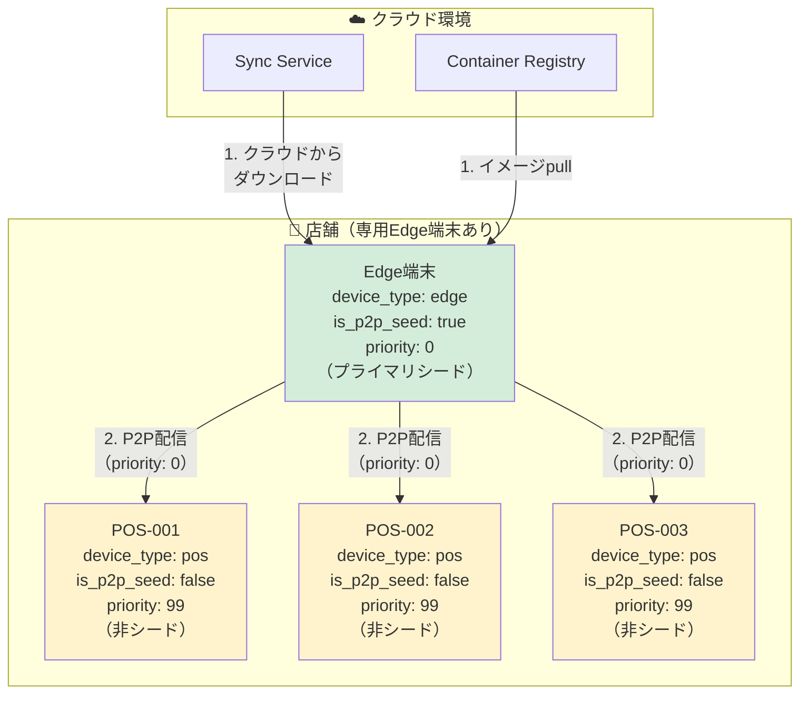
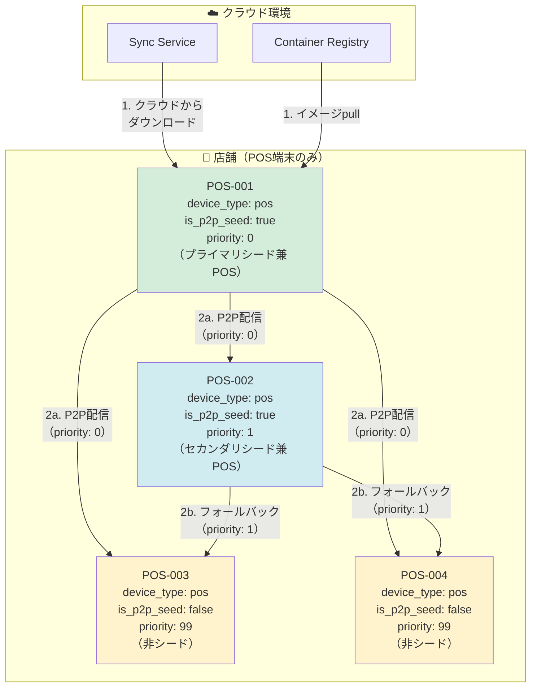
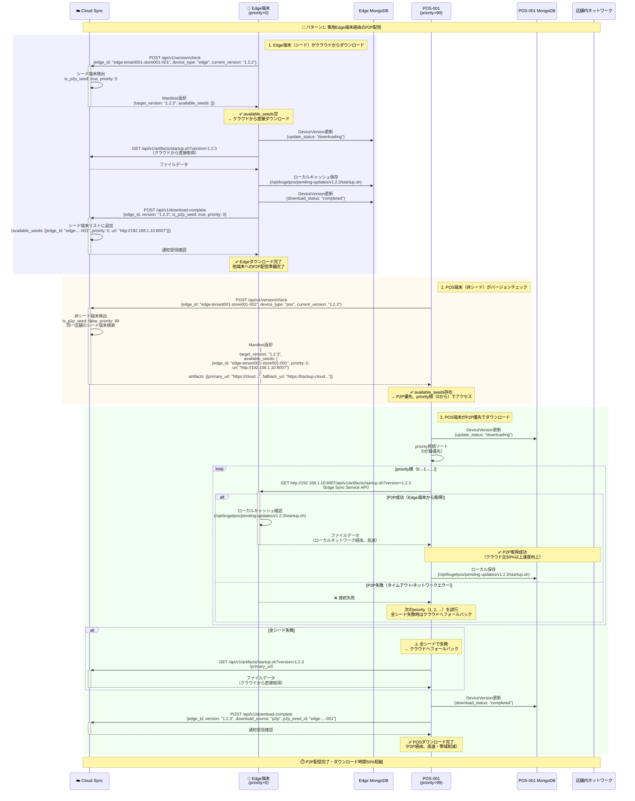
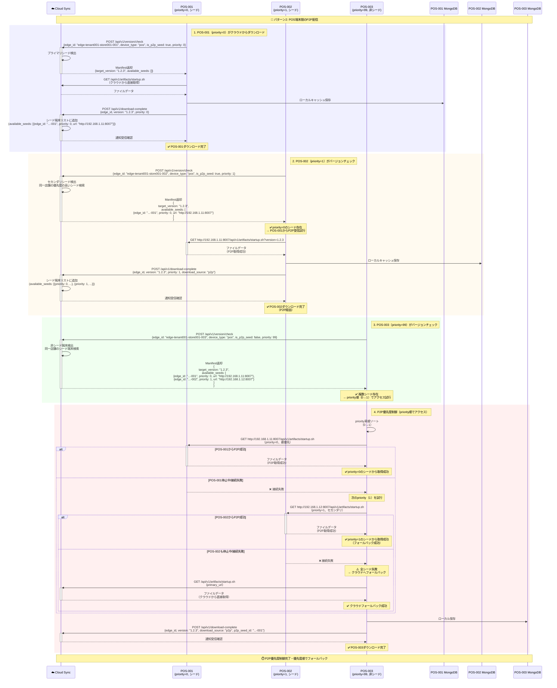
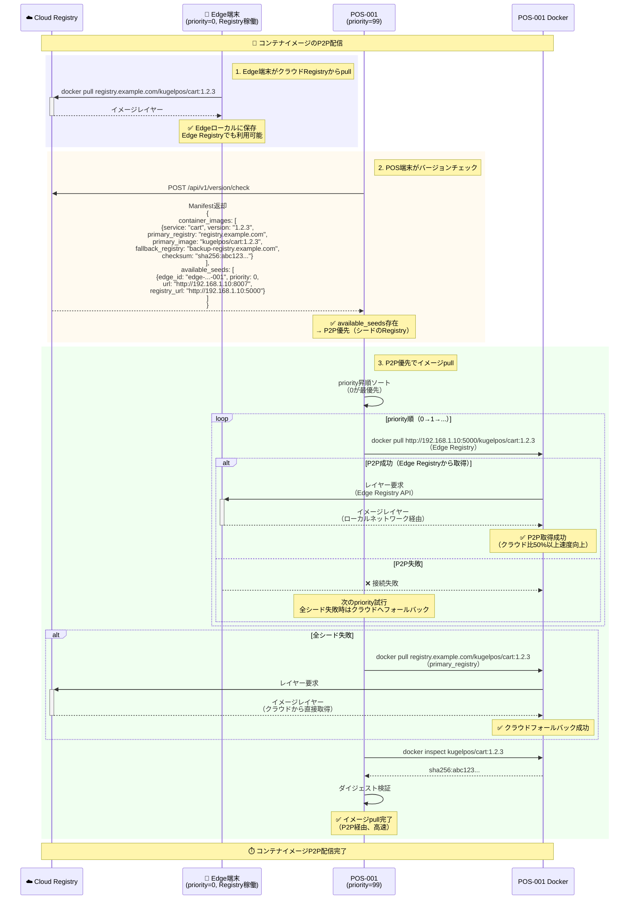
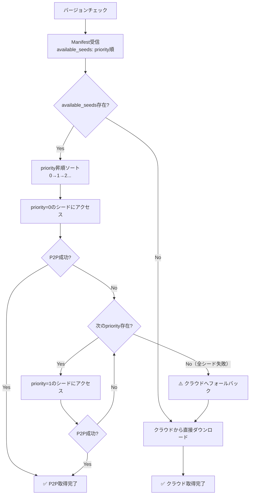
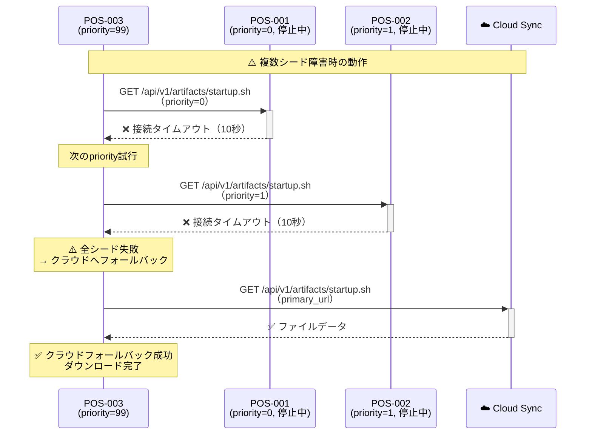

# ユーザーストーリー4: P2P優先度制御による店舗内高速ダウンロード - 処理フロー図

## 概要

このドキュメントは、ユーザーストーリー4「P2P優先度制御による店舗内高速ダウンロード」の処理フローを視覚的に説明します。同一店舗内の複数エッジ端末間で、P2P（Peer-to-Peer）優先度制御を用いてファイルとコンテナイメージを効率的に配信し、店舗全体のインターネット帯域を削減する仕組みを、ユーザーが理解しやすい形で図解します。

## シナリオ

同一店舗内の複数エッジ端末間で、P2P（Peer-to-Peer）優先度制御を用いてファイルとコンテナイメージを効率的に配信し、店舗全体のインターネット帯域を削減する。シード端末（is_p2p_seed=true）がクラウドから取得し、非シード端末（is_p2p_seed=false）は店舗内ネットワーク経由でシード端末から取得する。

## 店舗構成パターン

### パターン1: 専用Edge端末あり



**特徴**:
- 専用Edge端末（priority=0）: プライマリシード、クラウドから取得
- POS端末（priority=99）: 非シード、専用Edge端末からP2P受信

### パターン2: POS端末のみ（専用Edge端末不在）



**特徴**:
- POS-001（priority=0）: プライマリシード兼POS、クラウドから取得
- POS-002（priority=1）: セカンダリシード兼POS、POS-001からP2P受信可能
- POS-003/004（priority=99）: 非シード、priority順（0→1）でP2P受信試行

## 処理フロー全体

### フロー1: パターン1 - 専用Edge端末経由のP2P配信

専用Edge端末（priority=0）がクラウドから取得し、POS端末（priority=99）がEdge端末からP2P受信するフローです。



**主要ステップ**:
1. **Edge端末（シード）がクラウドからダウンロード**: available_seeds空、クラウドから直接取得
2. **POS端末（非シード）がバージョンチェック**: available_seedsにEdge端末情報が含まれる
3. **POS端末がP2P優先でダウンロード**: priority順（0→1...）で試行、全失敗時はクラウドへフォールバック

**P2P効果**:
- ダウンロード速度: クラウド比50%以上向上（ローカルネットワーク利用）
- 店舗全体の帯域削減: クラウドからのダウンロードはEdge端末のみ（POS端末3台がP2P利用で75%削減）

### フロー2: パターン2 - POS端末間のP2P配信と優先度制御

POS-001（priority=0）がプライマリシード、POS-002（priority=1）がセカンダリシード、POS-003（priority=99）が非シードの構成でのP2P配信フローです。



**主要ステップ**:
1. **POS-001（priority=0）がクラウドからダウンロード**: プライマリシード
2. **POS-002（priority=1）がPOS-001からP2P受信**: セカンダリシード
3. **POS-003（priority=99）がバージョンチェック**: 複数シード情報を受信
4. **P2P優先度制御**: priority順（0→1）でアクセス試行、全失敗時はクラウドへフォールバック

**優先度制御の効果**:
- 最優先（priority=0）のシードが健全な場合、全非シード端末がそこから取得
- primary=0停止時、自動的にpriority=1へフォールバック
- 全シード停止時、自動的にクラウドへフォールバック

### フロー3: コンテナイメージのP2P配信（Docker Registry間）

コンテナイメージをP2P配信する際、シード端末のRegistryから`docker pull`するフローです。



**主要ステップ**:
1. **Edge端末がクラウドRegistryからpull**: イメージをローカルに保存、Edge Registryで利用可能に
2. **POS端末がバージョンチェック**: available_seedsにEdge Registry URLが含まれる
3. **P2P優先でイメージpull**: priority順にシードのRegistryから試行、全失敗時はクラウドへフォールバック

**Docker Registry間のP2P**:
- Edge端末でDocker Registryを稼働（ポート5000）
- POS端末は`docker pull <edge_registry_url>/image:tag`でローカルネットワーク経由取得
- Dockerレイヤーキャッシュも活用され、さらに帯域削減

## データベース構造

### EdgeTerminal（エッジ端末P2P設定）

```
コレクション: master_edge_terminal

ドキュメント例（パターン1: 専用Edge端末）:
{
  "_id": ObjectId("..."),
  "edge_id": "edge-tenant001-store001-001",
  "tenant_id": "tenant001",
  "store_code": "store001",
  "device_type": "edge",
  "is_p2p_seed": true,
  "p2p_priority": 0,
  "secret": "sha256:...",
  "sync_service_url": "http://192.168.1.10:8007",
  "registry_url": "http://192.168.1.10:5000",
  "created_at": ISODate("2025-10-01T00:00:00Z"),
  "updated_at": ISODate("2025-10-14T00:00:00Z")
}

ドキュメント例（パターン2: POS端末シード）:
{
  "_id": ObjectId("..."),
  "edge_id": "edge-tenant001-store001-001",
  "tenant_id": "tenant001",
  "store_code": "store001",
  "device_type": "pos",
  "is_p2p_seed": true,
  "p2p_priority": 0,
  "secret": "sha256:...",
  "sync_service_url": "http://192.168.1.11:8007",
  "registry_url": "http://192.168.1.11:5000",
  "created_at": ISODate("2025-10-01T00:00:00Z"),
  "updated_at": ISODate("2025-10-14T00:00:00Z")
}

ドキュメント例（非シード端末）:
{
  "_id": ObjectId("..."),
  "edge_id": "edge-tenant001-store001-003",
  "tenant_id": "tenant001",
  "store_code": "store001",
  "device_type": "pos",
  "is_p2p_seed": false,
  "p2p_priority": 99,
  "secret": "sha256:...",
  "sync_service_url": null,
  "registry_url": null,
  "created_at": ISODate("2025-10-01T00:00:00Z"),
  "updated_at": ISODate("2025-10-14T00:00:00Z")
}
```

**インデックス**:
- `{edge_id: 1}` (unique) - エッジ端末IDでの検索
- `{tenant_id: 1, store_code: 1}` - 店舗ごとの端末一覧取得
- `{tenant_id: 1, store_code: 1, is_p2p_seed: 1, p2p_priority: 1}` - 店舗内シード端末検索（priority順）

### Manifest（available_seeds含む）

```json
{
  "manifest_version": "1.0",
  "device_type": "pos",
  "device_id": "edge-tenant001-store001-003",
  "target_version": "1.2.3",
  "artifacts": [
    {
      "type": "script",
      "name": "startup.sh",
      "version": "1.2.3",
      "primary_url": "https://blob.example.com/v1.2.3/startup.sh",
      "fallback_url": "https://backup-blob.example.com/v1.2.3/startup.sh",
      "checksum": "sha256:abc123...",
      "size": 8192,
      "destination": "/opt/kugelpos/startup.sh",
      "permissions": "755"
    }
  ],
  "container_images": [
    {
      "service": "cart",
      "version": "1.2.3",
      "primary_registry": "registry.example.com",
      "primary_image": "kugelpos/cart:1.2.3",
      "fallback_registry": "backup-registry.example.com",
      "fallback_image": "kugelpos/cart:1.2.3",
      "checksum": "sha256:def456..."
    }
  ],
  "available_seeds": [
    {
      "edge_id": "edge-tenant001-store001-001",
      "priority": 0,
      "url": "http://192.168.1.10:8007",
      "registry_url": "http://192.168.1.10:5000"
    },
    {
      "edge_id": "edge-tenant001-store001-002",
      "priority": 1,
      "url": "http://192.168.1.12:8007",
      "registry_url": "http://192.168.1.12:5000"
    }
  ],
  "apply_schedule": {
    "scheduled_at": "2025-10-15T02:00:00Z",
    "maintenance_window": 30
  }
}
```

**available_seedsフィールド**:
- `edge_id`: シード端末ID
- `priority`: 優先度（0-9、0が最優先）
- `url`: Sync Service APIエンドポイントURL（ファイル取得用）
- `registry_url`: Docker Registry URL（コンテナイメージ取得用）

## パフォーマンス指標

| 指標 | 目標値 | 測定方法 |
|------|--------|---------|
| **P2P速度向上率** | 50%以上 | クラウド直接ダウンロードと比較したP2P経由のダウンロード速度向上率 |
| **店舗全体の帯域削減率** | 75%以上（専用Edge + POS 3台の場合） | (クラウドダウンロード総量 - 実際のクラウドダウンロード量) / クラウドダウンロード総量<br/>例: (4台 × 1GB - 1GB) / (4台 × 1GB) = 75% |
| **P2P成功率** | 95%以上 | P2P取得成功回数 / 全P2P試行回数 |
| **フォールバック所要時間** | 10秒以内 | P2P失敗検出 → 次priorityまたはクラウドフォールバック開始までの時間 |
| **シード端末ダウンロード完了通知遅延** | 5秒以内 | ダウンロード完了 → available_seedsに反映されるまでの時間 |

## エラーハンドリング

### P2Pシード端末停止時のフォールバック（FR-015）



**フォールバック戦略**:
1. priority昇順（0→1→2...）でシード端末にアクセス試行
2. 各シードでタイムアウト（10秒）設定
3. 全シード失敗時、自動的にクラウドへフォールバック（primary_url → fallback_url）

### 複数シード障害時の動作



**全シード障害時の保証**:
- すべての端末（シード・非シード問わず）がクラウドへフォールバック可能
- primary_url失敗時はfallback_urlも試行
- 業務継続性を保証

## 受入シナリオの検証

### シナリオ1: パターン1の店舗でP2P配信

```
Given: パターン1の店舗で専用Edge端末（priority=0）がv1.2.3をクラウドからダウンロード完了
When: POS端末（priority=99）がバージョンチェック
Then:
  1. Manifestにpriority=0のシード端末URL（例: http://192.168.1.10:8007）が含まれる
  2. POS端末がpriority=0のシード端末にリクエスト送信
  3. ローカルネットワーク経由でP2P取得（クラウド比50%以上速度向上）

検証方法:
1. Edge端末でバージョンチェック → ダウンロード完了
2. Cloud側でEdge端末をavailable_seedsに追加
3. POS端末でバージョンチェック
4. Manifestにavailable_seeds含まれることを確認
5. POS端末がEdge端末（http://192.168.1.10:8007）にアクセスすることを確認
6. ダウンロード速度を測定（クラウド比50%以上向上を確認）
7. DeviceVersion.download_source: "p2p" を確認
```

### シナリオ2: パターン2でpriority順フォールバック

```
Given: パターン2の店舗でPOS-001（priority=0）がダウンロード完了
When: POS-002（priority=1）とPOS-003（priority=99）がバージョンチェック
Then:
  1. ManifestにPOS-001のURLが含まれる
  2. 両端末がPOS-001からP2P取得
  3. POS-001停止中の場合、POS-003はpriority=1のPOS-002へ自動フォールバック

検証方法:
1. POS-001でダウンロード完了
2. POS-002, POS-003でバージョンチェック
3. ManifestにPOS-001（priority=0）が含まれることを確認
4. POS-002, POS-003がPOS-001からP2P取得することを確認
5. POS-001を意図的に停止
6. POS-003（priority=99, 非シード）が再度バージョンチェック
7. POS-003がpriority=0へのアクセス失敗を検出
8. 自動的にpriority=1のPOS-002へフォールバックすることを確認
9. 全シード停止時はクラウドへフォールバックすることを確認
```

### シナリオ3: コンテナイメージのP2P配信

```
Given: コンテナイメージのダウンロード
When: シード端末（is_p2p_seed=true）が取得
Then: priority順に他のシード端末のRegistryからdocker pullを試行、全シードで失敗時はクラウドRegistryへフォールバック

検証方法:
1. Edge端末（priority=0）でコンテナイメージpull完了
2. POS端末（priority=99）でバージョンチェック
3. Manifestにavailable_seeds（registry_url含む）が含まれることを確認
4. POS端末が docker pull <edge_registry_url>/image:tag 実行
5. Edge Registry（http://192.168.1.10:5000）からレイヤー取得することを確認
6. Dockerレイヤーキャッシュも活用されることを確認
7. Edge Registry停止時、クラウドRegistryへフォールバックすることを確認
```

### シナリオ4: 全シード障害時のクラウドフォールバック

```
Given: パターン1の店舗で専用Edge端末（priority=0）が停止中
When: 非シードPOS端末（priority=99）がシード端末へのアクセス失敗
Then: クラウドへ直接フォールバックしてダウンロード

検証方法:
1. Edge端末を意図的に停止
2. POS端末でバージョンチェック
3. ManifestにEdge端末（priority=0）が含まれることを確認
4. POS端末がEdge端末へのアクセス試行
5. 接続失敗を検出（タイムアウト10秒）
6. 自動的にクラウド（primary_url）へフォールバックすることを確認
7. クラウドからダウンロード完了することを確認
8. DeviceVersion.download_source: "cloud_fallback" を確認
```

## 関連ドキュメント

- [spec.md](../spec.md) - 機能仕様書
- [plan.md](../plan.md) - 実装計画
- [data-model.md](../data-model.md) - データモデル設計
- [contracts/sync-api.yaml](../contracts/sync-api.yaml) - Sync API仕様

---

**ドキュメントバージョン**: 1.0.0
**最終更新日**: 2025-10-14
**ステータス**: 完成
