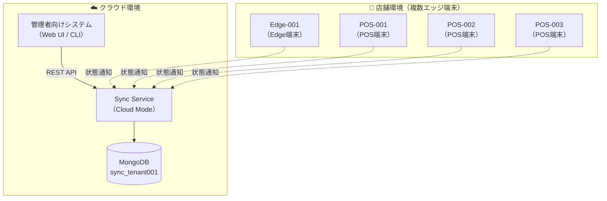
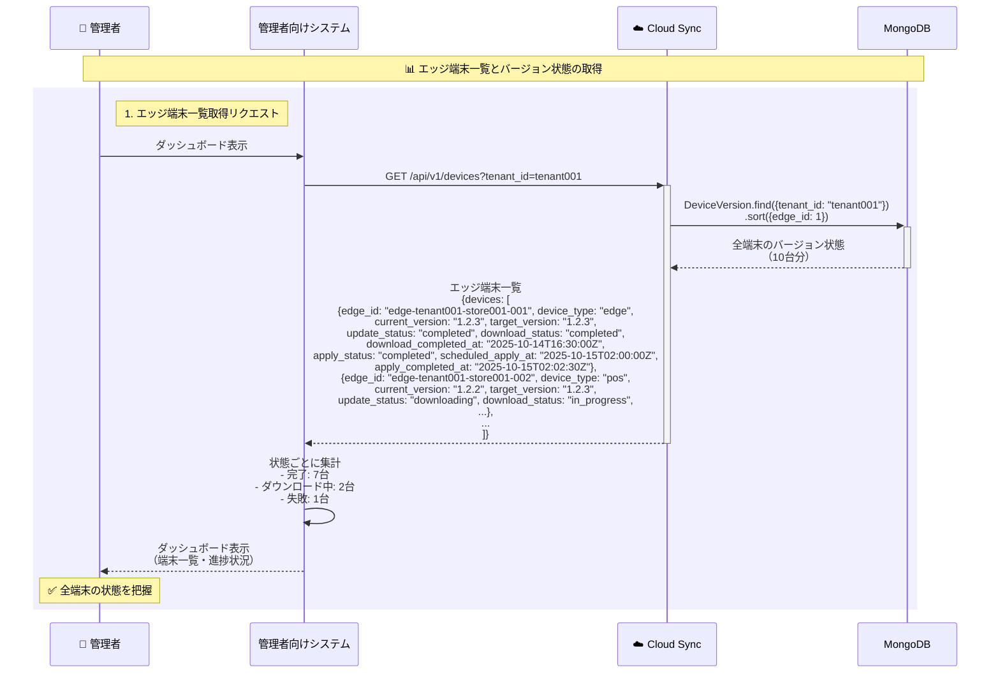
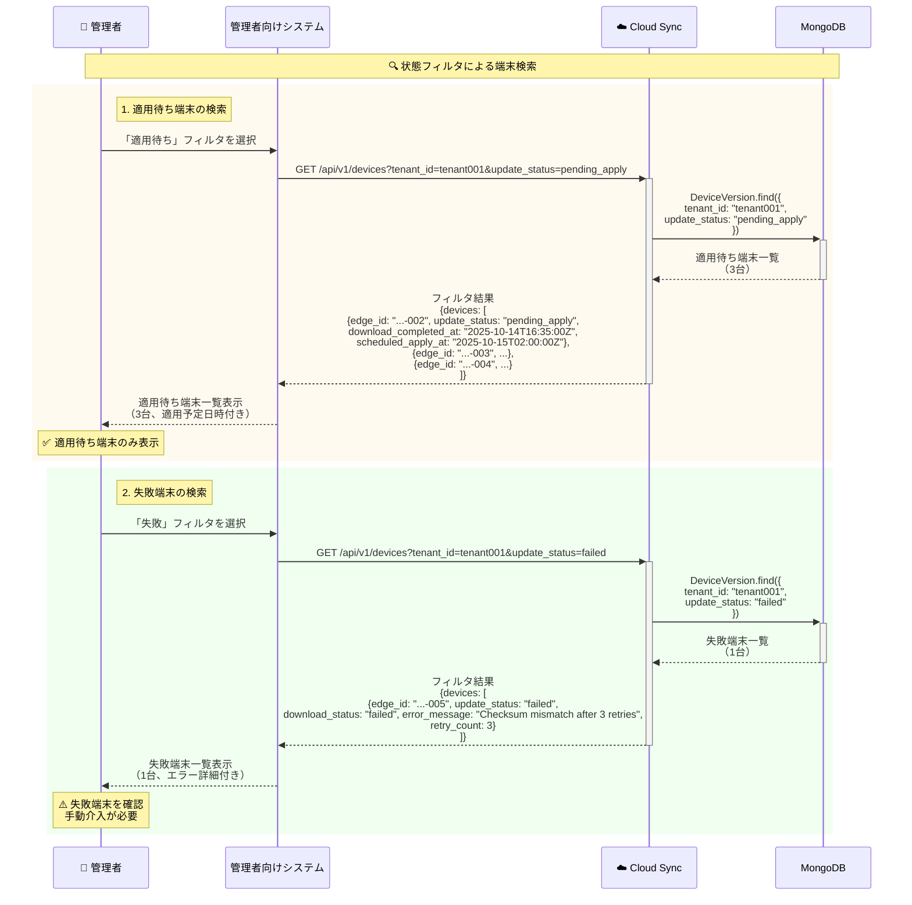
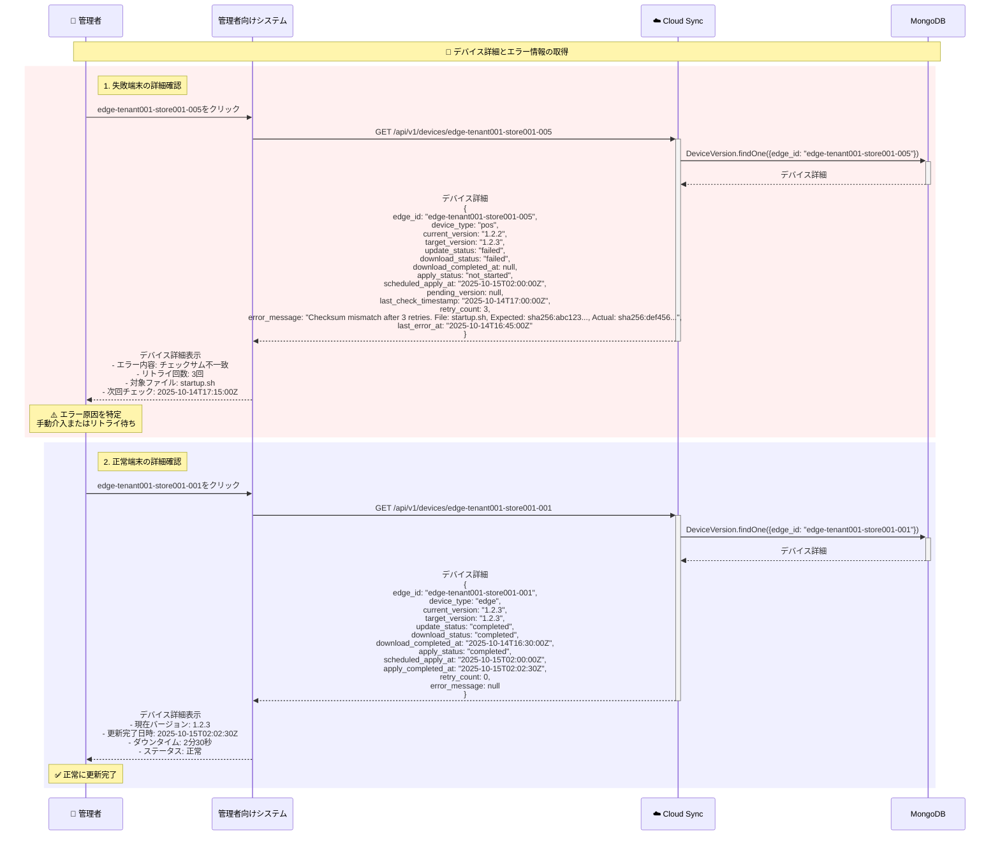
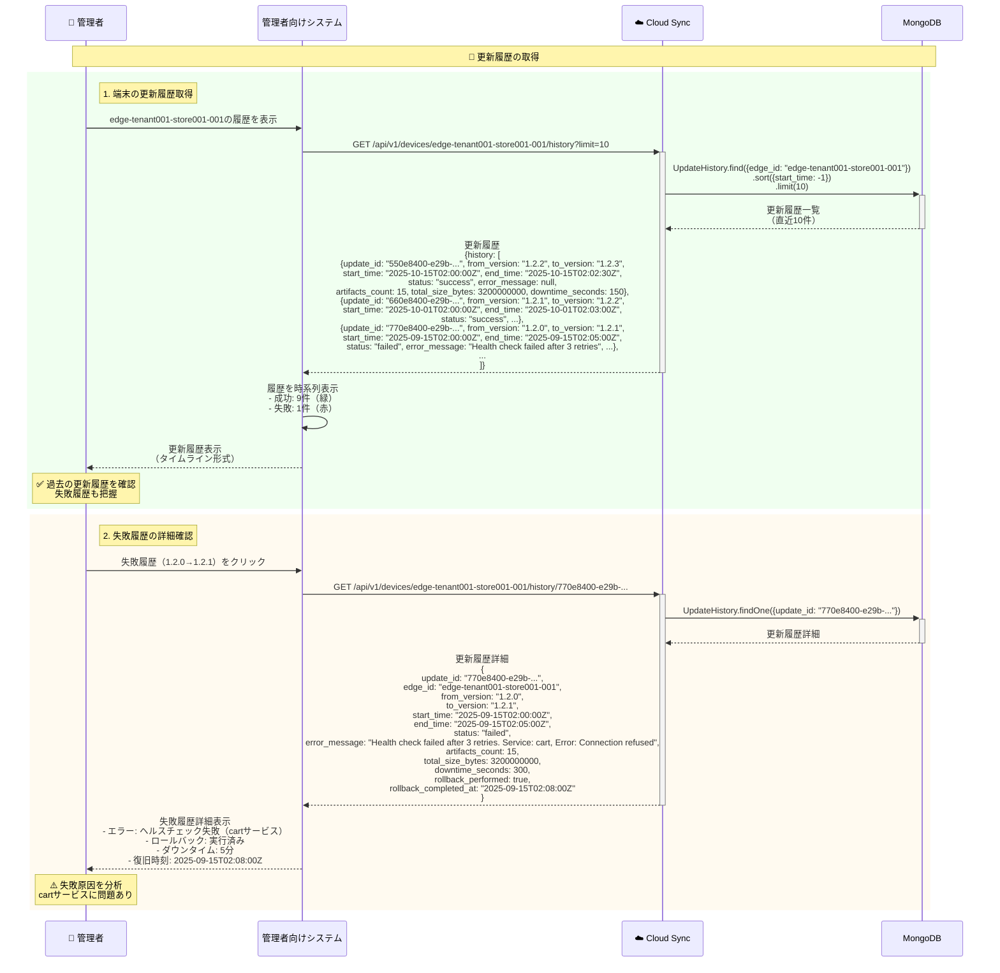

# ユーザーストーリー5: 更新履歴とバージョン状態の取得API - 処理フロー図

## 概要

このドキュメントは、ユーザーストーリー5「更新履歴とバージョン状態の取得API」の処理フローを視覚的に説明します。管理者向けシステムが、クラウド側のAPIを通じて全エッジ端末（Edge/POS）の現在バージョン、目標バージョン、ダウンロード状態、適用予定日時、更新履歴を取得し、更新の進捗状況を把握する仕組みを、ユーザーが理解しやすい形で図解します。

## シナリオ

管理者向けシステムが、クラウド側のAPIを通じて全エッジ端末（Edge/POS）の現在バージョン、目標バージョン、ダウンロード状態、適用予定日時、更新履歴を取得し、更新の進捗状況を把握できる。

## 主要コンポーネント



## 処理フロー全体

### フロー1: エッジ端末一覧とバージョン状態の取得

管理者が全エッジ端末の現在バージョン、目標バージョン、ダウンロード状態を一覧取得するフローです。



**主要ステップ**:
1. **エッジ端末一覧取得**: テナントIDで全端末のバージョン状態を取得
2. **状態集計**: 完了/進行中/失敗の台数を集計
3. **ダッシュボード表示**: 管理者に視覚的に表示

**レスポンス例**:
```json
{
  "devices": [
    {
      "edge_id": "edge-tenant001-store001-001",
      "device_type": "edge",
      "current_version": "1.2.3",
      "target_version": "1.2.3",
      "update_status": "completed",
      "download_status": "completed",
      "download_completed_at": "2025-10-14T16:30:00Z",
      "apply_status": "completed",
      "scheduled_apply_at": "2025-10-15T02:00:00Z",
      "apply_completed_at": "2025-10-15T02:02:30Z",
      "retry_count": 0,
      "error_message": null
    },
    {
      "edge_id": "edge-tenant001-store001-002",
      "device_type": "pos",
      "current_version": "1.2.2",
      "target_version": "1.2.3",
      "update_status": "downloading",
      "download_status": "in_progress",
      "download_completed_at": null,
      "apply_status": "not_started",
      "scheduled_apply_at": "2025-10-15T02:00:00Z",
      "apply_completed_at": null,
      "retry_count": 0,
      "error_message": null
    }
  ],
  "total_count": 10,
  "summary": {
    "completed": 7,
    "in_progress": 2,
    "failed": 1
  }
}
```

### フロー2: 状態フィルタによる端末検索

特定の状態（ダウンロード完了・適用待ち、失敗等）の端末のみを抽出するフローです。



**主要ステップ**:
1. **適用待ち端末検索**: `update_status=pending_apply` でフィルタ
2. **失敗端末検索**: `update_status=failed` でフィルタ、エラー詳細も取得

**フィルタパラメータ**:
- `update_status`: `none`, `downloading`, `pending_apply`, `applying`, `completed`, `failed`
- `download_status`: `not_started`, `in_progress`, `completed`, `failed`
- `apply_status`: `not_started`, `in_progress`, `completed`, `failed`, `rolled_back`
- `device_type`: `edge`, `pos`

### フロー3: デバイス詳細とエラー情報の取得

特定のエッジ端末の詳細情報とエラー詳細を取得するフローです。



**主要ステップ**:
1. **失敗端末の詳細確認**: エラーメッセージ、リトライ回数、最終エラー日時を取得
2. **正常端末の詳細確認**: 現在バージョン、更新完了日時、ダウンタイムを確認

### フロー4: 更新履歴の取得

特定のエッジ端末の過去の更新履歴を取得するフローです。



**主要ステップ**:
1. **端末の更新履歴取得**: 直近10件の更新履歴を時系列で取得
2. **失敗履歴の詳細確認**: エラー詳細、ロールバック実施状況、ダウンタイムを確認

**レスポンス例（更新履歴）**:
```json
{
  "history": [
    {
      "update_id": "550e8400-e29b-41d4-a716-446655440000",
      "edge_id": "edge-tenant001-store001-001",
      "from_version": "1.2.2",
      "to_version": "1.2.3",
      "start_time": "2025-10-15T02:00:00Z",
      "end_time": "2025-10-15T02:02:30Z",
      "status": "success",
      "error_message": null,
      "artifacts_count": 15,
      "total_size_bytes": 3200000000,
      "downtime_seconds": 150
    },
    {
      "update_id": "770e8400-e29b-41d4-a716-446655440001",
      "edge_id": "edge-tenant001-store001-001",
      "from_version": "1.2.0",
      "to_version": "1.2.1",
      "start_time": "2025-09-15T02:00:00Z",
      "end_time": "2025-09-15T02:05:00Z",
      "status": "failed",
      "error_message": "Health check failed after 3 retries. Service: cart",
      "artifacts_count": 15,
      "total_size_bytes": 3200000000,
      "downtime_seconds": 300
    }
  ],
  "total_count": 25
}
```

## API仕様

### 1. エッジ端末一覧取得API

**エンドポイント**: `GET /api/v1/devices`

**クエリパラメータ**:
- `tenant_id` (必須): テナントID
- `update_status` (任意): 更新ステータスでフィルタ（`none`, `downloading`, `pending_apply`, `applying`, `completed`, `failed`）
- `download_status` (任意): ダウンロードステータスでフィルタ（`not_started`, `in_progress`, `completed`, `failed`）
- `apply_status` (任意): 適用ステータスでフィルタ（`not_started`, `in_progress`, `completed`, `failed`, `rolled_back`）
- `device_type` (任意): デバイスタイプでフィルタ（`edge`, `pos`）
- `limit` (任意): 取得件数（デフォルト: 100、最大: 1000）
- `offset` (任意): オフセット（ページネーション用）

**レスポンス**: 200 OK
```json
{
  "devices": [
    {
      "edge_id": "edge-tenant001-store001-001",
      "device_type": "edge",
      "current_version": "1.2.3",
      "target_version": "1.2.3",
      "update_status": "completed",
      "download_status": "completed",
      "download_completed_at": "2025-10-14T16:30:00Z",
      "apply_status": "completed",
      "scheduled_apply_at": "2025-10-15T02:00:00Z",
      "apply_completed_at": "2025-10-15T02:02:30Z",
      "retry_count": 0,
      "error_message": null
    }
  ],
  "total_count": 10,
  "summary": {
    "completed": 7,
    "in_progress": 2,
    "failed": 1
  }
}
```

### 2. デバイス詳細取得API

**エンドポイント**: `GET /api/v1/devices/{edge_id}`

**パスパラメータ**:
- `edge_id` (必須): エッジ端末ID

**レスポンス**: 200 OK
```json
{
  "edge_id": "edge-tenant001-store001-001",
  "device_type": "edge",
  "current_version": "1.2.3",
  "target_version": "1.2.3",
  "update_status": "completed",
  "download_status": "completed",
  "download_completed_at": "2025-10-14T16:30:00Z",
  "apply_status": "completed",
  "scheduled_apply_at": "2025-10-15T02:00:00Z",
  "apply_completed_at": "2025-10-15T02:02:30Z",
  "pending_version": null,
  "last_check_timestamp": "2025-10-15T10:00:00Z",
  "retry_count": 0,
  "error_message": null,
  "last_error_at": null
}
```

### 3. 更新履歴取得API

**エンドポイント**: `GET /api/v1/devices/{edge_id}/history`

**パスパラメータ**:
- `edge_id` (必須): エッジ端末ID

**クエリパラメータ**:
- `limit` (任意): 取得件数（デフォルト: 10、最大: 100）
- `offset` (任意): オフセット（ページネーション用）

**レスポンス**: 200 OK
```json
{
  "history": [
    {
      "update_id": "550e8400-e29b-41d4-a716-446655440000",
      "edge_id": "edge-tenant001-store001-001",
      "from_version": "1.2.2",
      "to_version": "1.2.3",
      "start_time": "2025-10-15T02:00:00Z",
      "end_time": "2025-10-15T02:02:30Z",
      "status": "success",
      "error_message": null,
      "artifacts_count": 15,
      "total_size_bytes": 3200000000,
      "downtime_seconds": 150
    }
  ],
  "total_count": 25
}
```

### 4. 更新履歴詳細取得API

**エンドポイント**: `GET /api/v1/devices/{edge_id}/history/{update_id}`

**パスパラメータ**:
- `edge_id` (必須): エッジ端末ID
- `update_id` (必須): 更新ID（UUID）

**レスポンス**: 200 OK
```json
{
  "update_id": "550e8400-e29b-41d4-a716-446655440000",
  "edge_id": "edge-tenant001-store001-001",
  "from_version": "1.2.2",
  "to_version": "1.2.3",
  "start_time": "2025-10-15T02:00:00Z",
  "end_time": "2025-10-15T02:02:30Z",
  "status": "success",
  "error_message": null,
  "artifacts_count": 15,
  "total_size_bytes": 3200000000,
  "downtime_seconds": 150
}
```

## データベース構造

### DeviceVersion（クラウド側記録）

```
コレクション: info_edge_version

ドキュメント例:
{
  "_id": ObjectId("..."),
  "edge_id": "edge-tenant001-store001-001",
  "tenant_id": "tenant001",
  "device_type": "edge",
  "current_version": "1.2.3",
  "target_version": "1.2.3",
  "update_status": "completed",
  "download_status": "completed",
  "download_completed_at": ISODate("2025-10-14T16:30:00Z"),
  "apply_status": "completed",
  "scheduled_apply_at": ISODate("2025-10-15T02:00:00Z"),
  "apply_completed_at": ISODate("2025-10-15T02:02:30Z"),
  "pending_version": null,
  "last_check_timestamp": ISODate("2025-10-15T10:00:00Z"),
  "retry_count": 0,
  "error_message": null,
  "last_error_at": null,
  "created_at": ISODate("2025-10-01T00:00:00Z"),
  "updated_at": ISODate("2025-10-15T02:02:30Z")
}
```

**インデックス**:
- `{edge_id: 1}` (unique) - エッジ端末IDでの検索
- `{tenant_id: 1, update_status: 1}` - テナント・ステータスでのフィルタ
- `{tenant_id: 1, device_type: 1}` - テナント・デバイスタイプでのフィルタ

### UpdateHistory（クラウド側記録）

```
コレクション: info_update_history

ドキュメント例:
{
  "_id": ObjectId("..."),
  "update_id": "550e8400-e29b-41d4-a716-446655440000",
  "edge_id": "edge-tenant001-store001-001",
  "from_version": "1.2.2",
  "to_version": "1.2.3",
  "start_time": ISODate("2025-10-15T02:00:00Z"),
  "end_time": ISODate("2025-10-15T02:02:30Z"),
  "status": "success",
  "error_message": null,
  "artifacts_count": 15,
  "total_size_bytes": 3200000000,
  "downtime_seconds": 150,
  "rollback_performed": false,
  "rollback_completed_at": null
}
```

**インデックス**:
- `{update_id: 1}` (unique) - 更新IDでの検索
- `{edge_id: 1, start_time: -1}` - エッジ端末ごとの履歴取得（時系列降順）
- `{start_time: 1}` - TTLインデックス（90日保持）

## パフォーマンス指標

| 指標 | 目標値 | 測定方法 |
|------|--------|---------|
| **API応答時間（一覧取得）** | 1秒以内 | GET /api/v1/devices レスポンス時間（100台以下） |
| **API応答時間（詳細取得）** | 500ms以内 | GET /api/v1/devices/{edge_id} レスポンス時間 |
| **API応答時間（履歴取得）** | 1秒以内 | GET /api/v1/devices/{edge_id}/history レスポンス時間（100件以下） |
| **同時アクセス処理** | 100リクエスト/秒 | 管理者向けシステムからの同時アクセス処理能力 |

## 受入シナリオの検証

### シナリオ1: エッジ端末一覧の取得

```
Given: 管理者向けシステムがAPI（GET /api/v1/devices）にアクセス
When: エッジ端末一覧を取得
Then: 各端末の現在バージョン、目標バージョン、ダウンロード状態、適用予定日時が返却される

検証方法:
1. 管理者向けシステムからGET /api/v1/devices?tenant_id=tenant001を実行
2. レスポンスに全端末（10台）の情報が含まれることを確認
3. 各端末にcurrent_version, target_version, update_status, download_status, scheduled_apply_atが含まれることを確認
4. summaryフィールドに完了/進行中/失敗の集計が含まれることを確認
5. API応答時間が1秒以内であることを確認
```

### シナリオ2: 更新履歴の取得

```
Given: 端末の更新が完了
When: 更新履歴API（GET /api/v1/devices/{edge_id}/history）を取得
Then: 更新開始・終了時刻、更新データ件数・サイズ、成功/失敗状態が記録されている

検証方法:
1. edge-tenant001-store001-001の更新履歴を取得
2. レスポンスにhistory配列が含まれることを確認
3. 各履歴にupdate_id, from_version, to_version, start_time, end_time, status, artifacts_count, total_size_bytes, downtime_secondsが含まれることを確認
4. 時系列降順（最新が先頭）で返却されることを確認
5. API応答時間が1秒以内であることを確認
```

### シナリオ3: 更新失敗端末の詳細取得

```
Given: 更新失敗が発生
When: デバイス詳細API（GET /api/v1/devices/{edge_id}）を取得
Then: エラー詳細、リトライ回数が含まれる

検証方法:
1. 意図的に更新失敗を発生させる（チェックサム不一致等）
2. edge-tenant001-store001-005の詳細を取得
3. update_status: "failed"を確認
4. error_messageにエラー詳細が含まれることを確認
5. retry_count: 3を確認
6. last_error_atに最終エラー日時が記録されることを確認
```

### シナリオ4: 状態フィルタでの端末検索

```
Given: ダウンロード完了・適用待ちの端末
When: 状態フィルタパラメータ（?status=pending_apply）でAPI取得
Then: 適用待ち端末のみが返却される

検証方法:
1. GET /api/v1/devices?tenant_id=tenant001&update_status=pending_applyを実行
2. レスポンスに適用待ち端末のみが含まれることを確認（3台）
3. 各端末のupdate_status: "pending_apply"を確認
4. download_status: "completed"を確認
5. scheduled_apply_atに適用予定日時が含まれることを確認
```

## 関連ドキュメント

- [spec.md](../spec.md) - 機能仕様書
- [plan.md](../plan.md) - 実装計画
- [data-model.md](../data-model.md) - データモデル設計
- [contracts/sync-api.yaml](../contracts/sync-api.yaml) - Sync API仕様

---

**ドキュメントバージョン**: 1.0.0
**最終更新日**: 2025-10-14
**ステータス**: 完成
