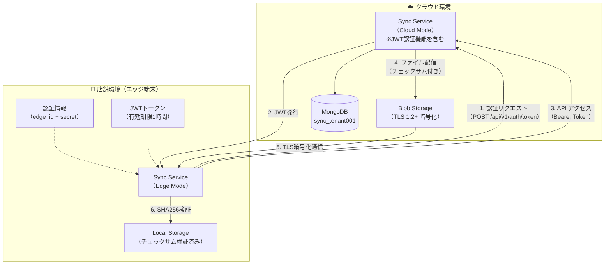
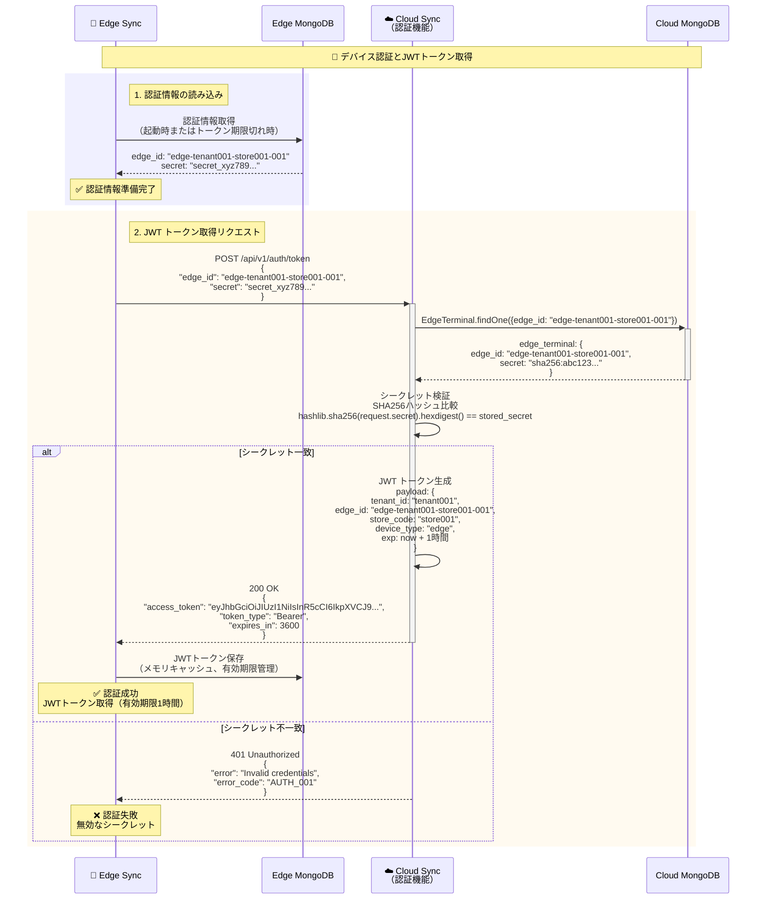
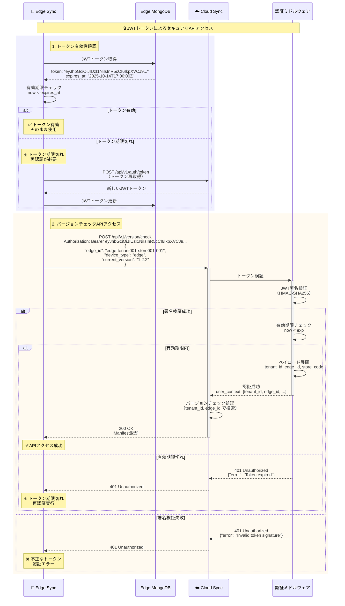
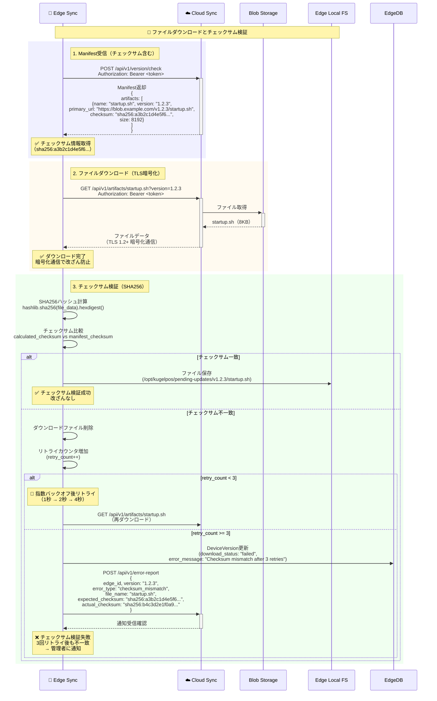
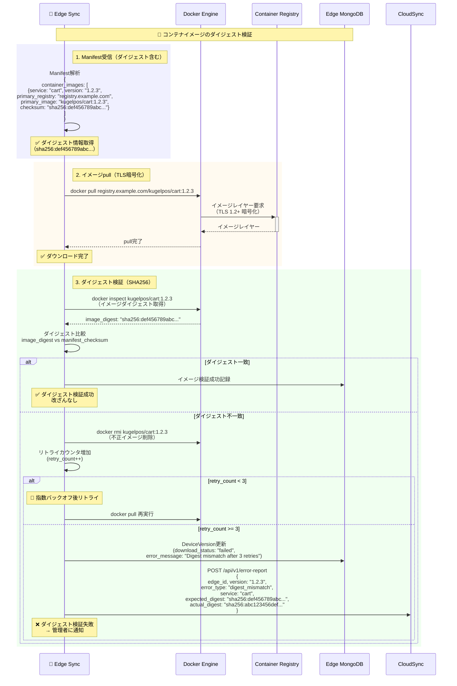
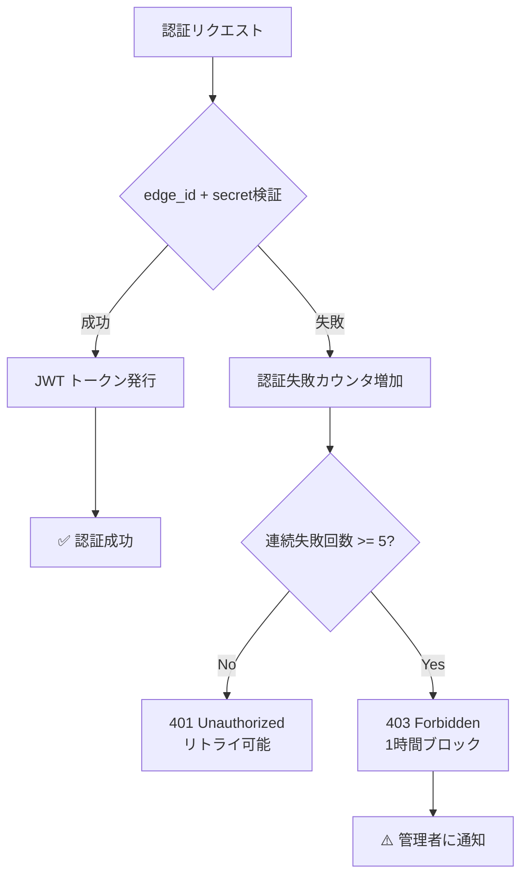
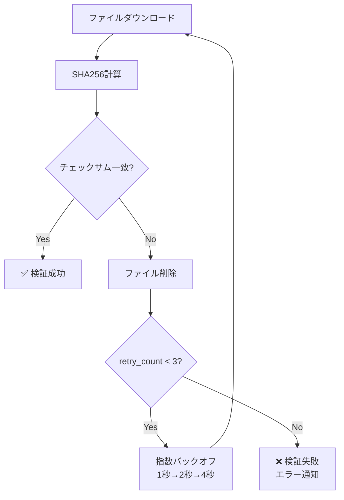

# ユーザーストーリー6: デバイス認証とセキュアな配信 - 処理フロー図

## 概要

このドキュメントは、ユーザーストーリー6「デバイス認証とセキュアな配信」の処理フローを視覚的に説明します。各エッジ端末（Edge/POS）がedge_idとsecretで認証し、JWTトークンを取得してセキュアにバージョン管理APIにアクセスする仕組み、およびダウンロードしたファイルのSHA256チェックサムによる改ざん検証を、ユーザーが理解しやすい形で図解します。

## シナリオ

各エッジ端末（Edge/POS）がedge_idとsecretで認証し、JWTトークンを取得してセキュアにバージョン管理APIにアクセスする。ダウンロードしたファイルはSHA256チェックサムで改ざん検証される。

## 主要コンポーネント



## 処理フロー全体

### フロー1: デバイス認証とJWTトークン取得

エッジ端末がedge_idとsecretで認証し、JWTトークンを取得するフローです。

**アーキテクチャ上の注意**: Sync Service（Cloud Mode）自体が認証機能を提供します。独立した認証サービスは存在せず、Sync Serviceの `/api/v1/auth/token` エンドポイントが認証とJWT発行を担当します。



**主要ステップ**:
1. **認証情報の読み込み**: edge_idとsecretをローカルDBから取得
2. **JWT トークン取得リクエスト**: Sync Service（Cloud Mode）にedge_id + secretを送信
3. **シークレット検証**: SHA256ハッシュ比較で検証
4. **JWT トークン生成**: 有効期限1時間のトークンを発行

**JWTペイロード例**:
```json
{
  "tenant_id": "tenant001",
  "edge_id": "edge-tenant001-store001-001",
  "store_code": "store001",
  "device_type": "edge",
  "iat": 1697270400,
  "exp": 1697274000
}
```

### フロー2: JWTトークンによるセキュアなAPI アクセス

取得したJWTトークンを使用してバージョンチェックAPIにアクセスするフローです。



**主要ステップ**:
1. **トークン有効性確認**: 有効期限チェック、期限切れなら再認証
2. **バージョンチェックAPIアクセス**: Authorization ヘッダーにBearerトークンを付与
3. **トークン検証**: 認証ミドルウェアでJWT署名検証、有効期限チェック
4. **API処理**: 認証成功後、バージョンチェック処理を実行

### フロー3: ファイルダウンロードとチェックサム検証

ダウンロードしたファイルのSHA256チェックサムを検証し、改ざんを検出するフローです。



**主要ステップ**:
1. **Manifest受信**: チェックサム情報（sha256:...）を取得
2. **ファイルダウンロード**: TLS 1.2+ 暗号化通信で改ざん防止
3. **チェックサム検証**: SHA256ハッシュ計算、Manifestの値と比較
4. **リトライ**: 不一致時は最大3回リトライ、全失敗時はエラー通知

**チェックサム検証コード例**:
```python
import hashlib

# ダウンロードしたファイルのチェックサム計算
calculated_checksum = hashlib.sha256(file_data).hexdigest()

# Manifestのチェックサムと比較
manifest_checksum = artifact["checksum"].replace("sha256:", "")

if calculated_checksum != manifest_checksum:
    raise ChecksumMismatchError(
        f"Checksum mismatch for {file_name}. "
        f"Expected: {manifest_checksum}, Actual: {calculated_checksum}"
    )
```

### フロー4: コンテナイメージのダイジェスト検証

コンテナイメージのダイジェスト（SHA256）を検証し、改ざんを検出するフローです。



**主要ステップ**:
1. **Manifest受信**: イメージダイジェスト（sha256:...）を取得
2. **イメージpull**: TLS暗号化通信でレジストリからダウンロード
3. **ダイジェスト検証**: `docker inspect` でダイジェスト取得、Manifestの値と比較
4. **リトライ**: 不一致時は不正イメージを削除し、最大3回リトライ

**ダイジェスト検証コード例**:
```python
import subprocess
import json

# docker inspect でイメージダイジェスト取得
result = subprocess.run(
    ["docker", "inspect", "kugelpos/cart:1.2.3"],
    capture_output=True,
    text=True
)
inspect_data = json.loads(result.stdout)[0]
actual_digest = inspect_data["RepoDigests"][0].split("@")[1]

# Manifestのダイジェストと比較
manifest_digest = image["checksum"].replace("sha256:", "")

if actual_digest != manifest_digest:
    # 不正イメージ削除
    subprocess.run(["docker", "rmi", "kugelpos/cart:1.2.3"])
    raise DigestMismatchError(
        f"Digest mismatch for {service}. "
        f"Expected: {manifest_digest}, Actual: {actual_digest}"
    )
```

## セキュリティ機能

### 1. JWT トークン仕様

**アルゴリズム**: HMAC-SHA256 (HS256)

**ヘッダー**:
```json
{
  "alg": "HS256",
  "typ": "JWT"
}
```

**ペイロード**:
```json
{
  "tenant_id": "tenant001",
  "edge_id": "edge-tenant001-store001-001",
  "store_code": "store001",
  "device_type": "edge",
  "iat": 1697270400,
  "exp": 1697274000
}
```

**署名**:
```
HMACSHA256(
  base64UrlEncode(header) + "." +
  base64UrlEncode(payload),
  secret_key
)
```

**有効期限**: 1時間（3600秒）

### 2. シークレット管理

**保存形式**: SHA256ハッシュ化
```python
import hashlib

# シークレットのハッシュ化（保存時）
hashed_secret = hashlib.sha256(plain_secret.encode()).hexdigest()

# シークレット検証（認証時）
provided_hash = hashlib.sha256(provided_secret.encode()).hexdigest()
is_valid = (provided_hash == stored_hash)
```

**セキュリティ対策**:
- プレーンテキストでの保存禁止
- SHA256ハッシュで保存
- 定期的なシークレットローテーション推奨

### 3. TLS暗号化通信

**プロトコル**: TLS 1.2以上

**暗号スイート**:
- TLS_ECDHE_RSA_WITH_AES_256_GCM_SHA384
- TLS_ECDHE_RSA_WITH_AES_128_GCM_SHA256

**証明書検証**: 必須（中間者攻撃防止）

### 4. チェックサム検証

**アルゴリズム**: SHA256

**対象**:
- ファイル: startup.sh, .whl, .deb, 設定ファイル等
- コンテナイメージ: Dockerダイジェスト（SHA256）

**検証タイミング**:
- ダウンロード完了後
- 適用前

## データベース構造

### EdgeTerminal（認証情報管理）

```
コレクション: master_edge_terminal

ドキュメント例:
{
  "_id": ObjectId("..."),
  "edge_id": "edge-tenant001-store001-001",
  "tenant_id": "tenant001",
  "store_code": "store001",
  "device_type": "edge",
  "is_p2p_seed": true,
  "p2p_priority": 0,
  "secret": "sha256:a3b2c1d4e5f6...",
  "created_at": ISODate("2025-10-01T00:00:00Z"),
  "updated_at": ISODate("2025-10-14T00:00:00Z")
}
```

**セキュリティ注意事項**:
- `secret`フィールドはSHA256ハッシュで保存
- プレーンテキストでの保存禁止

## パフォーマンス指標

| 指標 | 目標値 | 測定方法 |
|------|--------|---------|
| **JWT トークン生成時間** | 100ms以内 | 認証リクエスト → レスポンスまでの時間 |
| **JWT トークン検証時間** | 50ms以内 | 認証ミドルウェアでの検証処理時間 |
| **チェックサム検証成功率** | 99.9%以上 | 検証成功回数 / 全ダウンロード回数 |
| **認証失敗時のブロック** | 5回連続失敗で1時間ブロック | 不正アクセス試行の検出・防止 |

## エラーハンドリング

### 認証エラー



### チェックサム検証エラー



## 受入シナリオの検証

### シナリオ1: 正常な認証とJWT トークン取得

```
Given: エッジ端末が有効なedge_idとsecretを保持
When: Sync Service（Cloud Mode）の認証エンドポイントにリクエスト送信
Then: JWTトークン（有効期限1時間）を取得

検証方法:
1. Edge Sync 起動
2. Cloud Sync の POST /api/v1/auth/token に edge_id + secret を送信
3. レスポンスでaccess_tokenを取得
4. JWT トークンをデコードし、ペイロードを確認（tenant_id, edge_id, exp）
5. 有効期限が1時間後（3600秒）であることを確認
```

### シナリオ2: 無効なシークレットでの認証失敗

```
Given: 無効なsecretで認証試行
When: Sync Service（Cloud Mode）の認証エンドポイントにリクエスト送信
Then: 401 Unauthorizedエラーが返される

検証方法:
1. 意図的に誤ったsecretを使用
2. Cloud Sync の POST /api/v1/auth/token に edge_id + 誤secret を送信
3. レスポンスコード 401 Unauthorized を確認
4. エラーメッセージ "Invalid credentials" を確認
5. JWT トークンが発行されないことを確認
```

### シナリオ3: ファイルのチェックサム検証成功

```
Given: ファイルダウンロード完了
When: チェックサム検証実行
Then: SHA256ハッシュがManifestの値と一致することを確認

検証方法:
1. Manifestを取得し、checksumフィールドを確認（sha256:a3b2c1d4e5f6...）
2. startup.shをダウンロード
3. SHA256ハッシュを計算
4. Manifestのchecksumと比較し、一致することを確認
5. ファイルが /opt/kugelpos/pending-updates/v1.2.3/ に保存されることを確認
```

### シナリオ4: チェックサム不一致時のリトライ

```
Given: チェックサム不一致検出
When: 検証失敗
Then: ダウンロードファイルを削除し、エラーをクラウドに通知してリトライ

検証方法:
1. 意図的にファイルを改ざんしてチェックサム不一致を発生させる
2. Edge Sync がチェックサム検証を実行
3. 不一致検出を確認
4. ダウンロードファイルが削除されることを確認
5. retry_countが増加することを確認
6. 指数バックオフ（1秒→2秒→4秒）でリトライすることを確認
7. 3回失敗後、エラー通知がクラウドに送信されることを確認
8. DeviceVersion.download_status: "failed" を確認
```

## 関連ドキュメント

- [spec.md](../spec.md) - 機能仕様書
- [plan.md](../plan.md) - 実装計画
- [data-model.md](../data-model.md) - データモデル設計
- [contracts/auth-api.yaml](../contracts/auth-api.yaml) - 認証API仕様
- [contracts/sync-api.yaml](../contracts/sync-api.yaml) - Sync API仕様

---

**ドキュメントバージョン**: 1.0.0
**最終更新日**: 2025-10-14
**ステータス**: 完成
