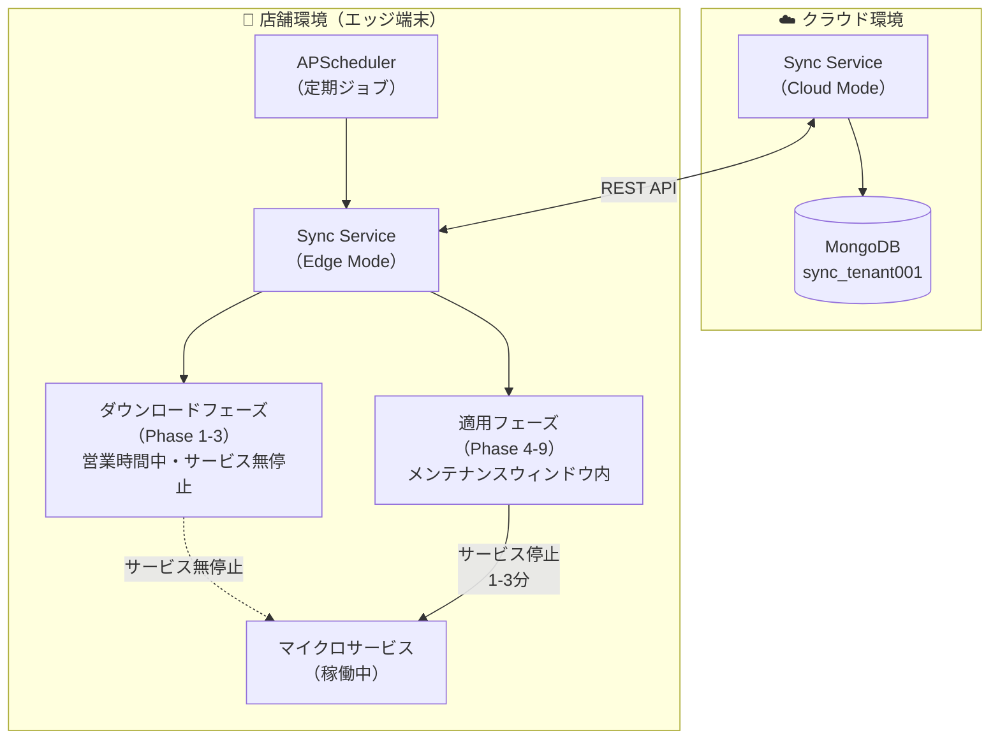
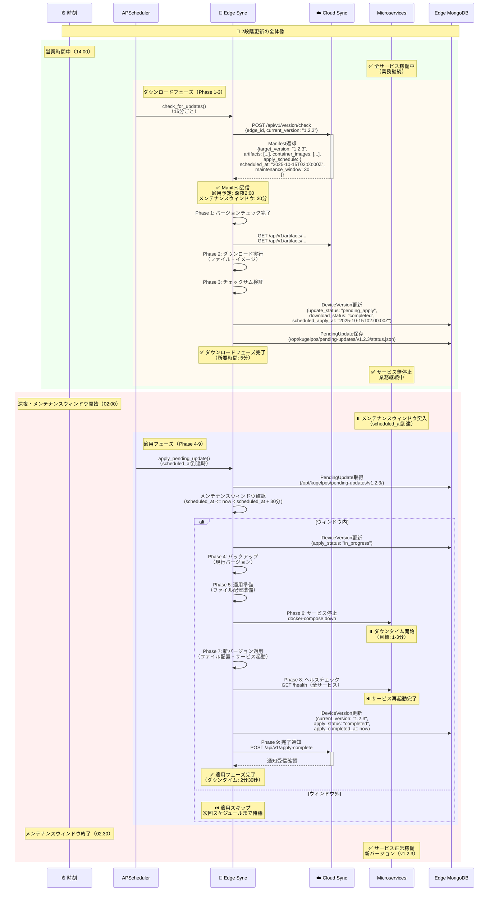
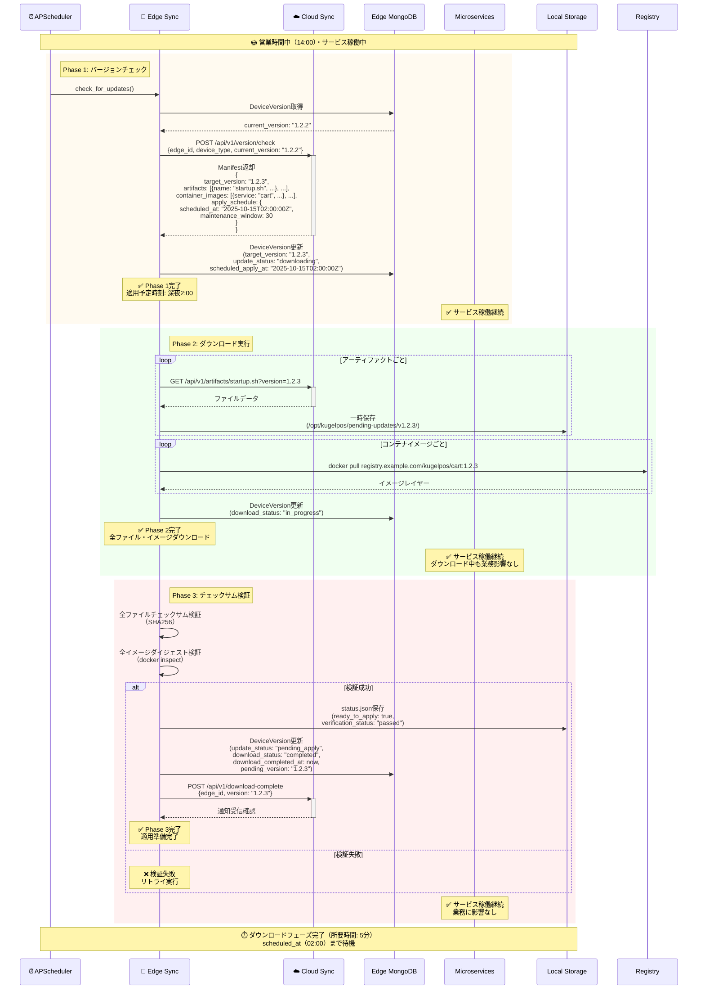
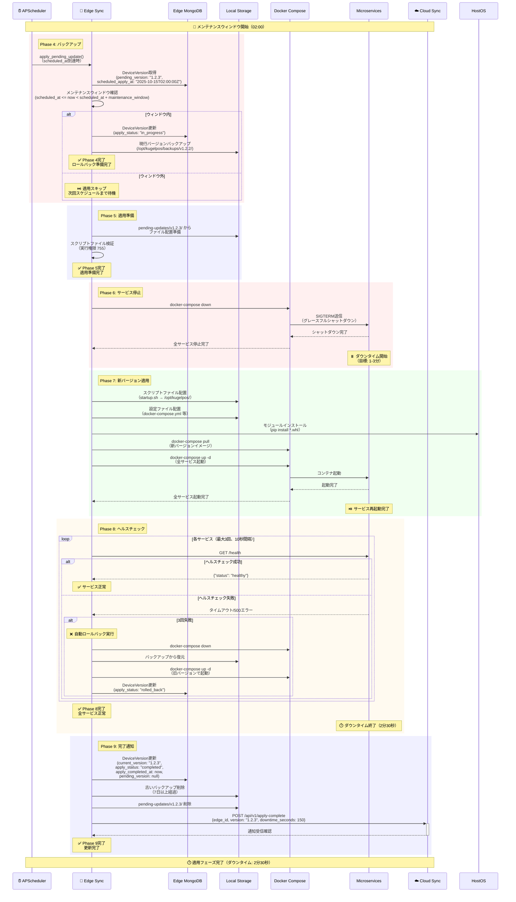
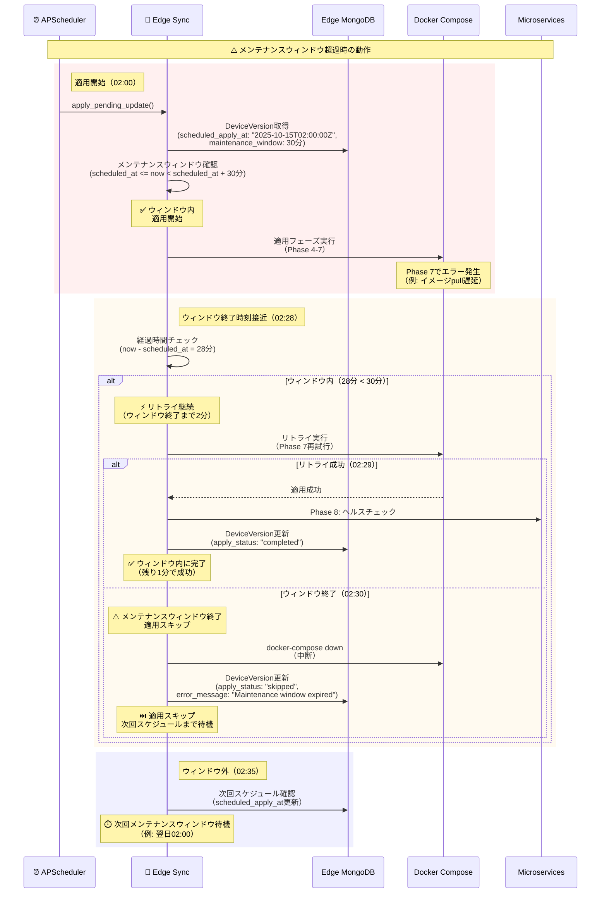

# ユーザーストーリー7: 2段階更新による業務影響最小化 - 処理フロー図

## 概要

このドキュメントは、ユーザーストーリー7「2段階更新による業務影響最小化」の処理フローを視覚的に説明します。店舗のエッジ端末（Edge/POS）が、営業時間中に新バージョンのダウンロードを完了し（ダウンロードフェーズ）、管理者が指定したメンテナンスウィンドウ（scheduled_at開始時刻、maintenance_window期間）内に自動適用される（適用フェーズ）仕組みを、ユーザーが理解しやすい形で図解します。

## シナリオ

店舗のエッジ端末（Edge/POS）が、営業時間中に新バージョンのダウンロードを完了し（ダウンロードフェーズ）、管理者が指定したメンテナンスウィンドウ（scheduled_at開始時刻、maintenance_window期間）内に自動適用される（適用フェーズ）。ダウンロードと適用を分離することで、営業時間中のダウンロード時間（1-10分）は業務に影響を与えず、サービス停止は適用時の1-3分のみに抑えられる。

## 主要コンポーネント



## 処理フロー全体

### フロー1: 2段階更新の全体像

ダウンロードフェーズ（Phase 1-3）と適用フェーズ（Phase 4-9）を分離した全体フローです。



**主要ステップ**:
1. **ダウンロードフェーズ（Phase 1-3）**: 営業時間中にダウンロード・検証（サービス無停止）
2. **待機**: scheduled_at（深夜2:00）まで待機
3. **適用フェーズ（Phase 4-9）**: メンテナンスウィンドウ内に適用（サービス停止1-3分）

**業務影響の最小化**:
- 営業時間中: ダウンロードのみ（5-10分）、サービス無停止
- 深夜メンテナンス: 適用のみ（1-3分）、サービス停止

### フロー2: ダウンロードフェーズ（Phase 1-3）詳細

営業時間中にサービスを停止せずにダウンロードを完了するフローです。



**主要ステップ**:
1. **Phase 1**: バージョンチェック、Manifest受信（scheduled_at, maintenance_window取得）
2. **Phase 2**: ファイル・イメージダウンロード（サービス無停止）
3. **Phase 3**: チェックサム・ダイジェスト検証

**サービス稼働の保証**:
- 全フェーズでサービスは無停止
- ダウンロード中も業務に影響なし
- scheduled_atまで待機

### フロー3: 適用フェーズ（Phase 4-9）詳細

メンテナンスウィンドウ内にサービスを停止して新バージョンを適用するフローです。



**主要ステップ**:
1. **Phase 4**: 現行バージョンバックアップ
2. **Phase 5**: 適用準備（ファイル配置準備）
3. **Phase 6**: サービス停止（ダウンタイム開始）
4. **Phase 7**: 新バージョン適用（ファイル配置・サービス起動）
5. **Phase 8**: ヘルスチェック（失敗時は自動ロールバック）
6. **Phase 9**: 完了通知（ダウンタイム終了）

**ダウンタイムの最小化**:
- ダウンタイムはPhase 6～Phase 8のみ（目標: 1-3分）
- ダウンロード時間（5-10分）はダウンタイムに含まれない

### フロー4: メンテナンスウィンドウ超過時の動作

適用フェーズがメンテナンスウィンドウを超過した場合の動作フローです。



**主要ステップ**:
1. **適用開始**: scheduled_at到達時、メンテナンスウィンドウ内で適用開始
2. **ウィンドウ内リトライ**: エラー発生時、ウィンドウ終了時刻までリトライ継続
3. **ウィンドウ超過**: 終了時刻を過ぎた場合、適用スキップ
4. **次回スケジュール**: 次回メンテナンスウィンドウまで待機

**メンテナンスウィンドウの保証**:
- ウィンドウ内であればリトライ継続
- ウィンドウ終了時刻を過ぎた場合、即座に適用スキップ
- 業務開始時刻（例: 06:00）に確実にサービス稼働

## データベース構造

### DeviceVersion（2段階更新状態管理）

```
コレクション: info_edge_version

ドキュメント例（ダウンロード完了・適用待ち）:
{
  "_id": ObjectId("..."),
  "edge_id": "edge-tenant001-store001-001",
  "device_type": "edge",
  "current_version": "1.2.2",
  "target_version": "1.2.3",
  "update_status": "pending_apply",
  "download_status": "completed",
  "download_completed_at": ISODate("2025-10-14T16:30:00Z"),
  "apply_status": "not_started",
  "scheduled_apply_at": ISODate("2025-10-15T02:00:00Z"),
  "apply_completed_at": null,
  "pending_version": "1.2.3",
  "last_check_timestamp": ISODate("2025-10-14T16:30:00Z"),
  "retry_count": 0,
  "error_message": null,
  "created_at": ISODate("2025-10-01T00:00:00Z"),
  "updated_at": ISODate("2025-10-14T16:30:00Z")
}
```

**2段階更新の状態遷移**:
1. `update_status: "none"` → `"downloading"` (Phase 1開始)
2. `download_status: "in_progress"` (Phase 2実行中)
3. `download_status: "completed"` (Phase 3完了)
4. `update_status: "pending_apply"` (scheduled_at待機中)
5. `apply_status: "in_progress"` (Phase 4-8実行中)
6. `update_status: "completed"` (Phase 9完了)

### PendingUpdate（ダウンロード済み未適用状態）

```
ファイルパス: /opt/kugelpos/pending-updates/v1.2.3/status.json

ドキュメント例:
{
  "version": "1.2.3",
  "download_status": "completed",
  "download_started_at": "2025-10-14T16:00:00Z",
  "download_completed_at": "2025-10-14T16:30:00Z",
  "verification_status": "passed",
  "ready_to_apply": true,
  "scheduled_apply_at": "2025-10-15T02:00:00Z",
  "maintenance_window": 30,
  "artifacts_count": 15,
  "total_size_bytes": 3200000000,
  "manifest_json": { ... }
}
```

## パフォーマンス指標

| 指標 | 目標値 | 測定方法 |
|------|--------|---------|
| **ダウンロード時間** | 10分以内 | Phase 1開始 → Phase 3完了までの時間 |
| **ダウンタイム** | 1-3分 | Phase 6開始 → Phase 8完了までの時間 |
| **適用開始時刻精度** | scheduled_at ±30秒 | scheduled_atと実際の適用開始時刻の差 |
| **メンテナンスウィンドウ遵守率** | 99%以上 | ウィンドウ内完了回数 / 全適用回数 |

## 受入シナリオの検証

### シナリオ1: 営業時間中のダウンロード、営業終了後の自動適用

```
Given: クラウドに新バージョン（v1.2.3）が登録され、scheduled_at=深夜2:00、maintenance_window=30分に設定
When: エッジ端末が15分ごとのバージョンチェックを実行（14:00）
Then:
  1. 更新が検知され、即座にダウンロードが開始される（営業時間中、サービス停止なし）
  2. ダウンロード完了後、深夜2:00まで待機
  3. 深夜2:00に自動的に適用フェーズが実行される
  4. サービス停止→新バージョンに更新→サービス起動→ヘルスチェック完了
  5. ダウンタイム1-3分以内

検証方法:
1. Cloud側で新バージョン登録（target_version: "1.2.3", scheduled_at: "02:00", maintenance_window: 30）
2. Edge Sync のバージョンチェック実行（14:00）
3. ダウンロードフェーズ完了を確認（DeviceVersion.download_status: "completed", update_status: "pending_apply"）
4. scheduled_at到達まで待機（サービス稼働継続を確認）
5. scheduled_at到達時（02:00）、適用フェーズ自動実行を確認
6. ダウンタイムを測定（Phase 6開始 → Phase 8完了）
7. 最終的に DeviceVersion.current_version: "1.2.3", apply_status: "completed" を確認
```

### シナリオ2: メンテナンスウィンドウ内での適用リトライ

```
Given: 適用予定時刻（scheduled_at）での適用失敗時
When: メンテナンスウィンドウ（maintenance_window）内であればリトライ継続
Then: ウィンドウ終了時刻を過ぎた場合は適用をスキップし、次回スケジュールまで待機

検証方法:
1. 意図的に適用失敗を発生させる（Phase 7でイメージpull遅延）
2. scheduled_at到達時（02:00）、適用フェーズ実行
3. Phase 7でエラー発生を確認
4. メンテナンスウィンドウ内（02:00-02:30）であればリトライ継続することを確認
5. ウィンドウ終了時刻（02:30）を過ぎた場合、適用スキップを確認
6. DeviceVersion.apply_status: "skipped"、error_message: "Maintenance window expired" を確認
7. 次回スケジュール（scheduled_apply_at更新）を確認
```

### シナリオ3: Edge Sync ServiceとCloud Sync Serviceの透過的切り替え

```
Given: POS端末がEdge端末からファイル取得
When: Edge Sync Service APIにリクエスト送信（例: GET http://192.168.1.10:8007/api/v1/artifacts/startup.sh?version=1.2.3）
Then: ローカルキャッシュからファイルを取得

検証方法:
1. Edge端末でv1.2.3ダウンロード完了（ローカルキャッシュに保存）
2. POS端末からEdge Sync Service API（http://192.168.1.10:8007/api/v1/artifacts/startup.sh?version=1.2.3）にアクセス
3. Edge Sync Serviceがローカルキャッシュ（/opt/kugelpos/pending-updates/v1.2.3/startup.sh）からファイルを返すことを確認
4. POS端末がファイル取得成功することを確認
5. Edge端末停止時、POS端末がCloud Sync Service（primary_url）へ自動フォールバックすることを確認
```

### シナリオ4: Edge Sync ServiceのAPI互換性

```
Given: Edge Sync ServiceがCloud Sync Serviceと同等のAPI（/api/v1/version、/api/v1/artifacts）を提供
When: POS端末がEdge端末をprimary_urlに設定
Then: Cloud Sync ServiceとEdge Sync Serviceを透過的に切り替えてダウンロード可能

検証方法:
1. POS端末のManifestでavailable_seedsにEdge端末を設定
2. POS端末がEdge Sync Service API（/api/v1/artifacts）にアクセス
3. エンドポイント・レスポンス形式がCloud Sync Serviceと同等であることを確認
4. POS端末がCloud/Edge Sync Serviceを透過的に切り替え可能であることを確認
5. Edge端末停止時のフォールバック動作を確認
```

## 関連ドキュメント

- [spec.md](../spec.md) - 機能仕様書
- [plan.md](../plan.md) - 実装計画
- [data-model.md](../data-model.md) - データモデル設計
- [contracts/sync-api.yaml](../contracts/sync-api.yaml) - Sync API仕様

---

**ドキュメントバージョン**: 1.0.0
**最終更新日**: 2025-10-14
**ステータス**: 完成
